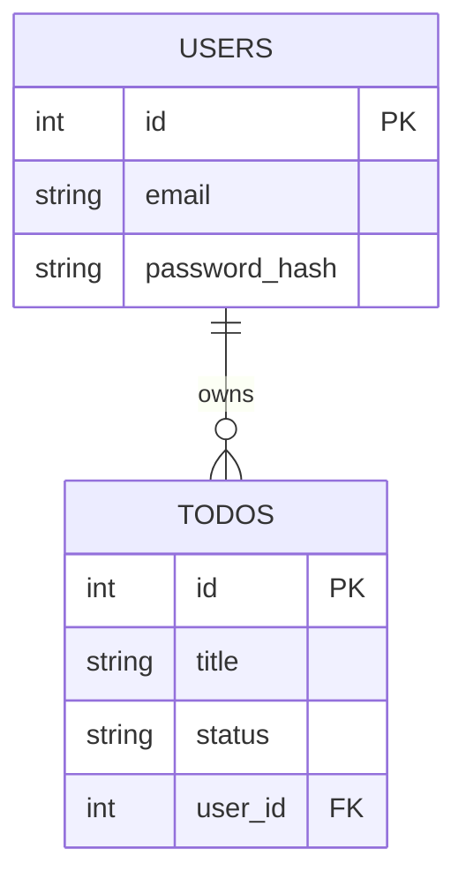

# 04 — Database Schema Design Basics

## 🎬 The Story

At Zoho — a company famous for grilling candidates on data modeling — an interviewer asked for a simple library app. The candidate confidently created one table:

```text
books(id, title, author_name, author_email, author_bio, borrower_name, borrower_email, ...)
```

"Okay," said the interviewer. "An author writes 50 books. You just stored their bio 50 times. Now they change their email. How many rows do you update?" *Fifty.* "And if I delete the last book by an author, where does their bio live now?" *Nowhere — it's gone.*

The candidate had built a spreadsheet, not a database. The fix — splitting authors into their own table — is the heart of schema design. Let's learn it with an analogy that makes it stick.

---

## 🏢 The Master Analogy

> **A database schema is like the blueprint of an apartment building.**
> - The **tables** are the rooms.
> - The **foreign keys** are the doors connecting rooms.
> - The **indexes** are the directories on each floor, so you can find a room quickly without knocking on every door.

Get the blueprint right and people move through the building effortlessly. Get it wrong — no doors between rooms, no directory in the lobby — and every task becomes a search through the whole building.

---

## 🔑 Primary Keys (the room number)

A **primary key** uniquely identifies each row in a table. No two rows share it; it is never empty.

```sql
CREATE TABLE users (
  id SERIAL PRIMARY KEY,          -- auto-incrementing integer: 1, 2, 3, ...
  email VARCHAR(255) NOT NULL
);
```

- `SERIAL` (PostgreSQL) auto-generates `1, 2, 3, ...` — convenient and compact.
- For systems where ids must be hard to guess or globally unique (payments, public URLs), use a `UUID` instead:
  ```sql
  id UUID PRIMARY KEY DEFAULT gen_random_uuid()
  ```
- Think of it as the **room number**: every room has exactly one, and it never points to the wrong room.

---

## 🔗 Foreign Keys (the doors between rooms)

A **foreign key** is a column in one table that points at the primary key of another table. It encodes a relationship and the database *enforces* it.

```sql
CREATE TABLE todos (
  id SERIAL PRIMARY KEY,
  title VARCHAR(255) NOT NULL,
  -- This column links each todo to the user who owns it:
  user_id INTEGER NOT NULL REFERENCES users(id) ON DELETE CASCADE
);
```

What `REFERENCES users(id)` buys you:
- **Integrity:** you *cannot* insert a todo with `user_id = 999` if no user 999 exists. The database refuses. No orphan rows.
- **`ON DELETE CASCADE`:** if a user is deleted, their todos are automatically deleted too (the doors close behind them). Alternatives: `ON DELETE SET NULL` (keep the row, null the link) or `RESTRICT` (block the delete while children exist).

> 🔴 **Missing foreign keys is a top rejection cause.** It signals you don't understand relationships. Add them.

---

## 🧮 Normalization — in Plain English

Normalization is the discipline of **storing each fact exactly once**. The library story above failed because the author's email was stored in every book row. Here are the first three "normal forms," translated.

### 1NF (First Normal Form): *No lists crammed into one cell.*
Each cell holds a single value; no comma-separated lists.

```text
❌ todos(id, title, tags)            -- tags = "work,urgent,home"
✅ todos(id, title)
   tags(id, name)
   todo_tags(todo_id, tag_id)        -- one row per (todo, tag) pair
```
*Why:* "find all todos tagged `urgent`" is impossible to do cleanly when tags are a comma string.

### 2NF (Second Normal Form): *Every column depends on the whole key.*
Mostly relevant when a table has a composite key. If a column depends on only *part* of the key, split it out.

```text
❌ order_items(order_id, product_id, quantity, product_name, product_price)
   -- product_name/price depend only on product_id, not the whole (order_id, product_id) key
✅ order_items(order_id, product_id, quantity)
   products(product_id, product_name, product_price)
```

### 3NF (Third Normal Form): *No column depends on another non-key column.*
A non-key column should depend on the key, not on another non-key column.

```text
❌ employees(id, name, dept_id, dept_name)   -- dept_name depends on dept_id, not on id
✅ employees(id, name, dept_id)
   departments(dept_id, dept_name)
```

> 💡 **The plain-English summary of all three:** *"Don't repeat a fact. If you'd have to update the same value in many rows to keep it correct, it belongs in its own table."* The library author's email is the textbook example.

**When to deliberately denormalize:** sometimes you *copy* data for speed (e.g., storing `total_amount` on an order even though you could re-sum the items). That's a conscious trade-off for read performance, not an accident — and you should be able to explain why.

---

## ⚡ Indexes (the floor directory)

An **index** is a lookup structure that lets the database find rows *without scanning the whole table*. Like a directory in the lobby: instead of knocking on all 500 doors, you look up "Smith → room 312."

```sql
-- We frequently query "all todos for this user". Index that column:
CREATE INDEX idx_todos_user_id ON todos(user_id);

-- We log in by email and it must be unique. A unique index does both:
CREATE UNIQUE INDEX idx_users_email ON users(email);
```

Guidelines:
- **Index columns you filter or join on** (`WHERE user_id = ?`, `JOIN ... ON`).
- **Index foreign keys** — you almost always query "the children of this parent."
- Indexes **speed up reads but slightly slow down writes** (every insert must update the index) and use disk. Don't index everything.
- The primary key is indexed automatically.

> In an interview, calling out *"I'd add an index on `user_id` because we filter todos by user on every request"* is a cheap, high-signal sentence. Say it.

---

## 🔀 JOIN Types (walking between rooms)

A **JOIN** combines rows from two tables using a relationship (a foreign key). The type controls what happens when there's no match.

Setup:
```text
users(id, name)            todos(id, title, user_id)
```

### INNER JOIN — only matched rows
```sql
SELECT u.name, t.title
FROM users u
INNER JOIN todos t ON t.user_id = u.id;
```
Returns users **that have** todos, paired with each todo. A user with no todos does **not** appear.

### LEFT JOIN — all left rows, matched or not
```sql
SELECT u.name, t.title
FROM users u
LEFT JOIN todos t ON t.user_id = u.id;
```
Returns **every** user; users with no todos show `NULL` for the todo columns. Perfect for "list all users and their todo count, including users with zero."

### RIGHT JOIN — all right rows
The mirror image of LEFT JOIN (rarely needed; you can usually rewrite as a LEFT JOIN by swapping table order).

### Quick decision guide
- "Only show me records that have a match" → **INNER**.
- "Show me everything on the left, even with no match" → **LEFT** (most common for dashboards/counts).

---

## 🗺️ ER Diagrams (drawing the blueprint)

An **Entity-Relationship (ER) diagram** is a picture of your tables and how they connect. Drawing one first catches modeling mistakes before you write SQL. In this course we draw them in **Mermaid**:



Reading the relationship symbol `||--o{`:
- `||` on the USERS side = "exactly one."
- `o{` on the TODOS side = "zero or many."
- Together: **one user owns zero or many todos** (a "one-to-many" relationship).

Common cardinalities you'll draw:
- **One-to-many:** one user → many todos.
- **Many-to-many:** many posts ↔ many tags, modeled with a **join table** (`post_tags`).
- **One-to-one:** one user → one profile (less common).

---

## 🧱 A Complete Worked Schema

Here's a small but *correct* schema demonstrating everything above — users, todos, tags, and a many-to-many between them:

```sql
-- File: database/schema.sql

-- Each registered person.
CREATE TABLE users (
  id            SERIAL PRIMARY KEY,                 -- room number
  email         VARCHAR(255) NOT NULL,              -- login identifier
  password_hash VARCHAR(255) NOT NULL,              -- bcrypt hash, never plain text
  created_at    TIMESTAMPTZ  NOT NULL DEFAULT now()
);
CREATE UNIQUE INDEX idx_users_email ON users(email);  -- enforce unique + fast login lookup

-- Each task, owned by exactly one user.
CREATE TABLE todos (
  id         SERIAL PRIMARY KEY,
  title      VARCHAR(255) NOT NULL,
  status     VARCHAR(20)  NOT NULL DEFAULT 'todo',  -- 'todo' | 'in_progress' | 'done'
  user_id    INTEGER NOT NULL REFERENCES users(id) ON DELETE CASCADE,  -- the door to users
  created_at TIMESTAMPTZ  NOT NULL DEFAULT now()
);
CREATE INDEX idx_todos_user_id ON todos(user_id);    -- we filter todos by user constantly

-- A reusable label (stored once — 1NF/3NF respected).
CREATE TABLE tags (
  id   SERIAL PRIMARY KEY,
  name VARCHAR(50) NOT NULL UNIQUE
);

-- The join table that wires the many-to-many between todos and tags.
CREATE TABLE todo_tags (
  todo_id INTEGER NOT NULL REFERENCES todos(id) ON DELETE CASCADE,
  tag_id  INTEGER NOT NULL REFERENCES tags(id)  ON DELETE CASCADE,
  PRIMARY KEY (todo_id, tag_id)                  -- composite key: each pair appears once
);
```

Every fact lives in exactly one place, every relationship has a real door (foreign key), and the columns we query are indexed. That is a passing schema.

---

## ✅ Key Takeaways

1. **Tables = rooms, foreign keys = doors, indexes = the lobby directory.**
2. Every row needs a **primary key**; relationships need **foreign keys with constraints**.
3. **Normalize** = store each fact once. Lists-in-a-cell and repeated columns are the smells to fix (1NF/2NF/3NF).
4. **Index** the columns you filter and join on (especially foreign keys).
5. Pick the right **JOIN**: INNER for "only matches," LEFT for "everything on the left."
6. **Draw the ER diagram first** — it catches modeling bugs before you write a line of SQL.

---

## 🔗 Navigation
⬅️ Previous: [03 — REST API Design Fundamentals](./03-rest-api-design-fundamentals.md)
➡️ Next: [05 — React Patterns You Must Know](./05-react-patterns-you-must-know.md)
🏠 [Module Home](./README.md)
