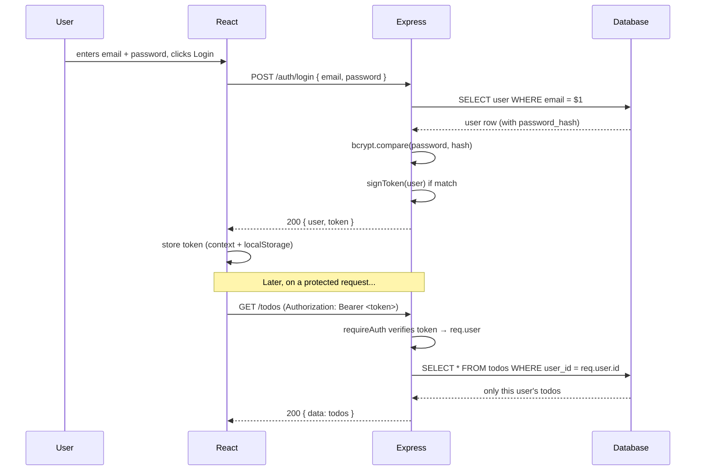

# 07 — Auth, JWT & Sessions Simplified

## 🎬 The Story

Almost every full stack round includes auth as the base layer — "users should only see their own data." A candidate at a fintech startup got the feature working but stored passwords like this:

```sql
INSERT INTO users (email, password) VALUES ('a@b.com', 'hunter2');
```

The interviewer opened the database, ran `SELECT * FROM users`, and read every password in plain text. "If your database leaks," they said, "every one of your users just lost their password — and since people reuse passwords, their bank login too." The round was effectively over.

Auth has two non-negotiables: **never store plain-text passwords**, and **protect routes so users only touch their own data.** This file shows both, completely.

---

## 🎟️ JWT vs Sessions — The Analogy

> **JWT is like a wristband at a concert.** You show ID at the entrance once, they snap a wristband on you, and from then on every staff member can see the wristband and let you in — *without phoning the box office*. The wristband itself proves you're allowed in.
>
> **Sessions are like a coat check.** You hand over your coat and get a ticket with a number. Every time you want something, the coat-check attendant (the server) looks up that number in their ledger to see what it means. The ticket is meaningless on its own; the *server's records* hold the truth.

| | **JWT (token)** | **Session (cookie + server store)** |
|---|---|---|
| Where state lives | In the token, with the client | On the server (memory/DB/Redis) |
| Server lookup per request | No — just verify the signature | Yes — look up the session id |
| Scales across servers | Easily (stateless) | Needs shared session store |
| Revoke before expiry | Harder (token is valid until it expires) | Easy (delete the session) |
| Best for | APIs, mobile, machine coding rounds | Traditional server-rendered web apps |

> For machine coding rounds, **use JWT.** It's stateless, fast to implement, and the standard for the React + Express + REST stack this course uses.

---

## 🔒 Why You Never Store Plain-Text Passwords

> Storing a plain password is like a hotel keeping a photocopy of every guest's house key in a binder at the front desk. One stolen binder and every guest's home is exposed.

Instead, we **hash** the password. A **hash** is a one-way function: easy to compute forwards (`password → hash`), practically impossible to reverse (`hash → password`). We store only the hash. To check a login, we hash the attempt and compare.

We use **bcrypt**, which adds two critical things:
- A **salt** [random data mixed into each hash] so two users with the same password get *different* hashes — defeating precomputed "rainbow table" attacks.
- A deliberately **slow** algorithm with a tunable cost factor, so brute-forcing is expensive even with fast hardware.

```javascript
const bcrypt = require("bcrypt");

// Hashing on registration (cost factor 10 is a good default):
const hash = await bcrypt.hash(plainPassword, 10);   // store `hash`, throw away the plain text

// Verifying on login (bcrypt re-derives the salt from the stored hash):
const ok = await bcrypt.compare(attempt, hash);      // true if the password matches
```

---

## 🧱 The Schema

```sql
-- File: database/schema.sql
CREATE TABLE users (
  id            SERIAL PRIMARY KEY,
  email         VARCHAR(255) NOT NULL,
  password_hash VARCHAR(255) NOT NULL,               -- bcrypt hash, NEVER the plain password
  created_at    TIMESTAMPTZ  NOT NULL DEFAULT now()
);
CREATE UNIQUE INDEX idx_users_email ON users(email); -- unique email + fast login lookup
```

---

## ⚙️ The Complete JWT Implementation (Backend)

### Token helpers

```javascript
// File: server/auth/token.js
const jwt = require("jsonwebtoken");

// Create a signed token. The PAYLOAD is public (base64), the SIGNATURE proves we issued it.
function signToken(user) {
  return jwt.sign(
    { sub: user.id, email: user.email },             // payload (claims). `sub` = subject = user id
    process.env.JWT_SECRET,                           // secret key only the server knows
    { expiresIn: "1h" }                               // wristband expires after 1 hour
  );
}

// Verify a token's signature + expiry. Throws if invalid/expired.
function verifyToken(token) {
  return jwt.verify(token, process.env.JWT_SECRET);   // returns the decoded payload if valid
}

module.exports = { signToken, verifyToken };
```

> A JWT has three dot-separated parts: `header.payload.signature`. The payload is **not encrypted** — it's just base64, anyone can read it — so never put secrets (like a password) in it. The *signature* is what can't be forged without `JWT_SECRET`.

### Register & Login controllers

```javascript
// File: server/controllers/authController.js
const bcrypt = require("bcrypt");
const { query } = require("../db");
const { signToken } = require("../auth/token");

const AuthController = {
  // POST /api/v1/auth/register
  async register(req, res) {
    const { email, password } = req.body;

    // 1) Reject duplicate emails with a clean 409 (don't let the DB error bubble up).
    const existing = await query("SELECT id FROM users WHERE email = $1", [email]);
    if (existing.rows.length > 0) {
      return res.status(409).json({ success: false, error: "Email already registered" });
    }

    // 2) Hash the password — we never store the plain text.
    const passwordHash = await bcrypt.hash(password, 10);

    // 3) Insert and return the new user (never return the hash).
    const { rows } = await query(
      "INSERT INTO users (email, password_hash) VALUES ($1, $2) RETURNING id, email",
      [email, passwordHash]
    );
    const user = rows[0];

    // 4) Issue a token so the user is logged in immediately after registering.
    const token = signToken(user);
    res.status(201).json({ success: true, data: { user, token } });
  },

  // POST /api/v1/auth/login
  async login(req, res) {
    const { email, password } = req.body;

    // 1) Find the user by email.
    const { rows } = await query(
      "SELECT id, email, password_hash FROM users WHERE email = $1",
      [email]
    );
    const user = rows[0];

    // 2) Use the SAME generic message whether the email or the password is wrong.
    //    Telling an attacker "email not found" vs "wrong password" leaks which emails exist.
    if (!user || !(await bcrypt.compare(password, user.password_hash))) {
      return res.status(401).json({ success: false, error: "Invalid email or password" });
    }

    // 3) Credentials good → issue a token.
    const token = signToken({ id: user.id, email: user.email });
    res.status(200).json({
      success: true,
      data: { user: { id: user.id, email: user.email }, token },
    });
  },
};

module.exports = { AuthController };
```

### The auth middleware (the wristband check)

```javascript
// File: server/middleware/auth.js
const { verifyToken } = require("../auth/token");

// Gate for protected routes. Reads the Bearer token, verifies it, attaches req.user.
function requireAuth(req, res, next) {
  const header = req.headers.authorization || "";    // "Bearer eyJ..."
  const token = header.startsWith("Bearer ") ? header.slice(7) : null;

  if (!token) {
    // No wristband at all → 401 (not authenticated).
    return res.status(401).json({ success: false, error: "Authentication required" });
  }

  try {
    const payload = verifyToken(token);              // throws if invalid/expired/forged
    req.user = { id: payload.sub, email: payload.email }; // hand identity to downstream handlers
    next();                                           // wristband valid → proceed
  } catch (err) {
    return res.status(401).json({ success: false, error: "Invalid or expired token" });
  }
}

module.exports = { requireAuth };
```

### Wiring the routes

```javascript
// File: server/routes/auth.js
const express = require("express");
const router = express.Router();
const { AuthController } = require("../controllers/authController");
const { requireFields } = require("../middleware/validate");
const { asyncHandler } = require("../middleware/asyncHandler");

router.post("/register", requireFields(["email", "password"]), asyncHandler(AuthController.register));
router.post("/login",    requireFields(["email", "password"]), asyncHandler(AuthController.login));

module.exports = router;
```

Now any protected resource just adds `requireAuth`:
```javascript
router.get("/todos", requireAuth, asyncHandler(TodoController.list)); // req.user.id is available
```

And the ownership check inside the model guarantees users only touch their own rows:
```sql
SELECT * FROM todos WHERE user_id = $1   -- $1 = req.user.id, set by requireAuth
```

---

## ⚛️ Auth State in React (`useContext`)

The frontend mirror of the backend: store the token, broadcast auth state, redirect when needed. (Full `AuthContext` and `PrivateRoute` were shown in [05 — React Patterns](./05-react-patterns-you-must-know.md); here's how login uses it.)

```jsx
// File: client/src/pages/LoginPage.jsx
import { useState } from "react";
import { useNavigate } from "react-router-dom";
import { useAuth } from "../context/AuthContext";
import { loginRequest } from "../api/auth";

export function LoginPage() {
  const { login } = useAuth();                       // from AuthContext
  const navigate = useNavigate();
  const [email, setEmail] = useState("");
  const [password, setPassword] = useState("");
  const [error, setError] = useState("");
  const [loading, setLoading] = useState(false);

  async function handleSubmit(e) {
    e.preventDefault();
    setLoading(true);
    setError("");
    try {
      const { user, token } = await loginRequest(email, password); // call POST /auth/login
      login(token, user);                            // store token in context + localStorage
      navigate("/");                                 // redirect into the app
    } catch (err) {
      setError("Invalid email or password");         // show the server's 401 cleanly
    } finally {
      setLoading(false);
    }
  }

  return (
    <form onSubmit={handleSubmit}>
      {error && <p role="alert">{error}</p>}
      <input value={email} onChange={(e) => setEmail(e.target.value)} type="email" placeholder="Email" />
      <input value={password} onChange={(e) => setPassword(e.target.value)} type="password" placeholder="Password" />
      <button disabled={loading}>{loading ? "Signing in…" : "Log in"}</button>
    </form>
  );
}
```

```javascript
// File: client/src/api/auth.js
const BASE = "/api/v1/auth";

export async function loginRequest(email, password) {
  const res = await fetch(`${BASE}/login`, {
    method: "POST",
    headers: { "Content-Type": "application/json" },
    body: JSON.stringify({ email, password }),
  });
  const json = await res.json();
  if (!res.ok) throw new Error(json.error || "Login failed"); // turn 401 into a thrown error
  return json.data;                                            // { user, token }
}
```

---

## 🔄 The Full Auth Flow



---

## ✅ Key Takeaways

1. **JWT = wristband (stateless, verify the signature). Sessions = coat check (server looks it up).** Use JWT for these rounds.
2. **Never store plain passwords** — hash with bcrypt (salt + slow on purpose).
3. **Login errors stay generic** ("invalid email or password") to avoid leaking which emails exist.
4. **`requireAuth` middleware** verifies the token and sets `req.user`; ownership is enforced with `WHERE user_id = $1`.
5. On the frontend, hold auth in **Context**, persist the token, and guard pages with **`PrivateRoute`**.

---

## 🔗 Navigation
⬅️ Previous: [06 — Node/Express Patterns You Must Know](./06-node-express-patterns-you-must-know.md)
➡️ Next: [08 — How to Approach Any Full Stack Problem](./08-how-to-approach-any-fullstack-problem.md)
🏠 [Module Home](./README.md)
