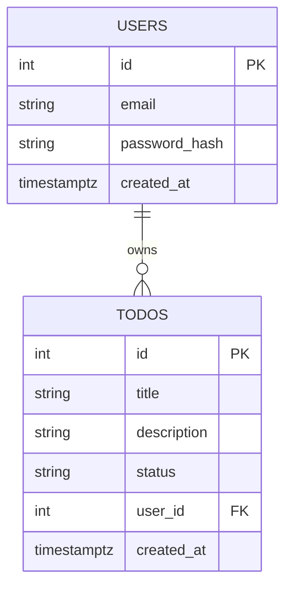
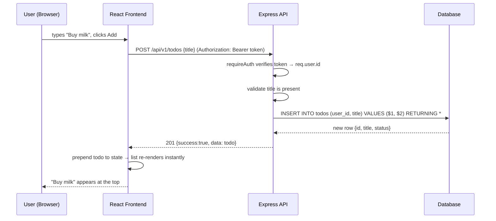

# 01 — Todo App with API

🏢 **Asked at:** Freshworks, Zoho, BrowserStack (as warm-up), Chargebee

> This is *the* foundational full stack question. Almost every other problem in this course is a variation on it: users own resources, you CRUD those resources, and auth gates everything. Master this one completely and you have a template for the rest.

---

## 🎬 The Product Story

You open any task app — Todoist, Microsoft To Do, the checklist in Notion. You log in, you see *your* tasks (never anyone else's), you type a task and it appears instantly, you check it off, you delete it. Refresh the page and it's all still there.

That last sentence — *"refresh and it's still there"* — is the whole game. It means the data lives in a database, reached through an API, gated by auth, and rendered by React. The interviewer will register two different users and confirm that User A absolutely cannot see User B's tasks. Build that, completely, and you pass.

---

## 📋 Requirements (clarified)

**Functional**
- A user can register and log in.
- A logged-in user can create, list, update, and delete **their own** todos.
- A todo has a title, an optional description, and a status (`todo` / `in_progress` / `done`).
- User A can never see or modify User B's todos.

**Non-functional**
- Passwords hashed (never plain text).
- Every write endpoint validated; errors return clean status codes.
- UI shows loading, empty, and error states.

**Clarifying questions to ask the interviewer** (say these out loud):
1. Do todos need due dates / categories now, or is that a possible extension? (Scope control.)
2. Should completed todos be hidden or just styled? (UI behavior.)
3. Single user per todo, or shared todos? (Decides if we need a join table — see Twist 3.)

---

## 🧱 Database Schema



```sql
-- File: database/schema.sql

-- Each registered person.
CREATE TABLE users (
  id            SERIAL PRIMARY KEY,                       -- auto-increment unique id
  email         VARCHAR(255) NOT NULL,                    -- login identifier
  password_hash VARCHAR(255) NOT NULL,                    -- bcrypt hash, NEVER plain text
  created_at    TIMESTAMPTZ  NOT NULL DEFAULT now()       -- audit timestamp
);
-- Unique index: enforces one account per email AND makes login lookup fast.
CREATE UNIQUE INDEX idx_users_email ON users(email);

-- Each task, owned by exactly one user.
CREATE TABLE todos (
  id          SERIAL PRIMARY KEY,
  title       VARCHAR(255) NOT NULL,                      -- required
  description TEXT,                                       -- optional
  status      VARCHAR(20)  NOT NULL DEFAULT 'todo',       -- 'todo' | 'in_progress' | 'done'
  user_id     INTEGER NOT NULL REFERENCES users(id) ON DELETE CASCADE, -- owner; delete cascades
  created_at  TIMESTAMPTZ  NOT NULL DEFAULT now()
);
-- We filter todos by user on EVERY request, so index that foreign key.
CREATE INDEX idx_todos_user_id ON todos(user_id);

-- Guard the status column to only allow valid values (DB-level validation).
ALTER TABLE todos ADD CONSTRAINT chk_todo_status
  CHECK (status IN ('todo', 'in_progress', 'done'));
```

---

## 🔌 API Design

| Method | Path | Auth | Body | Success | Errors |
|--------|------|------|------|---------|--------|
| POST | `/api/v1/auth/register` | – | `{email, password}` | `201 {user, token}` | `400`, `409` |
| POST | `/api/v1/auth/login` | – | `{email, password}` | `200 {user, token}` | `400`, `401` |
| GET | `/api/v1/todos` | ✅ | – | `200 {data:[...]}` | `401` |
| POST | `/api/v1/todos` | ✅ | `{title, description?}` | `201 {data}` | `400`, `401` |
| GET | `/api/v1/todos/:id` | ✅ | – | `200 {data}` | `401`, `404` |
| PATCH | `/api/v1/todos/:id` | ✅ | `{title?, description?, status?}` | `200 {data}` | `400`, `401`, `404` |
| DELETE | `/api/v1/todos/:id` | ✅ | – | `204` | `401`, `404` |

**Response envelopes** (consistent everywhere):
```json
// success
{ "success": true, "data": { "id": 1, "title": "Buy milk", "status": "todo" } }
// error
{ "success": false, "error": "Validation failed", "details": "title is required" }
```

---

## 🌳 Component Tree

```text
<App>
├── <AuthProvider>                      // auth context (token + user)
│   ├── <LoginPage>                     // public
│   ├── <RegisterPage>                  // public
│   └── <PrivateRoute>                  // redirects if not logged in
│       └── <TodosPage>                 // container: fetches todos
│           ├── <AddTodoForm>           // controlled form → POST
│           └── <TodoList>              // presentational
│               └── <TodoItem>          // one row: toggle status, delete
```

### State Design
```text
AuthContext:   { token, user, login(), logout(), isAuthed }     // app-wide auth
TodosPage:     todos[]        // the list, source of truth for the page
               loading        // true while initial fetch is in-flight
               error          // string|null, set when a request fails
AddTodoForm:   title          // controlled input value
TodoItem:      saving         // true while a status toggle / delete is in-flight
```

---

## 🔄 Full Stack Flow Diagram



**Reading this diagram:** The user's click triggers a POST carrying the JWT. The server first proves *who* the user is (`requireAuth`), then checks the input is valid, then inserts a row tagged with that user's id and gets the created row back. The API responds `201` with the new todo, and React adds it to local state so the screen updates without a full refetch.

---

## 💻 Complete Working Code

### Part 1: Database Setup
(see `database/schema.sql` above — run it once against your PostgreSQL database)

### Part 2: Backend (Node.js + Express)

```javascript
// File: server/db.js
const { Pool } = require("pg");                            // PostgreSQL driver

// One shared connection pool for the whole app (config from env, never hardcoded).
const pool = new Pool({
  host: process.env.DB_HOST,
  port: process.env.DB_PORT,
  user: process.env.DB_USER,
  password: process.env.DB_PASSWORD,
  database: process.env.DB_NAME,
  max: 10,
});

// Helper that forces parameterized queries (prevents SQL injection).
function query(text, params) {
  return pool.query(text, params);
}

module.exports = { query, pool };
```

```javascript
// File: server/middleware/asyncHandler.js
// Wrap async handlers so a rejected promise goes to the error handler instead of crashing Node.
const asyncHandler = (fn) => (req, res, next) =>
  Promise.resolve(fn(req, res, next)).catch(next);
module.exports = { asyncHandler };
```

```javascript
// File: server/middleware/errorHandler.js
// Central error handler — registered LAST. Turns any thrown error into clean JSON.
function errorHandler(err, req, res, next) {
  console.error("[ERROR]", err);                           // log full error server-side
  const status = err.statusCode || 500;
  res.status(status).json({
    success: false,
    error: err.publicMessage || "Internal server error",   // never leak internals
    details: process.env.NODE_ENV === "development" ? err.message : undefined,
  });
}
module.exports = { errorHandler };
```

```javascript
// File: server/middleware/validate.js
// Returns middleware that ensures required fields are present and non-empty.
function requireFields(fields) {
  return (req, res, next) => {
    const missing = fields.filter((f) => {
      const v = req.body[f];
      return v === undefined || v === null || v === "";
    });
    if (missing.length) {
      return res.status(400).json({
        success: false,
        error: "Validation failed",
        details: `Missing required field(s): ${missing.join(", ")}`,
      });
    }
    next();
  };
}
module.exports = { requireFields };
```

```javascript
// File: server/auth/token.js
const jwt = require("jsonwebtoken");

// Sign a token containing the user's id + email.
function signToken(user) {
  return jwt.sign({ sub: user.id, email: user.email }, process.env.JWT_SECRET, {
    expiresIn: "1h",
  });
}
// Verify a token; throws if invalid/expired.
function verifyToken(token) {
  return jwt.verify(token, process.env.JWT_SECRET);
}
module.exports = { signToken, verifyToken };
```

```javascript
// File: server/middleware/auth.js
const { verifyToken } = require("../auth/token");

// Gate for protected routes: verify the Bearer token, attach req.user.
function requireAuth(req, res, next) {
  const header = req.headers.authorization || "";
  const token = header.startsWith("Bearer ") ? header.slice(7) : null;
  if (!token) {
    return res.status(401).json({ success: false, error: "Authentication required" });
  }
  try {
    const payload = verifyToken(token);
    req.user = { id: payload.sub, email: payload.email };  // identity for downstream handlers
    next();
  } catch {
    return res.status(401).json({ success: false, error: "Invalid or expired token" });
  }
}
module.exports = { requireAuth };
```

```javascript
// File: server/controllers/authController.js
const bcrypt = require("bcrypt");
const { query } = require("../db");
const { signToken } = require("../auth/token");

const AuthController = {
  // POST /auth/register
  async register(req, res) {
    const { email, password } = req.body;

    // Reject too-short passwords early (cheap validation).
    if (password.length < 6) {
      return res.status(400).json({ success: false, error: "Password must be at least 6 characters" });
    }

    // Reject duplicate email with a 409 (not a generic 500).
    const existing = await query("SELECT id FROM users WHERE email = $1", [email]);
    if (existing.rows.length) {
      return res.status(409).json({ success: false, error: "Email already registered" });
    }

    const passwordHash = await bcrypt.hash(password, 10);  // hash before storing
    const { rows } = await query(
      "INSERT INTO users (email, password_hash) VALUES ($1, $2) RETURNING id, email",
      [email, passwordHash]
    );
    const user = rows[0];
    const token = signToken(user);                         // auto-login after register
    res.status(201).json({ success: true, data: { user, token } });
  },

  // POST /auth/login
  async login(req, res) {
    const { email, password } = req.body;
    const { rows } = await query(
      "SELECT id, email, password_hash FROM users WHERE email = $1",
      [email]
    );
    const user = rows[0];
    // Generic message whether email or password is wrong (don't leak which emails exist).
    if (!user || !(await bcrypt.compare(password, user.password_hash))) {
      return res.status(401).json({ success: false, error: "Invalid email or password" });
    }
    const token = signToken({ id: user.id, email: user.email });
    res.status(200).json({ success: true, data: { user: { id: user.id, email: user.email }, token } });
  },
};

module.exports = { AuthController };
```

```javascript
// File: server/models/todoModel.js
const { query } = require("../db");

// Pure data access. Every query is scoped by user_id so users can't touch others' data.
const TodoModel = {
  listByUser: (userId) =>
    query(
      "SELECT id, title, description, status, created_at FROM todos WHERE user_id = $1 ORDER BY created_at DESC",
      [userId]
    ).then((r) => r.rows),

  create: (userId, { title, description }) =>
    query(
      "INSERT INTO todos (user_id, title, description) VALUES ($1, $2, $3) RETURNING id, title, description, status, created_at",
      [userId, title, description || null]
    ).then((r) => r.rows[0]),

  getById: (userId, id) =>
    query("SELECT id, title, description, status, created_at FROM todos WHERE id = $1 AND user_id = $2", [id, userId])
      .then((r) => r.rows[0] || null),

  update: (userId, id, fields) => {
    // Build a dynamic, still-parameterized UPDATE from only the provided fields.
    const allowed = ["title", "description", "status"];
    const keys = Object.keys(fields).filter((k) => allowed.includes(k));
    if (keys.length === 0) return TodoModel.getById(userId, id);     // nothing to change
    const set = keys.map((k, i) => `${k} = $${i + 1}`).join(", ");   // "title = $1, status = $2"
    const values = keys.map((k) => fields[k]);
    values.push(id, userId);                                         // for the WHERE clause
    return query(
      `UPDATE todos SET ${set} WHERE id = $${keys.length + 1} AND user_id = $${keys.length + 2}
       RETURNING id, title, description, status, created_at`,
      values
    ).then((r) => r.rows[0] || null);
  },

  remove: (userId, id) =>
    query("DELETE FROM todos WHERE id = $1 AND user_id = $2 RETURNING id", [id, userId])
      .then((r) => r.rows[0] || null),
};

module.exports = { TodoModel };
```

```javascript
// File: server/controllers/todoController.js
const { TodoModel } = require("../models/todoModel");

const VALID_STATUS = ["todo", "in_progress", "done"];

const TodoController = {
  async list(req, res) {
    const todos = await TodoModel.listByUser(req.user.id);
    res.status(200).json({ success: true, data: todos });
  },

  async create(req, res) {
    const todo = await TodoModel.create(req.user.id, req.body);
    res.status(201).json({ success: true, data: todo, message: "Todo created" });
  },

  async getOne(req, res) {
    const todo = await TodoModel.getById(req.user.id, req.params.id);
    if (!todo) return res.status(404).json({ success: false, error: "Todo not found" });
    res.status(200).json({ success: true, data: todo });
  },

  async update(req, res) {
    // Validate status if it's being changed.
    if (req.body.status && !VALID_STATUS.includes(req.body.status)) {
      return res.status(400).json({ success: false, error: "Invalid status value" });
    }
    const todo = await TodoModel.update(req.user.id, req.params.id, req.body);
    if (!todo) return res.status(404).json({ success: false, error: "Todo not found" });
    res.status(200).json({ success: true, data: todo });
  },

  async remove(req, res) {
    const deleted = await TodoModel.remove(req.user.id, req.params.id);
    if (!deleted) return res.status(404).json({ success: false, error: "Todo not found" });
    res.status(204).send();                                  // 204 = success, no body
  },
};

module.exports = { TodoController };
```

```javascript
// File: server/routes/auth.js
const express = require("express");
const router = express.Router();
const { AuthController } = require("../controllers/authController");
const { requireFields } = require("../middleware/validate");
const { asyncHandler } = require("../middleware/asyncHandler");

router.post("/register", requireFields(["email", "password"]), asyncHandler(AuthController.register));
router.post("/login", requireFields(["email", "password"]), asyncHandler(AuthController.login));

module.exports = router;
```

```javascript
// File: server/routes/todos.js
const express = require("express");
const router = express.Router();
const { TodoController } = require("../controllers/todoController");
const { requireAuth } = require("../middleware/auth");
const { requireFields } = require("../middleware/validate");
const { asyncHandler } = require("../middleware/asyncHandler");

// All todo routes require auth.
router.get("/", requireAuth, asyncHandler(TodoController.list));
router.post("/", requireAuth, requireFields(["title"]), asyncHandler(TodoController.create));
router.get("/:id", requireAuth, asyncHandler(TodoController.getOne));
router.patch("/:id", requireAuth, asyncHandler(TodoController.update));
router.delete("/:id", requireAuth, asyncHandler(TodoController.remove));

module.exports = router;
```

```javascript
// File: server/index.js
require("dotenv").config();
const express = require("express");
const cors = require("cors");
const authRouter = require("./routes/auth");
const todosRouter = require("./routes/todos");
const { errorHandler } = require("./middleware/errorHandler");

const app = express();
app.use(cors());                                            // allow React dev server
app.use(express.json());                                    // parse JSON bodies

app.get("/health", (req, res) => res.json({ success: true, message: "ok" }));
app.use("/api/v1/auth", authRouter);
app.use("/api/v1/todos", todosRouter);

app.use((req, res) => res.status(404).json({ success: false, error: "Not found" }));
app.use(errorHandler);                                      // MUST be last

const PORT = process.env.PORT || 4000;
app.listen(PORT, () => console.log(`API on http://localhost:${PORT}`));
```

### Part 3: Frontend (React)

```javascript
// File: client/src/api/client.js
const BASE = "/api/v1";

// One fetch wrapper: attaches the token, unwraps our envelope, throws on non-2xx.
export async function apiFetch(path, options = {}) {
  const token = localStorage.getItem("token");
  const res = await fetch(`${BASE}${path}`, {
    ...options,
    headers: {
      "Content-Type": "application/json",
      ...(token ? { Authorization: `Bearer ${token}` } : {}),
      ...options.headers,
    },
  });
  if (res.status === 204) return null;                      // no body on delete
  const json = await res.json();
  if (!res.ok) throw new Error(json.error || "Request failed");
  return json.data;
}
```

```javascript
// File: client/src/api/todos.js
import { apiFetch } from "./client";

export const getTodos = () => apiFetch("/todos");
export const createTodo = (title, description) =>
  apiFetch("/todos", { method: "POST", body: JSON.stringify({ title, description }) });
export const updateTodo = (id, fields) =>
  apiFetch(`/todos/${id}`, { method: "PATCH", body: JSON.stringify(fields) });
export const deleteTodo = (id) => apiFetch(`/todos/${id}`, { method: "DELETE" });
```

```jsx
// File: client/src/pages/TodosPage.jsx
import { useEffect, useState } from "react";
import { getTodos, createTodo, updateTodo, deleteTodo } from "../api/todos";
import { AddTodoForm } from "../components/AddTodoForm";
import { TodoList } from "../components/TodoList";

export function TodosPage() {
  const [todos, setTodos] = useState([]);
  const [loading, setLoading] = useState(true);
  const [error, setError] = useState(null);

  // Fetch the user's todos once on mount.
  useEffect(() => {
    getTodos()
      .then(setTodos)
      .catch((e) => setError(e.message))
      .finally(() => setLoading(false));
  }, []);

  async function handleAdd(title) {
    const todo = await createTodo(title);                   // POST then prepend
    setTodos((prev) => [todo, ...prev]);
  }

  async function handleToggle(todo) {
    const next = todo.status === "done" ? "todo" : "done";
    setTodos((prev) => prev.map((t) => (t.id === todo.id ? { ...t, status: next } : t))); // optimistic
    try {
      await updateTodo(todo.id, { status: next });
    } catch {
      setTodos((prev) => prev.map((t) => (t.id === todo.id ? { ...t, status: todo.status } : t))); // rollback
    }
  }

  async function handleDelete(id) {
    const prev = todos;
    setTodos((p) => p.filter((t) => t.id !== id));          // optimistic remove
    try {
      await deleteTodo(id);
    } catch {
      setTodos(prev);                                       // rollback
    }
  }

  if (loading) return <p>Loading todos…</p>;                // loading state
  if (error) return <p role="alert">Error: {error}</p>;     // error state

  return (
    <div>
      <h1>My Todos</h1>
      <AddTodoForm onAdd={handleAdd} />
      {todos.length === 0 ? (
        <p>No todos yet — add your first one above.</p>     // empty state
      ) : (
        <TodoList todos={todos} onToggle={handleToggle} onDelete={handleDelete} />
      )}
    </div>
  );
}
```

```jsx
// File: client/src/components/AddTodoForm.jsx
import { useState } from "react";

export function AddTodoForm({ onAdd }) {
  const [title, setTitle] = useState("");                   // controlled input
  const [submitting, setSubmitting] = useState(false);

  async function handleSubmit(e) {
    e.preventDefault();
    if (!title.trim()) return;                              // client-side validation
    setSubmitting(true);
    try {
      await onAdd(title.trim());
      setTitle("");                                         // clear on success
    } finally {
      setSubmitting(false);
    }
  }

  return (
    <form onSubmit={handleSubmit}>
      <input value={title} onChange={(e) => setTitle(e.target.value)} placeholder="What needs doing?" />
      <button disabled={submitting || !title.trim()}>{submitting ? "Adding…" : "Add"}</button>
    </form>
  );
}
```

```jsx
// File: client/src/components/TodoList.jsx
import { TodoItem } from "./TodoItem";

// Presentational: render rows, delegate events upward.
export function TodoList({ todos, onToggle, onDelete }) {
  return (
    <ul>
      {todos.map((t) => (
        <TodoItem key={t.id} todo={t} onToggle={onToggle} onDelete={onDelete} />
      ))}
    </ul>
  );
}
```

```jsx
// File: client/src/components/TodoItem.jsx
export function TodoItem({ todo, onToggle, onDelete }) {
  return (
    <li>
      <input type="checkbox" checked={todo.status === "done"} onChange={() => onToggle(todo)} />
      <span style={{ textDecoration: todo.status === "done" ? "line-through" : "none" }}>
        {todo.title}
      </span>
      <button onClick={() => onDelete(todo.id)} aria-label="Delete">🗑️</button>
    </li>
  );
}
```

### Part 4: Running the App
```bash
# Database
createdb fullstack_course
psql fullstack_course < database/schema.sql

# Backend
cd server
cp .env.example .env            # then fill in DB creds + JWT_SECRET
npm install
npm run dev                     # API on http://localhost:4000

# Frontend (separate terminal)
cd client
npm install
npm run dev                     # Vite on http://localhost:5173 (proxy /api → :4000)
```

### 🖥️ What You Will See
After registering, you land on the Todos page showing "No todos yet." Type "Buy milk" and press Add — it appears instantly at the top. Check the box and the text gets a strike-through. Refresh the page; the todo is still there (it's in the database). Open a second browser in incognito, register a different user, and you'll see an *empty* list — proving per-user isolation. The server console logs each request; no crashes on bad input.

---

## ⚠️ What Makes This Problem Tricky (5 Non-Obvious Traps)

🔴 **Trap 1:** Not scoping queries by `user_id`, so `GET /todos` returns *everyone's* todos.
✅ **Better approach:** Every query includes `WHERE user_id = $1` using `req.user.id` from the JWT.
💡 **Why it matters:** This is the core security check; the interviewer *will* test cross-user access.

🔴 **Trap 2:** Returning `200` for a not-found todo on `GET /:id`, with `null` data.
✅ **Better approach:** Return `404` when the row doesn't exist (or isn't yours).
💡 **Why it matters:** Correct status codes are graded; the frontend can't distinguish "empty" from "missing" otherwise.

🔴 **Trap 3:** Letting an unhandled async error crash the Express process mid-demo.
✅ **Better approach:** `asyncHandler` + central `errorHandler`.
💡 **Why it matters:** A crashed server ends the round; resilience is a senior signal.

🔴 **Trap 4:** Building an `UPDATE` by string-concatenating fields (SQL injection + accidental overwrite).
✅ **Better approach:** Whitelist allowed columns, build a parameterized `SET` clause.
💡 **Why it matters:** Demonstrates you understand both injection and partial updates (PATCH).

🔴 **Trap 5:** No optimistic update, so toggling a checkbox feels laggy and the UI flickers.
✅ **Better approach:** Update state immediately, roll back on error.
💡 **Why it matters:** UI responsiveness is scored at UI-focused companies (CRED).

---

## 🌀 How the Interviewer Can Twist This Question (6 Extensions)

**Twist 1: Add authentication hardening — rate-limit login attempts**
🗣️ *"Someone's brute-forcing the login. Limit attempts."*
🧠 Testing: security awareness, middleware.
🛠️ Layer: Backend.
🔧 How: add an in-memory counter keyed by email+IP; block after N fails in a window.
💻 Snippet:
```javascript
const attempts = new Map();                                 // key -> {count, ts}
function loginLimiter(req, res, next) {
  const key = req.body.email + req.ip;
  const rec = attempts.get(key) || { count: 0, ts: Date.now() };
  if (Date.now() - rec.ts > 60000) { rec.count = 0; rec.ts = Date.now(); } // reset window
  if (rec.count >= 5) return res.status(429).json({ success: false, error: "Too many attempts" });
  attempts.set(key, rec);
  next();
}
```

**Twist 2: Real-time sync across tabs (polling → SSE)**
🗣️ *"If I open two tabs, adding a todo in one should show in the other."*
🧠 Testing: real-time delivery.
🛠️ Layer: Backend + Frontend.
🔧 How: add a Server-Sent Events endpoint that pushes "todo_created" events.
💻 Snippet:
```javascript
app.get("/api/v1/todos/stream", requireAuth, (req, res) => {
  res.setHeader("Content-Type", "text/event-stream");
  const send = (data) => res.write(`data: ${JSON.stringify(data)}\n\n`);
  emitter.on(`user:${req.user.id}`, send);                  // emit on create
  req.on("close", () => emitter.off(`user:${req.user.id}`, send));
});
```

**Twist 3: Scale — paginate the todo list**
🗣️ *"A user has 5,000 todos. Don't return them all."*
🧠 Testing: pagination.
🛠️ Layer: Backend + Frontend.
🔧 DB change: none. API change: accept `?page&limit`. Frontend: page controls.
💻 Snippet:
```javascript
const limit = Math.min(+req.query.limit || 20, 100);
const offset = ((+req.query.page || 1) - 1) * limit;
const { rows } = await query(
  "SELECT * FROM todos WHERE user_id = $1 ORDER BY created_at DESC LIMIT $2 OFFSET $3",
  [req.user.id, limit, offset]
);
```

**Twist 4: New feature — categories/tags (many-to-many)**
🗣️ *"Let me tag todos with labels like 'work' or 'home'."*
🧠 Testing: relational modeling.
🛠️ Layer: All three.
🔧 DB: add `tags` + `todo_tags` join table. API: `POST /todos/:id/tags`. Frontend: tag chips.
💻 Snippet:
```sql
CREATE TABLE tags (id SERIAL PRIMARY KEY, user_id INT REFERENCES users(id), name VARCHAR(50));
CREATE TABLE todo_tags (todo_id INT REFERENCES todos(id) ON DELETE CASCADE,
                        tag_id INT REFERENCES tags(id) ON DELETE CASCADE,
                        PRIMARY KEY (todo_id, tag_id));
```

**Twist 5: Performance — add due dates with sorting + index**
🗣️ *"Sort todos by due date, soonest first."*
🧠 Testing: indexing, query optimization.
🛠️ Layer: All three.
🔧 DB: add `due_date` + index. API: `?sort=due_date`. Frontend: date picker + sorted render.
💻 Snippet:
```sql
ALTER TABLE todos ADD COLUMN due_date DATE;
CREATE INDEX idx_todos_user_due ON todos(user_id, due_date); -- composite for "my todos by due date"
```

**Twist 6: Resilience — sharing a todo with another user (idempotent invite)**
🗣️ *"Let me share a todo with a teammate; sharing twice shouldn't duplicate."*
🧠 Testing: many-to-many + idempotency.
🛠️ Layer: All three.
🔧 DB: `todo_shares(todo_id, shared_with_user_id)` with a unique constraint.
💻 Snippet:
```sql
CREATE TABLE todo_shares (
  todo_id INT REFERENCES todos(id) ON DELETE CASCADE,
  shared_with_user_id INT REFERENCES users(id) ON DELETE CASCADE,
  PRIMARY KEY (todo_id, shared_with_user_id)   -- sharing twice is a no-op (ON CONFLICT DO NOTHING)
);
```

---

## 🧪 Test Cases (8 Cases)

| # | Action | Input | Expected API Response | Expected UI Behavior |
|---|--------|-------|-----------------------|----------------------|
| 1 | Create todo (happy) | `{title:"Buy milk"}` + token | `201 {data:{id,...}}` | Appears at top of list |
| 2 | Create with empty title | `{title:""}` | `400 {error:"Validation failed"}` | Inline error, no add |
| 3 | List todos | token | `200 {data:[...]}` | List renders |
| 4 | List with no todos | new user token | `200 {data:[]}` | "No todos yet" empty state |
| 5 | Update status | `PATCH {status:"done"}` | `200 {data:{status:"done"}}` | Strike-through, optimistic |
| 6 | Invalid status | `PATCH {status:"x"}` | `400 {error:"Invalid status"}` | Reverts, shows error |
| 7 | Access another user's todo | `GET /todos/<other id>` | `404` | "Not found" |
| 8 | No token | `GET /todos` no header | `401 {error:"Authentication required"}` | Redirect to /login |

---

## ⏱️ Time Budget for This Problem

| Phase | Time | Exactly What to Do |
|-------|------|-------------------|
| Read & clarify | 5 min | Ask: due dates now? shared? hide vs style done? |
| Database schema | 10 min | `users`, `todos` (FK + status check + index) |
| API design | 5 min | List 7 endpoints with status codes |
| Backend code | 25 min | db → middleware → auth → todo model/controller → routes |
| Frontend code | 25 min | api client → TodosPage → AddTodoForm → List/Item |
| Wire together + test | 10 min | Register, create, toggle, delete, second-user isolation |
| Buffer / edge cases | 10 min | Empty/loading/error states, 404, 401 |

---

## 🎤 Famous Interview Questions on This Topic

**Q1 (Conceptual): What does it mean for an endpoint to be "scoped to the user," and how do you enforce it?**
🏢 *Asked at: Freshworks*
✅ Answer: It means every read and write only ever touches rows belonging to the authenticated user. You enforce it by deriving the user id from the verified JWT (never from a request parameter the client controls) and including `WHERE user_id = $1` in every query — including updates and deletes. You never trust an id sent in the body for ownership. This way, even if a user guesses another user's todo id, the query simply returns nothing and you respond `404`.
💡 Bonus insight: Deriving identity from the token, not the URL, is the difference between authorization and a wide-open IDOR (Insecure Direct Object Reference) vulnerability.

**Q2 (Design Decision): Why PATCH for status changes instead of PUT?**
🏢 *Asked at: Zoho*
✅ Answer: PUT semantically replaces the entire resource, so a correct PUT client must send every field; omitting one could wipe it. PATCH expresses a partial update — "change just the status" — which matches the UI action of ticking a checkbox. It's safer (you can't accidentally null the description) and the payload is smaller. I build the SQL `SET` clause dynamically from only the fields present in the body, all parameterized.
💡 Bonus insight: PATCH is still idempotent here because setting status to "done" repeatedly yields the same result — so retries on a flaky network are safe.

**Q3 (Trade-off): What changes if todos can be shared between users?**
🏢 *Asked at: Chargebee*
✅ Answer: Ownership stops being a single column. You introduce a join table (`todo_shares`) representing a many-to-many relationship between todos and users. Reads change from `WHERE user_id = $1` to "todos I own *or* todos shared with me," typically a UNION or a JOIN against the shares table. Writes need a permission model — can a sharee edit or only view? You'd add a `role` column to the share. It also raises concurrency questions if two people edit simultaneously.
💡 Bonus insight: Adding a UNIQUE constraint on `(todo_id, shared_with_user_id)` makes re-sharing idempotent, so a double-click can't create duplicate shares.

**Q4 (Extension): How would you make this handle a million todos per user?**
🏢 *Asked at: BrowserStack*
✅ Answer: First, never return them all — cursor-based pagination (`WHERE created_at < $cursor ORDER BY created_at DESC LIMIT 20`) avoids offset drift at scale. Second, ensure the composite index `(user_id, created_at)` so the database can satisfy both the filter and the sort from the index. Third, add server-side filtering (by status, due date) so the client fetches only what it shows. For the UI, virtualize the list so the DOM only renders visible rows.
💡 Bonus insight: Offset pagination degrades at deep pages because the DB still scans and discards all skipped rows; cursor pagination stays constant-time because it seeks directly via the index.

**Q5 (Security/Edge case): What are the security risks in your implementation and how do you mitigate them?**
🏢 *Asked at: Freshworks*
✅ Answer: The main risks are: (1) IDOR — mitigated by scoping every query to `req.user.id`; (2) SQL injection — mitigated by parameterized queries everywhere, including the dynamic update; (3) plain-text passwords — mitigated by bcrypt; (4) information leakage on login — mitigated by a single generic "invalid email or password" message; (5) token theft — mitigated by short token expiry and HTTPS in production. I'd also add rate limiting on login to slow brute-force attempts.
💡 Bonus insight: The dynamic UPDATE is the subtle one — it's easy to accidentally interpolate column names from user input. I whitelist allowed columns first, so the user can only ever influence *values* (parameterized), never the SQL structure.

---

## 🔗 Navigation
⬅️ Previous: [Module 01 Home](./README.md)
➡️ Next: [02 — User Auth System](./02-user-auth-system.md)
🏠 [Module Home](./README.md)
