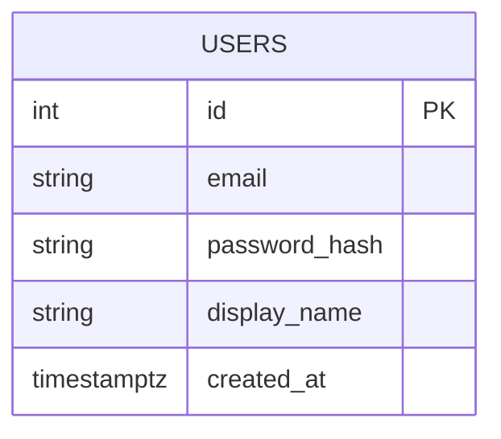
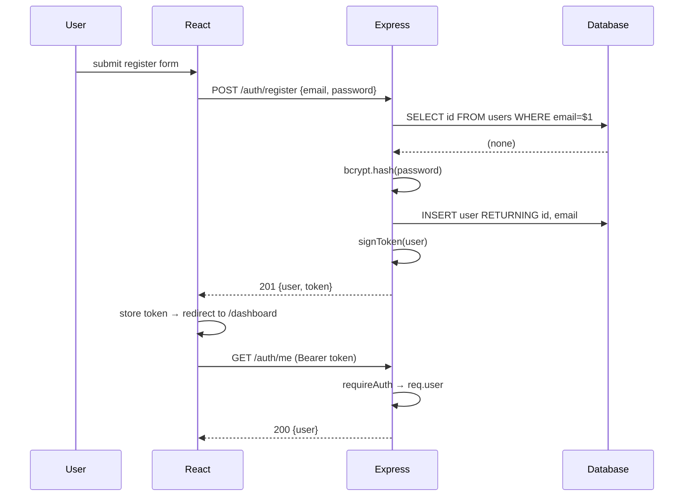

# 02 — User Auth System

🏢 **Asked at:** Every company — auth is always part of the base of a full stack round.

> Auth is rarely *the* question, but it's the floor every other question stands on. If you can scaffold register → login → protected route → logout from memory in 15 minutes, you free up the rest of the round for the actual feature. This file is that muscle memory, complete.

---

## 🎬 The Product Story

Think of the last app you signed into. You typed an email and password, the app remembered you across page refreshes, certain pages were off-limits until you logged in, and a "Log out" button dropped you back to the login screen. Behind that mundane experience is a precise dance: hash the password, issue a token, attach the token to every request, verify it on protected routes, and clear it on logout.

Interviewers care about this because it's where security mistakes are most catastrophic — a plain-text password column or an unprotected route can sink an otherwise great submission.

---

## 📋 Requirements (clarified)

**Functional:** register, login, logout, a protected "me" endpoint, and a React route that redirects unauthenticated users.
**Non-functional:** bcrypt-hashed passwords, JWT auth, generic login errors, validation on register.

**Clarifying questions:** Token expiry length? Refresh tokens needed (usually no for a 60-min round)? Email uniqueness only, or username too?

---

## 🧱 Database Schema



```sql
-- File: database/schema.sql
CREATE TABLE users (
  id            SERIAL PRIMARY KEY,
  email         VARCHAR(255) NOT NULL,
  password_hash VARCHAR(255) NOT NULL,                 -- bcrypt hash only
  display_name  VARCHAR(100),
  created_at    TIMESTAMPTZ  NOT NULL DEFAULT now()
);
CREATE UNIQUE INDEX idx_users_email ON users(email);   -- unique + fast lookup
```

---

## 🔒 Why You Never Store Plain-Text Passwords (the analogy)

> Storing a plain password is like a gym keeping a photocopy of every member's house key. Lose the binder once and every member's home is exposed. Instead, the gym should store something that *proves* you own the key without *being* the key.

That "something" is a **hash** [a one-way fingerprint of the password]. We store the fingerprint. On login we fingerprint the attempt and compare. bcrypt adds a **salt** [random per-user data so identical passwords get different hashes] and is deliberately **slow** to make brute-force expensive.

---

## 🔌 API Design

| Method | Path | Auth | Body | Success | Errors |
|--------|------|------|------|---------|--------|
| POST | `/api/v1/auth/register` | – | `{email, password, displayName?}` | `201 {user, token}` | `400`, `409` |
| POST | `/api/v1/auth/login` | – | `{email, password}` | `200 {user, token}` | `400`, `401` |
| GET | `/api/v1/auth/me` | ✅ | – | `200 {user}` | `401` |
| POST | `/api/v1/auth/logout` | ✅ | – | `200 {message}` | `401` |

> Note: with stateless JWT, "logout" is mostly a client action (drop the token). The endpoint exists for symmetry and for the optional token-blacklist twist.

---

## 🌳 Component Tree & State

```text
<App>
└── <AuthProvider>                  // token + user, persisted to localStorage
    ├── <RegisterPage> / <LoginPage>
    ├── <Navbar>                    // shows email + Logout when authed
    └── <PrivateRoute><Dashboard/></PrivateRoute>
```
```text
AuthContext: { token, user, login(), logout(), isAuthed }
LoginPage:   email, password (controlled), error, loading
```

---

## 🔄 Flow Diagram



**Reading this diagram:** Register checks the email is free, hashes the password, inserts the user, and immediately issues a token so the user is logged in. The client stores the token and calls `/auth/me`, which the server answers only after verifying the token — proving the protected-route mechanism works.

---

## 💻 Complete Working Code

> Shared infrastructure (`db.js`, `asyncHandler`, `errorHandler`, `validate`, `token.js`, `requireAuth`) is identical to [Module 00 / Problem 01](./01-todo-app-with-api.md). Shown here: the auth-specific controller, routes, and the full React auth layer.

```javascript
// File: server/controllers/authController.js
const bcrypt = require("bcrypt");
const { query } = require("../db");
const { signToken } = require("../auth/token");

// Simple email shape check (in a real app use a library / express-validator).
const EMAIL_RE = /^[^\s@]+@[^\s@]+\.[^\s@]+$/;

const AuthController = {
  async register(req, res) {
    const { email, password, displayName } = req.body;

    if (!EMAIL_RE.test(email)) {
      return res.status(400).json({ success: false, error: "Invalid email format" });
    }
    if (password.length < 8) {
      return res.status(400).json({ success: false, error: "Password must be at least 8 characters" });
    }

    const existing = await query("SELECT id FROM users WHERE email = $1", [email]);
    if (existing.rows.length) {
      return res.status(409).json({ success: false, error: "Email already registered" });
    }

    const passwordHash = await bcrypt.hash(password, 10);   // 10 = cost factor
    const { rows } = await query(
      "INSERT INTO users (email, password_hash, display_name) VALUES ($1, $2, $3) RETURNING id, email, display_name",
      [email, passwordHash, displayName || null]
    );
    const user = rows[0];
    res.status(201).json({ success: true, data: { user, token: signToken(user) } });
  },

  async login(req, res) {
    const { email, password } = req.body;
    const { rows } = await query(
      "SELECT id, email, display_name, password_hash FROM users WHERE email = $1",
      [email]
    );
    const user = rows[0];
    if (!user || !(await bcrypt.compare(password, user.password_hash))) {
      return res.status(401).json({ success: false, error: "Invalid email or password" }); // generic
    }
    const safeUser = { id: user.id, email: user.email, display_name: user.display_name };
    res.status(200).json({ success: true, data: { user: safeUser, token: signToken(safeUser) } });
  },

  async me(req, res) {
    // requireAuth already verified the token and set req.user.
    const { rows } = await query(
      "SELECT id, email, display_name, created_at FROM users WHERE id = $1",
      [req.user.id]
    );
    if (!rows[0]) return res.status(404).json({ success: false, error: "User not found" });
    res.status(200).json({ success: true, data: rows[0] });
  },

  async logout(req, res) {
    // Stateless JWT: nothing to invalidate server-side by default.
    // (See Twist 1 for a real blacklist.) Client drops the token.
    res.status(200).json({ success: true, message: "Logged out" });
  },
};

module.exports = { AuthController };
```

```javascript
// File: server/routes/auth.js
const express = require("express");
const router = express.Router();
const { AuthController } = require("../controllers/authController");
const { requireAuth } = require("../middleware/auth");
const { requireFields } = require("../middleware/validate");
const { asyncHandler } = require("../middleware/asyncHandler");

router.post("/register", requireFields(["email", "password"]), asyncHandler(AuthController.register));
router.post("/login", requireFields(["email", "password"]), asyncHandler(AuthController.login));
router.get("/me", requireAuth, asyncHandler(AuthController.me));
router.post("/logout", requireAuth, asyncHandler(AuthController.logout));

module.exports = router;
```

### Frontend — the complete auth layer

```jsx
// File: client/src/context/AuthContext.jsx
import { createContext, useContext, useEffect, useState } from "react";
import { apiFetch } from "../api/client";

const AuthContext = createContext(null);

export function AuthProvider({ children }) {
  const [token, setToken] = useState(() => localStorage.getItem("token"));
  const [user, setUser] = useState(null);
  const [loading, setLoading] = useState(!!token);          // if we have a token, verify it

  // On mount (or token change), confirm the token is still valid by calling /me.
  useEffect(() => {
    if (!token) { setLoading(false); return; }
    apiFetch("/auth/me")
      .then(setUser)
      .catch(() => { localStorage.removeItem("token"); setToken(null); }) // stale/invalid token
      .finally(() => setLoading(false));
  }, [token]);

  function login(newToken, userData) {
    localStorage.setItem("token", newToken);
    setToken(newToken);
    setUser(userData);
  }

  async function logout() {
    try { await apiFetch("/auth/logout", { method: "POST" }); } catch { /* ignore */ }
    localStorage.removeItem("token");
    setToken(null);
    setUser(null);
  }

  return (
    <AuthContext.Provider value={{ token, user, loading, login, logout, isAuthed: !!token }}>
      {children}
    </AuthContext.Provider>
  );
}

export function useAuth() {
  const ctx = useContext(AuthContext);
  if (!ctx) throw new Error("useAuth must be used within <AuthProvider>");
  return ctx;
}
```

```jsx
// File: client/src/components/PrivateRoute.jsx
import { Navigate } from "react-router-dom";
import { useAuth } from "../context/AuthContext";

export function PrivateRoute({ children }) {
  const { isAuthed, loading } = useAuth();
  if (loading) return <p>Checking session…</p>;             // avoid redirect flicker on refresh
  return isAuthed ? children : <Navigate to="/login" replace />;
}
```

```jsx
// File: client/src/pages/RegisterPage.jsx
import { useState } from "react";
import { useNavigate, Link } from "react-router-dom";
import { useAuth } from "../context/AuthContext";
import { apiFetch } from "../api/client";

export function RegisterPage() {
  const { login } = useAuth();
  const navigate = useNavigate();
  const [form, setForm] = useState({ email: "", password: "", displayName: "" });
  const [error, setError] = useState("");
  const [loading, setLoading] = useState(false);

  function update(field) {
    return (e) => setForm((f) => ({ ...f, [field]: e.target.value }));
  }

  async function handleSubmit(e) {
    e.preventDefault();
    setError("");
    setLoading(true);
    try {
      const { user, token } = await apiFetch("/auth/register", {
        method: "POST",
        body: JSON.stringify(form),
      });
      login(token, user);
      navigate("/dashboard");
    } catch (err) {
      setError(err.message);                                 // e.g. "Email already registered"
    } finally {
      setLoading(false);
    }
  }

  return (
    <form onSubmit={handleSubmit}>
      <h1>Create account</h1>
      {error && <p role="alert">{error}</p>}
      <input type="email" placeholder="Email" value={form.email} onChange={update("email")} />
      <input type="password" placeholder="Password (8+ chars)" value={form.password} onChange={update("password")} />
      <input placeholder="Display name (optional)" value={form.displayName} onChange={update("displayName")} />
      <button disabled={loading}>{loading ? "Creating…" : "Register"}</button>
      <p>Already have an account? <Link to="/login">Log in</Link></p>
    </form>
  );
}
```

```jsx
// File: client/src/pages/LoginPage.jsx
import { useState } from "react";
import { useNavigate, Link } from "react-router-dom";
import { useAuth } from "../context/AuthContext";
import { apiFetch } from "../api/client";

export function LoginPage() {
  const { login } = useAuth();
  const navigate = useNavigate();
  const [email, setEmail] = useState("");
  const [password, setPassword] = useState("");
  const [error, setError] = useState("");
  const [loading, setLoading] = useState(false);

  async function handleSubmit(e) {
    e.preventDefault();
    setError("");
    setLoading(true);
    try {
      const { user, token } = await apiFetch("/auth/login", {
        method: "POST",
        body: JSON.stringify({ email, password }),
      });
      login(token, user);
      navigate("/dashboard");
    } catch {
      setError("Invalid email or password");                 // mirror the server's generic message
    } finally {
      setLoading(false);
    }
  }

  return (
    <form onSubmit={handleSubmit}>
      <h1>Log in</h1>
      {error && <p role="alert">{error}</p>}
      <input type="email" placeholder="Email" value={email} onChange={(e) => setEmail(e.target.value)} />
      <input type="password" placeholder="Password" value={password} onChange={(e) => setPassword(e.target.value)} />
      <button disabled={loading}>{loading ? "Signing in…" : "Log in"}</button>
      <p>No account? <Link to="/register">Register</Link></p>
    </form>
  );
}
```

```jsx
// File: client/src/App.jsx
import { BrowserRouter, Routes, Route } from "react-router-dom";
import { AuthProvider } from "./context/AuthContext";
import { PrivateRoute } from "./components/PrivateRoute";
import { LoginPage } from "./pages/LoginPage";
import { RegisterPage } from "./pages/RegisterPage";
import { Dashboard } from "./pages/Dashboard";

export default function App() {
  return (
    <AuthProvider>
      <BrowserRouter>
        <Routes>
          <Route path="/login" element={<LoginPage />} />
          <Route path="/register" element={<RegisterPage />} />
          <Route path="/dashboard" element={<PrivateRoute><Dashboard /></PrivateRoute>} />
          <Route path="*" element={<LoginPage />} />
        </Routes>
      </BrowserRouter>
    </AuthProvider>
  );
}
```

### Running
```bash
psql fullstack_course < database/schema.sql
cd server && npm install && npm run dev      # :4000
cd client && npm install && npm run dev      # :5173
```

### 🖥️ What You Will See
Visiting `/dashboard` while logged out redirects you to `/login`. Register with a weak password and you get "Password must be at least 8 characters." Register successfully and you land on the dashboard showing your email. Refresh — you stay logged in (the token in localStorage is re-verified via `/me`). Click Logout and you bounce back to `/login`; visiting `/dashboard` again redirects you.

---

## ⚠️ What Makes This Problem Tricky (5 Non-Obvious Traps)

🔴 **Trap 1:** Different error messages for "email not found" vs "wrong password."
✅ Use one generic message for both.
💡 Distinct messages let an attacker enumerate which emails are registered.

🔴 **Trap 2:** Storing the JWT where XSS can steal it without a thought to trade-offs.
✅ Know the trade-off: `localStorage` (simple, XSS-exposed) vs `httpOnly` cookie (CSRF considerations). State it.
💡 Interviewers want you to *articulate* the trade-off, not just pick one silently.

🔴 **Trap 3:** No `/me` re-verification on refresh, so a deleted/expired user appears logged in.
✅ On app load, verify the token via `/me` before trusting it.
💡 Shows you understand tokens can become stale.

🔴 **Trap 4:** Putting sensitive data (password hash, roles you don't want exposed) in the JWT payload.
✅ Payload is only base64 — readable by anyone. Keep it to id + email.
💡 A classic "do you know JWT isn't encrypted?" check.

🔴 **Trap 5:** Returning the `password_hash` in the user object.
✅ Always `SELECT` explicit columns / strip the hash before responding.
💡 Leaking the hash enables offline cracking.

---

## 🌀 How the Interviewer Can Twist This Question (6 Extensions)

**Twist 1 (Auth/Security): Real logout via token blacklist**
🗣️ *"Logout must actually invalidate the token immediately."*
🧠 Stateful revocation atop stateless JWT.
🛠️ Backend.
💻
```javascript
const revoked = new Set();                                  // (use Redis in prod)
function requireAuthChecked(req, res, next) {
  const token = (req.headers.authorization || "").slice(7);
  if (revoked.has(token)) return res.status(401).json({ success: false, error: "Token revoked" });
  return requireAuth(req, res, next);
}
// logout: revoked.add(token)
```

**Twist 2 (Real-time): Force-logout across devices**
🗣️ *"If I change my password, log out all my other sessions."*
🧠 Token versioning.
🛠️ Backend + DB.
💻
```sql
ALTER TABLE users ADD COLUMN token_version INT NOT NULL DEFAULT 0;
-- include token_version in JWT; bump it on password change; reject tokens whose version is stale
```

**Twist 3 (Scale): Refresh tokens**
🗣️ *"Access tokens expire in 15 min but users shouldn't be logged out."*
🧠 Short access token + long refresh token.
🛠️ Backend + Frontend.
💻
```javascript
// issue access (15m) + refresh (7d, stored in DB); POST /auth/refresh swaps a valid refresh for a new access token
```

**Twist 4 (New feature): Role-based access control (RBAC)**
🗣️ *"Admins can see all users; regular users only themselves."*
🧠 Authorization layers.
🛠️ All three.
💻
```javascript
const requireRole = (role) => (req, res, next) =>
  req.user.role === role ? next() : res.status(403).json({ success: false, error: "Forbidden" });
// router.get("/users", requireAuth, requireRole("admin"), ...)
```

**Twist 5 (Performance): Cache /me lookups**
🗣️ *"`/me` is hit on every page load; don't hit the DB each time."*
🧠 Caching.
🛠️ Backend.
💻
```javascript
// LRU/Redis cache keyed by userId, short TTL; invalidate on profile update
```

**Twist 6 (Resilience): Account lockout + exponential backoff**
🗣️ *"Lock an account after repeated failures, then ease off."*
🧠 Brute-force defense.
🛠️ Backend + DB.
💻
```sql
ALTER TABLE users ADD COLUMN failed_attempts INT DEFAULT 0, ADD COLUMN locked_until TIMESTAMPTZ;
-- on failure: increment; if >=5, locked_until = now() + interval '5 minutes'; reset on success
```

---

## 🧪 Test Cases (8 Cases)

| # | Action | Input | Expected API Response | Expected UI Behavior |
|---|--------|-------|-----------------------|----------------------|
| 1 | Register (happy) | valid email/pw | `201 {user, token}` | Land on dashboard |
| 2 | Register weak pw | pw < 8 | `400` | Inline error |
| 3 | Register dup email | existing email | `409` | "Email already registered" |
| 4 | Login (happy) | correct creds | `200 {user, token}` | Dashboard |
| 5 | Login wrong pw | bad pw | `401` generic | "Invalid email or password" |
| 6 | Login unknown email | no such user | `401` generic | Same generic message |
| 7 | GET /me valid token | token | `200 {user}` | Shows email |
| 8 | GET /me no token | – | `401` | Redirect to /login |

---

## ⏱️ Time Budget

| Phase | Time | What to do |
|-------|------|-----------|
| Read & clarify | 4 min | Token expiry? refresh? username? |
| Schema | 6 min | `users` + unique email index |
| API design | 5 min | register/login/me/logout |
| Backend | 20 min | controller + token + requireAuth + routes |
| Frontend | 25 min | AuthContext + PrivateRoute + Login/Register |
| Test | 10 min | refresh persistence, redirect, generic errors |
| Buffer | 10 min | weak-pw, dup-email, no-token cases |

---

## 🎤 Famous Interview Questions

**Q1 (Conceptual): What exactly is inside a JWT, and which parts are safe to trust?**
🏢 *Asked at: Atlassian*
✅ Answer: A JWT has three base64url parts: a header (algorithm), a payload (claims like `sub` and `exp`), and a signature. The header and payload are *encoded, not encrypted* — anyone can read them — so you never put secrets there. The trustworthy part is the signature: it's computed from the header, payload, and your server secret, so a tampered payload won't match. On each request you recompute and compare the signature; if it matches and the token isn't expired, you trust the claims.
💡 Bonus insight: This is why a stolen token is dangerous until expiry — there's no server lookup to revoke it, which is the whole reason refresh-token rotation and short access-token lifetimes exist.

**Q2 (Design Decision): Why bcrypt instead of SHA-256 for passwords?**
🏢 *Asked at: Stripe*
✅ Answer: SHA-256 is designed to be *fast*, which is exactly wrong for passwords — an attacker with a leaked database can compute billions of SHA-256 hashes per second. bcrypt is deliberately slow with a tunable cost factor, and it bakes in a per-user salt so identical passwords produce different hashes, defeating rainbow tables. The cost factor also future-proofs you: as hardware gets faster, you raise it.
💡 Bonus insight: Modern alternatives like argon2 also resist GPU/ASIC attacks via memory-hardness; bcrypt is still perfectly acceptable and ubiquitous in Node.

**Q3 (Trade-off): localStorage vs httpOnly cookie for the token?**
🏢 *Asked at: CRED*
✅ Answer: localStorage is trivial to use and works the same for web and mobile webviews, but JavaScript can read it, so an XSS bug leaks the token. An httpOnly cookie can't be read by JS (mitigating XSS theft) but is sent automatically, which opens CSRF risk, so you need SameSite and CSRF tokens. For a short interview I use localStorage and *say* the trade-off; for production handling sensitive data I'd lean to httpOnly cookies with SameSite=strict.
💡 Bonus insight: The deeper point is that no storage is purely "safe" — you're choosing which attack class to defend against and pairing it with the right mitigation.

**Q4 (Extension): How do refresh tokens keep users logged in without long-lived access tokens?**
🏢 *Asked at: Postman*
✅ Answer: You issue a short-lived access token (say 15 minutes) and a long-lived refresh token (days), stored server-side or in an httpOnly cookie. The access token is used for API calls; when it expires, the client silently calls `/auth/refresh` with the refresh token to get a new access token. Because the refresh token is stored and can be revoked, you get both convenience and the ability to log someone out — something a bare access token can't offer.
💡 Bonus insight: Rotating the refresh token on each use (and detecting reuse of an old one) lets you spot token theft — if a stolen refresh token is replayed after the legitimate client already rotated, you invalidate the whole chain.

**Q5 (Security/Edge case): How do you defend the login endpoint against brute force?**
🏢 *Asked at: Razorpay*
✅ Answer: Layer several defenses: rate-limit by IP + email so only a handful of attempts are allowed per minute (429 after that); lock an account temporarily after repeated failures with exponential backoff; keep the error message generic so attackers can't tell whether the email exists; and ensure bcrypt's cost makes each guess expensive. For high-value accounts I'd add a second factor.
💡 Bonus insight: Rate-limiting purely by IP is weak against distributed attacks, so combining IP with the targeted email (and account lockout) is more robust — you slow both the spray and the focused attack.

---

## 🔗 Navigation
⬅️ Previous: [01 — Todo App with API](./01-todo-app-with-api.md)
➡️ Next: [03 — Blog Platform](./03-blog-platform.md)
🏠 [Module Home](./README.md)
