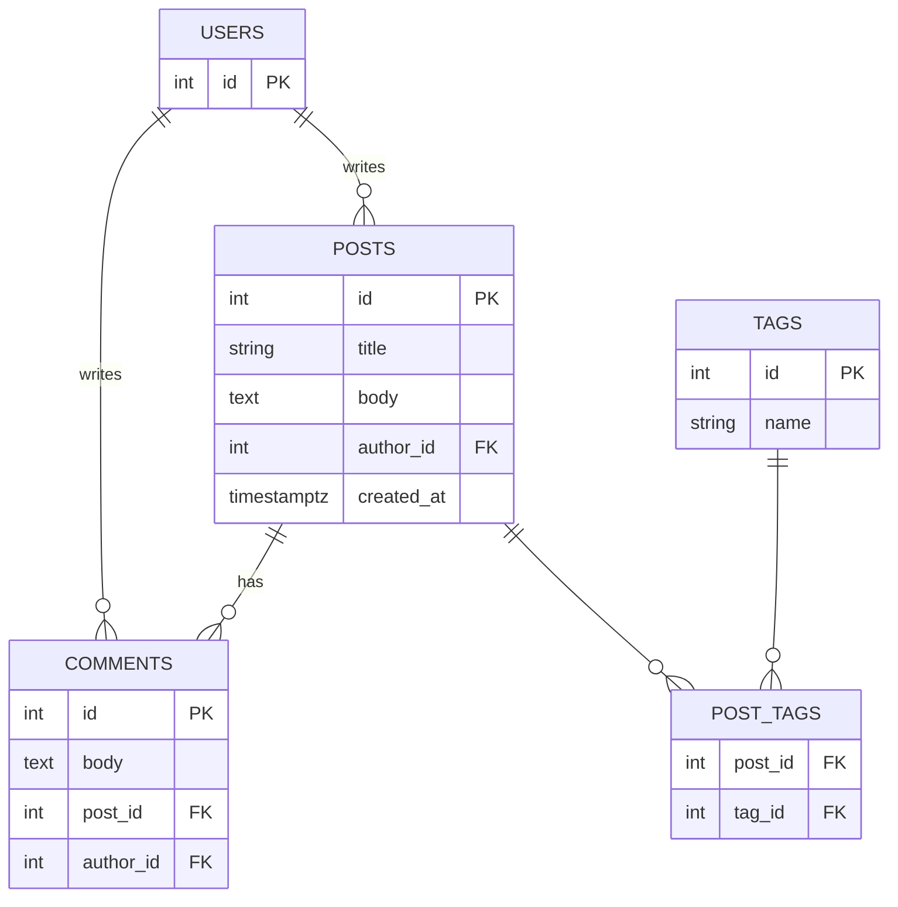
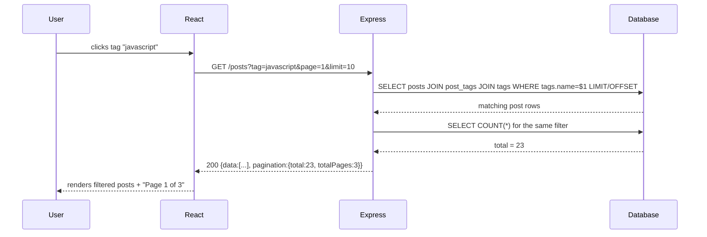

# 03 — Blog Platform

🏢 **Asked at:** Freshworks, Zoho, Atlassian, Chargebee

> This is the canonical "relational data" question. The moment you have posts that have comments and tags, you're forced to model one-to-many *and* many-to-many relationships, write JOINs, and paginate. Nail this and you've proven you can model real data.

---

## 🎬 The Product Story

Picture Dev.to or Medium. An author writes a post. Readers leave comments under it. The post is filed under tags like "javascript" or "career," and clicking a tag shows every post with that tag. There's a search box for titles, and the post list is paginated because there could be thousands.

Four relationships are hiding in that paragraph: a user *has many* posts, a post *has many* comments, a post *has many* tags, and a tag *belongs to many* posts. That last pair is **many-to-many** — the relationship that trips up most candidates and the reason this question is asked.

---

## 📋 Requirements (clarified)

**Functional:** authors CRUD their own posts; anyone logged in can comment; posts have tags; filter posts by tag; search posts by title; paginate the list.
**Non-functional:** only the author edits/deletes their post; comments show author + timestamp; clean pagination metadata.

**Clarifying questions:** Are posts public or login-only to read? Can anyone comment or only registered users? Soft-delete or hard-delete posts? Markdown body or plain text?

---

## 🧱 Database Schema



```sql
-- File: database/schema.sql
CREATE TABLE users (
  id SERIAL PRIMARY KEY,
  email VARCHAR(255) NOT NULL,
  password_hash VARCHAR(255) NOT NULL,
  display_name VARCHAR(100)
);
CREATE UNIQUE INDEX idx_users_email ON users(email);

CREATE TABLE posts (
  id         SERIAL PRIMARY KEY,
  title      VARCHAR(255) NOT NULL,
  body       TEXT NOT NULL,
  author_id  INTEGER NOT NULL REFERENCES users(id) ON DELETE CASCADE,  -- one author, many posts
  created_at TIMESTAMPTZ NOT NULL DEFAULT now()
);
CREATE INDEX idx_posts_author ON posts(author_id);
CREATE INDEX idx_posts_created ON posts(created_at DESC);    -- newest-first listing

CREATE TABLE comments (
  id         SERIAL PRIMARY KEY,
  body       TEXT NOT NULL,
  post_id    INTEGER NOT NULL REFERENCES posts(id) ON DELETE CASCADE, -- delete post → delete its comments
  author_id  INTEGER NOT NULL REFERENCES users(id) ON DELETE CASCADE,
  created_at TIMESTAMPTZ NOT NULL DEFAULT now()
);
CREATE INDEX idx_comments_post ON comments(post_id);

CREATE TABLE tags (
  id   SERIAL PRIMARY KEY,
  name VARCHAR(50) NOT NULL UNIQUE                           -- each tag name stored once
);

-- The JOIN TABLE that implements the many-to-many between posts and tags.
CREATE TABLE post_tags (
  post_id INTEGER NOT NULL REFERENCES posts(id) ON DELETE CASCADE,
  tag_id  INTEGER NOT NULL REFERENCES tags(id)  ON DELETE CASCADE,
  PRIMARY KEY (post_id, tag_id)                              -- a (post,tag) pair appears once
);
CREATE INDEX idx_post_tags_tag ON post_tags(tag_id);         -- "all posts with tag X"
```

> **Why a join table?** A post can have many tags and a tag can label many posts. You can't store that with a column on either side without repeating data. `post_tags` holds one row per pairing — the textbook many-to-many.

---

## 🔌 API Design

| Method | Path | Auth | Purpose |
|--------|------|------|---------|
| GET | `/api/v1/posts?page&limit&tag&q` | – | List posts (paginated, filter by `tag`, search `q`) |
| GET | `/api/v1/posts/:id` | – | One post with its tags |
| POST | `/api/v1/posts` | ✅ | Create (body: `{title, body, tags:[]}`) |
| PATCH | `/api/v1/posts/:id` | ✅ (author) | Update own post |
| DELETE | `/api/v1/posts/:id` | ✅ (author) | Delete own post |
| GET | `/api/v1/posts/:id/comments` | – | Comments for a post |
| POST | `/api/v1/posts/:id/comments` | ✅ | Add a comment |

List response includes pagination:
```json
{ "success": true, "data": [ ... ], "pagination": { "page": 1, "limit": 10, "total": 137, "totalPages": 14 } }
```

---

## 🌳 Component Tree & State

```text
<App>
└── <AuthProvider>
    ├── <PostsPage>                 // list + filters
    │   ├── <SearchBar>             // debounced title search
    │   ├── <TagFilter>            // click a tag to filter
    │   ├── <PostList>/<PostCard>
    │   └── <Pagination>
    ├── <PostDetailPage>
    │   ├── <PostBody>
    │   └── <CommentSection>/<CommentItem>/<AddCommentForm>
    └── <CreatePostForm>            // title, body, tags input
```
```text
PostsPage: posts[], page, totalPages, tag, query (debounced), loading, error
PostDetail: post, comments[], loading, error
CreatePost: title, body, tagsInput (controlled)
```

---

## 🔄 Flow Diagram (filter posts by tag)



**Reading this diagram:** Clicking a tag issues a filtered, paginated GET. The server JOINs posts to the tag through the `post_tags` join table, applies LIMIT/OFFSET for the page, and runs a second COUNT query so the UI can render "Page 1 of 3." No state-changing happens on this read — it's a pure GET.

---

## 💻 Complete Working Code

> Shared infra (db, middleware, auth, api client) as in earlier files. Shown: post/comment models with JOINs, controllers, routes, and the key React pieces.

```javascript
// File: server/models/postModel.js
const { query } = require("../db");

const PostModel = {
  // List with optional tag filter + title search + pagination.
  async list({ page = 1, limit = 10, tag, q }) {
    const params = [];
    const where = [];

    // Title search (ILIKE = case-insensitive LIKE in Postgres).
    if (q) { params.push(`%${q}%`); where.push(`p.title ILIKE $${params.length}`); }

    // Tag filter requires joining through the join table.
    let join = "";
    if (tag) {
      params.push(tag);
      join = "JOIN post_tags pt ON pt.post_id = p.id JOIN tags t ON t.id = pt.tag_id";
      where.push(`t.name = $${params.length}`);
    }

    const whereSql = where.length ? `WHERE ${where.join(" AND ")}` : "";

    // COUNT for pagination metadata (same filters, distinct posts).
    const countSql = `SELECT COUNT(DISTINCT p.id) AS total FROM posts p ${join} ${whereSql}`;
    const total = parseInt((await query(countSql, params)).rows[0].total, 10);

    // Page of rows. Add LIMIT/OFFSET params last.
    params.push(limit, (page - 1) * limit);
    const rowsSql = `
      SELECT DISTINCT p.id, p.title, p.created_at, u.display_name AS author
      FROM posts p JOIN users u ON u.id = p.author_id ${join} ${whereSql}
      ORDER BY p.created_at DESC
      LIMIT $${params.length - 1} OFFSET $${params.length}`;
    const rows = (await query(rowsSql, params)).rows;

    return { rows, total };
  },

  async getById(id) {
    const post = (await query(
      `SELECT p.id, p.title, p.body, p.created_at, u.display_name AS author, p.author_id
       FROM posts p JOIN users u ON u.id = p.author_id WHERE p.id = $1`,
      [id]
    )).rows[0];
    if (!post) return null;
    // Attach tags via the join table.
    post.tags = (await query(
      `SELECT t.name FROM tags t JOIN post_tags pt ON pt.tag_id = t.id WHERE pt.post_id = $1`,
      [id]
    )).rows.map((r) => r.name);
    return post;
  },

  async create(authorId, { title, body, tags = [] }) {
    // Insert the post.
    const post = (await query(
      "INSERT INTO posts (title, body, author_id) VALUES ($1, $2, $3) RETURNING id, title, body, created_at",
      [title, body, authorId]
    )).rows[0];
    // Upsert each tag and link it (idempotent via ON CONFLICT).
    for (const name of tags) {
      const tag = (await query(
        "INSERT INTO tags (name) VALUES ($1) ON CONFLICT (name) DO UPDATE SET name = EXCLUDED.name RETURNING id",
        [name]
      )).rows[0];
      await query(
        "INSERT INTO post_tags (post_id, tag_id) VALUES ($1, $2) ON CONFLICT DO NOTHING",
        [post.id, tag.id]
      );
    }
    post.tags = tags;
    return post;
  },

  // Returns the author_id so the controller can check ownership.
  ownerOf: (id) => query("SELECT author_id FROM posts WHERE id = $1", [id]).then((r) => r.rows[0]?.author_id ?? null),
  update: (id, { title, body }) =>
    query("UPDATE posts SET title = COALESCE($1,title), body = COALESCE($2,body) WHERE id = $3 RETURNING id, title, body",
      [title ?? null, body ?? null, id]).then((r) => r.rows[0]),
  remove: (id) => query("DELETE FROM posts WHERE id = $1 RETURNING id", [id]).then((r) => r.rows[0]),
};

module.exports = { PostModel };
```

```javascript
// File: server/models/commentModel.js
const { query } = require("../db");
const CommentModel = {
  listByPost: (postId) =>
    query(
      `SELECT c.id, c.body, c.created_at, u.display_name AS author
       FROM comments c JOIN users u ON u.id = c.author_id
       WHERE c.post_id = $1 ORDER BY c.created_at ASC`,
      [postId]
    ).then((r) => r.rows),
  create: (postId, authorId, body) =>
    query(
      "INSERT INTO comments (post_id, author_id, body) VALUES ($1, $2, $3) RETURNING id, body, created_at",
      [postId, authorId, body]
    ).then((r) => r.rows[0]),
};
module.exports = { CommentModel };
```

```javascript
// File: server/controllers/postController.js
const { PostModel } = require("../models/postModel");

const PostController = {
  async list(req, res) {
    const page = Math.max(parseInt(req.query.page) || 1, 1);
    const limit = Math.min(parseInt(req.query.limit) || 10, 50);
    const { rows, total } = await PostModel.list({ page, limit, tag: req.query.tag, q: req.query.q });
    res.status(200).json({
      success: true,
      data: rows,
      pagination: { page, limit, total, totalPages: Math.ceil(total / limit) },
    });
  },

  async getOne(req, res) {
    const post = await PostModel.getById(req.params.id);
    if (!post) return res.status(404).json({ success: false, error: "Post not found" });
    res.status(200).json({ success: true, data: post });
  },

  async create(req, res) {
    const post = await PostModel.create(req.user.id, req.body);
    res.status(201).json({ success: true, data: post });
  },

  async update(req, res) {
    const ownerId = await PostModel.ownerOf(req.params.id);
    if (ownerId === null) return res.status(404).json({ success: false, error: "Post not found" });
    if (ownerId !== req.user.id) return res.status(403).json({ success: false, error: "Not your post" }); // 403!
    const post = await PostModel.update(req.params.id, req.body);
    res.status(200).json({ success: true, data: post });
  },

  async remove(req, res) {
    const ownerId = await PostModel.ownerOf(req.params.id);
    if (ownerId === null) return res.status(404).json({ success: false, error: "Post not found" });
    if (ownerId !== req.user.id) return res.status(403).json({ success: false, error: "Not your post" });
    await PostModel.remove(req.params.id);
    res.status(204).send();
  },
};

module.exports = { PostController };
```

```javascript
// File: server/routes/posts.js
const express = require("express");
const router = express.Router();
const { PostController } = require("../controllers/postController");
const { CommentModel } = require("../models/commentModel");
const { requireAuth } = require("../middleware/auth");
const { requireFields } = require("../middleware/validate");
const { asyncHandler } = require("../middleware/asyncHandler");

router.get("/", asyncHandler(PostController.list));                       // public list
router.get("/:id", asyncHandler(PostController.getOne));                  // public read
router.post("/", requireAuth, requireFields(["title", "body"]), asyncHandler(PostController.create));
router.patch("/:id", requireAuth, asyncHandler(PostController.update));
router.delete("/:id", requireAuth, asyncHandler(PostController.remove));

// Comments nested under a post.
router.get("/:id/comments", asyncHandler(async (req, res) => {
  const comments = await CommentModel.listByPost(req.params.id);
  res.status(200).json({ success: true, data: comments });
}));
router.post("/:id/comments", requireAuth, requireFields(["body"]), asyncHandler(async (req, res) => {
  const comment = await CommentModel.create(req.params.id, req.user.id, req.body.body);
  res.status(201).json({ success: true, data: comment });
}));

module.exports = router;
```

### Frontend (key pieces)

```jsx
// File: client/src/pages/PostsPage.jsx
import { useEffect, useState } from "react";
import { apiFetch } from "../api/client";
import { useDebounce } from "../hooks/useDebounce";

export function PostsPage() {
  const [posts, setPosts] = useState([]);
  const [page, setPage] = useState(1);
  const [totalPages, setTotalPages] = useState(1);
  const [tag, setTag] = useState("");
  const [query, setQuery] = useState("");
  const debouncedQuery = useDebounce(query, 300);            // avoid a request per keystroke
  const [loading, setLoading] = useState(true);
  const [error, setError] = useState(null);

  useEffect(() => {
    const params = new URLSearchParams({ page, limit: 10 });
    if (tag) params.set("tag", tag);
    if (debouncedQuery) params.set("q", debouncedQuery);
    setLoading(true);
    apiFetch(`/posts?${params}`)                             // apiFetch returns .data; need pagination too
      .catch((e) => { setError(e.message); return null; })
      .then(async () => {
        // Use raw fetch here to read pagination; apiFetch unwraps only .data.
        const res = await fetch(`/api/v1/posts?${params}`);
        const json = await res.json();
        setPosts(json.data);
        setTotalPages(json.pagination.totalPages);
      })
      .finally(() => setLoading(false));
  }, [page, tag, debouncedQuery]);

  if (error) return <p role="alert">Error: {error}</p>;

  return (
    <div>
      <input placeholder="Search titles…" value={query} onChange={(e) => { setQuery(e.target.value); setPage(1); }} />
      {tag && <button onClick={() => { setTag(""); setPage(1); }}>Clear tag: {tag} ✕</button>}
      {loading ? <p>Loading…</p> : posts.length === 0 ? <p>No posts found.</p> : (
        <ul>
          {posts.map((p) => (
            <li key={p.id}>
              <a href={`/posts/${p.id}`}>{p.title}</a> <small>by {p.author}</small>
            </li>
          ))}
        </ul>
      )}
      <div>
        <button disabled={page <= 1} onClick={() => setPage((n) => n - 1)}>Prev</button>
        <span> Page {page} of {totalPages} </span>
        <button disabled={page >= totalPages} onClick={() => setPage((n) => n + 1)}>Next</button>
      </div>
    </div>
  );
}
```

```jsx
// File: client/src/components/CommentSection.jsx
import { useEffect, useState } from "react";
import { apiFetch } from "../api/client";

export function CommentSection({ postId }) {
  const [comments, setComments] = useState([]);
  const [body, setBody] = useState("");
  const [loading, setLoading] = useState(true);

  useEffect(() => {
    apiFetch(`/posts/${postId}/comments`).then(setComments).finally(() => setLoading(false));
  }, [postId]);

  async function submit(e) {
    e.preventDefault();
    if (!body.trim()) return;
    const c = await apiFetch(`/posts/${postId}/comments`, { method: "POST", body: JSON.stringify({ body }) });
    setComments((prev) => [...prev, c]);                    // append new comment
    setBody("");
  }

  if (loading) return <p>Loading comments…</p>;
  return (
    <section>
      <h3>Comments ({comments.length})</h3>
      {comments.length === 0 && <p>Be the first to comment.</p>}
      {comments.map((c) => (
        <div key={c.id}><strong>{c.author}</strong>: {c.body}</div>
      ))}
      <form onSubmit={submit}>
        <textarea value={body} onChange={(e) => setBody(e.target.value)} placeholder="Add a comment…" />
        <button>Post</button>
      </form>
    </section>
  );
}
```

### Running
```bash
psql fullstack_course < database/schema.sql
cd server && npm install && npm run dev
cd client && npm install && npm run dev
```

### 🖥️ What You Will See
The posts list loads newest-first with page controls ("Page 1 of 14"). Type in the search box and after a brief pause the list narrows to matching titles (one request, not one per letter). Click a tag and the list filters; a "Clear tag" chip appears. Open a post to read it and its comments; add a comment and it appears immediately at the bottom. Try to PATCH someone else's post via curl and you get `403`.

---

## ⚠️ What Makes This Problem Tricky (5 Non-Obvious Traps)

🔴 **Trap 1:** Storing tags as a comma-separated string on `posts`.
✅ Use a `tags` table + `post_tags` join table.
💡 "Find all posts tagged X" and "rename a tag" are clean with a relation, ugly with a string.

🔴 **Trap 2:** Forgetting the COUNT query, so pagination has no `totalPages`.
✅ Run a second COUNT with the same filters.
💡 The UI can't render page numbers without the total.

🔴 **Trap 3:** Using `403` and `404` interchangeably for edit attempts.
✅ `404` if the post doesn't exist, `403` if it exists but isn't yours.
💡 Demonstrates you understand auth (who) vs ownership (what you may touch).

🔴 **Trap 4:** Duplicate tags when two posts use "javascript."
✅ `UNIQUE(name)` + `ON CONFLICT DO NOTHING`/`DO UPDATE` (upsert).
💡 Keeps the tag dimension clean (3NF) and makes linking idempotent.

🔴 **Trap 5:** Searching with string-concatenated `LIKE '%' + q + '%'`.
✅ Parameterize: `ILIKE $1` with the value `%q%`.
💡 String concatenation is SQL-injectable; parameters are safe.

---

## 🌀 How the Interviewer Can Twist This Question (6 Extensions)

**Twist 1 (Auth/Security): Draft vs published + only author sees drafts**
🗣️ *"Authors should see their unpublished drafts; readers shouldn't."*
🛠️ All three.
💻
```sql
ALTER TABLE posts ADD COLUMN status VARCHAR(10) NOT NULL DEFAULT 'published'; -- 'draft'|'published'
-- list: WHERE (status='published' OR author_id = $currentUser)
```

**Twist 2 (Real-time): Live comment updates**
🗣️ *"New comments should appear without refresh."*
🛠️ Backend + Frontend.
💻
```javascript
// SSE per post room; emit on POST /comments; client EventSource appends
io.to(`post:${postId}`).emit("comment", newComment);
```

**Twist 3 (Scale): Full-text search instead of ILIKE**
🗣️ *"Search the body, not just the title, and rank results."*
🛠️ DB + API.
💻
```sql
ALTER TABLE posts ADD COLUMN tsv tsvector;
CREATE INDEX idx_posts_tsv ON posts USING GIN(tsv);
-- query: WHERE tsv @@ plainto_tsquery($1) ORDER BY ts_rank(tsv, plainto_tsquery($1)) DESC
```

**Twist 4 (New feature): Likes on posts**
🗣️ *"Let users like a post; show the count; a user likes once."*
🛠️ All three.
💻
```sql
CREATE TABLE post_likes (post_id INT REFERENCES posts(id) ON DELETE CASCADE,
                         user_id INT REFERENCES users(id) ON DELETE CASCADE,
                         PRIMARY KEY (post_id, user_id));   -- one like per user (idempotent)
```

**Twist 5 (Performance): Avoid N+1 when listing posts with tags**
🗣️ *"Listing 10 posts fires 11 queries for tags. Fix it."*
🛠️ Backend.
💻
```sql
-- one query, aggregate tags per post:
SELECT p.id, p.title, array_agg(t.name) AS tags
FROM posts p LEFT JOIN post_tags pt ON pt.post_id=p.id LEFT JOIN tags t ON t.id=pt.tag_id
GROUP BY p.id ORDER BY p.created_at DESC LIMIT $1 OFFSET $2;
```

**Twist 6 (Resilience): Soft delete + restore**
🗣️ *"Deleting a post should be recoverable for 30 days."*
🛠️ DB + API.
💻
```sql
ALTER TABLE posts ADD COLUMN deleted_at TIMESTAMPTZ;
-- delete: UPDATE posts SET deleted_at=now() ... ; list: WHERE deleted_at IS NULL
```

---

## 🧪 Test Cases (8 Cases)

| # | Action | Input | Expected API Response | Expected UI Behavior |
|---|--------|-------|-----------------------|----------------------|
| 1 | List page 1 | `?page=1&limit=10` | `200 {data, pagination}` | 10 posts + page controls |
| 2 | Filter by tag | `?tag=javascript` | `200` filtered | Only JS posts, clear-tag chip |
| 3 | Search title | `?q=react` | `200` matching | Narrowed list after debounce |
| 4 | Create post | `{title, body, tags}` | `201 {data}` | Redirect/show new post |
| 5 | Empty title | `{title:""}` | `400` | Inline error |
| 6 | Edit others' post | PATCH other id | `403` | "Not your post" |
| 7 | Edit missing post | PATCH id 99999 | `404` | "Post not found" |
| 8 | Add comment | `{body:"nice"}` | `201` | Comment appears at bottom |

---

## ⏱️ Time Budget

| Phase | Time | What to do |
|-------|------|-----------|
| Read & clarify | 5 min | public reads? markdown? soft delete? |
| Schema | 12 min | users, posts, comments, tags, post_tags + indexes |
| API design | 5 min | list(filters), CRUD, nested comments |
| Backend | 28 min | post model (JOINs + pagination), comment model, controllers |
| Frontend | 22 min | PostsPage (search/tag/pagination), CommentSection |
| Test | 10 min | filter, search, ownership 403/404 |
| Buffer | 8 min | empty/loading/error states |

---

## 🎤 Famous Interview Questions

**Q1 (Conceptual): What is a many-to-many relationship and how do you model it?**
🏢 *Asked at: Zoho*
✅ Answer: It's when records on both sides can relate to many on the other — a post can have many tags and a tag can apply to many posts. You can't represent that with a foreign key column on either table without duplicating data, so you introduce a third "join" table (`post_tags`) whose rows each represent one pairing of a post and a tag. Its primary key is the composite `(post_id, tag_id)`, which guarantees a pair appears only once, and you index the other column to query from either direction.
💡 Bonus insight: The join table is also the natural place to store data *about the relationship itself* — e.g., when the tag was added — which a plain column never could.

**Q2 (Design Decision): Why a separate COUNT query for pagination instead of returning everything and counting client-side?**
🏢 *Asked at: Freshworks*
✅ Answer: Returning everything defeats the purpose of pagination — it transfers thousands of rows and slows the page. The page query uses LIMIT/OFFSET to fetch only the current slice, but the UI still needs the *total* to render "Page 1 of 14," so a second lightweight COUNT with the same WHERE filters provides it. The COUNT touches an index and returns a single number, so it's cheap compared to shipping all rows.
💡 Bonus insight: At very large scale even COUNT gets expensive, so products often switch to "load more"/cursor pagination or an approximate count — a good trade-off to mention.

**Q3 (Trade-off): ILIKE search vs full-text search — when would you switch?**
🏢 *Asked at: Atlassian*
✅ Answer: `ILIKE '%term%'` is fine for small datasets and simple "title contains" matching, but it can't use a normal index (the leading wildcard forces a scan) and it doesn't rank results or handle stemming ("run" vs "running"). Once the corpus grows or you need to search bodies and rank by relevance, you switch to Postgres full-text search with a `tsvector` column and a GIN index, which is indexed, ranked, and language-aware.
💡 Bonus insight: For typo tolerance you'd reach for trigram similarity (`pg_trgm`) or an external engine like Elasticsearch — a sensible "next step" answer.

**Q4 (Extension): How would the listing query scale to a million posts?**
🏢 *Asked at: Chargebee*
✅ Answer: I'd index `created_at` for the default newest-first sort and the join-table's `tag_id` for tag filtering. I'd move from OFFSET pagination (which scans and discards skipped rows on deep pages) to keyset/cursor pagination using `WHERE created_at < $cursor`. I'd avoid the N+1 tag problem by aggregating tags in a single query with `array_agg`. And I'd cache hot tag pages, since "posts tagged javascript page 1" is requested constantly.
💡 Bonus insight: A covering index that includes the columns the list query selects can let Postgres answer entirely from the index without touching the table heap.

**Q5 (Security/Edge case): What security issues exist and how do you handle them?**
🏢 *Asked at: Freshworks*
✅ Answer: Ownership enforcement (only the author edits/deletes — checked server-side with `403`/`404`, never trusting the client), SQL injection (all queries parameterized, including the search term and tag), and stored XSS in post/comment bodies (escape on render, and if rendering markdown, sanitize the HTML). I'd also rate-limit comment creation to prevent spam and validate body length.
💡 Bonus insight: The XSS one is the sneaky trap in a blog — user-authored content is rendered to other users, so sanitizing markdown/HTML server-side is as important as the auth checks.

---

## 🔗 Navigation
⬅️ Previous: [02 — User Auth System](./02-user-auth-system.md)
➡️ Next: [04 — Expense Tracker](./04-expense-tracker.md)
🏠 [Module Home](./README.md)
