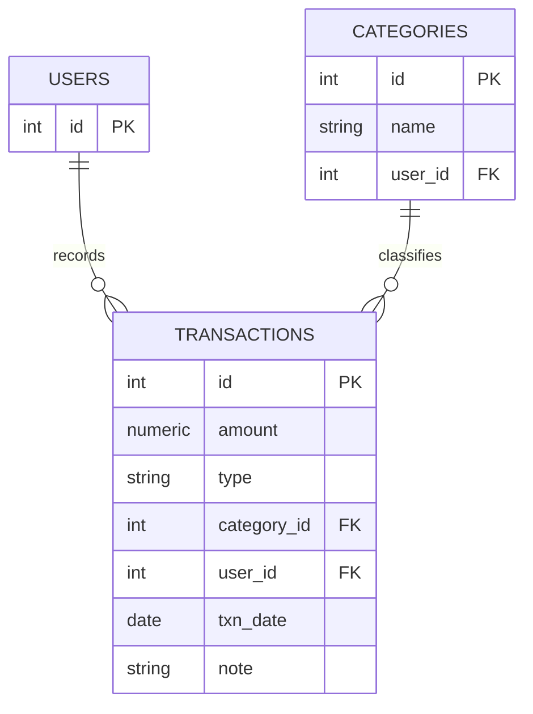
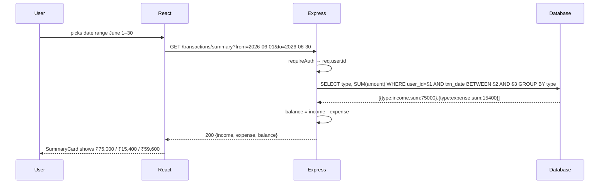

# 04 — Expense Tracker

🏢 **Asked at:** CRED, Zepto, Razorpay, PhonePe

> This is the "aggregation" question. The moment the interviewer asks for a *summary* — total income, total expense, balance, spending by category — you've left simple CRUD and entered `SUM`, `GROUP BY`, and filter-building territory. That's exactly the skill being probed.

---

## 🎬 The Product Story

Open any money app — CRED, Walnut, your bank's app. You log transactions: ₹300 groceries, ₹50,000 salary, ₹1,200 dining. The app doesn't just *list* them — it tells you "You spent ₹15,400 this month," shows a pie chart of where the money went, and a running balance. You can filter by a date range or a category. That summarization is the heart of the feature, and it lives in the database as aggregation queries.

Fintech companies love this question because money math must be *correct* — a wrong `SUM` or a float rounding error in a balance is a serious bug.

---

## 📋 Requirements (clarified)

**Functional:** add income/expense transactions with amount, category, type, date, note; list with filters (date range, category, type); a summary (total income, total expense, balance) and a by-category breakdown.
**Non-functional:** money stored precisely (not floats), per-user isolation, fast filtered queries.

**Clarifying questions:** Single currency? Are categories fixed or user-defined? Should the summary respect the active filters or always show the whole month? How precise must money be (paise)?

---

## 🧱 Database Schema



```sql
-- File: database/schema.sql
CREATE TABLE users (
  id SERIAL PRIMARY KEY,
  email VARCHAR(255) NOT NULL,
  password_hash VARCHAR(255) NOT NULL
);
CREATE UNIQUE INDEX idx_users_email ON users(email);

CREATE TABLE categories (
  id      SERIAL PRIMARY KEY,
  name    VARCHAR(50) NOT NULL,
  user_id INTEGER NOT NULL REFERENCES users(id) ON DELETE CASCADE,
  UNIQUE (user_id, name)                                  -- a user can't have two "Food" categories
);

CREATE TABLE transactions (
  id          SERIAL PRIMARY KEY,
  -- NUMERIC, NOT float: money must be exact. 12 digits, 2 after the decimal.
  amount      NUMERIC(12,2) NOT NULL CHECK (amount > 0),
  type        VARCHAR(10) NOT NULL CHECK (type IN ('income','expense')),
  category_id INTEGER REFERENCES categories(id) ON DELETE SET NULL,  -- keep txn if category deleted
  user_id     INTEGER NOT NULL REFERENCES users(id) ON DELETE CASCADE,
  txn_date    DATE NOT NULL DEFAULT CURRENT_DATE,
  note        VARCHAR(255),
  created_at  TIMESTAMPTZ NOT NULL DEFAULT now()
);
-- We filter by user + date constantly; a composite index serves both.
CREATE INDEX idx_txn_user_date ON transactions(user_id, txn_date DESC);
CREATE INDEX idx_txn_category ON transactions(category_id);
```

> **Why `NUMERIC`, not `FLOAT`?** Floats can't represent values like 0.10 exactly, so sums drift (0.1 + 0.2 ≠ 0.3). For money, that's unacceptable. `NUMERIC(12,2)` stores exact decimal values. Say this out loud — fintech interviewers are listening for it.

---

## 🔌 API Design

| Method | Path | Auth | Purpose |
|--------|------|------|---------|
| POST | `/api/v1/transactions` | ✅ | Add a transaction |
| GET | `/api/v1/transactions?from&to&category&type` | ✅ | List with filters |
| DELETE | `/api/v1/transactions/:id` | ✅ | Delete own transaction |
| GET | `/api/v1/transactions/summary?from&to` | ✅ | `{income, expense, balance}` |
| GET | `/api/v1/transactions/by-category?from&to` | ✅ | Spend grouped by category |
| GET/POST | `/api/v1/categories` | ✅ | List / create categories |

Summary response:
```json
{ "success": true, "data": { "income": "75000.00", "expense": "15400.00", "balance": "59600.00" } }
```

---

## 🌳 Component Tree & State

```text
<App>
└── <AuthProvider>
    └── <DashboardPage>
        ├── <FilterBar>            // date range, category, type
        ├── <SummaryCard>         // income / expense / balance
        ├── <CategoryChart>       // pie/bar from by-category
        ├── <AddTransactionForm>
        └── <TransactionList>/<TransactionRow>
```
```text
DashboardPage: transactions[], summary{}, byCategory[], filters{from,to,category,type}, loading, error
AddForm:       amount, type, categoryId, date, note (controlled)
```

---

## 🔄 Flow Diagram (filtered summary)



**Reading this diagram:** Choosing a date range triggers a summary GET. The server runs a single `GROUP BY type` aggregation scoped to the user and date window, then derives the balance. The whole month's totals come back as one tiny response — no need to ship every transaction to compute a sum.

---

## 💻 Complete Working Code

```javascript
// File: server/models/transactionModel.js
const { query } = require("../db");

const TransactionModel = {
  // Build a filtered list query safely from optional params.
  async list(userId, { from, to, category, type }) {
    const params = [userId];
    const where = ["t.user_id = $1"];
    if (from) { params.push(from); where.push(`t.txn_date >= $${params.length}`); }
    if (to) { params.push(to); where.push(`t.txn_date <= $${params.length}`); }
    if (type) { params.push(type); where.push(`t.type = $${params.length}`); }
    if (category) { params.push(category); where.push(`t.category_id = $${params.length}`); }

    const sql = `
      SELECT t.id, t.amount, t.type, t.txn_date, t.note, c.name AS category
      FROM transactions t LEFT JOIN categories c ON c.id = t.category_id
      WHERE ${where.join(" AND ")}
      ORDER BY t.txn_date DESC, t.id DESC`;
    return (await query(sql, params)).rows;
  },

  create: (userId, { amount, type, categoryId, txnDate, note }) =>
    query(
      `INSERT INTO transactions (user_id, amount, type, category_id, txn_date, note)
       VALUES ($1, $2, $3, $4, COALESCE($5, CURRENT_DATE), $6)
       RETURNING id, amount, type, category_id, txn_date, note`,
      [userId, amount, type, categoryId || null, txnDate || null, note || null]
    ).then((r) => r.rows[0]),

  remove: (userId, id) =>
    query("DELETE FROM transactions WHERE id = $1 AND user_id = $2 RETURNING id", [id, userId])
      .then((r) => r.rows[0] || null),

  // Aggregation: totals by type, in ONE query.
  async summary(userId, { from, to }) {
    const params = [userId];
    const where = ["user_id = $1"];
    if (from) { params.push(from); where.push(`txn_date >= $${params.length}`); }
    if (to) { params.push(to); where.push(`txn_date <= $${params.length}`); }
    const { rows } = await query(
      `SELECT type, COALESCE(SUM(amount), 0) AS total
       FROM transactions WHERE ${where.join(" AND ")} GROUP BY type`,
      params
    );
    const income = rows.find((r) => r.type === "income")?.total || "0";
    const expense = rows.find((r) => r.type === "expense")?.total || "0";
    // Use NUMERIC math via the DB or a precise lib; here a simple Number is fine for display.
    const balance = (Number(income) - Number(expense)).toFixed(2);
    return { income: Number(income).toFixed(2), expense: Number(expense).toFixed(2), balance };
  },

  // Spend grouped by category (expenses only).
  async byCategory(userId, { from, to }) {
    const params = [userId];
    const where = ["t.user_id = $1", "t.type = 'expense'"];
    if (from) { params.push(from); where.push(`t.txn_date >= $${params.length}`); }
    if (to) { params.push(to); where.push(`t.txn_date <= $${params.length}`); }
    const { rows } = await query(
      `SELECT COALESCE(c.name, 'Uncategorized') AS category, SUM(t.amount) AS total
       FROM transactions t LEFT JOIN categories c ON c.id = t.category_id
       WHERE ${where.join(" AND ")}
       GROUP BY c.name ORDER BY total DESC`,
      params
    );
    return rows.map((r) => ({ category: r.category, total: Number(r.total).toFixed(2) }));
  },
};

module.exports = { TransactionModel };
```

```javascript
// File: server/controllers/transactionController.js
const { TransactionModel } = require("../models/transactionModel");

const TransactionController = {
  async list(req, res) {
    const rows = await TransactionModel.list(req.user.id, req.query);
    res.status(200).json({ success: true, data: rows });
  },
  async create(req, res) {
    const { amount, type } = req.body;
    if (!(Number(amount) > 0)) return res.status(400).json({ success: false, error: "Amount must be positive" });
    if (!["income", "expense"].includes(type)) return res.status(400).json({ success: false, error: "type must be income or expense" });
    const txn = await TransactionModel.create(req.user.id, req.body);
    res.status(201).json({ success: true, data: txn });
  },
  async remove(req, res) {
    const deleted = await TransactionModel.remove(req.user.id, req.params.id);
    if (!deleted) return res.status(404).json({ success: false, error: "Transaction not found" });
    res.status(204).send();
  },
  async summary(req, res) {
    res.status(200).json({ success: true, data: await TransactionModel.summary(req.user.id, req.query) });
  },
  async byCategory(req, res) {
    res.status(200).json({ success: true, data: await TransactionModel.byCategory(req.user.id, req.query) });
  },
};

module.exports = { TransactionController };
```

```javascript
// File: server/routes/transactions.js
const express = require("express");
const router = express.Router();
const { TransactionController } = require("../controllers/transactionController");
const { requireAuth } = require("../middleware/auth");
const { requireFields } = require("../middleware/validate");
const { asyncHandler } = require("../middleware/asyncHandler");

router.use(requireAuth);                                    // every route below requires auth
router.get("/", asyncHandler(TransactionController.list));
router.post("/", requireFields(["amount", "type"]), asyncHandler(TransactionController.create));
router.get("/summary", asyncHandler(TransactionController.summary));
router.get("/by-category", asyncHandler(TransactionController.byCategory));
router.delete("/:id", asyncHandler(TransactionController.remove));

module.exports = router;
```

> ⚠️ **Route order matters:** `/summary` and `/by-category` are declared *before* `/:id`. If `/:id` came first, Express would treat "summary" as an `:id` value. A classic bug.

### Frontend (key pieces)

```jsx
// File: client/src/pages/DashboardPage.jsx
import { useEffect, useState, useCallback } from "react";
import { apiFetch } from "../api/client";
import { SummaryCard } from "../components/SummaryCard";
import { AddTransactionForm } from "../components/AddTransactionForm";

export function DashboardPage() {
  const [txns, setTxns] = useState([]);
  const [summary, setSummary] = useState({ income: "0", expense: "0", balance: "0" });
  const [filters, setFilters] = useState({ from: "", to: "", type: "", category: "" });
  const [loading, setLoading] = useState(true);
  const [error, setError] = useState(null);

  // Recompute everything whenever filters change.
  const load = useCallback(async () => {
    setLoading(true);
    setError(null);
    try {
      const qs = new URLSearchParams(Object.entries(filters).filter(([, v]) => v)).toString();
      const [list, sum] = await Promise.all([
        apiFetch(`/transactions?${qs}`),
        apiFetch(`/transactions/summary?${qs}`),
      ]);
      setTxns(list);
      setSummary(sum);
    } catch (e) {
      setError(e.message);
    } finally {
      setLoading(false);
    }
  }, [filters]);

  useEffect(() => { load(); }, [load]);

  async function addTxn(payload) {
    await apiFetch("/transactions", { method: "POST", body: JSON.stringify(payload) });
    load();                                                 // refresh list + summary together
  }

  if (error) return <p role="alert">Error: {error}</p>;

  return (
    <div>
      <h1>Expenses</h1>
      <div>
        <input type="date" value={filters.from} onChange={(e) => setFilters((f) => ({ ...f, from: e.target.value }))} />
        <input type="date" value={filters.to} onChange={(e) => setFilters((f) => ({ ...f, to: e.target.value }))} />
        <select value={filters.type} onChange={(e) => setFilters((f) => ({ ...f, type: e.target.value }))}>
          <option value="">All</option><option value="income">Income</option><option value="expense">Expense</option>
        </select>
      </div>
      <SummaryCard summary={summary} />
      <AddTransactionForm onAdd={addTxn} />
      {loading ? <p>Loading…</p> : txns.length === 0 ? <p>No transactions in this range.</p> : (
        <ul>
          {txns.map((t) => (
            <li key={t.id}>
              {t.txn_date} — {t.category || "Uncategorized"} — {t.type === "expense" ? "-" : "+"}₹{t.amount}
            </li>
          ))}
        </ul>
      )}
    </div>
  );
}
```

```jsx
// File: client/src/components/SummaryCard.jsx
export function SummaryCard({ summary }) {
  return (
    <div style={{ display: "flex", gap: 16 }}>
      <div>Income<br /><strong>₹{summary.income}</strong></div>
      <div>Expense<br /><strong>₹{summary.expense}</strong></div>
      <div>Balance<br /><strong style={{ color: Number(summary.balance) < 0 ? "red" : "green" }}>₹{summary.balance}</strong></div>
    </div>
  );
}
```

```jsx
// File: client/src/components/AddTransactionForm.jsx
import { useState } from "react";

export function AddTransactionForm({ onAdd }) {
  const [form, setForm] = useState({ amount: "", type: "expense", note: "", txnDate: "" });
  const [err, setErr] = useState("");

  function set(field) { return (e) => setForm((f) => ({ ...f, [field]: e.target.value })); }

  async function submit(e) {
    e.preventDefault();
    if (!(Number(form.amount) > 0)) { setErr("Enter a positive amount"); return; }
    setErr("");
    await onAdd({ ...form, amount: Number(form.amount) });
    setForm({ amount: "", type: "expense", note: "", txnDate: "" });
  }

  return (
    <form onSubmit={submit}>
      {err && <p role="alert">{err}</p>}
      <input type="number" step="0.01" placeholder="Amount" value={form.amount} onChange={set("amount")} />
      <select value={form.type} onChange={set("type")}>
        <option value="expense">Expense</option><option value="income">Income</option>
      </select>
      <input type="date" value={form.txnDate} onChange={set("txnDate")} />
      <input placeholder="Note" value={form.note} onChange={set("note")} />
      <button>Add</button>
    </form>
  );
}
```

### Running
```bash
psql fullstack_course < database/schema.sql
cd server && npm install && npm run dev
cd client && npm install && npm run dev
```

### 🖥️ What You Will See
The dashboard shows three numbers — income, expense, balance — for the selected date range. Add a ₹500 expense and both the list and the summary update together (balance drops by ₹500). Set a date range and everything recomputes for that window. The balance turns red if you've spent more than you earned. Try adding a negative amount and you get "Enter a positive amount" before any request fires.

---

## ⚠️ What Makes This Problem Tricky (5 Non-Obvious Traps)

🔴 **Trap 1:** Storing money as `FLOAT`/`REAL`.
✅ Use `NUMERIC(12,2)`.
💡 Float rounding makes sums and balances wrong — fatal for a money app.

🔴 **Trap 2:** Computing the summary by fetching all transactions and summing in JS.
✅ Use `SUM ... GROUP BY` in SQL.
💡 Aggregating in the DB is correct and scales; shipping all rows doesn't.

🔴 **Trap 3:** Declaring `/:id` before `/summary`, so `/summary` is parsed as an id.
✅ Put specific routes before parameterized ones.
💡 Subtle routing bug that breaks the summary endpoint.

🔴 **Trap 4:** `ON DELETE CASCADE` on category, wiping transactions when a category is deleted.
✅ `ON DELETE SET NULL` — keep the transaction, just drop the category link.
💡 You should never lose financial history because a label was removed.

🔴 **Trap 5:** Summary ignoring the active filters (showing all-time while the list shows June).
✅ Apply the same `from`/`to` to both queries.
💡 Inconsistent numbers destroy user trust and signal sloppy thinking.

---

## 🌀 How the Interviewer Can Twist This Question (6 Extensions)

**Twist 1 (Auth/Security): Shared family wallet with roles**
🗣️ *"A household shares a wallet; some members can only view."*
🛠️ All three.
💻
```sql
CREATE TABLE wallet_members (wallet_id INT, user_id INT, role VARCHAR(10), PRIMARY KEY (wallet_id, user_id));
-- transactions get a wallet_id; viewers blocked from POST via requireRole
```

**Twist 2 (Real-time): Live budget alerts**
🗣️ *"Warn me the moment I cross 90% of my monthly budget."*
🛠️ Backend + Frontend.
💻
```javascript
// after each insert, recompute month expense vs budget; if >=90%, SSE push an alert to that user
```

**Twist 3 (Scale): Monthly rollups**
🗣️ *"Years of data make the dashboard slow."*
🛠️ DB.
💻
```sql
CREATE TABLE monthly_rollups (user_id INT, month DATE, income NUMERIC, expense NUMERIC, PRIMARY KEY(user_id, month));
-- nightly job aggregates; dashboard reads rollups for past months, live query only for current month
```

**Twist 4 (New feature): Recurring transactions**
🗣️ *"Rent repeats every month — automate it."*
🛠️ All three.
💻
```sql
CREATE TABLE recurring (id SERIAL PRIMARY KEY, user_id INT, amount NUMERIC, type VARCHAR, day_of_month INT);
-- cron inserts a transaction each month from recurring rules
```

**Twist 5 (Performance): Index for date-range queries**
🗣️ *"Date-range filters are slow."*
🛠️ DB.
💻
```sql
CREATE INDEX idx_txn_user_date ON transactions(user_id, txn_date DESC); -- serves filter + sort together
```

**Twist 6 (Resilience): Multi-currency with stored rates**
🗣️ *"Support USD and INR with consistent reporting."*
🛠️ All three.
💻
```sql
ALTER TABLE transactions ADD COLUMN currency CHAR(3) DEFAULT 'INR', ADD COLUMN amount_base NUMERIC(12,2);
-- store amount_base in a reference currency using the rate at insert time so historical reports stay stable
```

---

## 🧪 Test Cases (8 Cases)

| # | Action | Input | Expected API Response | Expected UI Behavior |
|---|--------|-------|-----------------------|----------------------|
| 1 | Add expense | `{amount:500,type:expense}` | `201` | List + summary update |
| 2 | Add negative | `{amount:-5}` | `400` | "Amount must be positive" |
| 3 | Add invalid type | `{type:"foo"}` | `400` | Error |
| 4 | Summary range | `?from&to` | `200 {income,expense,balance}` | Card shows totals |
| 5 | Empty range | range with no txns | `200 {0,0,0}` | "No transactions in this range" |
| 6 | By category | `?from&to` | `200 [{category,total}]` | Chart renders |
| 7 | Delete txn | own id | `204` | Row removed, summary updates |
| 8 | Delete others' | other id | `404` | Not found |

---

## ⏱️ Time Budget

| Phase | Time | What to do |
|-------|------|-----------|
| Read & clarify | 5 min | currency? fixed categories? filtered summary? precision? |
| Schema | 10 min | users, categories, transactions (NUMERIC, checks, indexes) |
| API design | 5 min | CRUD + summary + by-category |
| Backend | 28 min | filter builder, summary/byCategory aggregations |
| Frontend | 24 min | Dashboard (filters), SummaryCard, AddForm |
| Test | 8 min | summary matches list, route order, negative amount |
| Buffer | 10 min | empty range, delete refresh, category SET NULL |

---

## 🎤 Famous Interview Questions

**Q1 (Conceptual): Why store money as NUMERIC instead of a floating-point type?**
🏢 *Asked at: Razorpay*
✅ Answer: Floating-point types represent numbers in binary, and many decimal fractions (like 0.10) have no exact binary representation, so arithmetic accumulates tiny errors — 0.1 + 0.2 famously isn't exactly 0.3. For money, where every paisa must reconcile, that's unacceptable; a balance could end in 0.0000001 and rounding becomes inconsistent. `NUMERIC(12,2)` stores exact decimal values, so sums and balances are precise.
💡 Bonus insight: Some systems go further and store integer paise/cents to sidestep decimals entirely, doing presentation formatting at the edge — another valid approach worth mentioning.

**Q2 (Design Decision): Why compute the summary in SQL with GROUP BY instead of in the application?**
🏢 *Asked at: PhonePe*
✅ Answer: The database can aggregate millions of rows close to the data using an index, returning just a couple of numbers. Pulling every transaction into Node to sum them transfers huge amounts of data, uses app memory, and gets slower as history grows. A single `SELECT type, SUM(amount) ... GROUP BY type` with a `(user_id, txn_date)` index is both correct and fast, and keeps the filtering logic in one place.
💡 Bonus insight: It also avoids subtle bugs — doing the sum in JS invites float errors again, whereas `SUM` over NUMERIC stays exact in the database.

**Q3 (Trade-off): What happens to transactions when their category is deleted, and why?**
🏢 *Asked at: CRED*
✅ Answer: I use `ON DELETE SET NULL` on `category_id`, so deleting a category keeps every transaction but nulls its category link (displayed as "Uncategorized"). The alternative, `ON DELETE CASCADE`, would delete the transactions too — catastrophic for a money app, since you'd lose financial history just because a label changed. Preserving the record while losing only the classification is the safe trade-off.
💡 Bonus insight: If categories are user-facing and reused in reports, you might instead "soft delete" the category (mark inactive) so historical reports still show the original name.

**Q4 (Extension): How would you keep the dashboard fast with years of data?**
🏢 *Asked at: Zepto*
✅ Answer: Add a composite index on `(user_id, txn_date)` so filtered range scans and the newest-first sort are index-served. For historical months that never change, precompute monthly rollups (income/expense per user per month) via a nightly job and read those instead of re-aggregating raw rows; only the current month needs a live query. Cache the current dashboard response briefly since it's hit on every page load.
💡 Bonus insight: Rollups turn an unbounded scan into a bounded one — the dashboard cost stops growing with total history and depends only on the date range shown.

**Q5 (Security/Edge case): What edge cases and security concerns matter here?**
🏢 *Asked at: Razorpay*
✅ Answer: Enforce per-user isolation on every query (a user must never sum another user's transactions); validate that amount is positive and type is one of the allowed values (DB CHECK constraints back this up); handle empty ranges by returning zeros, not null; and apply the same filters to the list and the summary so the numbers always agree. I'd parameterize all filter inputs to prevent injection and cap the date range to avoid abusive queries.
💡 Bonus insight: The consistency trap — summary and list diverging — isn't a "security" bug but it erodes trust instantly in a money app, so I treat matching filters as a correctness requirement.

---

## 🔗 Navigation
⬅️ Previous: [03 — Blog Platform](./03-blog-platform.md)
➡️ Next: [05 — URL Shortener](./05-url-shortener.md)
🏠 [Module Home](./README.md)
