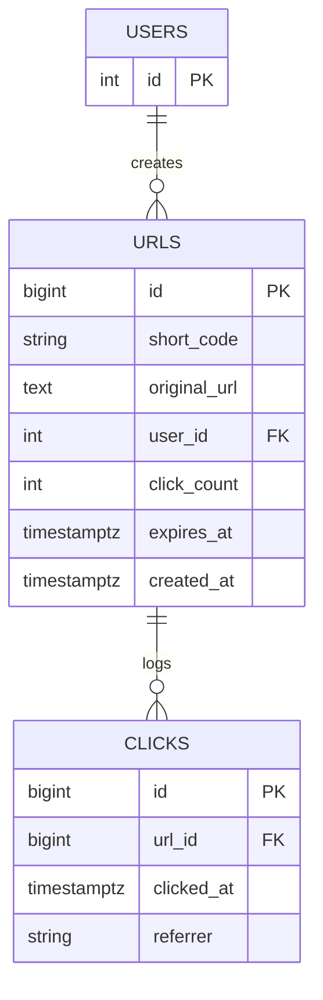
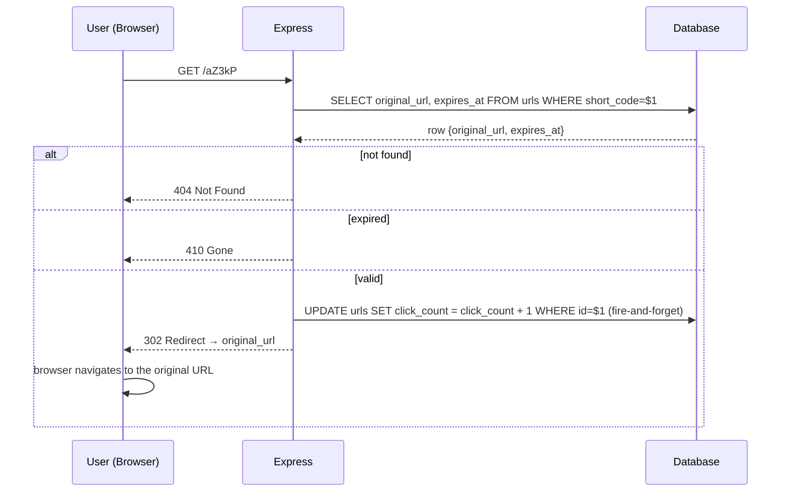

# 05 — URL Shortener

🏢 **Asked at:** Google, Amazon, Postman, Freshworks

> This is the "algorithm meets full stack" question. It looks trivial ("make short links!") but it hides a real algorithm — short-code generation — plus a redirect that must use the *correct* HTTP status, plus analytics. It's a favorite because a sloppy answer and a sharp answer look very different.

---

## 🎬 The Product Story

You paste a monstrous URL into bit.ly or TinyURL and get back something tiny like `short.ly/aZ3kP`. Share that, and when anyone visits it, their browser is bounced to the original long URL. Behind the scenes the service is also counting clicks, so you can later see "this link was opened 1,402 times."

Three real problems live in that flow: **how do you generate a short, unique code?** (an encoding algorithm), **how do you redirect correctly?** (301 vs 302 — they behave very differently), and **how do you count clicks without slowing the redirect?** Get all three right and you've shown range.

---

## 📋 Requirements (clarified)

**Functional:** a logged-in user shortens a long URL and gets a short code; visiting `/{code}` redirects to the original; the user sees a list of their links with click counts; optional expiry.
**Non-functional:** codes are short and collision-free; redirect is fast; click counting doesn't block the redirect; only valid URLs accepted.

**Clarifying questions:** Custom aliases allowed? Should expired links 410 or 404? Do we need per-click analytics (referrer, time) or just a counter? Public shorten or login-only?

---

## 🔑 The Core Algorithm: Base62 Short Codes (from scratch)

We want codes like `aZ3kP` — short, URL-safe, unique. The trick: every row already has a unique integer id. Convert that id into **base62**.

**What is base62?** Normal numbers are base10 (digits `0-9`). Base62 uses 62 symbols: `0-9`, `a-z`, `A-Z`. With 62 symbols, you pack far more values into few characters:
- 6 base62 characters = 62⁶ ≈ **56.8 billion** unique codes.
- The id `125` becomes `"21"` in base62; `1,000,000` becomes `"4c92"`.

```javascript
// File: server/utils/base62.js
const ALPHABET = "0123456789abcdefghijklmnopqrstuvwxyzABCDEFGHIJKLMNOPQRSTUVWXYZ"; // 62 symbols
const BASE = ALPHABET.length;                              // 62

// Encode a positive integer id into a base62 string.
// Repeatedly take the remainder mod 62 to pick a symbol, then divide by 62.
function encode(num) {
  if (num === 0) return ALPHABET[0];
  let str = "";
  while (num > 0) {
    str = ALPHABET[num % BASE] + str;                      // prepend the symbol for this digit
    num = Math.floor(num / BASE);                          // shift right by one base62 digit
  }
  return str;
}

// Decode is the inverse (useful for custom logic/tests).
function decode(str) {
  let num = 0;
  for (const ch of str) num = num * BASE + ALPHABET.indexOf(ch);
  return num;
}

module.exports = { encode, decode };
```

> **Why base62 from the id beats random strings:** an auto-increment id is *already* unique, so encoding it can never collide — no "generate, check the DB, retry on collision" loop. Random codes *can* collide and force retries. We add a fixed offset so early ids aren't 1-character codes.

---

## 🧱 Database Schema



```sql
-- File: database/schema.sql
CREATE TABLE users (
  id SERIAL PRIMARY KEY,
  email VARCHAR(255) NOT NULL,
  password_hash VARCHAR(255) NOT NULL
);
CREATE UNIQUE INDEX idx_users_email ON users(email);

CREATE TABLE urls (
  id           BIGSERIAL PRIMARY KEY,                      -- BIGSERIAL: room for billions of links
  short_code   VARCHAR(12) NOT NULL,                       -- the base62 code
  original_url TEXT NOT NULL,
  user_id      INTEGER REFERENCES users(id) ON DELETE CASCADE,
  click_count  BIGINT NOT NULL DEFAULT 0,                  -- denormalized fast counter
  expires_at   TIMESTAMPTZ,                                -- NULL = never expires
  created_at   TIMESTAMPTZ NOT NULL DEFAULT now()
);
-- The redirect looks up by short_code on EVERY visit → unique index is essential.
CREATE UNIQUE INDEX idx_urls_short_code ON urls(short_code);
CREATE INDEX idx_urls_user ON urls(user_id);

-- Optional detailed analytics (one row per click).
CREATE TABLE clicks (
  id         BIGSERIAL PRIMARY KEY,
  url_id     BIGINT NOT NULL REFERENCES urls(id) ON DELETE CASCADE,
  clicked_at TIMESTAMPTZ NOT NULL DEFAULT now(),
  referrer   TEXT
);
CREATE INDEX idx_clicks_url ON clicks(url_id);
```

> We keep both a denormalized `click_count` (instant to read) *and* a `clicks` table (detailed analytics). The counter is incremented cheaply on redirect; the detailed table is for time-series reporting.

---

## 🔌 API Design

| Method | Path | Auth | Purpose |
|--------|------|------|---------|
| POST | `/api/v1/shorten` | ✅ | Create a short link `{originalUrl, expiresAt?}` → `{shortCode, shortUrl}` |
| GET | `/:code` | – | **Redirect** to the original (this is NOT under /api) |
| GET | `/api/v1/urls` | ✅ | User's links with click counts |
| GET | `/api/v1/urls/:id/analytics` | ✅ | Clicks over time |

---

## 🔁 301 vs 302 — The Redirect Decision (explained)

When you redirect, the status code tells the browser *how permanent* it is:

- **301 Moved Permanently:** "this short code will *always* point here." Browsers and proxies **cache** it aggressively — future visits may skip your server entirely and jump straight to the cached target.
- **302 Found (temporary):** "go here for now, but ask me again next time." The browser does **not** cache the mapping and hits your server on every visit.

> **The trade-off for a URL shortener:** `301` is faster (cached) but **breaks click analytics** — if the browser caches the redirect, your server never sees the repeat visit, so the counter stays frozen. `302` costs a server round-trip each time but lets you **count every click**. Most shorteners that sell analytics use `302`. Say this trade-off out loud; it's the single sharpest point in this problem.

---

## 🔄 Full Stack Flow Diagram (visit a short link)



**Reading this diagram:** A visit looks up the code. If missing, `404`; if past its expiry, `410 Gone`. Otherwise the server increments the click counter (without making the user wait for it) and replies `302` with a `Location` header, and the browser follows it. The `302` (not `301`) is what guarantees the next visit also reaches the server so analytics keep counting.

---

## 💻 Complete Working Code

```javascript
// File: server/models/urlModel.js
const { query } = require("../db");
const { encode } = require("../utils/base62");

const OFFSET = 1000;                                        // so id 1 → code length > 1 char

const UrlModel = {
  // Insert first to get the auto id, then derive the code from (id + offset) and save it.
  async create(userId, originalUrl, expiresAt) {
    const inserted = (await query(
      "INSERT INTO urls (short_code, original_url, user_id, expires_at) VALUES ('', $1, $2, $3) RETURNING id",
      [originalUrl, userId, expiresAt || null]
    )).rows[0];
    const code = encode(inserted.id + OFFSET);              // unique, no collision possible
    await query("UPDATE urls SET short_code = $1 WHERE id = $2", [code, inserted.id]);
    return { id: inserted.id, shortCode: code, originalUrl };
  },

  // Used by the redirect — by code, returning what we need to decide.
  findByCode: (code) =>
    query("SELECT id, original_url, expires_at FROM urls WHERE short_code = $1", [code])
      .then((r) => r.rows[0] || null),

  // Increment the fast counter and log a detailed click row.
  recordClick(urlId, referrer) {
    query("UPDATE urls SET click_count = click_count + 1 WHERE id = $1", [urlId]).catch(() => {});
    query("INSERT INTO clicks (url_id, referrer) VALUES ($1, $2)", [urlId, referrer || null]).catch(() => {});
  },

  listByUser: (userId) =>
    query("SELECT id, short_code, original_url, click_count, expires_at, created_at FROM urls WHERE user_id = $1 ORDER BY created_at DESC",
      [userId]).then((r) => r.rows),
};

module.exports = { UrlModel };
```

```javascript
// File: server/controllers/urlController.js
const { UrlModel } = require("../models/urlModel");

// Validate that a string is an http(s) URL before storing it.
function isValidUrl(value) {
  try {
    const u = new URL(value);
    return u.protocol === "http:" || u.protocol === "https:";
  } catch {
    return false;
  }
}

const UrlController = {
  async shorten(req, res) {
    const { originalUrl, expiresAt } = req.body;
    if (!isValidUrl(originalUrl)) {
      return res.status(400).json({ success: false, error: "A valid http(s) URL is required" });
    }
    const created = await UrlModel.create(req.user.id, originalUrl, expiresAt);
    const shortUrl = `${req.protocol}://${req.get("host")}/${created.shortCode}`;
    res.status(201).json({ success: true, data: { ...created, shortUrl } });
  },

  async list(req, res) {
    const rows = await UrlModel.listByUser(req.user.id);
    res.status(200).json({ success: true, data: rows });
  },

  // The public redirect handler.
  async redirect(req, res) {
    const link = await UrlModel.findByCode(req.params.code);
    if (!link) return res.status(404).send("Not found");
    if (link.expires_at && new Date(link.expires_at) < new Date()) {
      return res.status(410).send("This link has expired");  // 410 Gone (was valid, now isn't)
    }
    UrlModel.recordClick(link.id, req.get("referer"));        // fire-and-forget; don't block the user
    return res.redirect(302, link.original_url);              // 302 so we keep counting future clicks
  },
};

module.exports = { UrlController };
```

```javascript
// File: server/routes/urls.js
const express = require("express");
const router = express.Router();
const { UrlController } = require("../controllers/urlController");
const { requireAuth } = require("../middleware/auth");
const { requireFields } = require("../middleware/validate");
const { asyncHandler } = require("../middleware/asyncHandler");

router.post("/shorten", requireAuth, requireFields(["originalUrl"]), asyncHandler(UrlController.shorten));
router.get("/urls", requireAuth, asyncHandler(UrlController.list));

module.exports = router;
```

```javascript
// File: server/index.js (relevant additions)
require("dotenv").config();
const express = require("express");
const cors = require("cors");
const authRouter = require("./routes/auth");
const urlsRouter = require("./routes/urls");
const { UrlController } = require("./controllers/urlController");
const { asyncHandler } = require("./middleware/asyncHandler");
const { errorHandler } = require("./middleware/errorHandler");

const app = express();
app.use(cors());
app.use(express.json());

app.use("/api/v1/auth", authRouter);
app.use("/api/v1", urlsRouter);                            // /api/v1/shorten, /api/v1/urls

// The bare redirect route lives at the ROOT, not under /api, so links look like host/aZ3kP.
// Declare it LAST so it doesn't swallow /api/* or /health.
app.get("/:code", asyncHandler(UrlController.redirect));

app.use(errorHandler);
app.listen(process.env.PORT || 4000);
```

> ⚠️ The root-level `/:code` route is greedy — it must be registered *after* all `/api/*` routes, or it would intercept them. This ordering subtlety is exactly what interviewers probe.

### Frontend (key pieces)

```jsx
// File: client/src/pages/LinksPage.jsx
import { useEffect, useState } from "react";
import { apiFetch } from "../api/client";

export function LinksPage() {
  const [links, setLinks] = useState([]);
  const [url, setUrl] = useState("");
  const [error, setError] = useState("");
  const [loading, setLoading] = useState(true);

  useEffect(() => {
    apiFetch("/urls").then(setLinks).catch((e) => setError(e.message)).finally(() => setLoading(false));
  }, []);

  async function shorten(e) {
    e.preventDefault();
    setError("");
    try {
      const created = await apiFetch("/shorten", { method: "POST", body: JSON.stringify({ originalUrl: url }) });
      setLinks((prev) => [{ ...created, short_code: created.shortCode, click_count: 0 }, ...prev]);
      setUrl("");
    } catch (err) {
      setError(err.message);                               // e.g. "A valid http(s) URL is required"
    }
  }

  function copy(code) {
    navigator.clipboard.writeText(`${window.location.origin}/${code}`);
  }

  if (loading) return <p>Loading…</p>;

  return (
    <div>
      <h1>My Short Links</h1>
      <form onSubmit={shorten}>
        {error && <p role="alert">{error}</p>}
        <input value={url} onChange={(e) => setUrl(e.target.value)} placeholder="https://example.com/very/long/url" />
        <button>Shorten</button>
      </form>
      {links.length === 0 ? <p>No links yet.</p> : (
        <table>
          <thead><tr><th>Short</th><th>Original</th><th>Clicks</th><th></th></tr></thead>
          <tbody>
            {links.map((l) => (
              <tr key={l.id}>
                <td>/{l.short_code}</td>
                <td title={l.original_url}>{l.original_url.slice(0, 40)}…</td>
                <td>{l.click_count}</td>
                <td><button onClick={() => copy(l.short_code)}>Copy</button></td>
              </tr>
            ))}
          </tbody>
        </table>
      )}
    </div>
  );
}
```

### Running
```bash
psql fullstack_course < database/schema.sql
cd server && npm install && npm run dev      # :4000
cd client && npm install && npm run dev      # :5173
```

### 🖥️ What You Will See
Paste a long URL, click Shorten, and a new row appears with a short code like `/4c95` and 0 clicks. Click Copy, paste the short URL in a new tab — your browser redirects to the original site. Return to the dashboard and refresh; the click count is now 1. Paste an invalid string like "not a url" and you get "A valid http(s) URL is required" before any request. Visit a made-up code like `/zzzzz` and you get a 404 page.

---

## ⚠️ What Makes This Problem Tricky (5 Non-Obvious Traps)

🔴 **Trap 1:** Generating random codes and not handling collisions.
✅ Encode the unique auto-increment id in base62 — collision-free by construction.
💡 Shows you can pick an algorithm that removes a whole failure mode.

🔴 **Trap 2:** Using `301` and wondering why click counts never increase.
✅ Use `302` so the browser re-hits your server each visit.
💡 The 301/302 trade-off is the headline concept of this problem.

🔴 **Trap 3:** Awaiting the click increment before redirecting, adding latency.
✅ Fire-and-forget the counter update; redirect immediately.
💡 The redirect must feel instant; analytics can lag a few ms.

🔴 **Trap 4:** Registering the root `/:code` route before `/api/*`, so it eats API calls.
✅ Declare the greedy route last.
💡 A routing-precedence bug that silently breaks everything.

🔴 **Trap 5:** Not validating the input URL, allowing `javascript:` or garbage.
✅ Parse with `new URL()` and allow only http/https.
💡 Prevents open-redirect abuse and broken links.

---

## 🌀 How the Interviewer Can Twist This Question (6 Extensions)

**Twist 1 (Auth/Security): Prevent open-redirect / block malicious targets**
🗣️ *"Don't let people shorten links to known-bad or internal hosts."*
🛠️ Backend.
💻
```javascript
const BLOCKED = ["localhost", "169.254.169.254"];          // SSRF / internal metadata
if (BLOCKED.includes(new URL(originalUrl).hostname)) return res.status(400).json({ success:false, error:"Blocked host" });
```

**Twist 2 (Real-time): Live click counter**
🗣️ *"Show the click count updating live on my dashboard."*
🛠️ Backend + Frontend.
💻
```javascript
// on recordClick, SSE-push {urlId, clickCount} to the owner; client updates that row's count
```

**Twist 3 (Scale): Cache hot codes in Redis**
🗣️ *"A viral link gets millions of hits; don't hammer Postgres."*
🛠️ Backend.
💻
```javascript
let target = await redis.get(`u:${code}`);                 // cache-aside
if (!target) { const row = await UrlModel.findByCode(code); target = row?.original_url; if (target) redis.setex(`u:${code}`, 3600, target); }
```

**Twist 4 (New feature): Custom aliases**
🗣️ *"Let me choose `short.ly/launch` instead of a random code."*
🛠️ All three.
💻
```javascript
// if alias provided: check uniqueness, else 409; otherwise fall back to base62(id)
if (alias) { const taken = await UrlModel.findByCode(alias); if (taken) return res.status(409).json({success:false,error:"Alias taken"}); }
```

**Twist 5 (Performance): Batch click counts**
🗣️ *"Per-click UPDATEs are write-heavy at scale."*
🛠️ Backend.
💻
```javascript
// increment an in-memory/Redis counter per code; a background job flushes sums to Postgres every N seconds
```

**Twist 6 (Resilience): Expiry + 410 Gone + cleanup job**
🗣️ *"Expired links should clearly say 'gone,' and we should purge them."*
🛠️ All three.
💻
```sql
-- nightly: DELETE FROM urls WHERE expires_at < now() - interval '7 days';
-- redirect already returns 410 when expires_at < now()
```

---

## 🧪 Test Cases (8 Cases)

| # | Action | Input | Expected API Response | Expected UI Behavior |
|---|--------|-------|-----------------------|----------------------|
| 1 | Shorten valid URL | `{originalUrl:"https://x.com"}` | `201 {shortCode, shortUrl}` | Row added, 0 clicks |
| 2 | Shorten invalid | `{originalUrl:"nope"}` | `400` | "valid http(s) URL" error |
| 3 | Visit valid code | `GET /4c95` | `302` → Location | Browser redirects |
| 4 | Visit unknown code | `GET /zzzzz` | `404` | "Not found" |
| 5 | Visit expired code | `GET /old` | `410` | "This link has expired" |
| 6 | Click increments | visit twice | counter +2 | Dashboard shows 2 |
| 7 | List links | `GET /urls` | `200 {data}` | Table renders |
| 8 | Shorten without auth | no token | `401` | Redirect to login |

---

## ⏱️ Time Budget

| Phase | Time | What to do |
|-------|------|-----------|
| Read & clarify | 5 min | custom alias? expiry behavior? analytics depth? |
| Algorithm + schema | 12 min | base62 util, urls + clicks tables, unique code index |
| API design | 5 min | shorten / redirect / list / analytics |
| Backend | 26 min | base62, urlModel (create→encode→update), redirect with 302/410 |
| Frontend | 22 min | LinksPage (shorten form, copy, click counts) |
| Test | 8 min | redirect works, count increments, invalid URL, route order |
| Buffer | 12 min | expiry/410, 404, validation |

---

## 🎤 Famous Interview Questions

**Q1 (Conceptual): How does base62 encoding produce short, unique codes?**
🏢 *Asked at: Google*
✅ Answer: Base62 represents a number using 62 symbols (0-9, a-z, A-Z) instead of 10, so each character carries much more information — six base62 characters cover about 56 billion values. I take each link's unique auto-increment id and convert it to base62 by repeatedly taking the remainder mod 62 to choose a symbol and dividing by 62. Because the id is already unique, the encoded code is guaranteed unique with no collision check, and it's compact.
💡 Bonus insight: Sequential ids make codes guessable/enumerable; if that's a concern you can encode `id XOR a secret` or a scrambled id space so codes don't reveal volume or order while staying collision-free.

**Q2 (Design Decision): Why 302 instead of 301 for the redirect?**
🏢 *Asked at: Amazon*
✅ Answer: A 301 is permanent and gets cached by browsers and proxies, so after the first visit the client may jump straight to the target without ever contacting my server again — which means I can't count subsequent clicks. A 302 is temporary and uncached, so every visit comes back through my server, letting me increment analytics. Since click tracking is a core feature of a shortener, the small per-visit latency of 302 is worth it.
💡 Bonus insight: If analytics didn't matter and raw speed did, 301 plus a CDN would be ideal — so the "right" code genuinely depends on the product requirement, which is the point of the question.

**Q3 (Trade-off): Why keep both a click_count column and a clicks table?**
🏢 *Asked at: Postman*
✅ Answer: The `click_count` column is denormalized for instant reads — the dashboard shows it without aggregating. The `clicks` table stores one row per visit for detailed analytics (over time, by referrer), which a single counter can't provide. It's a deliberate redundancy: a cheap counter for the common read, plus a rich log for reporting. They're kept consistent by updating both on each redirect.
💡 Bonus insight: At high write volume you'd stop doing a synchronous row insert per click and instead buffer clicks (in Redis or a queue) and flush them in batches, trading a little freshness for far fewer writes.

**Q4 (Extension): How would you handle a viral link getting millions of hits?**
🏢 *Asked at: Google*
✅ Answer: Reads dominate, so I'd cache the code→URL mapping in Redis (cache-aside) so the hot path never touches Postgres. For writes, per-click UPDATEs become a bottleneck, so I'd increment counters in Redis and flush aggregated counts to the database periodically. The redirect itself is stateless and trivially horizontally scalable behind a load balancer, and a CDN edge could even serve the redirect for the very hottest links.
💡 Bonus insight: Mappings are immutable once created, which makes them ideal to cache with long TTLs — the only invalidation case is expiry or deletion, both rare.

**Q5 (Security/Edge case): What are the security risks in a URL shortener?**
🏢 *Asked at: Amazon*
✅ Answer: The big ones are open redirects and SSRF — users could shorten links to internal addresses (like cloud metadata endpoints) or to malicious/phishing sites. I validate that the target is a real http/https URL, block internal/loopback hosts, and ideally check against a malware blocklist. I'd also rate-limit shortening to prevent spam, and consider that sequential codes leak how many links exist, which I'd mitigate by obfuscating the id space.
💡 Bonus insight: Because the service redirects users to arbitrary destinations, it can be weaponized to launder a trusted domain in front of a malicious one — which is why reputable shorteners scan targets and honor takedown requests.

---

## 🔗 Navigation
⬅️ Previous: [04 — Expense Tracker](./04-expense-tracker.md)
➡️ Next module: [02 — Product Feature Questions](../02-product-feature-questions/README.md)
🏠 [Module Home](./README.md)
