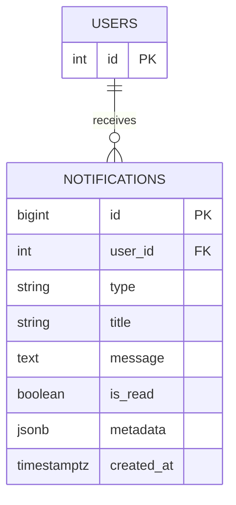

# 01 — Notification System

🏢 **Asked at:** Swiggy, Flipkart, LinkedIn, Amazon, CRED

> Build the exact bell-icon notification system you see in Swiggy or LinkedIn: an unread badge count, a dropdown list, "mark as read," and new notifications arriving without a full page reload. This is the canonical "polling vs real-time" question.

---

## 🎬 The Product Story

Look at the top-right of LinkedIn or Swiggy: a bell icon with a little red number. Something happens — someone likes your post, your order is out for delivery — and that number ticks up *without you refreshing*. Click the bell and a dropdown shows recent notifications; the unread ones are highlighted. Click one (or "mark all read") and the badge clears.

The interesting engineering question hiding here: **how does the number update on its own?** The simple answer is polling (ask the server every 30 seconds). The impressive answer is WebSockets (the server pushes the moment it happens). A strong candidate builds polling first — it's robust and quick — then explains exactly how they'd upgrade to WebSockets.

---

## 📋 Requirements (clarified)

**Functional:** a user sees their notifications (paginated), an unread count badge, can mark one read, can mark all read; new notifications appear automatically.
**Non-functional:** per-user isolation; the unread count query is cheap; auto-refresh shouldn't hammer the server.

**Clarifying questions:** How fresh must "new" be — is a 30s delay OK (polling) or must it be instant (WebSocket)? Do notifications have types/links (so clicking navigates)? Retention — do we keep them forever?

---

## 🧱 Database Schema



```sql
-- File: database/schema.sql
CREATE TABLE notifications (
  id         BIGSERIAL PRIMARY KEY,
  user_id    INTEGER NOT NULL REFERENCES users(id) ON DELETE CASCADE,
  type       VARCHAR(40) NOT NULL,                         -- 'order_update' | 'like' | 'comment' ...
  title      VARCHAR(150) NOT NULL,
  message    TEXT,
  is_read    BOOLEAN NOT NULL DEFAULT false,
  metadata   JSONB,                                        -- flexible payload, e.g. {"orderId": 42}
  created_at TIMESTAMPTZ NOT NULL DEFAULT now()
);
-- The list query is "this user's notifications, newest first" → composite index.
CREATE INDEX idx_notif_user_created ON notifications(user_id, created_at DESC);
-- The badge query is "count this user's unread" → partial index makes it tiny + fast.
CREATE INDEX idx_notif_unread ON notifications(user_id) WHERE is_read = false;
```

> **Why a partial index on `is_read = false`?** The badge counts *only* unread rows. A partial index indexes just those rows, so the count stays fast even when a user has 10,000 old read notifications. A nice detail to call out.

> **Why `JSONB` for metadata?** Different notification types carry different data (an order id, a post id, an actor). Rather than add a column per type, we store a flexible JSON blob — schema stays stable as new types appear.

---

## 🔌 API Design

| Method | Path | Auth | Purpose |
|--------|------|------|---------|
| GET | `/api/v1/notifications?page&limit` | ✅ | Paginated list |
| GET | `/api/v1/notifications/unread-count` | ✅ | `{count}` for the badge (cheap) |
| POST | `/api/v1/notifications/:id/read` | ✅ | Mark one read |
| POST | `/api/v1/notifications/read-all` | ✅ | Mark all read |

---

## 🌳 Component Tree & State

```text
<NotificationBell>                 // badge count; polls unread-count
└── <NotificationDropdown>         // opens on click; fetches the list
    └── <NotificationItem>         // one row; click → mark read + navigate
```
```text
NotificationBell:     unreadCount (polled every 30s), open (dropdown toggle)
NotificationDropdown: items[], loading, page
```

---

## 🔄 Full Stack Flow Diagram (polling)

```mermaid
sequenceDiagram
  participant R as React (Bell)
  participant E as Express
  participant D as Database
  loop every 30 seconds
    R->>E: GET /notifications/unread-count
    E->>D: SELECT count(*) WHERE user_id=$1 AND is_read=false
    D-->>E: count = 3
    E-->>R: {count: 3}
    R->>R: badge shows 3
  end
  Note over R,E: user clicks the bell
  R->>E: GET /notifications?page=1
  E->>D: SELECT ... ORDER BY created_at DESC LIMIT 20
  D-->>E: rows
  E-->>R: {data: notifications}
  R->>R: render dropdown; clicking an item POSTs /:id/read
```

**Reading this diagram:** A lightweight timer polls only the *count* every 30 seconds — a tiny query backed by the partial index — keeping the badge fresh without fetching the full list. The expensive list fetch happens only when the user actually opens the dropdown. Marking an item read flips its flag and decrements the badge.

---

## 💻 Complete Working Code

```javascript
// File: server/models/notificationModel.js
const { query } = require("../db");

const NotificationModel = {
  list: (userId, { page = 1, limit = 20 }) =>
    query(
      `SELECT id, type, title, message, is_read, metadata, created_at
       FROM notifications WHERE user_id = $1
       ORDER BY created_at DESC LIMIT $2 OFFSET $3`,
      [userId, limit, (page - 1) * limit]
    ).then((r) => r.rows),

  unreadCount: (userId) =>
    query("SELECT COUNT(*)::int AS count FROM notifications WHERE user_id = $1 AND is_read = false", [userId])
      .then((r) => r.rows[0].count),

  markRead: (userId, id) =>
    query("UPDATE notifications SET is_read = true WHERE id = $1 AND user_id = $2 RETURNING id", [id, userId])
      .then((r) => r.rows[0] || null),

  markAllRead: (userId) =>
    query("UPDATE notifications SET is_read = true WHERE user_id = $1 AND is_read = false", [userId]),

  // Used by other features to create a notification (e.g. when an order ships).
  create: (userId, { type, title, message, metadata }) =>
    query(
      "INSERT INTO notifications (user_id, type, title, message, metadata) VALUES ($1,$2,$3,$4,$5) RETURNING *",
      [userId, type, title, message || null, metadata || null]
    ).then((r) => r.rows[0]),
};

module.exports = { NotificationModel };
```

```javascript
// File: server/controllers/notificationController.js
const { NotificationModel } = require("../models/notificationModel");

const NotificationController = {
  async list(req, res) {
    const page = Math.max(parseInt(req.query.page) || 1, 1);
    const limit = Math.min(parseInt(req.query.limit) || 20, 50);
    const rows = await NotificationModel.list(req.user.id, { page, limit });
    res.status(200).json({ success: true, data: rows });
  },
  async unreadCount(req, res) {
    const count = await NotificationModel.unreadCount(req.user.id);
    res.status(200).json({ success: true, data: { count } });
  },
  async markRead(req, res) {
    const updated = await NotificationModel.markRead(req.user.id, req.params.id);
    if (!updated) return res.status(404).json({ success: false, error: "Notification not found" });
    res.status(200).json({ success: true, data: updated });
  },
  async markAllRead(req, res) {
    await NotificationModel.markAllRead(req.user.id);
    res.status(200).json({ success: true, message: "All marked read" });
  },
};

module.exports = { NotificationController };
```

```javascript
// File: server/routes/notifications.js
const express = require("express");
const router = express.Router();
const { NotificationController } = require("../controllers/notificationController");
const { requireAuth } = require("../middleware/auth");
const { asyncHandler } = require("../middleware/asyncHandler");

router.use(requireAuth);
router.get("/", asyncHandler(NotificationController.list));
router.get("/unread-count", asyncHandler(NotificationController.unreadCount));   // before /:id-style routes
router.post("/:id/read", asyncHandler(NotificationController.markRead));
router.post("/read-all", asyncHandler(NotificationController.markAllRead));

module.exports = router;
```

### Frontend

```jsx
// File: client/src/hooks/usePolling.js
import { useEffect, useRef } from "react";

// Calls `fn` immediately, then every `intervalMs`. Cleans up on unmount.
export function usePolling(fn, intervalMs) {
  const saved = useRef(fn);
  saved.current = fn;                                       // always call the latest fn
  useEffect(() => {
    saved.current();                                        // run once right away
    const id = setInterval(() => saved.current(), intervalMs);
    return () => clearInterval(id);                         // stop polling on unmount
  }, [intervalMs]);
}
```

```jsx
// File: client/src/components/NotificationBell.jsx
import { useState } from "react";
import { apiFetch } from "../api/client";
import { usePolling } from "../hooks/usePolling";
import { NotificationDropdown } from "./NotificationDropdown";

export function NotificationBell() {
  const [count, setCount] = useState(0);
  const [open, setOpen] = useState(false);

  // Poll only the cheap count every 30s.
  usePolling(async () => {
    try {
      const { count } = await apiFetch("/notifications/unread-count");
      setCount(count);
    } catch { /* ignore transient errors; try again next tick */ }
  }, 30000);

  return (
    <div style={{ position: "relative" }}>
      <button onClick={() => setOpen((o) => !o)} aria-label="Notifications">
        🔔 {count > 0 && <span className="badge">{count > 99 ? "99+" : count}</span>}
      </button>
      {open && (
        <NotificationDropdown
          onCountChange={setCount}                          // dropdown updates badge after marking read
          onClose={() => setOpen(false)}
        />
      )}
    </div>
  );
}
```

```jsx
// File: client/src/components/NotificationDropdown.jsx
import { useEffect, useState } from "react";
import { apiFetch } from "../api/client";

export function NotificationDropdown({ onCountChange }) {
  const [items, setItems] = useState([]);
  const [loading, setLoading] = useState(true);

  useEffect(() => {
    apiFetch("/notifications?page=1&limit=20").then(setItems).finally(() => setLoading(false));
  }, []);

  async function markRead(id) {
    setItems((prev) => prev.map((n) => (n.id === id ? { ...n, is_read: true } : n))); // optimistic
    await apiFetch(`/notifications/${id}/read`, { method: "POST" });
    const { count } = await apiFetch("/notifications/unread-count");
    onCountChange(count);                                   // refresh badge
  }

  async function markAll() {
    setItems((prev) => prev.map((n) => ({ ...n, is_read: true })));
    await apiFetch("/notifications/read-all", { method: "POST" });
    onCountChange(0);
  }

  if (loading) return <div className="dropdown">Loading…</div>;
  return (
    <div className="dropdown">
      <button onClick={markAll}>Mark all read</button>
      {items.length === 0 ? <p>No notifications.</p> : items.map((n) => (
        <div key={n.id} onClick={() => markRead(n.id)}
             style={{ fontWeight: n.is_read ? "normal" : "bold" }}>
          <strong>{n.title}</strong><div>{n.message}</div>
        </div>
      ))}
    </div>
  );
}
```

### Running
```bash
psql fullstack_course < database/schema.sql
cd server && npm install && npm run dev
cd client && npm install && npm run dev
```

### 🖥️ What You Will See
A bell icon shows a red badge with your unread count. Every 30 seconds the badge silently re-checks (you'll see it update if new notifications were inserted). Click the bell — a dropdown lists notifications with unread ones in bold. Click one and it turns normal-weight; the badge drops by one immediately. Click "Mark all read" and the badge clears to nothing.

---

## ⚠️ What Makes This Problem Tricky (5 Non-Obvious Traps)

🔴 **Trap 1:** Polling the entire notification *list* every 30s.
✅ Poll only the cheap `unread-count`; fetch the list on open.
💡 Shows you separate the frequent cheap query from the occasional expensive one.

🔴 **Trap 2:** `COUNT(*)` over all notifications for the badge.
✅ Partial index on `is_read = false` so the count touches only unread rows.
💡 Keeps the badge fast for power users with huge histories.

🔴 **Trap 3:** Not clearing the polling interval on unmount.
✅ `clearInterval` in the effect cleanup.
💡 A classic React memory leak / "setState on unmounted component" bug.

🔴 **Trap 4:** Marking read on the server but not updating the badge.
✅ After marking, re-fetch or locally decrement the count.
💡 UI consistency — the badge must reflect reality instantly.

🔴 **Trap 5:** A column per notification type (order_id, post_id, …).
✅ One `JSONB metadata` column.
💡 Schema stays stable as new notification types are added.

---

## 🌀 How the Interviewer Can Twist This Question (6 Extensions)

**Twist 1 (Auth/Security): Only the recipient can mark read**
🗣️ *"Make sure user A can't mark user B's notification read."*
🛠️ Backend.
💻
```javascript
// already enforced: UPDATE ... WHERE id=$1 AND user_id=$2 → returns null → 404 if not yours
```

**Twist 2 (Real-time): Replace polling with WebSocket push**
🗣️ *"Notifications should appear instantly, not after 30s."*
🛠️ Backend + Frontend.
💻
```javascript
// server: on NotificationModel.create, io.to(`user:${userId}`).emit("notification", n)
// client: socket.on("notification", n => { setCount(c=>c+1); prepend to list })
```

**Twist 3 (Scale): Cap retention / archive old**
🗣️ *"Don't keep notifications forever."*
🛠️ DB.
💻
```sql
-- nightly: DELETE FROM notifications WHERE created_at < now() - interval '90 days' AND is_read = true;
```

**Twist 4 (New feature): Grouping ("Alice and 4 others liked your post")**
🗣️ *"Collapse similar notifications."*
🛠️ Backend.
💻
```sql
SELECT type, metadata->>'postId' AS post, count(*) AS n, max(created_at) AS latest
FROM notifications WHERE user_id=$1 AND is_read=false GROUP BY type, post;
```

**Twist 5 (Performance): Keyset pagination for the list**
🗣️ *"Scrolling deep into history is slow."*
🛠️ Backend + Frontend.
💻
```sql
SELECT * FROM notifications WHERE user_id=$1 AND created_at < $2 ORDER BY created_at DESC LIMIT 20;
```

**Twist 6 (Resilience): Per-channel preferences (email/push/in-app)**
🗣️ *"Let users mute certain notification types."*
🛠️ All three.
💻
```sql
CREATE TABLE notif_prefs (user_id INT, type VARCHAR(40), in_app BOOL DEFAULT true, email BOOL DEFAULT false,
                          PRIMARY KEY (user_id, type));
-- skip creating an in-app notification when in_app=false for that type
```

---

## 🧪 Test Cases (8 Cases)

| # | Action | Input | Expected API Response | Expected UI Behavior |
|---|--------|-------|-----------------------|----------------------|
| 1 | Get unread count | token | `200 {count:3}` | Badge shows 3 |
| 2 | List notifications | `?page=1` | `200 {data:[...]}` | Dropdown renders |
| 3 | Empty list | new user | `200 {data:[]}` | "No notifications" |
| 4 | Mark one read | `/:id/read` | `200` | Item un-bolds, badge -1 |
| 5 | Mark all read | `/read-all` | `200` | All un-bold, badge 0 |
| 6 | Mark others' notif | other id | `404` | Not found |
| 7 | New notif arrives | (insert) | next poll `count+1` | Badge ticks up |
| 8 | No token | – | `401` | – |

---

## ⏱️ Time Budget

| Phase | Time | What to do |
|-------|------|-----------|
| Read & clarify | 5 min | freshness (poll vs WS)? types/links? retention? |
| Schema | 8 min | notifications + composite + partial index, JSONB |
| API design | 5 min | list / unread-count / read / read-all |
| Backend | 22 min | model, controller, routes (route order) |
| Frontend | 25 min | usePolling, Bell (badge), Dropdown (mark read) |
| Test | 8 min | count updates, mark read, ownership |
| Buffer | 12 min | empty/loading states, cleanup interval |

---

## 🎤 Famous Interview Questions

**Q1 (Conceptual): Polling vs WebSockets — when do you use which?**
🏢 *Asked at: LinkedIn*
✅ Answer: Polling has the client ask the server on a fixed interval; it's simple, stateless, and works through any proxy, but it wastes requests when nothing changed and adds up-to-interval latency. WebSockets keep a persistent open connection so the server pushes the instant something happens — great for low latency, but it's stateful, needs connection management, and is harder to scale across servers. For a notification badge where a 30-second delay is acceptable, polling the cheap count is the pragmatic choice; for chat or live trading you want WebSockets.
💡 Bonus insight: Server-Sent Events sit between them — one-way server-to-client push over plain HTTP — often the sweet spot for notifications since you only push downstream.

**Q2 (Design Decision): Why poll the count separately instead of the full list?**
🏢 *Asked at: Swiggy*
✅ Answer: The badge needs to refresh frequently, but the full list is expensive (rows, JSON, pagination) and only matters when the user actually opens the dropdown. So I poll a tiny `COUNT` query — backed by a partial index on unread rows — every 30 seconds, and fetch the list lazily on click. This minimizes bandwidth and database load while keeping the visible badge fresh.
💡 Bonus insight: The partial index is what makes the frequent count cheap regardless of how many thousands of read notifications a heavy user has accumulated.

**Q3 (Trade-off): Why JSONB metadata instead of typed columns per notification type?**
🏢 *Asked at: CRED*
✅ Answer: Notification types proliferate (likes, comments, order updates, mentions) and each carries different data. Adding a column per type bloats the schema and requires a migration for every new type. A single JSONB column stores whatever each type needs (`{orderId}`, `{postId, actorId}`), keeping the table stable and letting new types ship without DDL. The trade-off is weaker typing and that querying inside JSON is a bit more work, but for display payloads that's fine.
💡 Bonus insight: If I needed to filter heavily by a metadata field, Postgres lets me add a GIN index on the JSONB or a generated column — so I'm not giving up indexability entirely.

**Q4 (Extension): How would you push notifications instantly to millions of connected users?**
🏢 *Asked at: Amazon*
✅ Answer: I'd move from polling to a push channel (WebSocket/SSE) fronted by a layer that maps user → connection. Because users connect to different servers, I'd use a pub/sub backbone (like Redis pub/sub or a message broker): when a notification is created, publish to a `user:{id}` channel, and whichever server holds that user's connection delivers it. Persist the notification in the database too, so a user who's offline sees it on next load. Connection servers scale horizontally and are stateless beyond their socket map.
💡 Bonus insight: Fan-out cost matters — for a celebrity-style broadcast you'd queue the writes and push asynchronously rather than synchronously inserting millions of rows in the request path.

**Q5 (Security/Edge case): What edge cases and security issues exist?**
🏢 *Asked at: Flipkart*
✅ Answer: Enforce that mark-read only affects the caller's own rows (the `WHERE user_id` clause returns nothing otherwise, yielding a 404). Handle the empty state cleanly. Clean up the polling interval on unmount to avoid leaks. Cap page size to prevent a client requesting 10,000 at once. And debounce or back off polling when requests fail so a flaky network doesn't create a request storm.
💡 Bonus insight: If you add the WebSocket twist, you must authenticate the socket connection (validate the JWT on connect) — an unauthenticated socket subscribing to another user's channel would be an information leak.

---

## 🔗 Navigation
⬅️ Previous: [Module 02 Home](./README.md)
➡️ Next: [02 — Search Autocomplete](./02-search-autocomplete.md)
🏠 [Module Home](./README.md)
