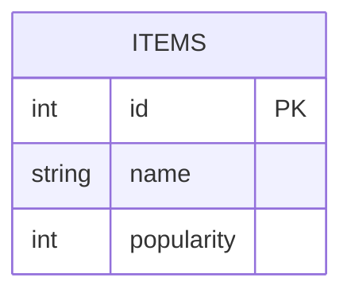
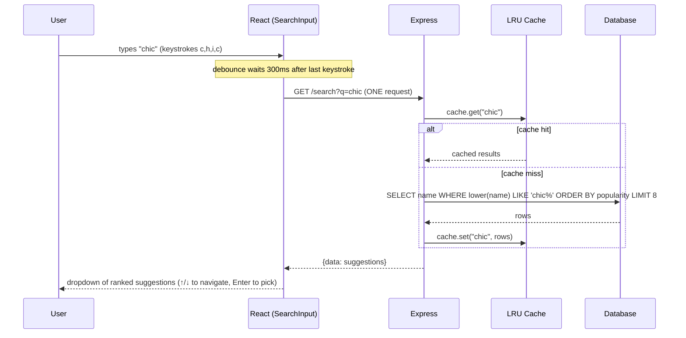

# 02 — Search Autocomplete

🏢 **Asked at:** Swiggy, Zepto, Google, Flipkart, Razorpay

> The search box that drops a list of suggestions as you type. It looks like a frontend task but hides three real skills: **debouncing** (don't fire on every keystroke), **server-side partial matching with ranking**, and **caching** to avoid re-querying the database for repeated terms. Plus keyboard navigation, which separates polished from sloppy.

---

## 🎬 The Product Story

Start typing "chic" in Swiggy's search and instantly a list appears — "Chicken Biryani," "Chinese," "Chai" — ranked by relevance. You press the down arrow to move through them and Enter to pick one. It feels instant because the app isn't hitting the database on every single keystroke; it waits for a tiny pause, and it remembers results for terms you've already typed.

Interviewers love this because the naive version (a fetch in `onChange`) fires six requests for "chicken" and melts the server, while the good version fires one, caches it, and supports the keyboard. The gap between those two is exactly what's being measured.

---

## 📋 Requirements (clarified)

**Functional:** as the user types, show ranked suggestions; support arrow-key navigation and Enter to select; minimum 2 characters before searching.
**Non-functional:** debounce input; cache repeated queries; partial/prefix matching; cap result count.

**Clarifying questions:** Prefix match ("chic" → "chicken") or substring? How many suggestions? Should we store per-user search history? Case-insensitive (almost always yes)?

---

## 🧱 Database Schema



```sql
-- File: database/schema.sql
CREATE TABLE items (
  id         SERIAL PRIMARY KEY,
  name       VARCHAR(150) NOT NULL,
  popularity INTEGER NOT NULL DEFAULT 0                    -- used to rank suggestions
);
-- For case-insensitive prefix search, index lower(name) with text_pattern_ops
-- so "name ILIKE 'chic%'" can use the index (a trailing wildcard is index-friendly).
CREATE INDEX idx_items_name_lower ON items (lower(name) text_pattern_ops);
CREATE INDEX idx_items_popularity ON items (popularity DESC);
```

> **Why `text_pattern_ops`?** A prefix match `name ILIKE 'chic%'` (wildcard only at the end) *can* use a btree index if it's built for pattern matching on `lower(name)`. A leading-wildcard substring search (`'%chic%'`) cannot use a normal index — a key trade-off to mention.

---

## 🔌 API Design

| Method | Path | Auth | Purpose |
|--------|------|------|---------|
| GET | `/api/v1/search?q=chic&limit=8` | optional | Ranked suggestions for the prefix |

Response:
```json
{ "success": true, "data": [ { "id": 12, "name": "Chicken Biryani" }, { "id": 8, "name": "Chinese" } ] }
```

---

## 🧮 Two Algorithms From Scratch: Debounce + LRU Cache

### Debounce (frontend, no lodash)
**Problem:** typing "chicken" fires 7 requests. **Fix:** wait until the user pauses (e.g. 300ms) before searching; each new keystroke resets the timer.

```jsx
// File: client/src/hooks/useDebounce.js
import { useEffect, useState } from "react";
export function useDebounce(value, delay = 300) {
  const [debounced, setDebounced] = useState(value);
  useEffect(() => {
    const timer = setTimeout(() => setDebounced(value), delay); // schedule update
    return () => clearTimeout(timer);                           // cancel if value changes first
  }, [value, delay]);
  return debounced;
}
```

### LRU Cache (backend, no library)
**Problem:** popular prefixes like "ch" are searched constantly; hitting the DB each time is wasteful. **Fix:** cache results in memory, evicting the **Least Recently Used** entry when full. A `Map` in JS preserves insertion order, which makes LRU easy.

```javascript
// File: server/utils/lruCache.js
// Least-Recently-Used cache. On get/set we delete+reinsert so the newest is last;
// when over capacity we evict the first (oldest) key.
class LRUCache {
  constructor(capacity = 500) {
    this.capacity = capacity;
    this.map = new Map();                                  // Map keeps insertion order
  }
  get(key) {
    if (!this.map.has(key)) return undefined;
    const value = this.map.get(key);
    this.map.delete(key);                                  // remove…
    this.map.set(key, value);                              // …re-insert as most-recent
    return value;
  }
  set(key, value) {
    if (this.map.has(key)) this.map.delete(key);
    this.map.set(key, value);
    if (this.map.size > this.capacity) {
      const oldest = this.map.keys().next().value;         // first key = least recently used
      this.map.delete(oldest);                             // evict it
    }
  }
}
module.exports = { LRUCache };
```

---

## 🔄 Full Stack Flow Diagram



**Reading this diagram:** Four keystrokes produce *one* request because debounce collapses them. On the server, the LRU cache short-circuits repeated prefixes so the database is only touched on a miss; results are ranked by popularity and capped. The user navigates the dropdown with the keyboard.

---

## 💻 Complete Working Code

```javascript
// File: server/controllers/searchController.js
const { query } = require("../db");
const { LRUCache } = require("../utils/lruCache");

const cache = new LRUCache(500);                           // module-level: shared across requests

const SearchController = {
  async suggest(req, res) {
    const q = (req.query.q || "").trim().toLowerCase();
    const limit = Math.min(parseInt(req.query.limit) || 8, 20);

    if (q.length < 2) {
      return res.status(200).json({ success: true, data: [] }); // too short to search
    }

    const cacheKey = `${q}:${limit}`;
    const cached = cache.get(cacheKey);
    if (cached) {
      res.set("X-Cache", "HIT");                            // handy for the interviewer to see
      return res.status(200).json({ success: true, data: cached });
    }

    // Prefix match (index-friendly), ranked by popularity. Parameterized → no injection.
    const { rows } = await query(
      `SELECT id, name FROM items
       WHERE lower(name) LIKE $1
       ORDER BY popularity DESC, name ASC
       LIMIT $2`,
      [`${q}%`, limit]
    );

    cache.set(cacheKey, rows);
    res.set("X-Cache", "MISS");
    res.status(200).json({ success: true, data: rows });
  },
};

module.exports = { SearchController };
```

```javascript
// File: server/routes/search.js
const express = require("express");
const router = express.Router();
const { SearchController } = require("../controllers/searchController");
const { asyncHandler } = require("../middleware/asyncHandler");

router.get("/", asyncHandler(SearchController.suggest));   // mounted at /api/v1/search
module.exports = router;
```

### Frontend — the full autocomplete with keyboard nav

```jsx
// File: client/src/components/SearchInput.jsx
import { useEffect, useState, useRef } from "react";
import { useDebounce } from "../hooks/useDebounce";
import { apiFetch } from "../api/client";

export function SearchInput({ onSelect }) {
  const [query, setQuery] = useState("");
  const [results, setResults] = useState([]);
  const [open, setOpen] = useState(false);
  const [highlight, setHighlight] = useState(-1);          // which suggestion is keyboard-focused
  const [loading, setLoading] = useState(false);
  const debounced = useDebounce(query, 300);
  const boxRef = useRef(null);

  // Fetch suggestions only when the debounced query changes.
  useEffect(() => {
    if (debounced.trim().length < 2) {
      setResults([]); setOpen(false); return;
    }
    let cancelled = false;
    setLoading(true);
    apiFetch(`/search?q=${encodeURIComponent(debounced)}&limit=8`)
      .then((data) => { if (!cancelled) { setResults(data); setOpen(true); setHighlight(-1); } })
      .catch(() => { if (!cancelled) setResults([]); })
      .finally(() => { if (!cancelled) setLoading(false); });
    return () => { cancelled = true; };                    // ignore stale responses (race safety)
  }, [debounced]);

  function handleKeyDown(e) {
    if (!open) return;
    if (e.key === "ArrowDown") { e.preventDefault(); setHighlight((h) => Math.min(h + 1, results.length - 1)); }
    else if (e.key === "ArrowUp") { e.preventDefault(); setHighlight((h) => Math.max(h - 1, 0)); }
    else if (e.key === "Enter" && highlight >= 0) { e.preventDefault(); choose(results[highlight]); }
    else if (e.key === "Escape") { setOpen(false); }
  }

  function choose(item) {
    setQuery(item.name);
    setOpen(false);
    onSelect?.(item);
  }

  return (
    <div ref={boxRef} style={{ position: "relative" }}>
      <input
        value={query}
        onChange={(e) => setQuery(e.target.value)}
        onKeyDown={handleKeyDown}
        placeholder="Search…"
        role="combobox"
        aria-expanded={open}
        aria-autocomplete="list"
      />
      {loading && <span className="spinner" aria-label="loading" />}
      {open && (
        <ul role="listbox">
          {results.length === 0 ? (
            <li>No matches</li>                              // empty state
          ) : results.map((item, i) => (
            <li
              key={item.id}
              role="option"
              aria-selected={i === highlight}
              onMouseEnter={() => setHighlight(i)}
              onMouseDown={() => choose(item)}               // mousedown fires before blur closes the list
              style={{ background: i === highlight ? "#eef" : "transparent" }}
            >
              {item.name}
            </li>
          ))}
        </ul>
      )}
    </div>
  );
}
```

### Running
```bash
psql fullstack_course < database/schema.sql
# seed some items, e.g.:
psql fullstack_course -c "INSERT INTO items (name, popularity) VALUES ('Chicken Biryani',100),('Chinese',80),('Chai',60),('Cheese Pizza',90);"
cd server && npm install && npm run dev
cd client && npm install && npm run dev
```

### 🖥️ What You Will See
Type "ch" and after a brief pause a ranked dropdown appears: "Chicken Biryani," "Cheese Pizza," "Chinese," "Chai." Watch the network tab — typing "chai" fires one request, not four. Type "ch" again and the response header shows `X-Cache: HIT` (served from the LRU cache, no DB query). Use ↓/↑ to move the highlight and Enter to select; Escape closes the list. Type one character and nothing fires (below the 2-char minimum).

---

## ⚠️ What Makes This Problem Tricky (5 Non-Obvious Traps)

🔴 **Trap 1:** Fetching in `onChange` — one request per keystroke.
✅ Debounce to one request per pause.
💡 The single most important point; the naive version is a server-killer.

🔴 **Trap 2:** Out-of-order responses (slow "ch" arrives after fast "chic").
✅ A `cancelled` flag in the effect cleanup ignores stale responses.
💡 Race conditions make the dropdown flicker to wrong results.

🔴 **Trap 3:** Substring search `'%term%'` that can't use an index.
✅ Prefix `'term%'` with a pattern-ops index (or full-text/trigram for substring).
💡 Demonstrates you understand why leading wildcards kill index usage.

🔴 **Trap 4:** No keyboard navigation.
✅ Arrow keys move a highlight; Enter selects; Escape closes.
💡 Accessibility + polish; explicitly scored at Google/CRED.

🔴 **Trap 5:** `onClick` on a suggestion (blur fires first and closes the list).
✅ Use `onMouseDown` so selection happens before the input blurs.
💡 A subtle DOM-event-ordering bug that breaks click selection.

---

## 🌀 How the Interviewer Can Twist This Question (6 Extensions)

**Twist 1 (Auth/Security): Per-user search history**
🗣️ *"Store and show what each user searched."*
🛠️ All three.
💻
```sql
CREATE TABLE search_history (id BIGSERIAL PRIMARY KEY, user_id INT, term VARCHAR(150), searched_at TIMESTAMPTZ DEFAULT now());
-- on select, POST the term; show recent terms when the box is empty/focused
```

**Twist 2 (Real-time): Trending searches**
🗣️ *"Show what's trending right now."*
🛠️ Backend.
💻
```javascript
// increment a Redis sorted set per term with a time decay; read top N for "trending"
```

**Twist 3 (Scale): Move ranking to a search engine**
🗣️ *"Millions of items, fuzzy + typo tolerance."*
🛠️ Backend.
💻
```text
// index items in Elasticsearch / OpenSearch; query with match + fuzziness; DB stays source of truth
```

**Twist 4 (New feature): Typo tolerance with trigrams**
🗣️ *"'chiken' should still find 'chicken'."*
🛠️ DB.
💻
```sql
CREATE EXTENSION pg_trgm;
CREATE INDEX idx_items_trgm ON items USING GIN (name gin_trgm_ops);
-- WHERE name % $1 ORDER BY similarity(name,$1) DESC
```

**Twist 5 (Performance): Cache invalidation on item changes**
🗣️ *"New items aren't showing — the cache is stale."*
🛠️ Backend.
💻
```javascript
// give cache entries a short TTL, or clear the LRU when items are inserted/updated
```

**Twist 6 (Resilience): Rate-limit the search endpoint**
🗣️ *"A scraper is hammering search."*
🛠️ Backend.
💻
```javascript
// token-bucket middleware per IP (see Rate Limiter problem) returning 429 when exceeded
```

---

## 🧪 Test Cases (8 Cases)

| # | Action | Input | Expected API Response | Expected UI Behavior |
|---|--------|-------|-----------------------|----------------------|
| 1 | Type prefix | `?q=chic` | `200 {data:[ranked]}` | Dropdown of matches |
| 2 | One char | `?q=c` | `200 {data:[]}` | No request fired (min 2) |
| 3 | Repeated query | `?q=chic` again | `200` + `X-Cache: HIT` | Same results, no DB hit |
| 4 | No matches | `?q=zzz` | `200 {data:[]}` | "No matches" |
| 5 | Rapid typing | "chicken" | ONE request | Debounced |
| 6 | Arrow + Enter | ↓ ↓ Enter | – | Selects 2nd item |
| 7 | Escape | Esc | – | Dropdown closes |
| 8 | Ranking | popular item | first in list | Highest popularity on top |

---

## ⏱️ Time Budget

| Phase | Time | What to do |
|-------|------|-----------|
| Read & clarify | 4 min | prefix vs substring? count? history? |
| Schema | 6 min | items + pattern-ops index + popularity index |
| API design | 3 min | GET /search?q&limit |
| Backend | 22 min | LRU cache util, suggest controller (min-len, cache, rank) |
| Frontend | 28 min | useDebounce, SearchInput (fetch, race guard, keyboard) |
| Test | 8 min | one request, cache hit, keyboard, empty |
| Buffer | 9 min | min-length, escape/blur handling |

---

## 🎤 Famous Interview Questions

**Q1 (Conceptual): Explain debouncing and how you implement it from scratch.**
🏢 *Asked at: Swiggy*
✅ Answer: Debouncing delays acting on a rapidly-changing value until it stops changing for a set period. In React I keep a `debounced` state and, in an effect keyed on the raw value, start a `setTimeout` to copy the value over after, say, 300ms; the effect's cleanup clears that timer. So every keystroke cancels the previous pending update and schedules a new one — only after the user pauses does the timer survive and fire, producing one search instead of one per character.
💡 Bonus insight: Debounce (wait for a pause) differs from throttle (allow at most one call per interval); search wants debounce, but a "scroll position" handler usually wants throttle.

**Q2 (Design Decision): Why an LRU cache, and why did a Map make it easy?**
🏢 *Asked at: Google*
✅ Answer: Search traffic is heavily skewed — short popular prefixes are queried far more than the long tail — so caching results lets most requests skip the database entirely. LRU evicts the least-recently-used entry when full, which matches access patterns well because recently-used terms are likely to be used again. A JavaScript `Map` preserves insertion order, so I implement "recently used" by deleting and re-inserting a key on access (moving it to the end) and evicting the first key when over capacity — O(1) operations.
💡 Bonus insight: For multi-server deployments an in-process Map won't share hits, so you'd move to Redis; the LRU logic is the same, just externalized.

**Q3 (Trade-off): Prefix matching vs substring matching — what's the cost?**
🏢 *Asked at: Flipkart*
✅ Answer: Prefix matching (`'term%'`) can use a btree index built with pattern ops, so it's fast even on large tables. Substring matching (`'%term%'`) is more flexible — it finds the term anywhere in the name — but the leading wildcard makes a normal index unusable, forcing a full scan. So I default to prefix matching for speed, and if substring or fuzzy matching is required I switch to a trigram (`pg_trgm`) GIN index or a full-text/search-engine approach.
💡 Bonus insight: Many real autocompletes deliberately stick to prefix matching because it both performs better and matches user intent — people type the start of what they want.

**Q4 (Extension): How do you scale autocomplete to millions of items with typo tolerance?**
🏢 *Asked at: Google*
✅ Answer: At that scale I'd offload search to a dedicated engine like Elasticsearch/OpenSearch, which provides inverted indexes, relevance scoring, and fuzzy matching for typos out of the box, keeping the database as the source of truth and syncing changes to the index. I'd cache hot prefixes in Redis, cap suggestion counts, and possibly precompute top suggestions per prefix. For autocomplete specifically, a prefix-optimized structure like a trie or an FST (used internally by search engines) gives very fast prefix lookups.
💡 Bonus insight: Edge-caching the most common prefixes at a CDN can serve a huge share of autocomplete traffic without ever reaching application servers.

**Q5 (Security/Edge case): What edge cases and security concerns matter here?**
🏢 *Asked at: Razorpay*
✅ Answer: Parameterize the query so the search term can't inject SQL; enforce a minimum length so a single character doesn't return half the table; cap the result `limit`; and handle out-of-order responses with a cancellation guard so the dropdown doesn't flicker to stale results. On the server I'd rate-limit the endpoint to stop scrapers, and trim/normalize the input. Empty and no-match states should render cleanly rather than breaking.
💡 Bonus insight: The race condition is the subtle one — without ignoring stale responses, a slower request for "ch" can land after the faster "chic" and overwrite the correct suggestions, which users perceive as a flickering, "wrong" dropdown.

---

## 🔗 Navigation
⬅️ Previous: [01 — Notification System](./01-notification-system.md)
➡️ Next: [03 — Rate Limiter](./03-rate-limiter.md)
🏠 [Module Home](./README.md)
