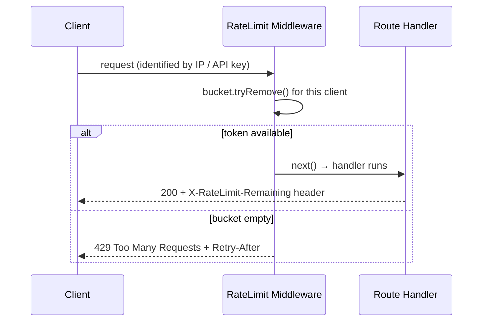

# 03 — Rate Limiter

🏢 **Asked at:** Razorpay, Stripe, Postman, Google, Amazon

> Build a real rate limiter as Express middleware — the thing that returns `429 Too Many Requests` when a client calls your API too fast. This is *the* payment-company question because at Razorpay or Stripe, an unthrottled endpoint is a fraud and abuse vector, not just a performance concern.

---

## 🎬 The Product Story

Imagine the OTP-send button on a payment app. Without protection, an attacker scripts it to fire 10,000 times a second — burning your SMS budget, spamming a victim, and probing for weaknesses. The rate limiter is the bouncer at the door: "You've made enough requests this minute; come back later." It returns `429`, often with a `Retry-After` header telling the client exactly when to try again.

Why is this asked so heavily at fintech? Because **money endpoints attract abuse**. Rate limiting is the first line of defense against brute force, credential stuffing, scraping, and accidental retry storms. Showing you can build one — and explain the algorithms — signals you think about abuse, not just happy paths.

---

## 📋 Requirements (clarified)

**Functional:** limit each client to N requests per time window; over the limit returns `429`; tell the client when they can retry.
**Non-functional:** O(1) per request; works as reusable Express middleware; identify clients by IP (or API key / user id).

**Clarifying questions:** Limit per IP, per user, or per API key? Fixed quota per window or smooth rate? Global or per-endpoint limits? In-memory (single server) or shared (Redis, multi-server)?

---

## 🧮 Algorithm 1: Token Bucket (the main one)

> **Analogy:** Imagine a bucket that fills with tokens at a steady rate — say 10 tokens per minute, up to a max of 10. Each API call removes one token. If the bucket has a token, the call proceeds; if it's empty, you get a `429`. Because tokens refill steadily, a client who's been quiet builds up a small reserve and can "burst" a few quick calls, then is throttled to the refill rate.

Two parameters define it: **capacity** (max tokens = max burst) and **refill rate** (tokens added per second = sustained rate).

```javascript
// File: server/rateLimit/tokenBucket.js
// One bucket per client. Tokens refill continuously based on elapsed time.
class TokenBucket {
  constructor(capacity, refillPerSec) {
    this.capacity = capacity;            // max tokens (burst size)
    this.refillPerSec = refillPerSec;    // tokens added per second (sustained rate)
    this.tokens = capacity;              // start full
    this.lastRefill = Date.now();
  }

  // Lazily add tokens for the time elapsed since the last check (no background timer needed).
  _refill() {
    const now = Date.now();
    const elapsedSec = (now - this.lastRefill) / 1000;
    this.tokens = Math.min(this.capacity, this.tokens + elapsedSec * this.refillPerSec);
    this.lastRefill = now;
  }

  // Try to spend one token. Returns true if allowed.
  tryRemove() {
    this._refill();
    if (this.tokens >= 1) {
      this.tokens -= 1;
      return true;
    }
    return false;
  }

  // Seconds until at least one token is available (for Retry-After).
  retryAfterSec() {
    this._refill();
    if (this.tokens >= 1) return 0;
    return Math.ceil((1 - this.tokens) / this.refillPerSec);
  }
}
module.exports = { TokenBucket };
```

---

## 🧮 Algorithm 2: Sliding Window (the comparison)

The **fixed window** counter (e.g. "100 requests per minute, reset at the top of each minute") is simple but has a boundary flaw: a client can send 100 at 00:59 and 100 at 01:00 — 200 requests in two seconds — because the counter reset.

The **sliding window** fixes this by counting requests in the *last 60 seconds from now*, not within a calendar minute. A precise version keeps timestamps and drops ones older than the window:

```javascript
// File: server/rateLimit/slidingWindow.js
// Track request timestamps per client; allow if count within the trailing window < limit.
class SlidingWindow {
  constructor(limit, windowMs) {
    this.limit = limit;
    this.windowMs = windowMs;
    this.hits = new Map();               // clientId -> number[] (timestamps)
  }
  allow(clientId) {
    const now = Date.now();
    const cutoff = now - this.windowMs;
    const arr = (this.hits.get(clientId) || []).filter((t) => t > cutoff); // drop old hits
    if (arr.length >= this.limit) {
      this.hits.set(clientId, arr);
      return false;
    }
    arr.push(now);
    this.hits.set(clientId, arr);
    return true;
  }
}
module.exports = { SlidingWindow };
```

| | Token Bucket | Fixed Window | Sliding Window |
|---|---|---|---|
| Allows bursts | Yes (up to capacity) | Yes (at boundary — flaw) | No |
| Memory | O(1) per client | O(1) per client | O(requests) per client |
| Smoothness | Smooth sustained rate | Spiky at boundaries | Very smooth |
| Best for | APIs needing burst + sustained | Simple quotas | Strict fairness |

> Token bucket is the most common production choice (it allows reasonable bursts while capping the sustained rate), so lead with it and mention sliding window as the stricter alternative.

---

## 🔌 Where It Fits (middleware)



**Reading this diagram:** Every request first passes the limiter, which looks up (or creates) that client's bucket and tries to spend a token. With a token, the request flows to the real handler and the response advertises remaining quota. Without one, the limiter short-circuits with `429` and a `Retry-After` so well-behaved clients back off.

---

## 💻 Complete Working Code

```javascript
// File: server/rateLimit/middleware.js
const { TokenBucket } = require("./tokenBucket");

// Factory: build a middleware with a given policy.
// keyFn decides how to identify a client (IP by default; could be API key or user id).
function rateLimit({ capacity = 10, refillPerSec = 1, keyFn = (req) => req.ip } = {}) {
  const buckets = new Map();                               // clientKey -> TokenBucket

  // Periodically drop idle buckets so memory doesn't grow forever.
  setInterval(() => {
    const now = Date.now();
    for (const [key, b] of buckets) {
      if (now - b.lastRefill > 10 * 60 * 1000) buckets.delete(key); // idle 10 min → evict
    }
  }, 60 * 1000).unref();                                   // unref so it doesn't keep the process alive

  return (req, res, next) => {
    const key = keyFn(req);
    let bucket = buckets.get(key);
    if (!bucket) {
      bucket = new TokenBucket(capacity, refillPerSec);
      buckets.set(key, bucket);
    }

    if (bucket.tryRemove()) {
      res.set("X-RateLimit-Limit", String(capacity));
      res.set("X-RateLimit-Remaining", String(Math.floor(bucket.tokens)));
      return next();                                        // allowed
    }

    const retry = bucket.retryAfterSec();
    res.set("Retry-After", String(retry));                 // tell the client when to retry
    return res.status(429).json({
      success: false,
      error: "Too many requests",
      details: `Retry after ${retry}s`,
    });
  };
}

module.exports = { rateLimit };
```

```javascript
// File: server/index.js (applying the limiter)
const { rateLimit } = require("./rateLimit/middleware");

// Global gentle limit on the whole API:
app.use("/api/v1", rateLimit({ capacity: 60, refillPerSec: 1 }));   // ~60 burst, 60/min sustained

// Strict limit on a sensitive endpoint, keyed by IP + the target email:
app.post(
  "/api/v1/auth/login",
  rateLimit({ capacity: 5, refillPerSec: 5 / 60, keyFn: (req) => `${req.ip}:${req.body.email}` }),
  /* loginHandler */
);
```

### Frontend — UI for a rate-limited action

```jsx
// File: client/src/components/RateLimitedButton.jsx
import { useState, useEffect } from "react";

// A button that respects 429 + Retry-After: disables itself and counts down.
export function RateLimitedButton({ onClick, children }) {
  const [cooldown, setCooldown] = useState(0);             // seconds remaining
  const [error, setError] = useState("");

  // Tick the countdown down to zero.
  useEffect(() => {
    if (cooldown <= 0) return;
    const id = setTimeout(() => setCooldown((c) => c - 1), 1000);
    return () => clearTimeout(id);
  }, [cooldown]);

  async function handleClick() {
    setError("");
    try {
      const res = await onClick();                         // onClick returns the raw fetch Response
      if (res.status === 429) {
        const retry = parseInt(res.headers.get("Retry-After") || "30", 10);
        setCooldown(retry);                                 // start the countdown
        setError(`Slow down — try again in ${retry}s`);
      }
    } catch {
      setError("Something went wrong");
    }
  }

  return (
    <div>
      <button onClick={handleClick} disabled={cooldown > 0}>
        {cooldown > 0 ? `Wait ${cooldown}s` : children}
      </button>
      {error && <p role="alert">{error}</p>}
    </div>
  );
}
```

### Running
```bash
cd server && npm install && npm run dev
# Hammer an endpoint to see 429:
for i in $(seq 1 70); do curl -s -o /dev/null -w "%{http_code} " localhost:4000/api/v1/health; done
# → prints 200s until the bucket empties, then 429s
```

### 🖥️ What You Will See
Calling the API normally returns `200` with `X-RateLimit-Remaining` ticking down. Fire a burst loop and after the bucket empties you start getting `429 Too Many Requests` with a `Retry-After` header. In the UI, clicking the rate-limited button after a 429 disables it and shows "Wait 12s," counting down to zero, then re-enabling. Wait a moment without calling and tokens refill, so the next call succeeds again.

---

## ⚠️ What Makes This Problem Tricky (5 Non-Obvious Traps)

🔴 **Trap 1:** A background timer per bucket to refill tokens.
✅ Lazy refill — compute tokens from elapsed time on each request.
💡 Thousands of timers is wasteful; lazy refill is O(1) and timer-free.

🔴 **Trap 2:** Fixed-window counter allowing 2× the limit at the boundary.
✅ Token bucket or sliding window.
💡 Shows you understand the classic fixed-window flaw.

🔴 **Trap 3:** Buckets `Map` growing forever (one entry per IP ever seen).
✅ Periodically evict idle buckets.
💡 An unbounded map is a slow memory leak / DoS vector.

🔴 **Trap 4:** In-memory limiter behind multiple servers (each has its own count).
✅ For multi-server, store counters in Redis (atomic ops).
💡 The single most important scaling caveat to state aloud.

🔴 **Trap 5:** No `Retry-After`, so clients hammer blindly.
✅ Return `Retry-After`; the UI counts down.
💡 Good limiters cooperate with well-behaved clients.

---

## 🌀 How the Interviewer Can Twist This Question (6 Extensions)

**Twist 1 (Auth/Security): Per-API-key tiers**
🗣️ *"Free keys get 60/min, paid keys 6000/min."*
🛠️ Backend.
💻
```javascript
const policyFor = (key) => key.tier === "paid" ? { capacity: 6000, refillPerSec: 100 } : { capacity: 60, refillPerSec: 1 };
// keyFn = req => req.apiKey.id; pick policy per key
```

**Twist 2 (Real-time): Live quota meter via headers**
🗣️ *"Show users their remaining quota live."*
🛠️ Frontend.
💻
```javascript
// read X-RateLimit-Remaining from each response; render a meter in the UI
```

**Twist 3 (Scale): Redis-backed distributed limiter**
🗣️ *"We run 8 API servers; the limit must be global."*
🛠️ Backend.
💻
```javascript
// atomic Lua script in Redis: INCR key, set EXPIRE on first hit, allow while count <= limit
// or a token-bucket Lua script storing {tokens, ts} per key
```

**Twist 4 (New feature): Different limits per route**
🗣️ *"Search can be 100/min but payment-create only 5/min."*
🛠️ Backend.
💻
```javascript
app.use("/api/v1/search", rateLimit({ capacity: 100, refillPerSec: 100/60 }));
app.use("/api/v1/payments", rateLimit({ capacity: 5, refillPerSec: 5/60 }));
```

**Twist 5 (Performance): Sliding-window-log → sliding-window-counter**
🗣️ *"The timestamp array uses too much memory."*
🛠️ Backend.
💻
```text
// approximate with two fixed-window counters (current + previous) weighted by overlap → O(1) memory
```

**Twist 6 (Resilience): Fail-open vs fail-closed**
🗣️ *"What if Redis is down?"*
🛠️ Backend.
💻
```javascript
// decide policy: fail-open (allow requests, prioritize availability) or fail-closed (block, prioritize protection)
// payments often fail-closed for sensitive ops, fail-open for read traffic
```

---

## 🧪 Test Cases (8 Cases)

| # | Action | Input | Expected API Response | Expected UI Behavior |
|---|--------|-------|-----------------------|----------------------|
| 1 | Within limit | few requests | `200` + remaining header | Works normally |
| 2 | Exceed limit | burst > capacity | `429` + Retry-After | Button disabled, countdown |
| 3 | After refill | wait then retry | `200` | Re-enabled |
| 4 | Two clients | different IPs | independent limits | Each tracked separately |
| 5 | Retry-After value | at limit | header = seconds to a token | Countdown matches |
| 6 | Remaining header | each call | decrements | Meter updates |
| 7 | Idle eviction | quiet 10 min | bucket removed | Fresh quota |
| 8 | Strict login limit | 6th login try | `429` | "Slow down" |

---

## ⏱️ Time Budget

| Phase | Time | What to do |
|-------|------|-----------|
| Read & clarify | 5 min | per IP/user/key? burst allowed? multi-server? |
| Algorithm | 10 min | token bucket (lazy refill), mention sliding window |
| Middleware | 18 min | factory, keyFn, headers, 429, eviction |
| Apply + Frontend | 18 min | global + strict limits; countdown button |
| Test | 10 min | burst → 429, refill, two clients |
| Buffer | 9 min | Retry-After, idle eviction |

---

## 🎤 Famous Interview Questions

**Q1 (Conceptual): Explain the token bucket algorithm.**
🏢 *Asked at: Razorpay*
✅ Answer: A bucket holds up to a fixed number of tokens and refills at a steady rate. Each request must take one token; if the bucket has one, the request proceeds, otherwise it's rejected with 429. The capacity sets the maximum burst a client can make after being idle, and the refill rate sets the sustained throughput. I implement refill lazily — on each request I add tokens proportional to the time elapsed since the last check — so there's no background timer and it's O(1) per request.
💡 Bonus insight: Token bucket's appeal is that it permits short bursts (good UX for legitimate spikes) while still capping the long-run rate, unlike a strict per-request spacing that would feel rigid.

**Q2 (Design Decision): Why token bucket over a fixed-window counter?**
🏢 *Asked at: Stripe*
✅ Answer: A fixed-window counter resets at calendar boundaries, which lets a client send a full window's worth of requests just before the reset and another full window's worth right after — up to double the intended rate in a short span. Token bucket has no such boundary because refill is continuous, so the sustained rate is genuinely capped while still allowing a controlled burst. It's also O(1) in memory per client, unlike a precise sliding-window log.
💡 Bonus insight: If strict fairness with no bursts is required, a sliding-window counter (two weighted fixed windows) is the middle ground — smoother than fixed window, cheaper than a full timestamp log.

**Q3 (Trade-off): In-memory vs Redis-backed rate limiting?**
🏢 *Asked at: Amazon*
✅ Answer: An in-memory limiter is fast and simple but only sees traffic on its own server, so behind a load balancer with N servers the effective limit becomes N times the intended one. Moving the counters to Redis makes the limit global and consistent across servers, at the cost of a network round-trip per request and a dependency on Redis. For a single instance or per-instance protection, in-memory is fine; for a fleet enforcing a real quota, Redis (with an atomic Lua script) is the standard.
💡 Bonus insight: The Redis approach must be atomic — read-modify-write across separate commands races under load — which is why people use a Lua script or `INCR`+`EXPIRE` to make the check-and-increment a single operation.

**Q4 (Extension): How would you support different tiers and per-endpoint limits?**
🏢 *Asked at: Postman*
✅ Answer: I'd make the middleware a factory parameterized by policy (capacity, refill rate) and a `keyFn` that identifies the client. Per-endpoint limits come from mounting different instances on different routes — strict on payments, generous on search. Tiers come from choosing the policy based on the authenticated API key's plan, so a paid key gets a larger bucket. The identity key can combine dimensions (IP + user + endpoint) for fine-grained control.
💡 Bonus insight: Returning standard headers (`X-RateLimit-Limit/Remaining/Reset`) lets clients self-throttle, which reduces the number of requests that even reach the limiter — cooperative clients are cheaper than blocked ones.

**Q5 (Security/Edge case): What abuse and edge cases does a rate limiter need to handle?**
🏢 *Asked at: Razorpay*
✅ Answer: Keying purely by IP is weak against distributed attacks (a botnet spreads across many IPs) and unfair behind shared NATs (many users on one IP), so for sensitive actions I combine IP with the targeted identity (e.g. the login email). I bound memory by evicting idle buckets. I emit `Retry-After` so honest clients back off. And I decide a failure mode: if the limiter's backing store is down, do I fail-open (favor availability) or fail-closed (favor protection)? Payment-creation typically fails closed.
💡 Bonus insight: Rate limiting is one layer — for credential stuffing you pair it with account lockout, CAPTCHA, and anomaly detection, because a sophisticated attacker stays just under any single threshold.

---

## 🔗 Navigation
⬅️ Previous: [02 — Search Autocomplete](./02-search-autocomplete.md)
➡️ Next: [04 — File Upload Manager](./04-file-upload-manager.md)
🏠 [Module Home](./README.md)
