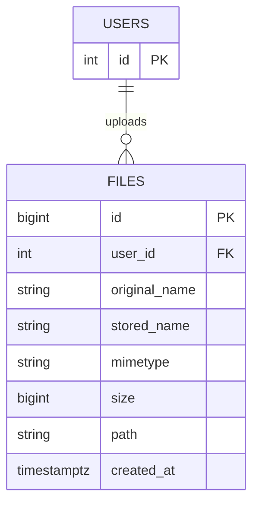

# 04 — File Upload Manager

🏢 **Asked at:** Atlassian, Notion, BrowserStack, Freshworks

> Build a drag-and-drop file uploader with a progress bar and a file list — like attaching files in Jira, Notion, or a support ticket. The hidden depth: handling `multipart/form-data`, validating file type and size *server-side*, storing metadata in the DB while files live on disk/S3, and tracking upload progress.

---

## 🎬 The Product Story

In Notion or Jira you drag a PDF onto the page; a progress bar fills as it uploads; then it appears in a list with its name, size, and a delete button. It feels effortless, but the server is doing careful work: parsing a multipart stream, checking the file is an allowed type and within the size limit (you can't trust the client's claims), saving the bytes somewhere durable, and recording a row so the file can be listed and deleted later.

Interviewers use this to test whether you understand that **file uploads are a security surface**: unchecked uploads enable storage-exhaustion attacks, malicious file types, and path-traversal exploits.

---

## 📋 Requirements (clarified)

**Functional:** upload one or more files via drag-drop or picker; show per-file progress; list uploaded files with size; delete a file.
**Non-functional:** validate type + size on the server; store files outside the web root; per-user isolation; unique stored filenames.

**Clarifying questions:** Allowed types (images only? any?)? Max size? Local disk or S3? Single or multiple files? Do we need signed/expiring download links?

---

## 🧱 Database Schema



```sql
-- File: database/schema.sql
CREATE TABLE files (
  id            BIGSERIAL PRIMARY KEY,
  user_id       INTEGER NOT NULL REFERENCES users(id) ON DELETE CASCADE,
  original_name VARCHAR(255) NOT NULL,                    -- what the user named it
  stored_name   VARCHAR(255) NOT NULL,                    -- our unique name on disk (never trust original)
  mimetype      VARCHAR(100) NOT NULL,
  size          BIGINT NOT NULL,                          -- bytes
  path          TEXT NOT NULL,                            -- or an S3 key/URL
  created_at    TIMESTAMPTZ NOT NULL DEFAULT now()
);
CREATE INDEX idx_files_user ON files(user_id);
```

> **Why a separate `stored_name`?** Never save a file under its user-supplied name — it could contain `../` (path traversal) or collide with another file. We generate a random unique name for disk and keep `original_name` only for display.

---

## 🔌 API Design

| Method | Path | Auth | Purpose |
|--------|------|------|---------|
| POST | `/api/v1/files` | ✅ | Upload (multipart/form-data, field `file`) |
| GET | `/api/v1/files` | ✅ | List user's files |
| GET | `/api/v1/files/:id/download` | ✅ | Download (stream) |
| DELETE | `/api/v1/files/:id` | ✅ | Delete file + row |

---

## 🔄 Full Stack Flow Diagram (upload)

```mermaid
sequenceDiagram
  participant U as User
  participant R as React (DropZone)
  participant E as Express + Multer
  participant FS as Disk / S3
  participant D as Database
  U->>R: drags file onto drop zone
  R->>E: POST /files (multipart) — XHR reports upload progress
  E->>E: Multer streams file; check mimetype + size
  alt invalid type/size
    E-->>R: 400 (rejected before saving)
  else valid
    E->>FS: write bytes under a random stored_name
    E->>D: INSERT file metadata RETURNING row
    E-->>R: 201 {file}
    R->>R: progress hits 100%, file added to list
  end
```

**Reading this diagram:** The browser uploads via XHR so it can report progress events as bytes leave. Multer streams the body and the server validates type and size *before* committing — an invalid file is rejected with `400` and never written. Valid files are saved under a random name and a metadata row is inserted, then the UI shows the completed file.

---

## 💻 Complete Working Code

```javascript
// File: server/middleware/upload.js
const multer = require("multer");
const path = require("path");
const crypto = require("crypto");

const UPLOAD_DIR = path.join(__dirname, "..", "uploads");   // OUTSIDE the public/web root
const MAX_BYTES = 5 * 1024 * 1024;                          // 5 MB limit
const ALLOWED = new Set(["image/png", "image/jpeg", "application/pdf"]);

// Store on disk with a random, safe filename (never the user's name).
const storage = multer.diskStorage({
  destination: (req, file, cb) => cb(null, UPLOAD_DIR),
  filename: (req, file, cb) => {
    const ext = path.extname(file.originalname).toLowerCase().replace(/[^.a-z0-9]/g, ""); // sanitize ext
    cb(null, `${crypto.randomBytes(16).toString("hex")}${ext}`);
  },
});

// Reject disallowed types early (defense in depth — also re-check after).
function fileFilter(req, file, cb) {
  if (!ALLOWED.has(file.mimetype)) {
    return cb(new multer.MulterError("LIMIT_UNEXPECTED_FILE", "Unsupported file type"));
  }
  cb(null, true);
}

const upload = multer({ storage, fileFilter, limits: { fileSize: MAX_BYTES } });

module.exports = { upload, UPLOAD_DIR, MAX_BYTES, ALLOWED };
```

```javascript
// File: server/controllers/fileController.js
const fs = require("fs");
const path = require("path");
const { query } = require("../db");
const { UPLOAD_DIR } = require("../middleware/upload");

const FileController = {
  async upload(req, res) {
    if (!req.file) return res.status(400).json({ success: false, error: "No file provided" });
    const f = req.file;
    const { rows } = await query(
      `INSERT INTO files (user_id, original_name, stored_name, mimetype, size, path)
       VALUES ($1,$2,$3,$4,$5,$6) RETURNING id, original_name, mimetype, size, created_at`,
      [req.user.id, f.originalname, f.filename, f.mimetype, f.size, f.path]
    );
    res.status(201).json({ success: true, data: rows[0] });
  },

  async list(req, res) {
    const { rows } = await query(
      "SELECT id, original_name, mimetype, size, created_at FROM files WHERE user_id = $1 ORDER BY created_at DESC",
      [req.user.id]
    );
    res.status(200).json({ success: true, data: rows });
  },

  async download(req, res) {
    const { rows } = await query(
      "SELECT stored_name, original_name, mimetype FROM files WHERE id = $1 AND user_id = $2",
      [req.params.id, req.user.id]
    );
    const file = rows[0];
    if (!file) return res.status(404).json({ success: false, error: "File not found" });
    const fullPath = path.join(UPLOAD_DIR, file.stored_name);
    res.setHeader("Content-Type", file.mimetype);
    res.setHeader("Content-Disposition", `attachment; filename="${file.original_name}"`);
    fs.createReadStream(fullPath).pipe(res);                 // stream, don't buffer into memory
  },

  async remove(req, res) {
    const { rows } = await query(
      "DELETE FROM files WHERE id = $1 AND user_id = $2 RETURNING stored_name",
      [req.params.id, req.user.id]
    );
    if (!rows[0]) return res.status(404).json({ success: false, error: "File not found" });
    fs.promises.unlink(path.join(UPLOAD_DIR, rows[0].stored_name)).catch(() => {}); // best-effort disk cleanup
    res.status(204).send();
  },
};

module.exports = { FileController };
```

```javascript
// File: server/routes/files.js
const express = require("express");
const router = express.Router();
const { FileController } = require("../controllers/fileController");
const { upload } = require("../middleware/upload");
const { requireAuth } = require("../middleware/auth");
const { asyncHandler } = require("../middleware/asyncHandler");

router.use(requireAuth);
router.post("/", upload.single("file"), asyncHandler(FileController.upload)); // field name = "file"
router.get("/", asyncHandler(FileController.list));
router.get("/:id/download", asyncHandler(FileController.download));
router.delete("/:id", asyncHandler(FileController.remove));

module.exports = router;
```

```javascript
// File: server/middleware/errorHandler.js (handle Multer errors)
const multer = require("multer");
function errorHandler(err, req, res, next) {
  if (err instanceof multer.MulterError) {
    // e.g. file too large, or our "unsupported type" signal
    const msg = err.code === "LIMIT_FILE_SIZE" ? "File too large (max 5MB)" : "Invalid file";
    return res.status(400).json({ success: false, error: msg });
  }
  console.error("[ERROR]", err);
  res.status(err.statusCode || 500).json({ success: false, error: err.publicMessage || "Internal server error" });
}
module.exports = { errorHandler };
```

### Frontend — drag-drop + progress

```jsx
// File: client/src/components/UploadZone.jsx
import { useRef, useState } from "react";

// Uses XMLHttpRequest (not fetch) because fetch can't report upload progress events.
function uploadWithProgress(file, onProgress) {
  return new Promise((resolve, reject) => {
    const xhr = new XMLHttpRequest();
    xhr.open("POST", "/api/v1/files");
    xhr.setRequestHeader("Authorization", `Bearer ${localStorage.getItem("token")}`);
    xhr.upload.onprogress = (e) => {
      if (e.lengthComputable) onProgress(Math.round((e.loaded / e.total) * 100));
    };
    xhr.onload = () => (xhr.status >= 200 && xhr.status < 300
      ? resolve(JSON.parse(xhr.responseText).data)
      : reject(new Error(JSON.parse(xhr.responseText).error || "Upload failed")));
    xhr.onerror = () => reject(new Error("Network error"));
    const form = new FormData();
    form.append("file", file);                              // field name must match upload.single("file")
    xhr.send(form);
  });
}

export function UploadZone({ onUploaded }) {
  const [dragging, setDragging] = useState(false);
  const [progress, setProgress] = useState(null);
  const [error, setError] = useState("");
  const inputRef = useRef();

  async function handleFiles(fileList) {
    setError("");
    for (const file of fileList) {
      try {
        setProgress(0);
        const saved = await uploadWithProgress(file, setProgress);
        onUploaded(saved);
      } catch (err) {
        setError(err.message);                              // e.g. "File too large (max 5MB)"
      } finally {
        setProgress(null);
      }
    }
  }

  return (
    <div
      onDragOver={(e) => { e.preventDefault(); setDragging(true); }}
      onDragLeave={() => setDragging(false)}
      onDrop={(e) => { e.preventDefault(); setDragging(false); handleFiles(e.dataTransfer.files); }}
      onClick={() => inputRef.current.click()}
      style={{ border: `2px dashed ${dragging ? "#36c" : "#aaa"}`, padding: 32, textAlign: "center", cursor: "pointer" }}
    >
      <input ref={inputRef} type="file" hidden multiple
             onChange={(e) => handleFiles(e.target.files)} />
      <p>Drag files here, or click to choose</p>
      {progress !== null && <progress value={progress} max="100">{progress}%</progress>}
      {error && <p role="alert">{error}</p>}
    </div>
  );
}
```

```jsx
// File: client/src/pages/FilesPage.jsx
import { useEffect, useState } from "react";
import { apiFetch } from "../api/client";
import { UploadZone } from "../components/UploadZone";

export function FilesPage() {
  const [files, setFiles] = useState([]);
  const [loading, setLoading] = useState(true);

  useEffect(() => { apiFetch("/files").then(setFiles).finally(() => setLoading(false)); }, []);

  async function remove(id) {
    setFiles((prev) => prev.filter((f) => f.id !== id));    // optimistic
    await apiFetch(`/files/${id}`, { method: "DELETE" });
  }

  const fmtSize = (b) => (b < 1024 * 1024 ? `${(b / 1024).toFixed(0)} KB` : `${(b / 1024 / 1024).toFixed(1)} MB`);

  return (
    <div>
      <h1>Files</h1>
      <UploadZone onUploaded={(f) => setFiles((prev) => [f, ...prev])} />
      {loading ? <p>Loading…</p> : files.length === 0 ? <p>No files yet.</p> : (
        <ul>
          {files.map((f) => (
            <li key={f.id}>
              <a href={`/api/v1/files/${f.id}/download`}>{f.original_name}</a> — {fmtSize(f.size)}
              <button onClick={() => remove(f.id)}>Delete</button>
            </li>
          ))}
        </ul>
      )}
    </div>
  );
}
```

### Running
```bash
mkdir -p server/uploads
psql fullstack_course < database/schema.sql
cd server && npm install multer && npm run dev
cd client && npm install && npm run dev
```

### 🖥️ What You Will See
Drag a PNG onto the dashed zone — it highlights blue, a progress bar fills 0→100%, then the file appears in the list with its size. Drag a 10MB file and you get "File too large (max 5MB)" with nothing saved. Drag a `.exe` and you get "Invalid file." Click a file name to download it (with its original name). Click Delete and it disappears from the list and from disk.

---

## ⚠️ What Makes This Problem Tricky (5 Non-Obvious Traps)

🔴 **Trap 1:** Trusting the client's claimed file type / saving under the user's filename.
✅ Validate `mimetype` server-side; store under a random `stored_name`.
💡 Prevents malicious types and path-traversal via crafted names.

🔴 **Trap 2:** Using `fetch` and wondering why there's no progress.
✅ Use `XMLHttpRequest` — only it exposes `upload.onprogress`.
💡 A concrete browser-API limitation interviewers like to probe.

🔴 **Trap 3:** No size limit — a single upload fills the disk.
✅ Enforce `limits.fileSize` in Multer (and check on the client).
💡 Storage-exhaustion is a real DoS vector.

🔴 **Trap 4:** Buffering large files fully into memory to download.
✅ Stream with `createReadStream().pipe(res)`.
💡 Buffering big files OOM-crashes the server.

🔴 **Trap 5:** Storing uploads inside the public/static web root.
✅ Store outside it; serve only via the authenticated download route.
💡 Otherwise anyone can fetch any file by guessing the path.

---

## 🌀 How the Interviewer Can Twist This Question (6 Extensions)

**Twist 1 (Auth/Security): Signed, expiring download URLs**
🗣️ *"Generate a share link that expires in 10 minutes."*
🛠️ Backend.
💻
```javascript
// sign {fileId, exp} as a short-lived JWT; GET /files/shared?token=... verifies + streams
```

**Twist 2 (Real-time): Live progress for teammates**
🗣️ *"Show others in the workspace that a file is uploading."*
🛠️ Backend + Frontend.
💻
```javascript
// emit upload-progress over WebSocket to the workspace room
```

**Twist 3 (Scale): Direct-to-S3 presigned uploads**
🗣️ *"Don't route big files through our server."*
🛠️ Backend.
💻
```javascript
// server returns a presigned S3 PUT URL; browser uploads directly to S3; server stores only metadata
```

**Twist 4 (New feature): Image thumbnails**
🗣️ *"Generate a thumbnail for image uploads."*
🛠️ Backend.
💻
```javascript
// after save, use sharp to resize → store thumb_path; list returns thumbnail URLs
```

**Twist 5 (Performance): Chunked / resumable uploads**
🗣️ *"Large uploads should resume after a dropped connection."*
🛠️ All three.
💻
```text
// split file into chunks client-side; POST /files/:uploadId/chunk/:n; server reassembles; track received chunks
```

**Twist 6 (Resilience): Orphan cleanup (DB ↔ disk consistency)**
🗣️ *"A crash left files on disk with no DB row."*
🛠️ Backend.
💻
```javascript
// nightly job: list disk files, delete any without a matching files.stored_name row
```

---

## 🧪 Test Cases (8 Cases)

| # | Action | Input | Expected API Response | Expected UI Behavior |
|---|--------|-------|-----------------------|----------------------|
| 1 | Upload valid | 1MB PNG | `201 {file}` | Progress 100%, listed |
| 2 | Too large | 10MB | `400 "File too large"` | Error, not listed |
| 3 | Bad type | .exe | `400 "Invalid file"` | Error |
| 4 | No file | empty | `400 "No file provided"` | Error |
| 5 | List files | token | `200 {data}` | Files render with sizes |
| 6 | Download | own file id | `200` stream | File downloads |
| 7 | Download others' | other id | `404` | Not found |
| 8 | Delete | own id | `204` | Removed from list + disk |

---

## ⏱️ Time Budget

| Phase | Time | What to do |
|-------|------|-----------|
| Read & clarify | 5 min | types? max size? disk vs S3? signed links? |
| Schema | 6 min | files table (stored_name vs original_name) |
| API design | 4 min | upload/list/download/delete |
| Backend | 24 min | Multer config, controller, streaming download, error handling |
| Frontend | 24 min | XHR progress, drag-drop zone, file list |
| Test | 8 min | size/type rejection, progress, delete |
| Buffer | 9 min | empty state, ownership 404 |

---

## 🎤 Famous Interview Questions

**Q1 (Conceptual): How does a multipart file upload work, and what is Multer doing?**
🏢 *Asked at: Atlassian*
✅ Answer: A file upload uses `multipart/form-data`, where the request body is split into parts separated by a boundary string — each part has headers (field name, filename, content type) and raw bytes. Multer is Express middleware that parses this stream, and with disk storage it writes each file part to disk and populates `req.file`/`req.files` with metadata while leaving normal text fields in `req.body`. It can validate size and type as it streams, so I can reject a bad file without buffering the whole thing in memory.
💡 Bonus insight: Because Multer streams, very large uploads don't have to fit in RAM — but you still set a `fileSize` limit so a malicious client can't stream an unbounded file to fill your disk.

**Q2 (Design Decision): Why store metadata in the database but the file bytes on disk/S3?**
🏢 *Asked at: Notion*
✅ Answer: Databases are optimized for structured, queryable data, not large binary blobs — storing big files as BLOBs bloats the database, slows backups, and complicates caching. So I keep the bytes on a filesystem or object store (S3) that's built for that, and store a metadata row (name, size, type, path/key, owner) in the database so I can list, authorize, and delete efficiently. The DB row is the source of truth for "does this file exist and who owns it."
💡 Bonus insight: This split also enables a CDN in front of S3 for downloads while the database still enforces ownership — best of both worlds.

**Q3 (Trade-off): Routing uploads through your server vs presigned direct-to-S3?**
🏢 *Asked at: BrowserStack*
✅ Answer: Routing through the server is simple and lets you validate and transform files in one place, but it consumes your bandwidth and CPU and can bottleneck on large files. Presigned URLs let the browser upload directly to S3 using a short-lived signed link your server generates, offloading the heavy transfer entirely — at the cost of doing validation differently (you validate the request and rely on S3 constraints, then confirm afterward). For big files at scale, presigned direct upload is the standard.
💡 Bonus insight: With presigned uploads you typically still record metadata via a follow-up call and may verify the object (size/type) server-side after S3 reports completion, so you don't blindly trust the client.

**Q4 (Extension): How would you support resumable uploads for large files?**
🏢 *Asked at: Atlassian*
✅ Answer: I'd split the file into fixed-size chunks on the client and upload them individually, each tagged with an upload id and chunk index. The server records which chunks it has received; if the connection drops, the client asks which chunks are missing and re-sends only those. Once all chunks arrive, the server reassembles them into the final file and writes the metadata row. This makes uploads robust to flaky networks and enables progress and pause/resume.
💡 Bonus insight: S3 multipart upload implements exactly this natively — you initiate, upload parts (each retryable), then complete — so on S3 you'd lean on that rather than building reassembly yourself.

**Q5 (Security/Edge case): What are the security risks of file uploads?**
🏢 *Asked at: Freshworks*
✅ Answer: The main risks are: malicious file types (validate MIME type and extension, and don't execute uploads); path traversal via crafted filenames (never use the user's name — generate a random stored name); storage exhaustion (enforce size limits and quotas); serving files from the web root (store outside it and gate downloads with auth); and content-based attacks like an image with embedded scripts (set correct `Content-Type` and `Content-Disposition: attachment`, and consider scanning). I also enforce per-user ownership on download and delete.
💡 Bonus insight: MIME type from the client is a hint, not proof — for strict environments you sniff the file's magic bytes server-side to confirm it really is the type it claims.

---

## 🔗 Navigation
⬅️ Previous: [03 — Rate Limiter](./03-rate-limiter.md)
➡️ Next: [05 — Real-Time Chat](./05-real-time-chat.md)
🏠 [Module Home](./README.md)
