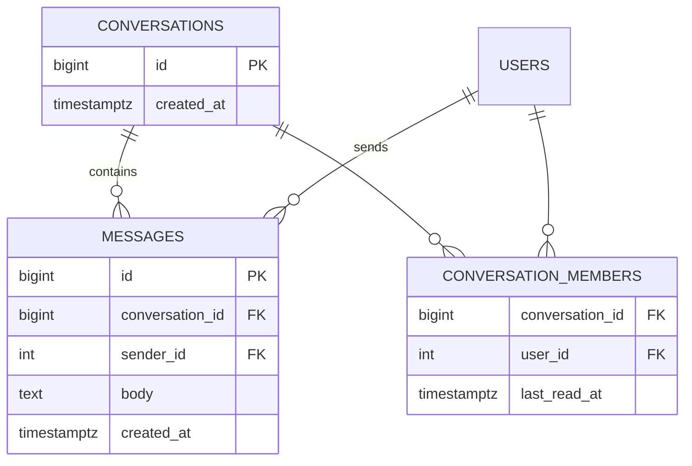
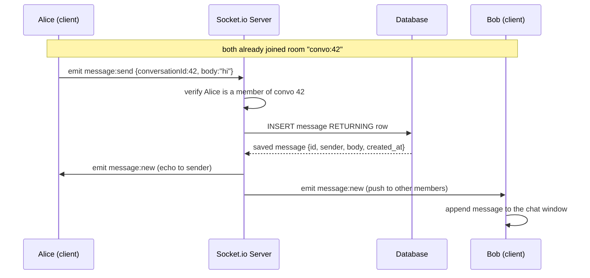

# 05 — Real-Time Chat

🏢 **Asked at:** Atlassian, Meta, Notion, Slack, Freshworks

> Build a chat with live message delivery, history, and a typing indicator — Slack/WhatsApp in miniature. The signature lesson: the **hybrid architecture** — REST for the data that already exists (history) and WebSockets for the data arriving *right now* (new messages, typing).

---

## 🎬 The Product Story

Open Slack. You scroll up and older messages load (that's a normal HTTP fetch from a database). You type and "Alice is typing…" appears on your colleague's screen instantly. You hit send and your message pops onto everyone's screen in the channel within milliseconds — no refresh, no polling. Two completely different mechanisms power one experience: **request/response** for the past, **push** for the present.

Interviewers ask this to see if you understand *why* you can't build live chat on plain HTTP polling (latency + load) and whether you can wire up WebSockets without losing message history or persistence.

---

## 🌐 WebSockets vs HTTP — The Analogy

> **HTTP is like sending letters.** For every reply you must mail a new letter and wait — one request, one response, then the connection closes. To "watch" for news you'd mail a letter every few seconds asking "anything new?" (polling) — wasteful and slow.
>
> **A WebSocket is like an open phone line.** You dial once, the line stays open, and either side can talk the instant they have something to say. No re-dialing, no "anything new?" — the server just *tells* you the moment a message arrives.

WebSockets give **full-duplex** (both directions, simultaneously) communication over a single long-lived connection — exactly what live chat needs. We use **Socket.io**, which wraps WebSockets with rooms, reconnection, and fallbacks.

---

## 📋 Requirements (clarified)

**Functional:** users in a conversation send/receive messages live; load message history; show a typing indicator; (bonus) read receipts.
**Non-functional:** messages persisted (survive refresh); only conversation members can read/post; history paginated.

**Clarifying questions:** 1:1 or group conversations? Do we need read receipts/online presence? Must messages persist or is live-only fine? How far back does history go?

---

## 🧱 Database Schema



```sql
-- File: database/schema.sql
CREATE TABLE conversations (
  id         BIGSERIAL PRIMARY KEY,
  created_at TIMESTAMPTZ NOT NULL DEFAULT now()
);

CREATE TABLE conversation_members (
  conversation_id BIGINT NOT NULL REFERENCES conversations(id) ON DELETE CASCADE,
  user_id         INTEGER NOT NULL REFERENCES users(id) ON DELETE CASCADE,
  last_read_at    TIMESTAMPTZ,                            -- for read receipts / unread counts
  PRIMARY KEY (conversation_id, user_id)                 -- a user joins a conversation once
);

CREATE TABLE messages (
  id              BIGSERIAL PRIMARY KEY,
  conversation_id BIGINT NOT NULL REFERENCES conversations(id) ON DELETE CASCADE,
  sender_id       INTEGER NOT NULL REFERENCES users(id) ON DELETE CASCADE,
  body            TEXT NOT NULL,
  created_at      TIMESTAMPTZ NOT NULL DEFAULT now()
);
-- History is "messages in this conversation, by time" → composite index.
CREATE INDEX idx_messages_convo_time ON messages(conversation_id, created_at DESC);
```

---

## 🔌 API + Socket Design (the hybrid)

**REST (the past):**
| Method | Path | Purpose |
|--------|------|---------|
| GET | `/api/v1/conversations` | My conversations |
| GET | `/api/v1/conversations/:id/messages?before=&limit=` | Paginated history |
| POST | `/api/v1/conversations` | Start a conversation |

**Socket.io events (the present):**
| Event | Direction | Payload |
|-------|-----------|---------|
| `join` | client→server | `{conversationId}` (join the room) |
| `message:send` | client→server | `{conversationId, body}` |
| `message:new` | server→clients | the persisted message |
| `typing` | client→server→others | `{conversationId, userId}` |

---

## 🔄 Full Stack Flow Diagram (send a message)



**Reading this diagram:** Alice emits over the open socket; the server authorizes her membership, persists the message (so it survives refresh), then broadcasts `message:new` to everyone in the room — including Alice, so her UI shows the server-confirmed message. No polling anywhere; delivery is push-based and the database keeps the durable record.

---

## 💻 Complete Working Code

```javascript
// File: server/socket/index.js
const { Server } = require("socket.io");
const { verifyToken } = require("../auth/token");
const { query } = require("../db");

function attachSockets(httpServer) {
  const io = new Server(httpServer, { cors: { origin: "*" } });

  // Authenticate every socket connection using the JWT (don't trust an anonymous socket).
  io.use((socket, next) => {
    try {
      const payload = verifyToken(socket.handshake.auth.token);
      socket.userId = payload.sub;
      next();
    } catch {
      next(new Error("Unauthorized"));
    }
  });

  io.on("connection", (socket) => {
    // Join a conversation room after checking membership.
    socket.on("join", async ({ conversationId }) => {
      const ok = await isMember(conversationId, socket.userId);
      if (!ok) return socket.emit("error", "Not a member");
      socket.join(`convo:${conversationId}`);
    });

    // Receive a message, persist it, broadcast to the room.
    socket.on("message:send", async ({ conversationId, body }) => {
      if (!body || !body.trim()) return;
      if (!(await isMember(conversationId, socket.userId))) return;
      const { rows } = await query(
        `INSERT INTO messages (conversation_id, sender_id, body) VALUES ($1,$2,$3)
         RETURNING id, conversation_id, sender_id, body, created_at`,
        [conversationId, socket.userId, body.trim()]
      );
      io.to(`convo:${conversationId}`).emit("message:new", rows[0]); // push to all members
    });

    // Relay typing to OTHERS in the room (not back to the typer).
    socket.on("typing", ({ conversationId }) => {
      socket.to(`convo:${conversationId}`).emit("typing", { userId: socket.userId, conversationId });
    });
  });

  return io;
}

async function isMember(conversationId, userId) {
  const { rows } = await query(
    "SELECT 1 FROM conversation_members WHERE conversation_id = $1 AND user_id = $2",
    [conversationId, userId]
  );
  return rows.length > 0;
}

module.exports = { attachSockets };
```

```javascript
// File: server/index.js (wiring HTTP + sockets together)
require("dotenv").config();
const http = require("http");
const express = require("express");
const cors = require("cors");
const { attachSockets } = require("./socket");
const conversationsRouter = require("./routes/conversations");
const { errorHandler } = require("./middleware/errorHandler");

const app = express();
app.use(cors());
app.use(express.json());
app.use("/api/v1/conversations", conversationsRouter);     // REST for history
app.use(errorHandler);

const server = http.createServer(app);                     // one server for HTTP + WS
attachSockets(server);                                     // attach Socket.io to it
server.listen(process.env.PORT || 4000);
```

```javascript
// File: server/controllers/conversationController.js
const { query } = require("../db");

const ConversationController = {
  // Paginated history via keyset ("messages before this timestamp").
  async messages(req, res) {
    const { id } = req.params;
    const limit = Math.min(parseInt(req.query.limit) || 30, 100);
    const before = req.query.before || new Date().toISOString();
    // Authorize membership.
    const member = await query("SELECT 1 FROM conversation_members WHERE conversation_id=$1 AND user_id=$2", [id, req.user.id]);
    if (!member.rows.length) return res.status(403).json({ success: false, error: "Not a member" });

    const { rows } = await query(
      `SELECT id, sender_id, body, created_at FROM messages
       WHERE conversation_id = $1 AND created_at < $2
       ORDER BY created_at DESC LIMIT $3`,
      [id, before, limit]
    );
    res.status(200).json({ success: true, data: rows.reverse() }); // oldest→newest for display
  },
};

module.exports = { ConversationController };
```

### Frontend

```jsx
// File: client/src/hooks/useSocket.js
import { useEffect, useRef } from "react";
import { io } from "socket.io-client";

// Create one authenticated socket connection for the app.
export function useSocket() {
  const ref = useRef(null);
  useEffect(() => {
    const socket = io("http://localhost:4000", { auth: { token: localStorage.getItem("token") } });
    ref.current = socket;
    return () => socket.disconnect();                       // clean up on unmount
  }, []);
  return ref;
}
```

```jsx
// File: client/src/components/ChatWindow.jsx
import { useEffect, useState, useRef } from "react";
import { apiFetch } from "../api/client";
import { useSocket } from "../hooks/useSocket";

export function ChatWindow({ conversationId, myUserId }) {
  const [messages, setMessages] = useState([]);
  const [text, setText] = useState("");
  const [typingUser, setTypingUser] = useState(null);
  const [loading, setLoading] = useState(true);
  const socketRef = useSocket();
  const typingTimeout = useRef();

  // 1) Load history over REST.
  useEffect(() => {
    apiFetch(`/conversations/${conversationId}/messages?limit=30`)
      .then(setMessages)
      .finally(() => setLoading(false));
  }, [conversationId]);

  // 2) Join the room and subscribe to live events over the socket.
  useEffect(() => {
    const socket = socketRef.current;
    if (!socket) return;
    socket.emit("join", { conversationId });
    socket.on("message:new", (m) => {
      if (m.conversation_id === conversationId) setMessages((prev) => [...prev, m]);
    });
    socket.on("typing", ({ userId }) => {
      setTypingUser(userId);
      clearTimeout(typingTimeout.current);
      typingTimeout.current = setTimeout(() => setTypingUser(null), 2000); // clear after 2s of silence
    });
    return () => { socket.off("message:new"); socket.off("typing"); };
  }, [conversationId, socketRef]);

  function send(e) {
    e.preventDefault();
    if (!text.trim()) return;
    socketRef.current.emit("message:send", { conversationId, body: text });
    setText("");                                            // server will echo it back via message:new
  }

  function onType(e) {
    setText(e.target.value);
    socketRef.current.emit("typing", { conversationId });   // notify others
  }

  if (loading) return <p>Loading conversation…</p>;
  return (
    <div>
      <div className="messages">
        {messages.length === 0 ? <p>No messages yet. Say hi 👋</p> : messages.map((m) => (
          <div key={m.id} className={m.sender_id === myUserId ? "mine" : "theirs"}>
            {m.body}
          </div>
        ))}
      </div>
      {typingUser && typingUser !== myUserId && <em>Someone is typing…</em>}
      <form onSubmit={send}>
        <input value={text} onChange={onType} placeholder="Type a message…" />
        <button>Send</button>
      </form>
    </div>
  );
}
```

### Running
```bash
psql fullstack_course < database/schema.sql
cd server && npm install socket.io && npm run dev
cd client && npm install socket.io-client && npm run dev
```

### 🖥️ What You Will See
Open two browsers logged in as two members of a conversation. Type in one — "Someone is typing…" appears in the other almost instantly. Send a message and it pops onto *both* screens within milliseconds, no refresh. Reload either browser and the history is still there (it's persisted and reloaded via REST). Scroll the chat and older messages remain in order. A non-member who tries to join the room gets an error and no messages.

---

## ⚠️ What Makes This Problem Tricky (5 Non-Obvious Traps)

🔴 **Trap 1:** Trying to do live chat with HTTP polling.
✅ WebSockets for live, REST for history (the hybrid).
💡 Polling adds latency and load; the hybrid is the expected architecture.

🔴 **Trap 2:** Not persisting messages, so refresh loses everything.
✅ Persist to the DB *before* broadcasting; load history over REST.
💡 "Real-time" doesn't mean "ephemeral."

🔴 **Trap 3:** Unauthenticated sockets — anyone joins any room.
✅ Verify the JWT on socket handshake; check membership on join/send.
💡 Sockets need the same auth rigor as HTTP routes.

🔴 **Trap 4:** Broadcasting typing to everyone including the typer, or never clearing it.
✅ `socket.to(room)` excludes the sender; clear after a short timeout.
💡 Shows you understand room semantics and ephemeral state.

🔴 **Trap 5:** OFFSET pagination for history (drifts as new messages arrive).
✅ Keyset pagination with `created_at < before`.
💡 Stable paging in a stream of incoming messages.

---

## 🌀 How the Interviewer Can Twist This Question (6 Extensions)

**Twist 1 (Auth/Security): Per-room authorization on every event**
🗣️ *"Make sure a user can't post to a room they left."*
🛠️ Backend.
💻
```javascript
// re-check isMember() on every message:send (already shown) — membership can change mid-session
```

**Twist 2 (Real-time): Read receipts + online presence**
🗣️ *"Show 'seen' and who's online."*
🛠️ All three.
💻
```javascript
// on view, update conversation_members.last_read_at + emit "read"; track presence in a Map of userId→socketCount
```

**Twist 3 (Scale): Multi-server with a Redis adapter**
🗣️ *"Users connect to different servers but share a room."*
🛠️ Backend.
💻
```javascript
const { createAdapter } = require("@socket.io/redis-adapter");
io.adapter(createAdapter(pubClient, subClient)); // broadcasts propagate across server instances
```

**Twist 4 (New feature): Group conversations + member management**
🗣️ *"Support group chats with add/remove member."*
🛠️ All three.
💻
```javascript
// conversation_members already supports N members; add POST /conversations/:id/members
```

**Twist 5 (Performance): Message delivery acks + dedupe**
🗣️ *"Guarantee a message isn't lost or duplicated on flaky networks."*
🛠️ All three.
💻
```javascript
// client sends a clientMsgId; server upserts on (conversation_id, client_msg_id) UNIQUE; acks back
```

**Twist 6 (Resilience): Offline queue + reconnect replay**
🗣️ *"Deliver messages missed while disconnected."*
🛠️ Backend + Frontend.
💻
```javascript
// on reconnect, client sends lastSeenMessageId; server replays messages created after it
```

---

## 🧪 Test Cases (8 Cases)

| # | Action | Input | Expected Result | UI Behavior |
|---|--------|-------|-----------------|-------------|
| 1 | Send message | `message:send` | persisted + broadcast | Appears on all members |
| 2 | Receive live | other sends | `message:new` | Appears without refresh |
| 3 | Load history | GET messages | `200 {data}` | Older messages render |
| 4 | Refresh | reload | history reloads | Messages persist |
| 5 | Typing | `typing` | relayed to others | "Someone is typing…" |
| 6 | Non-member join | join room | error | No messages shown |
| 7 | Empty body | `body:""` | ignored | Nothing sent |
| 8 | Unauth socket | bad token | connection refused | Can't connect |

---

## ⏱️ Time Budget

| Phase | Time | What to do |
|-------|------|-----------|
| Read & clarify | 5 min | 1:1 vs group? receipts? persistence? |
| Schema | 8 min | conversations, members, messages + index |
| API + socket design | 6 min | REST history + socket events |
| Backend | 26 min | socket auth, join/send/typing, history endpoint |
| Frontend | 24 min | useSocket, ChatWindow (history + live + typing) |
| Test | 8 min | two-browser live, persistence, typing |
| Buffer | 8 min | non-member, empty body, cleanup |

---

## 🎤 Famous Interview Questions

**Q1 (Conceptual): Why WebSockets for chat instead of HTTP polling?**
🏢 *Asked at: Atlassian*
✅ Answer: HTTP is request/response — to get new messages with HTTP you'd poll on an interval, which adds latency (up to the interval) and wastes requests when nothing changed; long-polling helps but is awkward. WebSockets establish a single persistent, full-duplex connection so the server pushes a message the instant it arrives, with no repeated requests. For chat, where low latency and frequent bidirectional updates are the whole point, WebSockets are dramatically more efficient and responsive.
💡 Bonus insight: The connection upgrade starts as an HTTP request with an `Upgrade: websocket` header, then switches protocols — so WebSockets ride on the same port/infrastructure as HTTP, which is why Socket.io can fall back to long-polling when a proxy blocks the upgrade.

**Q2 (Design Decision): Why the hybrid REST + WebSocket architecture?**
🏢 *Asked at: Slack*
✅ Answer: History and live delivery have different needs. Fetching old messages is a classic paginated read — request/response over REST, cacheable, easy to authorize and page. Live messages need push, which is what WebSockets provide. So I load the existing conversation over REST when the window opens, then subscribe over the socket for everything new. This keeps each mechanism doing what it's best at and avoids, say, replaying all history over the socket on every connect.
💡 Bonus insight: It also degrades gracefully — if the socket drops, history and even sending (via a REST fallback) can still work, so the app isn't entirely dead when real-time is unavailable.

**Q3 (Trade-off): Persist-then-broadcast vs broadcast-then-persist?**
🏢 *Asked at: Notion*
✅ Answer: I persist first, then broadcast the server-saved row (with its real id and timestamp). This guarantees that what users see matches durable state — no "ghost" messages that appear then vanish if the write fails. The cost is a tiny bit of latency from the DB write before fan-out. Broadcasting first feels faster but risks showing messages that were never saved, which is worse for a chat app where history must be trustworthy.
💡 Bonus insight: To get both speed and safety, some systems echo an optimistic local message immediately (greyed out) and reconcile it when the server's confirmed `message:new` with the real id arrives.

**Q4 (Extension): How do you scale WebSocket chat across many servers?**
🏢 *Asked at: Meta*
✅ Answer: WebSocket connections are stateful and pinned to one server, so two members of a room may be connected to different servers. To broadcast across them I add a pub/sub backbone — Socket.io's Redis adapter — so an `emit` to a room publishes to Redis and every server delivers to its locally-connected room members. I'd use sticky sessions or a connection-aware load balancer, store presence centrally, and offload heavy fan-out to background workers for large rooms.
💡 Bonus insight: For very large broadcast rooms (e.g. a live event), you stop fanning out per-connection in the request path and use a dedicated pub/sub or even a streaming/CDN layer, because synchronously emitting to a million sockets won't keep up.

**Q5 (Security/Edge case): What security and edge cases matter for chat?**
🏢 *Asked at: Freshworks*
✅ Answer: Authenticate the socket on handshake (validate the JWT) and re-check conversation membership on join and on every send — membership can change during a session. Validate and sanitize message bodies to prevent stored XSS when rendering. Handle reconnection (replay missed messages via a last-seen id) and dedupe with a client message id so retries don't double-post. Rate-limit sends to curb spam, and ensure typing indicators are ephemeral and don't leak across rooms.
💡 Bonus insight: The membership re-check on each event is the subtle one — authorizing only at connect time means a removed user keeps receiving and sending until they disconnect, so authorization has to be per-action, not per-connection.

---

## 🔗 Navigation
⬅️ Previous: [04 — File Upload Manager](./04-file-upload-manager.md)
➡️ Next: [06 — Activity Feed](./06-activity-feed.md)
🏠 [Module Home](./README.md)
