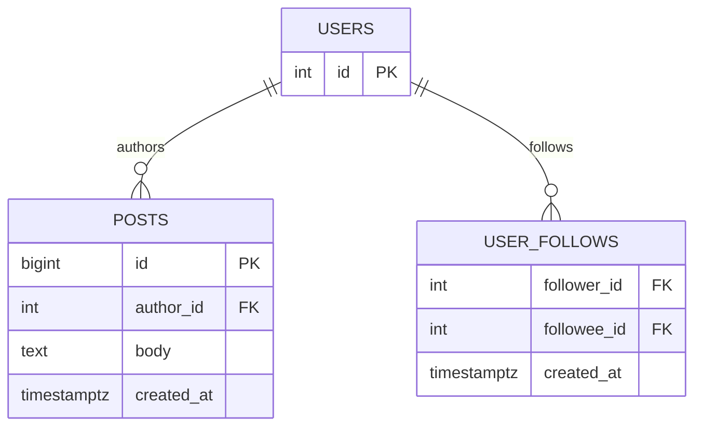

# 06 — Activity Feed

🏢 **Asked at:** Meta, LinkedIn, Twitter/X, Swiggy, CRED

> Build a personalized feed: you follow people, and you see their activity newest-first with infinite scroll. The famous teaching point is the **fan-out problem** — "fan-out on write" vs "fan-out on read" — the central design decision behind every social feed at scale.

---

## 🎬 The Product Story

Your LinkedIn or Twitter home feed is a blend of posts from everyone you follow, freshest at the top, loading more as you scroll. Simple to use, deceptively hard to build: when someone you follow posts, how does it get into *your* feed? Do you compute the feed fresh every time someone opens the app (read time), or do you push each new post into all followers' feeds the moment it's created (write time)?

That single choice — **fan-out on read vs fan-out on write** — determines whether your feed is fast for readers or fast for writers, and it's the heart of why this question is asked at Meta and Twitter.

---

## 🌬️ The Fan-Out Problem (plain English)

> Think of a post as a newspaper, and followers as subscribers.
>
> **Fan-out on read** = you don't pre-deliver anything. When a subscriber wants to read, you run around gathering the latest editions from every publisher they follow and assemble a custom paper *on the spot*. Cheap when publishing, expensive every time someone reads — and slow for someone following thousands.
>
> **Fan-out on write** = the moment a publisher prints an edition, you immediately drop a copy into the mailbox of every subscriber. Reading is then instant (just open your mailbox), but publishing is expensive — a celebrity with 10 million followers triggers 10 million mailbox drops.

| | Fan-out on read | Fan-out on write |
|---|---|---|
| Cost at post time | Cheap (just store the post) | Expensive (write to every follower's feed) |
| Cost at read time | Expensive (gather + merge live) | Cheap (read your precomputed feed) |
| Best when | Users follow few; writes >> reads | Reads >> writes; followers moderate |
| The "celebrity problem" | Fine | Painful (millions of writes per post) |

**The real-world answer is hybrid:** fan-out on write for normal users, fan-out on read for celebrities (merge their posts in at read time). For an interview, implement **fan-out on read** (simpler, correct) and *explain* the write/hybrid trade-off.

---

## 📋 Requirements (clarified)

**Functional:** follow/unfollow users; a personalized feed of posts from people you follow, newest-first; infinite scroll; create a post.
**Non-functional:** stable pagination as new posts arrive (keyset/cursor); per-user feed; reasonable performance.

**Clarifying questions:** Expected follow counts (any celebrities)? Read-heavy or write-heavy? Just text posts? Should my own posts appear in my feed?

---

## 🧱 Database Schema



```sql
-- File: database/schema.sql
CREATE TABLE posts (
  id         BIGSERIAL PRIMARY KEY,
  author_id  INTEGER NOT NULL REFERENCES users(id) ON DELETE CASCADE,
  body       TEXT NOT NULL,
  created_at TIMESTAMPTZ NOT NULL DEFAULT now()
);
CREATE INDEX idx_posts_author_time ON posts(author_id, created_at DESC);

-- The follow graph: who follows whom.
CREATE TABLE user_follows (
  follower_id INTEGER NOT NULL REFERENCES users(id) ON DELETE CASCADE,  -- the one doing the following
  followee_id INTEGER NOT NULL REFERENCES users(id) ON DELETE CASCADE,  -- the one being followed
  created_at  TIMESTAMPTZ NOT NULL DEFAULT now(),
  PRIMARY KEY (follower_id, followee_id),                                -- can't follow twice (idempotent)
  CHECK (follower_id <> followee_id)                                     -- can't follow yourself
);
CREATE INDEX idx_follows_follower ON user_follows(follower_id);          -- "who do I follow"

-- (Fan-out-on-write twist) a materialized feed table:
-- CREATE TABLE feed_items (user_id INT, post_id BIGINT, created_at TIMESTAMPTZ, PRIMARY KEY(user_id, post_id));
```

---

## 🔌 API Design

| Method | Path | Auth | Purpose |
|--------|------|------|---------|
| GET | `/api/v1/feed?cursor=&limit=` | ✅ | Personalized feed (keyset paginated) |
| POST | `/api/v1/posts` | ✅ | Create a post |
| POST | `/api/v1/follow/:userId` | ✅ | Follow someone (idempotent) |
| DELETE | `/api/v1/follow/:userId` | ✅ | Unfollow |

Feed response with a cursor for the next page:
```json
{ "success": true, "data": [ ... ], "nextCursor": "2026-06-13T09:00:00.000Z" }
```

---

## 🔄 Full Stack Flow Diagram (load feed — fan-out on read)

```mermaid
sequenceDiagram
  participant U as User
  participant R as React (Feed)
  participant E as Express
  participant D as Database
  U->>R: opens feed / scrolls to bottom
  R->>E: GET /feed?cursor=<lastSeenTime>&limit=20
  E->>D: SELECT posts WHERE author_id IN (SELECT followee_id FROM user_follows WHERE follower_id=$1)\n           AND created_at < $cursor ORDER BY created_at DESC LIMIT 20
  D-->>E: 20 posts (merged from all followees)
  E-->>R: {data, nextCursor: oldest.created_at}
  R->>R: append to feed; cursor = nextCursor for next scroll
```

**Reading this diagram:** Opening the feed (or scrolling to the bottom) asks for posts older than the cursor. The server computes the feed *at read time* by selecting posts whose authors are in the user's followee set, ordered newest-first, limited to a page. The oldest item's timestamp becomes the next cursor, so infinite scroll fetches the next slice without drift.

---

## 💻 Complete Working Code

```javascript
// File: server/models/feedModel.js
const { query } = require("../db");

const FeedModel = {
  // Fan-out on READ: gather followees' posts live, keyset-paginated by created_at.
  async getFeed(userId, { cursor, limit = 20 }) {
    const before = cursor || new Date().toISOString();
    const { rows } = await query(
      `SELECT p.id, p.body, p.created_at, u.display_name AS author, p.author_id
       FROM posts p
       JOIN users u ON u.id = p.author_id
       WHERE p.author_id IN (
               SELECT followee_id FROM user_follows WHERE follower_id = $1
               UNION SELECT $1                       -- include my own posts
             )
         AND p.created_at < $2                        -- keyset cursor
       ORDER BY p.created_at DESC
       LIMIT $3`,
      [userId, before, limit]
    );
    const nextCursor = rows.length === limit ? rows[rows.length - 1].created_at : null;
    return { rows, nextCursor };
  },

  createPost: (authorId, body) =>
    query("INSERT INTO posts (author_id, body) VALUES ($1,$2) RETURNING id, body, created_at",
      [authorId, body]).then((r) => r.rows[0]),

  // Idempotent follow: ON CONFLICT means following twice is a harmless no-op.
  follow: (followerId, followeeId) =>
    query("INSERT INTO user_follows (follower_id, followee_id) VALUES ($1,$2) ON CONFLICT DO NOTHING",
      [followerId, followeeId]),

  unfollow: (followerId, followeeId) =>
    query("DELETE FROM user_follows WHERE follower_id=$1 AND followee_id=$2", [followerId, followeeId]),
};

module.exports = { FeedModel };
```

```javascript
// File: server/controllers/feedController.js
const { FeedModel } = require("../models/feedModel");

const FeedController = {
  async feed(req, res) {
    const limit = Math.min(parseInt(req.query.limit) || 20, 50);
    const { rows, nextCursor } = await FeedModel.getFeed(req.user.id, { cursor: req.query.cursor, limit });
    res.status(200).json({ success: true, data: rows, nextCursor });
  },
  async createPost(req, res) {
    if (!req.body.body?.trim()) return res.status(400).json({ success: false, error: "Post body required" });
    const post = await FeedModel.createPost(req.user.id, req.body.body.trim());
    res.status(201).json({ success: true, data: post });
  },
  async follow(req, res) {
    const followee = parseInt(req.params.userId);
    if (followee === req.user.id) return res.status(400).json({ success: false, error: "Can't follow yourself" });
    await FeedModel.follow(req.user.id, followee);
    res.status(200).json({ success: true, message: "Following" });
  },
  async unfollow(req, res) {
    await FeedModel.unfollow(req.user.id, parseInt(req.params.userId));
    res.status(204).send();
  },
};

module.exports = { FeedController };
```

```javascript
// File: server/routes/feed.js
const express = require("express");
const router = express.Router();
const { FeedController } = require("../controllers/feedController");
const { requireAuth } = require("../middleware/auth");
const { asyncHandler } = require("../middleware/asyncHandler");

router.use(requireAuth);
router.get("/feed", asyncHandler(FeedController.feed));
router.post("/posts", asyncHandler(FeedController.createPost));
router.post("/follow/:userId", asyncHandler(FeedController.follow));
router.delete("/follow/:userId", asyncHandler(FeedController.unfollow));

module.exports = router;
```

### Frontend — infinite scroll with IntersectionObserver

```jsx
// File: client/src/hooks/useInfiniteScroll.js
import { useEffect, useRef } from "react";

// Calls loadMore() when the sentinel element scrolls into view.
export function useInfiniteScroll(loadMore, hasMore) {
  const sentinelRef = useRef(null);
  useEffect(() => {
    if (!hasMore) return;
    const observer = new IntersectionObserver((entries) => {
      if (entries[0].isIntersecting) loadMore();           // bottom reached → fetch next page
    }, { rootMargin: "200px" });                            // start a bit before fully visible
    const el = sentinelRef.current;
    if (el) observer.observe(el);
    return () => observer.disconnect();
  }, [loadMore, hasMore]);
  return sentinelRef;
}
```

```jsx
// File: client/src/pages/FeedPage.jsx
import { useState, useCallback, useRef } from "react";
import { apiFetch } from "../api/client";
import { useInfiniteScroll } from "../hooks/useInfiniteScroll";

export function FeedPage() {
  const [posts, setPosts] = useState([]);
  const [cursor, setCursor] = useState(null);
  const [hasMore, setHasMore] = useState(true);
  const [loading, setLoading] = useState(false);
  const loadingRef = useRef(false);                         // guard against overlapping loads

  const loadMore = useCallback(async () => {
    if (loadingRef.current || !hasMore) return;
    loadingRef.current = true;
    setLoading(true);
    try {
      const params = new URLSearchParams({ limit: 20 });
      if (cursor) params.set("cursor", cursor);
      const res = await fetch(`/api/v1/feed?${params}`, {
        headers: { Authorization: `Bearer ${localStorage.getItem("token")}` },
      });
      const json = await res.json();
      setPosts((prev) => [...prev, ...json.data]);          // append next page
      setCursor(json.nextCursor);
      setHasMore(!!json.nextCursor);                        // no cursor → no more pages
    } finally {
      loadingRef.current = false;
      setLoading(false);
    }
  }, [cursor, hasMore]);

  const sentinelRef = useInfiniteScroll(loadMore, hasMore);

  return (
    <div>
      <h1>Your Feed</h1>
      {posts.length === 0 && !loading && <p>Follow people to see their posts here.</p>}
      {posts.map((p) => (
        <article key={p.id}>
          <strong>{p.author}</strong>
          <p>{p.body}</p>
          <small>{new Date(p.created_at).toLocaleString()}</small>
        </article>
      ))}
      {loading && <p>Loading…</p>}
      <div ref={sentinelRef} style={{ height: 1 }} />       {/* the infinite-scroll sentinel */}
    </div>
  );
}
```

### Running
```bash
psql fullstack_course < database/schema.sql
cd server && npm install && npm run dev
cd client && npm install && npm run dev
```

### 🖥️ What You Will See
Follow a couple of users and your feed fills with their posts, newest first. Scroll to the bottom and the next 20 load automatically (watch the network tab fire one request per page). Create a post and it shows up at the top of your own feed. Follow the same person twice (e.g. double-click) and nothing breaks — the second follow is a no-op. With nobody followed, you see "Follow people to see their posts here."

---

## ⚠️ What Makes This Problem Tricky (5 Non-Obvious Traps)

🔴 **Trap 1:** OFFSET pagination — new posts shift everything, causing duplicates/skips while scrolling.
✅ Keyset/cursor pagination on `created_at`.
💡 Feeds receive new items constantly; offset is unstable.

🔴 **Trap 2:** Not knowing fan-out on read vs write (or picking write blindly).
✅ Implement read; explain the trade-off and the celebrity problem.
💡 This is the concept the whole question exists to test.

🔴 **Trap 3:** Non-idempotent follow — double-clicking creates duplicates or errors.
✅ Composite PK + `ON CONFLICT DO NOTHING`.
💡 Idempotency makes the follow button safe to mash.

🔴 **Trap 4:** Overlapping infinite-scroll loads firing the same page twice.
✅ A loading guard (`loadingRef`) blocks concurrent loads.
💡 Without it, fast scrolling duplicates posts.

🔴 **Trap 5:** Forgetting to include your own posts in your feed.
✅ `UNION SELECT $userId` into the author set.
💡 A common product expectation that's easy to miss.

---

## 🌀 How the Interviewer Can Twist This Question (6 Extensions)

**Twist 1 (Auth/Security): Private accounts / blocked users**
🗣️ *"Don't show posts from accounts that blocked me, or private accounts I don't follow."*
🛠️ All three.
💻
```sql
-- add a blocks table; exclude authors who blocked the viewer from the feed query
```

**Twist 2 (Real-time): Live "new posts" pill**
🗣️ *"Show 'N new posts' at the top as they arrive."*
🛠️ Backend + Frontend.
💻
```javascript
// WebSocket pushes new post ids for followees; client shows a pill, prepends on click
```

**Twist 3 (Scale): Fan-out on write with a materialized feed**
🗣️ *"Reads are too slow at scale."*
🛠️ Backend.
💻
```javascript
// on createPost: INSERT INTO feed_items(user_id, post_id, created_at) SELECT follower_id, $postId, now() FROM user_follows WHERE followee_id=$author
// feed read becomes: SELECT FROM feed_items WHERE user_id=$me ORDER BY created_at DESC
```

**Twist 4 (New feature): Likes & comment counts in the feed**
🗣️ *"Show engagement counts on each post."*
🛠️ All three.
💻
```sql
ALTER TABLE posts ADD COLUMN like_count INT DEFAULT 0; -- denormalized counter, bump on like
```

**Twist 5 (Performance): Hybrid fan-out for celebrities**
🗣️ *"A user with 10M followers breaks fan-out on write."*
🛠️ Backend.
💻
```text
// mark celebrity accounts; skip write fan-out for them; merge their recent posts at read time
```

**Twist 6 (Resilience): Idempotent post creation**
🗣️ *"A retried POST shouldn't create duplicate posts."*
🛠️ Backend.
💻
```sql
ALTER TABLE posts ADD COLUMN client_post_id UUID;
CREATE UNIQUE INDEX ux_posts_client ON posts(author_id, client_post_id); -- retry = same row
```

---

## 🧪 Test Cases (8 Cases)

| # | Action | Input | Expected API Response | UI Behavior |
|---|--------|-------|-----------------------|-------------|
| 1 | Load feed | `GET /feed` | `200 {data, nextCursor}` | Posts newest-first |
| 2 | Scroll | next cursor | next page | Appends 20 more |
| 3 | End of feed | no more | `nextCursor:null` | Stops loading |
| 4 | Empty feed | follow none | `200 {data:[]}` | "Follow people…" |
| 5 | Create post | `{body}` | `201` | Appears at top of own feed |
| 6 | Follow | `/follow/:id` | `200` | Their posts appear |
| 7 | Double follow | twice | `200` no dup | Idempotent |
| 8 | Follow self | own id | `400` | Error |

---

## ⏱️ Time Budget

| Phase | Time | What to do |
|-------|------|-----------|
| Read & clarify | 5 min | follow counts? celebrities? own posts? |
| Schema | 8 min | posts, user_follows (PK + check) + indexes |
| API design | 5 min | feed (cursor), posts, follow/unfollow |
| Backend | 24 min | fan-out-on-read query, keyset cursor, idempotent follow |
| Frontend | 24 min | IntersectionObserver infinite scroll + load guard |
| Test | 8 min | scroll paging, empty, idempotent follow |
| Buffer | 10 min | self-follow, end-of-feed, own posts |

---

## 🎤 Famous Interview Questions

**Q1 (Conceptual): Explain fan-out on write vs fan-out on read.**
🏢 *Asked at: Meta*
✅ Answer: Fan-out on read computes the feed when a user opens it — you query all the people they follow and merge those posts on the fly. It's cheap to publish (just store the post) but expensive per read, especially for users following many accounts. Fan-out on write does the opposite: when someone posts, you immediately write that post into every follower's precomputed feed, so reads are a trivial lookup but publishing is costly. The choice depends on the read/write ratio and follower distribution.
💡 Bonus insight: Production systems go hybrid — fan-out on write for ordinary users (fast reads) but fan-out on read for celebrities, because writing a single celebrity post to tens of millions of feeds synchronously is infeasible.

**Q2 (Design Decision): Why keyset (cursor) pagination instead of OFFSET for a feed?**
🏢 *Asked at: Twitter/X*
✅ Answer: A feed constantly receives new items at the top, so OFFSET-based paging shifts: by the time you fetch page 2, new posts have pushed everything down, so you re-see items (duplicates) or skip some. Keyset pagination pages by a stable cursor — "give me posts older than this timestamp/id" — which is immune to insertions above the cursor and also performs better because the database seeks via the index instead of counting and discarding skipped rows.
💡 Bonus insight: The cursor should be a tie-broken key like `(created_at, id)` so posts sharing a timestamp don't get dropped or duplicated at page boundaries.

**Q3 (Trade-off): When would you switch from fan-out on read to fan-out on write?**
🏢 *Asked at: LinkedIn*
✅ Answer: I'd switch when reads vastly outnumber writes and the read-time merge becomes the bottleneck — typical of a social app where people scroll far more than they post. Precomputing feeds shifts the cost to write time, which is acceptable for users with moderate follower counts, and makes the common operation (reading) a fast indexed lookup. I'd keep read-time merging for high-follower accounts to avoid the write explosion, giving a hybrid.
💡 Bonus insight: The materialized feed also lets you rank/insert ads and recommendations during the (asynchronous) write fan-out, rather than doing expensive ranking on every read.

**Q4 (Extension): How do you handle the celebrity problem at scale?**
🏢 *Asked at: Meta*
✅ Answer: A celebrity posting under pure fan-out-on-write would trigger tens of millions of feed writes per post, which is impractical synchronously. The standard fix is hybrid: classify high-follower accounts as "celebrities" and *don't* fan out their posts on write; instead, at read time, merge their recent posts into each follower's precomputed feed. So a normal feed read is a cheap lookup plus a small merge of the handful of celebrities you follow. Write fan-out for celebrities, if done at all, happens asynchronously via queues.
💡 Bonus insight: This also bounds worst-case write amplification — the system's write cost no longer scales with the largest follower count, which is what makes the architecture sustainable.

**Q5 (Security/Edge case): What edge cases and integrity concerns exist?**
🏢 *Asked at: CRED*
✅ Answer: Make follow idempotent (composite primary key + `ON CONFLICT`) so a double-tap doesn't error or duplicate, and forbid self-follow with a check constraint. Guard infinite scroll against overlapping requests so the same page isn't appended twice. Use a tie-broken cursor to avoid boundary skips. For privacy, exclude blocked or private accounts from the feed query. And make post creation idempotent with a client id so a network retry doesn't double-post.
💡 Bonus insight: The overlapping-load guard is the sneaky front-end bug — IntersectionObserver can fire repeatedly during a fast scroll, so without a "currently loading" lock you get duplicate posts and wasted requests.

---

## 🔗 Navigation
⬅️ Previous: [05 — Real-Time Chat](./05-real-time-chat.md)
➡️ Next module: [03 — Company-Specific Questions](../03-company-specific-questions/README.md)
🏠 [Module Home](./README.md)
