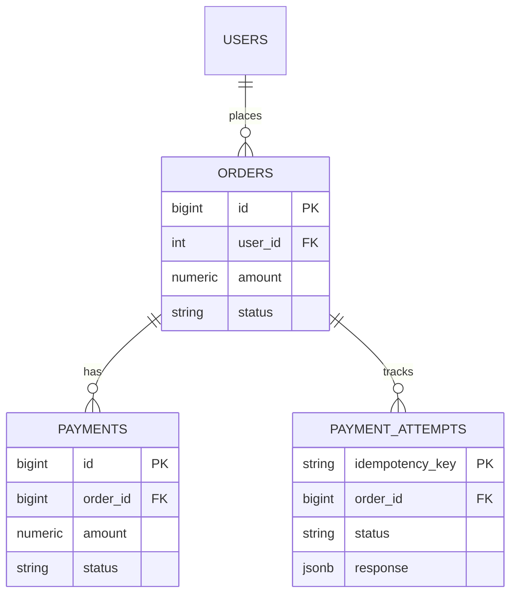
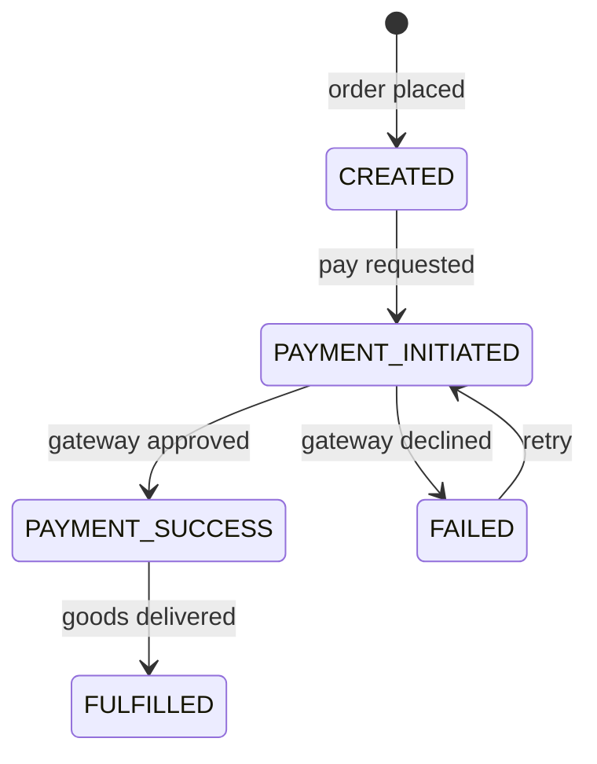
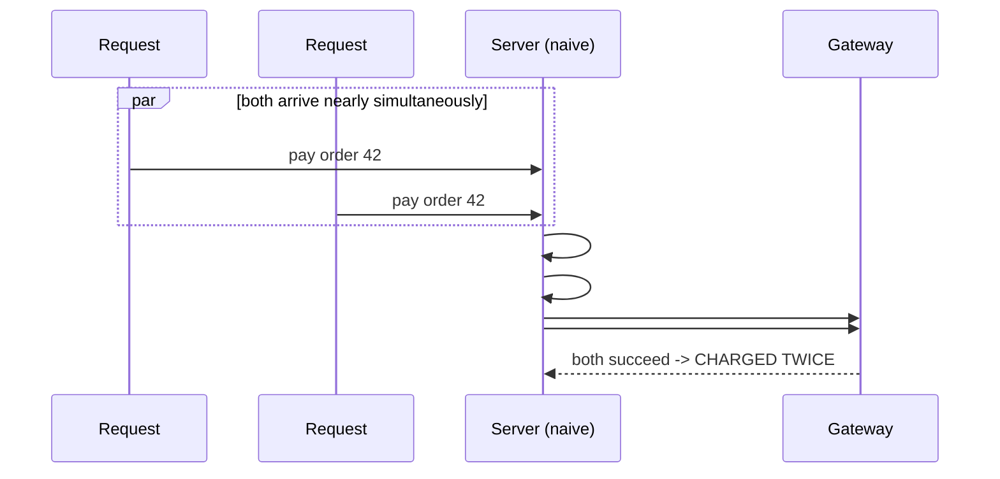

# 01 — Payment Checkout Flow

🏢 **Asked at:** Razorpay, Stripe, PhonePe, Juspay, CRED

> This is the most company-specific question in the course, treated with extreme depth because at a payments company, *correctness beats everything*. The defining concept: **idempotency** — making the same request multiple times produce the same result — because on a payment network, retries are inevitable and a double-charge is a disaster.

---

## 🎬 The Product Story

You're buying something. You tap "Pay ₹2,000." The spinner turns… and your phone's network blips. Did it go through? You tap "Pay" again, nervously. In a naive system, you were just charged ₹4,000.

This exact scenario — a user (or the client code, or the network layer) retrying a payment because they didn't get a clear answer — happens constantly. The job of a payment system is to make that retry *safe*: the second tap must recognize "this is the same payment I already processed" and return the original result instead of charging again. That's idempotency, and building it correctly is what Razorpay and Stripe are testing.

---

## 🔑 The Core Concept: Idempotency

> **Idempotency** means an operation can be applied many times without changing the result beyond the first application. Reading a value is naturally idempotent. *Creating a payment* is naturally **not** — do it twice and you have two payments. We make it idempotent artificially with an **idempotency key**.

**How it works:** the client generates a unique key (a UUID) for *one logical payment attempt* and sends it with the request (header `Idempotency-Key`). The server records that key with the result. If the same key arrives again, the server skips the work and returns the stored result. The key ties all retries of one attempt together. This is exactly how Stripe and Razorpay's real APIs work.

---

## 📋 Requirements (clarified)

**Functional:** a user has a cart; checkout creates an order; paying the order charges once; retrying the payment (same key) does not double-charge; show order/payment status.
**Non-functional:** correctness under concurrency (two simultaneous requests can't both charge); clear order states; atomic DB updates.

**Clarifying questions:** Real gateway or simulated? Who generates the idempotency key (client)? What states must I model? Handle partial failures (charged but order not updated)?

---

## 🧱 Database Schema



```sql
-- File: database/schema.sql
CREATE TABLE orders (
  id         BIGSERIAL PRIMARY KEY,
  user_id    INTEGER NOT NULL REFERENCES users(id),
  amount     NUMERIC(12,2) NOT NULL CHECK (amount > 0),    -- money: NUMERIC, never float
  status     VARCHAR(20) NOT NULL DEFAULT 'CREATED'
             CHECK (status IN ('CREATED','PAYMENT_INITIATED','PAYMENT_SUCCESS','FAILED','FULFILLED')),
  created_at TIMESTAMPTZ NOT NULL DEFAULT now()
);

CREATE TABLE payments (
  id         BIGSERIAL PRIMARY KEY,
  order_id   BIGINT NOT NULL REFERENCES orders(id),
  amount     NUMERIC(12,2) NOT NULL,
  status     VARCHAR(20) NOT NULL CHECK (status IN ('SUCCESS','FAILED')),
  created_at TIMESTAMPTZ NOT NULL DEFAULT now()
);

-- The heart of idempotency: one row per logical payment attempt, keyed by the client's key.
CREATE TABLE payment_attempts (
  idempotency_key VARCHAR(80) PRIMARY KEY,                 -- UNIQUE by definition (PK)
  order_id        BIGINT NOT NULL REFERENCES orders(id),
  status          VARCHAR(20) NOT NULL DEFAULT 'IN_PROGRESS', -- IN_PROGRESS|SUCCESS|FAILED
  response        JSONB,                                   -- stored result to replay on retry
  created_at      TIMESTAMPTZ NOT NULL DEFAULT now()
);
```

> `payment_attempts.idempotency_key` being the **primary key** is the linchpin: the database itself refuses a duplicate. Combined with a transaction, that `UNIQUE` constraint is what makes concurrent double-submits safe.

---

## 🔌 API Design

| Method | Path | Auth | Notes |
|--------|------|------|-------|
| POST | `/api/v1/orders` | ✅ | Create an order from the cart → `CREATED` |
| POST | `/api/v1/orders/:id/pay` | ✅ | **Requires `Idempotency-Key` header.** Charges once. |
| GET | `/api/v1/orders/:id` | ✅ | Order + payment status |

---

## 🏁 Order State Machine



Modeling explicit states (not booleans) prevents impossible situations like "paid but still in cart" and makes the flow auditable.

---

## ⚠️ The Race Condition (why naive code double-charges)



**The fix:** wrap the check-and-charge in a database transaction and rely on the `UNIQUE` idempotency key. The first request inserts the key; the second's insert *fails the unique constraint* (or blocks, then sees the stored result). Only one charge happens.

---

## 🔄 Full Stack Flow Diagram (safe, idempotent pay)

```mermaid
sequenceDiagram
  participant U as User (React)
  participant E as Express
  participant D as Database
  participant G as Gateway
  U->>E: POST /orders/42/pay (Idempotency-Key: abc-123)
  E->>D: BEGIN; INSERT payment_attempts(key=abc-123) ON CONFLICT DO NOTHING
  alt key already exists (a retry)
    D-->>E: conflict -> fetch stored response
    E-->>U: replay original result (no new charge)
  else first time
    E->>D: UPDATE orders SET status='PAYMENT_INITIATED'
    E->>G: charge 2000
    G-->>E: success
    E->>D: INSERT payment; UPDATE order='PAYMENT_SUCCESS'; attempt='SUCCESS'
    E->>D: COMMIT
    E-->>U: 200 {order, payment}
  end
```

**Reading this diagram:** Every pay request first tries to claim the idempotency key inside a transaction. New key → the charge proceeds and the result is stored atomically with the key. Existing key (a retry) → the server skips charging and replays the stored response. The unique key plus the transaction guarantees at-most-once charging, even under concurrent taps.

---

## 💻 Complete Working Code

```javascript
// File: server/controllers/paymentController.js
const { pool } = require("../db");
const { fakeGatewayCharge } = require("../services/gateway");

const PaymentController = {
  // POST /orders/:id/pay  — requires Idempotency-Key header.
  async pay(req, res) {
    const idempotencyKey = req.headers["idempotency-key"];
    if (!idempotencyKey) {
      return res.status(400).json({ success: false, error: "Idempotency-Key header required" });
    }
    const orderId = parseInt(req.params.id);

    const client = await pool.connect();                   // dedicated connection for the transaction
    try {
      await client.query("BEGIN");

      // 1) Try to CLAIM the idempotency key. If it exists, this is a retry.
      const claim = await client.query(
        `INSERT INTO payment_attempts (idempotency_key, order_id)
         VALUES ($1, $2)
         ON CONFLICT (idempotency_key) DO NOTHING
         RETURNING idempotency_key`,
        [idempotencyKey, orderId]
      );

      if (claim.rows.length === 0) {
        // Key already used -> replay the stored result (do NOT charge again).
        await client.query("COMMIT");
        const prior = await client.query(
          "SELECT status, response FROM payment_attempts WHERE idempotency_key = $1",
          [idempotencyKey]
        );
        const row = prior.rows[0];
        if (row.status === "IN_PROGRESS") {
          return res.status(409).json({ success: false, error: "Payment in progress, retry shortly" });
        }
        return res.status(200).json({ success: true, data: row.response, replayed: true });
      }

      // 2) First time for this key. Lock the order row to avoid concurrent state changes.
      const orderRes = await client.query(
        "SELECT id, user_id, amount, status FROM orders WHERE id = $1 FOR UPDATE",
        [orderId]
      );
      const order = orderRes.rows[0];
      if (!order || order.user_id !== req.user.id) {
        await client.query("ROLLBACK");
        return res.status(404).json({ success: false, error: "Order not found" });
      }
      if (order.status === "PAYMENT_SUCCESS" || order.status === "FULFILLED") {
        await client.query("ROLLBACK");
        return res.status(409).json({ success: false, error: "Order already paid" });
      }

      await client.query("UPDATE orders SET status = 'PAYMENT_INITIATED' WHERE id = $1", [orderId]);

      // 3) Call the gateway (the one external, non-transactional step).
      const result = await fakeGatewayCharge(order.amount);

      // 4) Record the outcome ATOMICALLY with the order + attempt status.
      let response;
      if (result.success) {
        const pay = await client.query(
          "INSERT INTO payments (order_id, amount, status) VALUES ($1,$2,'SUCCESS') RETURNING id, amount, status",
          [orderId, order.amount]
        );
        await client.query("UPDATE orders SET status = 'PAYMENT_SUCCESS' WHERE id = $1", [orderId]);
        response = { orderId, payment: pay.rows[0], status: "PAYMENT_SUCCESS" };
        await client.query(
          "UPDATE payment_attempts SET status='SUCCESS', response=$2 WHERE idempotency_key=$1",
          [idempotencyKey, response]
        );
      } else {
        await client.query("UPDATE orders SET status = 'FAILED' WHERE id = $1", [orderId]);
        response = { orderId, status: "FAILED", reason: result.reason };
        await client.query(
          "UPDATE payment_attempts SET status='FAILED', response=$2 WHERE idempotency_key=$1",
          [idempotencyKey, response]
        );
      }

      await client.query("COMMIT");                        // everything commits together or not at all
      return res.status(result.success ? 200 : 402).json({ success: result.success, data: response });
    } catch (err) {
      await client.query("ROLLBACK");                      // any error -> undo the whole transaction
      throw err;
    } finally {
      client.release();                                    // return the connection to the pool
    }
  },
};

module.exports = { PaymentController };
```

```javascript
// File: server/services/gateway.js
// Simulated payment gateway. In reality this calls Razorpay/Stripe APIs.
async function fakeGatewayCharge(amount) {
  await new Promise((r) => setTimeout(r, 300));            // simulate network latency
  if (Math.random() < 0.1) return { success: false, reason: "card_declined" }; // 10% decline
  return { success: true, gatewayRef: `g_${Date.now()}` };
}
module.exports = { fakeGatewayCharge };
```

```javascript
// File: server/controllers/orderController.js
const { query } = require("../db");
const OrderController = {
  async create(req, res) {
    const { amount } = req.body;                           // in a real cart, compute server-side from items
    if (!(Number(amount) > 0)) return res.status(400).json({ success: false, error: "Invalid amount" });
    const { rows } = await query(
      "INSERT INTO orders (user_id, amount) VALUES ($1,$2) RETURNING id, amount, status",
      [req.user.id, amount]
    );
    res.status(201).json({ success: true, data: rows[0] });
  },
  async get(req, res) {
    const { rows } = await query(
      `SELECT o.id, o.amount, o.status, p.status AS payment_status
       FROM orders o LEFT JOIN payments p ON p.order_id = o.id
       WHERE o.id = $1 AND o.user_id = $2`,
      [req.params.id, req.user.id]
    );
    if (!rows[0]) return res.status(404).json({ success: false, error: "Order not found" });
    res.status(200).json({ success: true, data: rows[0] });
  },
};
module.exports = { OrderController };
```

```javascript
// File: server/routes/orders.js
const express = require("express");
const router = express.Router();
const { OrderController } = require("../controllers/orderController");
const { PaymentController } = require("../controllers/paymentController");
const { requireAuth } = require("../middleware/auth");
const { asyncHandler } = require("../middleware/asyncHandler");

router.use(requireAuth);
router.post("/", asyncHandler(OrderController.create));
router.get("/:id", asyncHandler(OrderController.get));
router.post("/:id/pay", asyncHandler(PaymentController.pay));   // idempotent

module.exports = router;
```

### Frontend

```jsx
// File: client/src/components/PaymentForm.jsx
import { useState, useRef } from "react";

// Generate ONE idempotency key per payment attempt and reuse it across retries.
function uuid() {
  return crypto.randomUUID ? crypto.randomUUID()
    : "xxxxxxxx-xxxx-4xxx".replace(/x/g, () => ((Math.random() * 16) | 0).toString(16));
}

export function PaymentForm({ order }) {
  const [status, setStatus] = useState(order.status);
  const [error, setError] = useState("");
  const [paying, setPaying] = useState(false);
  const keyRef = useRef(uuid());                           // stable key for THIS attempt (survives retries)

  async function pay() {
    setPaying(true);
    setError("");
    try {
      const res = await fetch(`/api/v1/orders/${order.id}/pay`, {
        method: "POST",
        headers: {
          "Content-Type": "application/json",
          Authorization: `Bearer ${localStorage.getItem("token")}`,
          "Idempotency-Key": keyRef.current,               // same key on every retry
        },
      });
      const json = await res.json();
      if (json.success) setStatus(json.data.status);
      else setError(json.error || "Payment failed");
    } catch {
      setError("Network error — tap Pay again (it's safe).");  // retry reuses the same key
    } finally {
      setPaying(false);
    }
  }

  if (status === "PAYMENT_SUCCESS") return <p>Paid Rs{order.amount}. Order confirmed.</p>;

  return (
    <div>
      <p>Amount due: Rs{order.amount}</p>
      {error && <p role="alert">{error}</p>}
      <button onClick={pay} disabled={paying}>{paying ? "Processing…" : `Pay Rs${order.amount}`}</button>
    </div>
  );
}
```

### Running
```bash
psql fullstack_course < database/schema.sql
cd server && npm install && npm run dev
cd client && npm install && npm run dev
```

### What You Will See
Create an order (₹2,000), then tap "Pay." It processes and shows "Paid ₹2,000." Now the key test: replay the *same* pay request twice (same `Idempotency-Key`) — the second returns the *original* result with `replayed: true` and **no second payment row** is created. Fire two pay requests concurrently with the same key and only one charge happens; the other gets the replayed result or a `409` "in progress."

---

## ⚠️ What Makes This Problem Tricky (5 Non-Obvious Traps)

🔴 **Trap 1:** Checking "already paid?" then charging in two separate steps (the race).
✅ Claim the unique idempotency key *inside a transaction* before charging.
💡 The check-then-act gap is exactly where double-charges happen.

🔴 **Trap 2:** Generating a new idempotency key on each button click.
✅ Generate one key per attempt and reuse it on retries (`useRef`).
💡 A fresh key per click defeats the entire mechanism.

🔴 **Trap 3:** Charging the gateway *before* recording intent, so a crash loses the record.
✅ Record `PAYMENT_INITIATED` + the attempt first; reconcile after.
💡 Otherwise you can charge a customer with no DB trace.

🔴 **Trap 4:** Booleans (`is_paid`) instead of an explicit state machine.
✅ Model states with a `CHECK` constraint; forbid illegal transitions.
💡 States make impossible combinations unrepresentable and auditable.

🔴 **Trap 5:** Not locking the order row, allowing concurrent state changes.
✅ `SELECT ... FOR UPDATE` to serialize access to that order.
💡 Row locks prevent two transactions both advancing the order.

---

## 🌀 How the Interviewer Can Twist This Question (6 Extensions)

**Twist 1 (Auth/Security): Verify gateway webhooks with HMAC**
🗣️ *"The gateway calls you back — make sure it's really them."*
🛠️ Backend.
💻
```javascript
const expected = crypto.createHmac("sha256", SECRET).update(rawBody).digest("hex");
if (expected !== req.headers["x-signature"]) return res.status(401).end(); // reject forged callbacks
```

**Twist 2 (Real-time): Live order status via WebSocket**
🗣️ *"Update the order screen the moment payment settles."*
🛠️ Backend + Frontend.
💻
```javascript
// on PAYMENT_SUCCESS, io.to(`order:${id}`).emit("status", "PAYMENT_SUCCESS")
```

**Twist 3 (Scale): Idempotency keys in Redis with TTL**
🗣️ *"High volume — don't keep every key in Postgres forever."*
🛠️ Backend.
💻
```javascript
// SET key result NX EX 86400 in Redis; NX gives an atomic claim, EX expires after 24h
```

**Twist 4 (New feature): Refunds (also idempotent)**
🗣️ *"Add refunds without double-refunding."*
🛠️ All three.
💻
```sql
CREATE TABLE refunds (idempotency_key VARCHAR(80) PRIMARY KEY, payment_id BIGINT, amount NUMERIC(12,2), status VARCHAR(20));
-- same claim-key-then-act pattern as pay
```

**Twist 5 (Performance): Async fulfillment via a queue**
🗣️ *"Fulfillment is slow; don't block the pay response."*
🛠️ Backend.
💻
```javascript
// on PAYMENT_SUCCESS, enqueue a fulfillment job; a worker moves order -> FULFILLED (see Job Queue problem)
```

**Twist 6 (Resilience): Reconciliation for stuck payments**
🗣️ *"A charge succeeded at the gateway but our COMMIT failed."*
🛠️ Backend.
💻
```javascript
// periodic job: for attempts stuck IN_PROGRESS, query the gateway by reference and finalize the true state
```

---

## 🧪 Test Cases (8 Cases)

| # | Action | Input | Expected API Response | Expected UI Behavior |
|---|--------|-------|-----------------------|----------------------|
| 1 | Create order | `{amount:2000}` | `201 {status:CREATED}` | Shows amount due |
| 2 | Pay (happy) | key=A | `200 PAYMENT_SUCCESS` | "Paid" |
| 3 | Retry same key | key=A again | `200` `replayed:true` | Same result, no 2nd charge |
| 4 | Missing key | no header | `400` | "Idempotency-Key required" |
| 5 | Concurrent same key | A + A | one charges, other `409`/replay | No double charge |
| 6 | Gateway decline | (10% path) | `402 FAILED` | Error, can retry |
| 7 | Pay others' order | other user | `404` | Not found |
| 8 | Already paid (new key) | key=B after success | `409` "already paid" | Blocked |

---

## ⏱️ Time Budget

| Phase | Time | What to do |
|-------|------|-----------|
| Read & clarify | 6 min | real/sim gateway? who makes the key? states? |
| Schema | 12 min | orders/payments/payment_attempts, states, NUMERIC |
| API design | 6 min | create / pay (idempotent) / get |
| Backend | 30 min | transaction + key claim + FOR UPDATE + gateway + atomic commit |
| Frontend | 18 min | PaymentForm with stable key + safe-retry UX |
| Test | 12 min | retry replay, concurrent, decline, already-paid |
| Buffer | 6 min | missing key, ownership |

---

## 🎤 Famous Interview Questions

**Q1 (Conceptual): What is idempotency and why is it critical in payments?**
🏢 *Asked at: Stripe*
✅ Answer: Idempotency means performing an operation multiple times has the same effect as performing it once. Payments are inherently non-idempotent — naively charging twice creates two charges — but networks are unreliable, so clients retry when they don't get a clear response. We make the charge idempotent with an idempotency key: the client sends a unique key per logical attempt, the server records the key with its result, and any retry carrying that key replays the stored result instead of charging again. This guarantees at-most-once charging despite retries.
💡 Bonus insight: The key must scope one *logical* attempt, not one button click — which is why the client generates it once and reuses it across retries; a new key per click would create distinct charges.

**Q2 (Design Decision): How do you prevent a double charge when two requests arrive simultaneously?**
🏢 *Asked at: Razorpay*
✅ Answer: I rely on a database `UNIQUE` constraint plus a transaction. Both requests try to INSERT the same idempotency key inside a transaction; the database guarantees only one INSERT succeeds, and the other either conflicts (and replays the stored result) or blocks until the first commits and then sees it. I also lock the order row with `SELECT ... FOR UPDATE` so concurrent transactions can't both advance the order state. The charge happens exactly once because the unique key is the gatekeeper.
💡 Bonus insight: The subtle bug is doing the "already paid?" check and the charge as two separate statements — the unique-constraint approach collapses check-and-act into one atomic operation the database enforces, eliminating the race window.

**Q3 (Trade-off): Where do you store idempotency keys — database or Redis?**
🏢 *Asked at: PhonePe*
✅ Answer: Postgres gives strong durability and the unique-constraint guarantee for free, and ties the key to the payment in the same transaction — ideal for correctness. Redis is faster and supports automatic expiry (keys rarely need to outlive 24 hours), with an atomic `SET NX` for the claim. The trade-off is durability vs speed/TTL management. For a payment system I'd lean on the database as the source of truth, optionally fronted by Redis for the hot claim check.
💡 Bonus insight: If you use Redis alone, you must handle the case where it loses the key before the payment is reconciled — so most production designs keep the authoritative record in the durable store.

**Q4 (Extension): A charge succeeded at the gateway but your transaction failed to commit. What now?**
🏢 *Asked at: Juspay*
✅ Answer: This is the classic dual-write problem — the external charge and the local commit aren't a single atomic unit. I record intent (`PAYMENT_INITIATED` + an `IN_PROGRESS` attempt) before calling the gateway, so there's always a trace. Then a reconciliation job periodically finds attempts stuck `IN_PROGRESS`, queries the gateway by the stored reference for the true outcome, and finalizes the local state. The idempotency key ensures the reconciliation doesn't re-charge.
💡 Bonus insight: This is why gateways provide webhooks and a query API — they expect local state to occasionally diverge, and reconciliation (not perfect synchronous atomicity) is the accepted industry pattern.

**Q5 (Security/Edge case): What security and edge cases matter in checkout?**
🏢 *Asked at: Razorpay*
✅ Answer: Verify gateway webhooks with HMAC signatures so an attacker can't forge a "payment succeeded" callback. Enforce that a user can only pay their own orders. Compute the amount server-side from the cart, never trust a client-sent amount. Use NUMERIC for money to avoid rounding errors. Handle the already-paid case so a second key can't re-charge a settled order. And require the idempotency key so retries are always safe.
💡 Bonus insight: Trusting a client-supplied price is the most damaging and most common real-world bug here — the server must derive the charge amount from authoritative data, treating the client purely as a trigger.

---

## 🔗 Navigation
⬅️ Previous: [Module 03 Home](./README.md)
➡️ Next: [02 — Splitwise Expense Manager](./02-splitwise-expense-manager.md)
🏠 [Module Home](./README.md)
