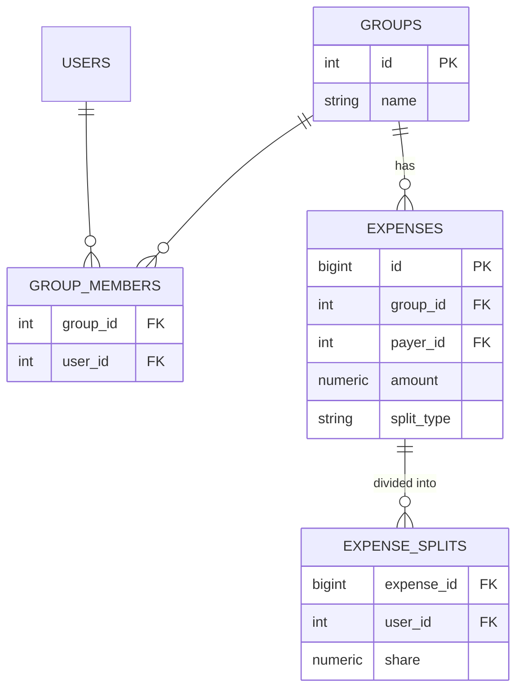

# 02 — Splitwise Expense Manager

🏢 **Asked at:** Swiggy, CRED, Zepto, Groww, Upstox

> Build group expense sharing like Splitwise: friends in a group add expenses, split them (equally, by exact amounts, or by percentage), and see who owes whom. The depth is in two algorithms — the **balance calculation** and the **settlement optimizer** that minimizes the number of payments.

---

## 🎬 The Product Story

A trip with friends. Alice pays ₹300 for dinner, Bob pays ₹200 for the taxi, Charlie pays ₹150 for dessert. Everyone shares equally. Nobody wants to do the math, so Splitwise does it: it computes each person's net balance and then tells you the *fewest* payments to settle up — "Bob pays Alice ₹16.67, Charlie pays Alice ₹66.67" — instead of everyone paying everyone.

This question is loved by fintech-adjacent companies because it's pure correctness + algorithms on top of a clean relational schema. A wrong balance is obvious and embarrassing; an unoptimized settlement (everyone pays everyone) signals you missed the interesting part.

---

## 📋 Requirements (clarified)

**Functional:** create groups, add members, add an expense with a payer and a split (EQUAL / EXACT / PERCENTAGE), view per-member balances, view the minimal settlement plan.
**Non-functional:** money exact (NUMERIC); splits must sum to the total; per-group isolation.

**Clarifying questions:** Which split types? One payer per expense or multiple? Record settlements once paid? Single currency?

---

## 🧱 Database Schema



```sql
-- File: database/schema.sql
CREATE TABLE groups (
  id SERIAL PRIMARY KEY,
  name VARCHAR(100) NOT NULL,
  created_by INTEGER NOT NULL REFERENCES users(id)
);
CREATE TABLE group_members (
  group_id INTEGER NOT NULL REFERENCES groups(id) ON DELETE CASCADE,
  user_id  INTEGER NOT NULL REFERENCES users(id) ON DELETE CASCADE,
  PRIMARY KEY (group_id, user_id)
);
CREATE TABLE expenses (
  id          BIGSERIAL PRIMARY KEY,
  group_id    INTEGER NOT NULL REFERENCES groups(id) ON DELETE CASCADE,
  payer_id    INTEGER NOT NULL REFERENCES users(id),       -- who paid the bill
  amount      NUMERIC(12,2) NOT NULL CHECK (amount > 0),
  description VARCHAR(255),
  split_type  VARCHAR(12) NOT NULL CHECK (split_type IN ('EQUAL','EXACT','PERCENTAGE')),
  created_at  TIMESTAMPTZ NOT NULL DEFAULT now()
);
-- One row per participant in an expense: how much of it they owe.
CREATE TABLE expense_splits (
  expense_id BIGINT NOT NULL REFERENCES expenses(id) ON DELETE CASCADE,
  user_id    INTEGER NOT NULL REFERENCES users(id),
  share      NUMERIC(12,2) NOT NULL,
  PRIMARY KEY (expense_id, user_id)
);
CREATE TABLE settlements (
  id BIGSERIAL PRIMARY KEY,
  group_id INTEGER NOT NULL REFERENCES groups(id),
  from_user INTEGER NOT NULL REFERENCES users(id),
  to_user   INTEGER NOT NULL REFERENCES users(id),
  amount    NUMERIC(12,2) NOT NULL,
  created_at TIMESTAMPTZ NOT NULL DEFAULT now()
);
```

---

## 🧮 The Balance Calculation (worked example)

**Net balance** = (total a person paid) − (total they owe across all splits). Positive means others owe them; negative means they owe.

Worked example — Alice pays ₹300 dinner, Bob pays ₹200 taxi, Charlie pays ₹150 dessert, each split **equally 3 ways**:

| Expense | Total | Paid by | Each owes (÷3) |
|---------|-------|---------|----------------|
| Dinner | 300 | Alice | 100 each |
| Taxi | 200 | Bob | 66.67 each |
| Dessert | 150 | Charlie | 50 each |
| **Total owed per person** | | | **216.67** |

| Person | Paid | Owes | **Net** |
|--------|------|------|---------|
| Alice | 300 | 216.67 | **+83.33** (is owed) |
| Bob | 200 | 216.67 | **−16.67** (owes) |
| Charlie | 150 | 216.67 | **−66.67** (owes) |

Check: nets sum to ~0 (83.33 − 16.67 − 66.67 ≈ 0). ✅ Always verify balances sum to zero.

---

## 🧮 The Settlement Optimizer (greedy)

Naively, everyone who owes pays everyone who's owed — up to N² payments. The optimizer minimizes transactions: repeatedly match the biggest debtor with the biggest creditor.

```javascript
// File: server/services/settle.js
// Given net balances {userId: net}, return the minimal list of {from, to, amount}.
function minimizeSettlements(netByUser) {
  const creditors = [];                                    // [ [userId, cents] ] owed money
  const debtors = [];                                      // [ [userId, cents] ] owe money
  for (const [user, net] of Object.entries(netByUser)) {
    const cents = Math.round(net * 100);                   // work in integer cents for exactness
    if (cents > 0) creditors.push([user, cents]);
    else if (cents < 0) debtors.push([user, -cents]);      // store debt as positive
  }
  creditors.sort((a, b) => b[1] - a[1]);                   // largest first -> fewer, bigger transfers
  debtors.sort((a, b) => b[1] - a[1]);

  const transfers = [];
  let i = 0, j = 0;
  while (i < debtors.length && j < creditors.length) {
    const pay = Math.min(debtors[i][1], creditors[j][1]);  // settle as much as possible at once
    transfers.push({ from: debtors[i][0], to: creditors[j][0], amount: pay / 100 });
    debtors[i][1] -= pay;
    creditors[j][1] -= pay;
    if (debtors[i][1] === 0) i++;                           // debtor cleared -> next debtor
    if (creditors[j][1] === 0) j++;                         // creditor satisfied -> next creditor
  }
  return transfers;
}
module.exports = { minimizeSettlements };
```

> For the example: Bob owes 16.67, Charlie owes 66.67, Alice is owed 83.33. Greedy matching yields just **two** transfers (Charlie→Alice 66.67, Bob→Alice 16.67) instead of a tangle.

---

## 🔌 API Design

| Method | Path | Auth | Purpose |
|--------|------|------|---------|
| POST | `/api/v1/groups` | ✅ | Create group |
| POST | `/api/v1/groups/:id/members` | ✅ | Add member |
| POST | `/api/v1/groups/:id/expenses` | ✅ | Add expense (with split) |
| GET | `/api/v1/groups/:id/balances` | ✅ | Net balance per member |
| GET | `/api/v1/groups/:id/settlements` | ✅ | Minimal settle-up plan |

---

## 🔄 Flow Diagram (add expense → balances)

```mermaid
sequenceDiagram
  participant U as User
  participant E as Express
  participant D as Database
  U->>E: POST /groups/9/expenses {amount:300, payer:Alice, type:EQUAL, members:[A,B,C]}
  E->>E: validate splits (EQUAL -> 100 each; sums to 300)
  E->>D: INSERT expense; INSERT 3 expense_splits (in a transaction)
  D-->>E: ok
  E-->>U: 201 {expense}
  U->>E: GET /groups/9/balances
  E->>D: SUM paid per user; SUM share per user
  E->>E: net = paid - owed
  E-->>U: {Alice:+83.33, Bob:-16.67, Charlie:-66.67}
```

**Reading this diagram:** Adding an expense validates that the chosen split sums to the total, then writes the expense and one split row per participant atomically. Balances are derived on demand by summing what each user paid minus what each owes across all splits — the database does the aggregation, and the result always sums to zero.

---

## 💻 Complete Working Code

```javascript
// File: server/services/computeSplits.js
// Turn a split_type + inputs into concrete per-user shares that sum EXACTLY to amount.
function computeSplits(amount, splitType, participants /* [{userId, value?}] */) {
  const cents = Math.round(amount * 100);
  const n = participants.length;
  let shares;

  if (splitType === "EQUAL") {
    const base = Math.floor(cents / n);
    shares = participants.map((p) => ({ userId: p.userId, cents: base }));
    let remainder = cents - base * n;                       // distribute leftover paisa
    for (let k = 0; remainder > 0; k++, remainder--) shares[k % n].cents += 1;
  } else if (splitType === "EXACT") {
    shares = participants.map((p) => ({ userId: p.userId, cents: Math.round(p.value * 100) }));
    const sum = shares.reduce((s, x) => s + x.cents, 0);
    if (sum !== cents) throw Object.assign(new Error("Exact splits must sum to total"), { statusCode: 400 });
  } else if (splitType === "PERCENTAGE") {
    const pctSum = participants.reduce((s, p) => s + p.value, 0);
    if (Math.round(pctSum) !== 100) throw Object.assign(new Error("Percentages must sum to 100"), { statusCode: 400 });
    shares = participants.map((p) => ({ userId: p.userId, cents: Math.round((cents * p.value) / 100) }));
    const drift = cents - shares.reduce((s, x) => s + x.cents, 0); // fix 1-paisa rounding drift
    shares[shares.length - 1].cents += drift;
  } else {
    throw Object.assign(new Error("Unknown split type"), { statusCode: 400 });
  }
  return shares.map((s) => ({ userId: s.userId, share: s.cents / 100 }));
}
module.exports = { computeSplits };
```

```javascript
// File: server/controllers/expenseController.js
const { pool, query } = require("../db");
const { computeSplits } = require("../services/computeSplits");
const { minimizeSettlements } = require("../services/settle");

// Shared helper: compute net balance per user for a group.
async function netForGroup(groupId) {
  const paid = (await query("SELECT payer_id AS user_id, SUM(amount) AS total FROM expenses WHERE group_id=$1 GROUP BY payer_id", [groupId])).rows;
  const owed = (await query("SELECT es.user_id, SUM(es.share) AS total FROM expense_splits es JOIN expenses e ON e.id=es.expense_id WHERE e.group_id=$1 GROUP BY es.user_id", [groupId])).rows;
  const net = {};
  for (const p of paid) net[p.user_id] = (net[p.user_id] || 0) + Number(p.total);
  for (const o of owed) net[o.user_id] = (net[o.user_id] || 0) - Number(o.total);
  Object.keys(net).forEach((k) => (net[k] = Math.round(net[k] * 100) / 100));
  return net;
}

const ExpenseController = {
  async addExpense(req, res) {
    const { amount, payerId, splitType, participants, description } = req.body;
    const groupId = parseInt(req.params.id);
    const shares = computeSplits(amount, splitType, participants);  // may throw 400

    const client = await pool.connect();
    try {
      await client.query("BEGIN");
      const exp = (await client.query(
        "INSERT INTO expenses (group_id, payer_id, amount, description, split_type) VALUES ($1,$2,$3,$4,$5) RETURNING id",
        [groupId, payerId, amount, description || null, splitType]
      )).rows[0];
      for (const s of shares) {
        await client.query("INSERT INTO expense_splits (expense_id, user_id, share) VALUES ($1,$2,$3)", [exp.id, s.userId, s.share]);
      }
      await client.query("COMMIT");
      res.status(201).json({ success: true, data: { id: exp.id, shares } });
    } catch (err) {
      await client.query("ROLLBACK");
      throw err;
    } finally {
      client.release();
    }
  },

  async balances(req, res) {
    res.status(200).json({ success: true, data: await netForGroup(parseInt(req.params.id)) });
  },

  async settlements(req, res) {
    const net = await netForGroup(parseInt(req.params.id));
    res.status(200).json({ success: true, data: minimizeSettlements(net) });
  },
};
module.exports = { ExpenseController };
```

```jsx
// File: client/src/components/AddExpenseModal.jsx
import { useState } from "react";
import { apiFetch } from "../api/client";

export function AddExpenseModal({ groupId, members, onAdded }) {
  const [amount, setAmount] = useState("");
  const [payerId, setPayerId] = useState(members[0]?.id);
  const [splitType, setSplitType] = useState("EQUAL");
  const [values, setValues] = useState({});               // for EXACT/PERCENTAGE
  const [error, setError] = useState("");

  async function submit(e) {
    e.preventDefault();
    setError("");
    const participants = members.map((m) => ({
      userId: m.id,
      ...(splitType !== "EQUAL" ? { value: Number(values[m.id] || 0) } : {}),
    }));
    try {
      await apiFetch(`/groups/${groupId}/expenses`, {
        method: "POST",
        body: JSON.stringify({ amount: Number(amount), payerId, splitType, participants }),
      });
      onAdded();
    } catch (err) {
      setError(err.message);                              // e.g. "Percentages must sum to 100"
    }
  }

  return (
    <form onSubmit={submit}>
      {error && <p role="alert">{error}</p>}
      <input type="number" step="0.01" placeholder="Amount" value={amount} onChange={(e) => setAmount(e.target.value)} />
      <select value={payerId} onChange={(e) => setPayerId(Number(e.target.value))}>
        {members.map((m) => <option key={m.id} value={m.id}>{m.name}</option>)}
      </select>
      <select value={splitType} onChange={(e) => setSplitType(e.target.value)}>
        <option value="EQUAL">Equal</option><option value="EXACT">Exact</option><option value="PERCENTAGE">Percentage</option>
      </select>
      {splitType !== "EQUAL" && members.map((m) => (
        <input key={m.id} type="number" placeholder={`${m.name} ${splitType === "PERCENTAGE" ? "%" : "Rs"}`}
               onChange={(e) => setValues((v) => ({ ...v, [m.id]: e.target.value }))} />
      ))}
      <button>Add expense</button>
    </form>
  );
}
```

### Running
```bash
psql fullstack_course < database/schema.sql
cd server && npm install && npm run dev
cd client && npm install && npm run dev
```

### What You Will See
Create a group, add three members, and add the three example expenses with EQUAL split. Open balances: Alice +₹83.33, Bob −₹16.67, Charlie −₹66.67 (sums to zero). Open settlements: exactly two transfers — Charlie pays Alice ₹66.67 and Bob pays Alice ₹16.67. Try an EXACT split that doesn't sum to the total and you get "Exact splits must sum to total" with nothing saved.

---

## ⚠️ What Makes This Problem Tricky (5 Non-Obvious Traps)

🔴 **Trap 1:** Equal splits that don't sum to the total due to rounding (₹100/3).
✅ Distribute the remainder paisa across shares; work in cents.
💡 ₹100 split 3 ways must total exactly ₹100, not ₹99.99.

🔴 **Trap 2:** Not validating EXACT/PERCENTAGE splits sum correctly.
✅ Reject if exact shares ≠ total or percentages ≠ 100.
💡 Garbage splits corrupt every downstream balance.

🔴 **Trap 3:** Settlement that makes everyone pay everyone (N² transfers).
✅ Greedy match biggest debtor ↔ biggest creditor.
💡 Minimizing transactions is the actual point of the question.

🔴 **Trap 4:** Floats for money, so balances don't sum to zero.
✅ NUMERIC in DB; integer cents in the algorithms.
💡 A non-zero total is an instant correctness red flag.

🔴 **Trap 5:** Writing expense + splits non-atomically.
✅ One transaction for the expense and all its split rows.
💡 A half-written expense leaves balances permanently wrong.

---

## 🌀 How the Interviewer Can Twist This Question (6 Extensions)

**Twist 1 (Auth/Security): Only group members can add/view**
🗣️ *"Outsiders can't touch a group's expenses."*
🛠️ Backend.
💻
```javascript
// middleware: SELECT 1 FROM group_members WHERE group_id=$1 AND user_id=$me -> else 403
```

**Twist 2 (Real-time): Live balance updates**
🗣️ *"When someone adds an expense, others see balances update live."*
🛠️ Backend + Frontend.
💻
```javascript
// emit "balances:changed" to the group room after each expense; clients refetch
```

**Twist 3 (Scale): Precomputed running balances**
🗣️ *"Recomputing from all expenses is slow for big groups."*
🛠️ DB.
💻
```sql
CREATE TABLE balances (group_id INT, user_id INT, net NUMERIC(12,2), PRIMARY KEY(group_id,user_id));
-- update incrementally inside the add-expense transaction
```

**Twist 4 (New feature): Record settlements (mark as paid)**
🗣️ *"Let Bob mark that he paid Alice."*
🛠️ All three.
💻
```sql
-- INSERT INTO settlements(...); treat a settlement as a transfer when computing net
```

**Twist 5 (Performance): Multi-payer expenses**
🗣️ *"Two people split paying one bill."*
🛠️ All three.
💻
```sql
CREATE TABLE expense_payers (expense_id BIGINT, user_id INT, paid NUMERIC(12,2), PRIMARY KEY(expense_id,user_id));
-- net paid now sums expense_payers instead of a single payer_id
```

**Twist 6 (Resilience): Currency + stable historical rates**
🗣️ *"Trip across countries with mixed currencies."*
🛠️ All three.
💻
```sql
ALTER TABLE expenses ADD COLUMN currency CHAR(3), ADD COLUMN amount_base NUMERIC(12,2);
-- store base-currency amount at expense time so old balances don't shift when rates change
```

---

## 🧪 Test Cases (8 Cases)

| # | Action | Input | Expected | UI |
|---|--------|-------|----------|----|
| 1 | Equal split | ₹300 / 3 | 100 each | Saved |
| 2 | Equal rounding | ₹100 / 3 | 33.34/33.33/33.33 | Sums to 100 |
| 3 | Exact valid | sums to total | saved | OK |
| 4 | Exact invalid | sums ≠ total | `400` | Error shown |
| 5 | Percentage ≠ 100 | 50/30/10 | `400` | Error |
| 6 | Balances | example | A+83.33,B-16.67,C-66.67 | Sums to 0 |
| 7 | Settlements | example | 2 transfers | Minimal plan |
| 8 | Non-member add | outsider | `403` | Blocked |

---

## ⏱️ Time Budget

| Phase | Time | What to do |
|-------|------|-----------|
| Read & clarify | 5 min | split types? record settlements? single payer? |
| Schema | 12 min | groups/members/expenses/splits/settlements |
| Algorithms | 12 min | computeSplits (3 types, rounding), minimizeSettlements |
| Backend | 22 min | add-expense txn, balances, settlements endpoints |
| Frontend | 18 min | AddExpenseModal, BalanceSheet |
| Test | 11 min | rounding, validation, balance sum-to-zero, settlement count |

---

## 🎤 Famous Interview Questions

**Q1 (Conceptual): How do you compute who owes whom in a group?**
🏢 *Asked at: CRED*
✅ Answer: For each member I compute a net balance = total they paid across expenses minus total they owe across all split shares. Positive net means the group owes them; negative means they owe the group. Crucially the nets always sum to zero, which is my correctness check. Settling up is then matching the negatives to the positives. I derive these sums with `GROUP BY` aggregations in the database rather than in application code, keeping it exact and fast.
💡 Bonus insight: Tracking only net balances (not every pairwise debt) is what lets the settlement be optimized — pairwise tracking explodes combinatorially and locks you into more transactions than necessary.

**Q2 (Design Decision): How does the settlement optimizer minimize transactions?**
🏢 *Asked at: Swiggy*
✅ Answer: I separate members into creditors (net positive) and debtors (net negative), then greedily match the largest debtor against the largest creditor, transferring the smaller of the two amounts, and repeat. Each transfer fully settles at least one party, so with k people who have nonzero balances you need at most k−1 transfers — far fewer than the naive everyone-pays-everyone approach. Working in integer cents keeps the matches exact.
💡 Bonus insight: The greedy approach isn't guaranteed to be the theoretical minimum (that's an NP-hard subset-sum-like problem), but it's near-optimal and what real apps use — worth saying if pressed.

**Q3 (Trade-off): Recompute balances on the fly vs store them?**
🏢 *Asked at: Groww*
✅ Answer: Recomputing from expenses on each request is always correct and simple — single source of truth — but it's O(expenses) per read, which gets slow for large, active groups. Storing a running net per member makes reads O(members), but now I must update those balances inside the same transaction as every expense and settlement, risking drift if there's a bug. For an interview I recompute; at scale I'd maintain stored balances with the expenses as the reconcilable source of truth.
💡 Bonus insight: A common hybrid keeps stored balances for speed but runs a periodic job that recomputes from expenses to detect and correct drift.

**Q4 (Extension): How would you support multiple payers and currencies?**
🏢 *Asked at: Upstox*
✅ Answer: For multiple payers I replace the single `payer_id` with an `expense_payers` table recording how much each person paid, so "paid" becomes a sum over that table. For currencies I store both the original currency/amount and a converted base-currency amount computed at expense time using the rate then, so historical balances don't shift when exchange rates change. Balances and settlements then operate consistently in the base currency.
💡 Bonus insight: Freezing the conversion at creation time is the key correctness decision — converting live on every read would make past settled balances mysteriously change.

**Q5 (Security/Edge case): What edge cases and security concerns matter?**
🏢 *Asked at: CRED*
✅ Answer: Validate that splits sum exactly to the total (with paisa-level rounding handled), restrict all group operations to members (403 otherwise), and write the expense plus its splits atomically so a failure never leaves a half-recorded expense skewing balances. Use NUMERIC/integer-cents for exactness so balances reconcile to zero. Handle a member leaving a group with outstanding balances, and prevent self-transfers in settlements.
💡 Bonus insight: The "leaving with a balance" case is the nasty one — you can't just delete the membership because their debts still exist, so you either block departure until settled or retain them as an inactive participant for accounting.

---

## 🔗 Navigation
⬅️ Previous: [01 — Payment Checkout Flow](./01-payment-checkout-flow.md)
➡️ Next: [03 — Food Ordering System](./03-food-ordering-system.md)
🏠 [Module Home](./README.md)
