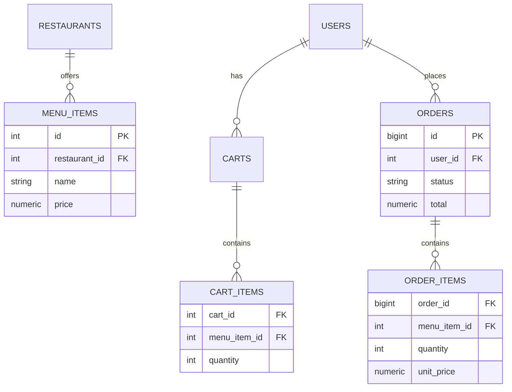
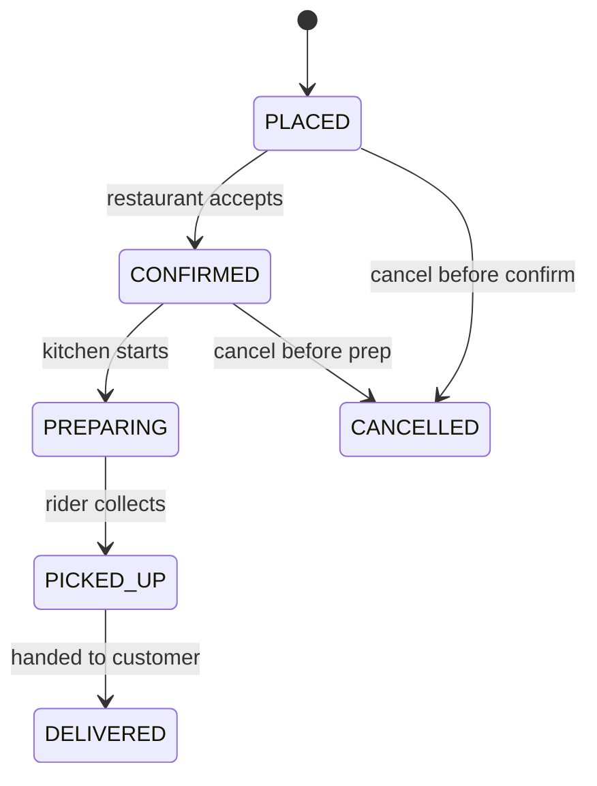
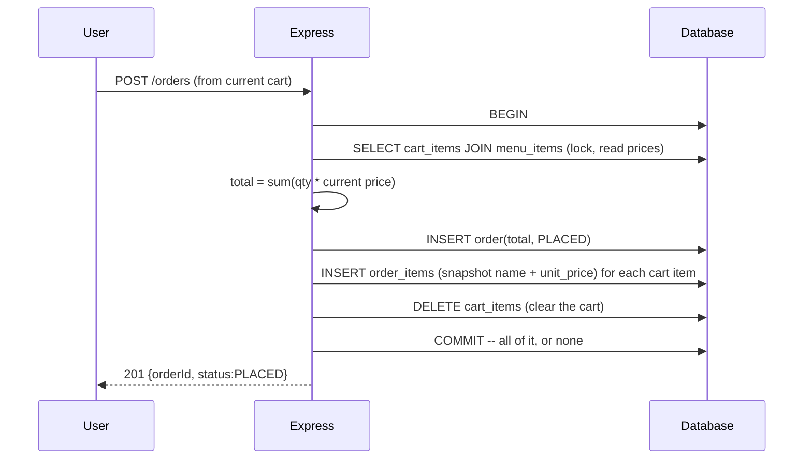

# 03 — Food Ordering System

🏢 **Asked at:** Swiggy, Zomato, Zepto, DoorDash

> Build the Swiggy/Zomato core: browse a restaurant menu, build a cart, place an order, and track its status through a delivery lifecycle. The signature lessons are the **order state machine** and the **atomic cart-to-order conversion** (all cart items become order items, or none do).

---

## 🎬 The Product Story

You open Swiggy, pick a restaurant, add a biryani and a coke to your cart, hit "Place Order," and pay. Then the magic part: a live timeline — "Order Confirmed → Preparing → Out for Delivery → Delivered" — updates as your food moves. Behind it, the moment you place the order, your cart is *frozen* into an immutable order (prices locked in, so a menu price change later doesn't alter your bill), and the kitchen/delivery flow advances through well-defined states.

Food companies ask this to test state-machine modeling and transactional correctness: a half-converted cart (some items ordered, some lost) or an order that can jump from "Placed" straight to "Delivered" are exactly the bugs they're probing for.

---

## 📋 Requirements (clarified)

**Functional:** browse restaurants + menus; add/remove cart items; place order (cart → order atomically); track order status; (server) advance order status.
**Non-functional:** prices snapshotted at order time; valid state transitions only; per-user cart isolation.

**Clarifying questions:** Single restaurant per cart? Real payment or assume paid? Who advances status (simulate a kitchen)? Polling or push for tracking?

---

## 🧱 Database Schema



```sql
-- File: database/schema.sql
CREATE TABLE restaurants (id SERIAL PRIMARY KEY, name VARCHAR(120) NOT NULL);
CREATE TABLE menu_items (
  id SERIAL PRIMARY KEY,
  restaurant_id INTEGER NOT NULL REFERENCES restaurants(id) ON DELETE CASCADE,
  name VARCHAR(120) NOT NULL,
  price NUMERIC(10,2) NOT NULL CHECK (price >= 0),
  available BOOLEAN NOT NULL DEFAULT true
);
CREATE INDEX idx_menu_restaurant ON menu_items(restaurant_id);

CREATE TABLE carts (
  id SERIAL PRIMARY KEY,
  user_id INTEGER NOT NULL REFERENCES users(id) ON DELETE CASCADE,
  restaurant_id INTEGER REFERENCES restaurants(id),       -- cart is tied to one restaurant
  UNIQUE (user_id)                                        -- one active cart per user
);
CREATE TABLE cart_items (
  cart_id INTEGER NOT NULL REFERENCES carts(id) ON DELETE CASCADE,
  menu_item_id INTEGER NOT NULL REFERENCES menu_items(id),
  quantity INTEGER NOT NULL CHECK (quantity > 0),
  PRIMARY KEY (cart_id, menu_item_id)
);

CREATE TABLE orders (
  id BIGSERIAL PRIMARY KEY,
  user_id INTEGER NOT NULL REFERENCES users(id),
  restaurant_id INTEGER NOT NULL REFERENCES restaurants(id),
  status VARCHAR(20) NOT NULL DEFAULT 'PLACED'
         CHECK (status IN ('PLACED','CONFIRMED','PREPARING','PICKED_UP','DELIVERED','CANCELLED')),
  total NUMERIC(12,2) NOT NULL,
  created_at TIMESTAMPTZ NOT NULL DEFAULT now()
);
-- Order items snapshot the price AT ORDER TIME (unit_price), independent of future menu changes.
CREATE TABLE order_items (
  order_id BIGINT NOT NULL REFERENCES orders(id) ON DELETE CASCADE,
  menu_item_id INTEGER NOT NULL REFERENCES menu_items(id),
  name VARCHAR(120) NOT NULL,
  quantity INTEGER NOT NULL,
  unit_price NUMERIC(10,2) NOT NULL,
  PRIMARY KEY (order_id, menu_item_id)
);
```

> **Why snapshot `unit_price` and `name` onto `order_items`?** An order is a historical record. If the restaurant raises the biryani price tomorrow, your *past* order must still show what you actually paid. Referencing the live `menu_items.price` would silently rewrite history.

---

## 🏁 Order State Machine



The server enforces legal transitions — you can't go `PLACED → DELIVERED` or cancel after pickup.

---

## 🔌 API Design

| Method | Path | Auth | Purpose |
|--------|------|------|---------|
| GET | `/api/v1/restaurants/:id/menu` | – | Menu items |
| POST | `/api/v1/cart/items` | ✅ | Add/update a cart item |
| GET | `/api/v1/cart` | ✅ | View cart |
| POST | `/api/v1/orders` | ✅ | Place order (cart → order, atomic) |
| GET | `/api/v1/orders/:id` | ✅ | Track order (status + items) |
| PATCH | `/api/v1/orders/:id/status` | ✅ (staff) | Advance status (validated) |

---

## 🔄 Full Stack Flow Diagram (place order — atomic conversion)



**Reading this diagram:** Placing an order runs as one transaction: read the cart with current prices, create the order, copy each cart line into `order_items` with a price snapshot, then clear the cart — and commit it all together. If anything fails midway, the rollback leaves the cart intact and no partial order exists.

---

## 💻 Complete Working Code

```javascript
// File: server/controllers/orderController.js
const { pool, query } = require("../db");

// Allowed transitions for the state machine.
const NEXT = {
  PLACED: ["CONFIRMED", "CANCELLED"],
  CONFIRMED: ["PREPARING", "CANCELLED"],
  PREPARING: ["PICKED_UP"],
  PICKED_UP: ["DELIVERED"],
  DELIVERED: [],
  CANCELLED: [],
};

const OrderController = {
  // Atomic cart -> order conversion.
  async placeOrder(req, res) {
    const client = await pool.connect();
    try {
      await client.query("BEGIN");

      // Read the cart with current menu prices (lock cart rows for this transaction).
      const items = (await client.query(
        `SELECT ci.menu_item_id, ci.quantity, mi.name, mi.price, mi.available, c.restaurant_id, c.id AS cart_id
         FROM carts c JOIN cart_items ci ON ci.cart_id = c.id
         JOIN menu_items mi ON mi.id = ci.menu_item_id
         WHERE c.user_id = $1 FOR UPDATE`,
        [req.user.id]
      )).rows;

      if (items.length === 0) {
        await client.query("ROLLBACK");
        return res.status(400).json({ success: false, error: "Cart is empty" });
      }
      if (items.some((i) => !i.available)) {
        await client.query("ROLLBACK");
        return res.status(409).json({ success: false, error: "Some items are no longer available" });
      }

      const total = items.reduce((s, i) => s + Number(i.price) * i.quantity, 0);
      const order = (await client.query(
        "INSERT INTO orders (user_id, restaurant_id, total) VALUES ($1,$2,$3) RETURNING id, status, total",
        [req.user.id, items[0].restaurant_id, total]
      )).rows[0];

      // Snapshot each line into order_items.
      for (const i of items) {
        await client.query(
          "INSERT INTO order_items (order_id, menu_item_id, name, quantity, unit_price) VALUES ($1,$2,$3,$4,$5)",
          [order.id, i.menu_item_id, i.name, i.quantity, i.price]
        );
      }
      // Clear the cart.
      await client.query("DELETE FROM cart_items WHERE cart_id = $1", [items[0].cart_id]);

      await client.query("COMMIT");
      res.status(201).json({ success: true, data: { orderId: order.id, status: order.status, total } });
    } catch (err) {
      await client.query("ROLLBACK");
      throw err;
    } finally {
      client.release();
    }
  },

  async track(req, res) {
    const order = (await query(
      "SELECT id, status, total, created_at FROM orders WHERE id=$1 AND user_id=$2",
      [req.params.id, req.user.id]
    )).rows[0];
    if (!order) return res.status(404).json({ success: false, error: "Order not found" });
    order.items = (await query("SELECT name, quantity, unit_price FROM order_items WHERE order_id=$1", [order.id])).rows;
    res.status(200).json({ success: true, data: order });
  },

  // Advance status with transition validation.
  async updateStatus(req, res) {
    const { status } = req.body;
    const current = (await query("SELECT status FROM orders WHERE id=$1", [req.params.id])).rows[0];
    if (!current) return res.status(404).json({ success: false, error: "Order not found" });
    if (!NEXT[current.status].includes(status)) {
      return res.status(409).json({ success: false, error: `Cannot go ${current.status} -> ${status}` });
    }
    const updated = (await query("UPDATE orders SET status=$1 WHERE id=$2 RETURNING id, status", [status, req.params.id])).rows[0];
    res.status(200).json({ success: true, data: updated });
  },
};
module.exports = { OrderController };
```

```javascript
// File: server/controllers/cartController.js
const { query } = require("../db");
const CartController = {
  async addItem(req, res) {
    const { menuItemId, quantity, restaurantId } = req.body;
    if (!(quantity > 0)) return res.status(400).json({ success: false, error: "quantity must be > 0" });
    // Ensure a cart exists for the user, tied to the restaurant.
    const cart = (await query(
      `INSERT INTO carts (user_id, restaurant_id) VALUES ($1,$2)
       ON CONFLICT (user_id) DO UPDATE SET restaurant_id = EXCLUDED.restaurant_id RETURNING id`,
      [req.user.id, restaurantId]
    )).rows[0];
    // Upsert the line item.
    await query(
      `INSERT INTO cart_items (cart_id, menu_item_id, quantity) VALUES ($1,$2,$3)
       ON CONFLICT (cart_id, menu_item_id) DO UPDATE SET quantity = EXCLUDED.quantity`,
      [cart.id, menuItemId, quantity]
    );
    res.status(200).json({ success: true, message: "Cart updated" });
  },
  async view(req, res) {
    const rows = (await query(
      `SELECT ci.menu_item_id, mi.name, mi.price, ci.quantity
       FROM carts c JOIN cart_items ci ON ci.cart_id=c.id JOIN menu_items mi ON mi.id=ci.menu_item_id
       WHERE c.user_id=$1`,
      [req.user.id]
    )).rows;
    const total = rows.reduce((s, r) => s + Number(r.price) * r.quantity, 0);
    res.status(200).json({ success: true, data: { items: rows, total } });
  },
};
module.exports = { CartController };
```

```jsx
// File: client/src/components/OrderTracking.jsx
import { useEffect, useState } from "react";
import { apiFetch } from "../api/client";

const STEPS = ["PLACED", "CONFIRMED", "PREPARING", "PICKED_UP", "DELIVERED"];

export function OrderTracking({ orderId }) {
  const [order, setOrder] = useState(null);

  // Poll status every 10s (simple, robust for a tracking UI).
  useEffect(() => {
    let active = true;
    const load = () => apiFetch(`/orders/${orderId}`).then((o) => active && setOrder(o));
    load();
    const id = setInterval(load, 10000);
    return () => { active = false; clearInterval(id); };
  }, [orderId]);

  if (!order) return <p>Loading order…</p>;
  const currentIdx = STEPS.indexOf(order.status);

  return (
    <div>
      <h2>Order #{order.id} — Rs{order.total}</h2>
      <ol>
        {STEPS.map((s, i) => (
          <li key={s} style={{ fontWeight: i <= currentIdx ? "bold" : "normal", color: i <= currentIdx ? "green" : "#999" }}>
            {i < currentIdx ? "✓ " : i === currentIdx ? "→ " : ""}{s}
          </li>
        ))}
      </ol>
      {order.status === "CANCELLED" && <p style={{ color: "red" }}>Order cancelled</p>}
    </div>
  );
}
```

### Running
```bash
psql fullstack_course < database/schema.sql
cd server && npm install && npm run dev
cd client && npm install && npm run dev
```

### What You Will See
Browse a menu, add two items to the cart, and see a running total. Place the order — the cart empties and a tracking screen appears showing "PLACED" highlighted. As staff advances the status (CONFIRMED → PREPARING → …), the timeline fills in green every 10 seconds. Raise a menu price after ordering and refresh the order — it still shows the *original* price you paid. Try to advance an order from PLACED straight to DELIVERED and the API returns `409`.

---

## ⚠️ What Makes This Problem Tricky (5 Non-Obvious Traps)

🔴 **Trap 1:** Referencing live menu prices on orders, so historical bills change.
✅ Snapshot `unit_price`/`name` into `order_items`.
💡 Orders are immutable history; live references rewrite the past.

🔴 **Trap 2:** Non-atomic cart→order (order created but cart not cleared, or vice versa).
✅ One transaction: create order, copy items, clear cart, commit.
💡 Partial conversion double-orders or loses items.

🔴 **Trap 3:** Allowing any status jump (PLACED → DELIVERED).
✅ A transition map enforced server-side.
💡 Illegal transitions corrupt the lifecycle and analytics.

🔴 **Trap 4:** Ordering unavailable/out-of-stock items.
✅ Check `available` inside the transaction before placing.
💡 Prevents accepting orders the kitchen can't fulfill.

🔴 **Trap 5:** Mixing two restaurants in one cart.
✅ Tie the cart to one `restaurant_id`; reset on restaurant switch.
💡 A single order can't span kitchens.

---

## 🌀 How the Interviewer Can Twist This Question (6 Extensions)

**Twist 1 (Auth/Security): Role-gate status updates**
🗣️ *"Only restaurant staff/riders can change status."*
🛠️ Backend.
💻
```javascript
const requireRole = (r) => (req,res,next)=> req.user.role===r ? next() : res.status(403).json({success:false,error:"Forbidden"});
```

**Twist 2 (Real-time): Push status via WebSocket**
🗣️ *"Don't poll — push status changes live."*
🛠️ Backend + Frontend.
💻
```javascript
// on updateStatus, io.to(`order:${id}`).emit("status", newStatus); client subscribes instead of polling
```

**Twist 3 (Scale): Inventory decrement with stock**
🗣️ *"Track stock; reject when sold out."*
🛠️ All three.
💻
```sql
ALTER TABLE menu_items ADD COLUMN stock INT;
-- in the order txn: UPDATE menu_items SET stock=stock-$qty WHERE id=$id AND stock>=$qty (0 rows = sold out -> rollback)
```

**Twist 4 (New feature): Promo codes / discounts**
🗣️ *"Apply a coupon at checkout."*
🛠️ All three.
💻
```sql
CREATE TABLE promos (code VARCHAR(20) PRIMARY KEY, pct INT, max_off NUMERIC, expires_at TIMESTAMPTZ);
-- validate + apply in the place-order transaction; store discount on the order
```

**Twist 5 (Performance): Index hot menu reads**
🗣️ *"Menus are read constantly."*
🛠️ DB + caching.
💻
```sql
CREATE INDEX idx_menu_restaurant_avail ON menu_items(restaurant_id) WHERE available;
-- plus cache the menu JSON per restaurant with a short TTL
```

**Twist 6 (Resilience): Idempotent order placement**
🗣️ *"A double-tapped Place Order shouldn't create two orders."*
🛠️ Backend.
💻
```sql
ALTER TABLE orders ADD COLUMN client_order_id UUID;
CREATE UNIQUE INDEX ux_orders_client ON orders(user_id, client_order_id); -- retry = same order
```

---

## 🧪 Test Cases (8 Cases)

| # | Action | Input | Expected | UI |
|---|--------|-------|----------|----|
| 1 | Add to cart | item, qty 2 | `200` | Cart total updates |
| 2 | Place order | non-empty cart | `201 PLACED` | Cart clears, tracking shows |
| 3 | Place empty cart | empty | `400` | "Cart is empty" |
| 4 | Price snapshot | raise price after | order shows old price | Historical total stable |
| 5 | Track order | own id | `200 {status,items}` | Timeline renders |
| 6 | Valid transition | PLACED→CONFIRMED | `200` | Step advances |
| 7 | Invalid transition | PLACED→DELIVERED | `409` | Rejected |
| 8 | Unavailable item | sold out | `409` | "no longer available" |

---

## ⏱️ Time Budget

| Phase | Time | What to do |
|-------|------|-----------|
| Read & clarify | 5 min | one restaurant/cart? who advances status? push/poll? |
| Schema | 12 min | restaurants/menu/cart/orders/order_items + states |
| API design | 5 min | menu/cart/place/track/status |
| Backend | 28 min | atomic placeOrder txn, transition map, cart upsert |
| Frontend | 20 min | cart UI + OrderTracking timeline (poll) |
| Test | 10 min | atomicity, price snapshot, transitions |

---

## 🎤 Famous Interview Questions

**Q1 (Conceptual): Why snapshot prices onto order_items instead of joining to the live menu?**
🏢 *Asked at: Swiggy*
✅ Answer: An order is a financial and historical record of what the customer actually agreed to pay. If I joined to `menu_items` for price at display time, a later menu price change would retroactively alter past orders, breaking receipts, refunds, and accounting. So at order placement I copy the name and unit price into `order_items`, freezing them. The live menu can change freely without ever touching historical orders.
💡 Bonus insight: This is denormalization done deliberately — duplicating the price is correct here precisely because the order and the menu are different concepts (a past agreement vs a current offering).

**Q2 (Design Decision): Why convert cart to order inside a single transaction?**
🏢 *Asked at: Zomato*
✅ Answer: Placing an order is several writes — create the order, insert each item with its snapshot, and clear the cart. If these aren't atomic, a failure midway leaves an inconsistent state: an order with missing items, or a charged order whose cart still shows the items (inviting a double order). Wrapping them in a transaction means they all succeed or all roll back, so the system is never half-converted.
💡 Bonus insight: Reading the cart `FOR UPDATE` inside the same transaction also prevents a concurrent "add to cart" from racing with placement, so the order reflects a consistent snapshot of the cart.

**Q3 (Trade-off): Polling vs WebSocket for order tracking?**
🏢 *Asked at: DoorDash*
✅ Answer: Status changes are infrequent (every few minutes) and a ~10-second delay is perfectly acceptable for a delivery timeline, so polling every 10s is simple, robust, and survives flaky mobile networks with trivial reconnect logic. WebSockets give instant updates but add connection management and server state for a benefit users barely perceive here. So I'd poll for tracking and reserve WebSockets for genuinely real-time needs like live rider location on a map.
💡 Bonus insight: A nice middle ground is adaptive polling — poll frequently right after placing the order when changes are likely, then back off as the order sits in a stable state.

**Q4 (Extension): How do you handle inventory so you don't oversell?**
🏢 *Asked at: Zepto*
✅ Answer: I'd add a stock column and decrement it inside the order transaction with a conditional update — `UPDATE menu_items SET stock = stock - qty WHERE id = $1 AND stock >= qty`. If that affects zero rows, the item is sold out and I roll back the whole order. Doing the check-and-decrement as one atomic conditional update prevents two concurrent orders from both seeing stock and overselling, which a separate read-then-write would allow.
💡 Bonus insight: For high-demand flash items you'd often reserve stock at add-to-cart with a short expiry, so two users don't both reach checkout for the last unit — trading some complexity for a better experience.

**Q5 (Security/Edge case): What edge cases and security concerns matter?**
🏢 *Asked at: Swiggy*
✅ Answer: Enforce valid state transitions server-side (reject illegal jumps with 409) and gate status changes to staff/rider roles. Make order placement idempotent with a client order id so a double-tap doesn't create two orders. Validate availability and quantities inside the transaction. Restrict tracking to the order's owner. And compute totals server-side from menu prices, never trusting a client-sent total.
💡 Bonus insight: The idempotency angle is the easy-to-miss one — checkout buttons get double-tapped constantly on mobile, so without a client order id deduplicating the request, you'll see duplicate orders in production.

---

## 🔗 Navigation
⬅️ Previous: [02 — Splitwise Expense Manager](./02-splitwise-expense-manager.md)
➡️ Next: [04 — Kanban Board](./04-kanban-board.md)
🏠 [Module Home](./README.md)
