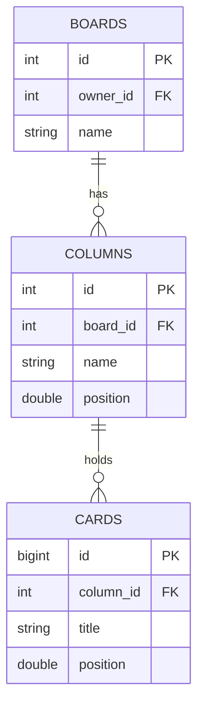
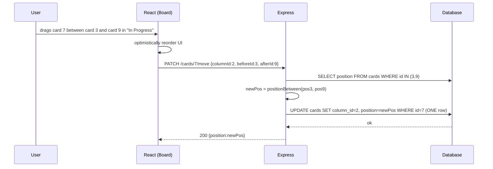

# 04 — Kanban Board

🏢 **Asked at:** Atlassian (Jira), Notion, Linear, Trello, Asana

> Build a Trello/Jira-style board: columns (To Do / In Progress / Done) with draggable cards. The signature lesson is **card ordering** — how do you persist a card's position so you can insert it anywhere without renumbering everything? The elegant answer is **fractional indexing**.

---

## 🎬 The Product Story

In Jira or Trello you drag a card from "To Do" to "In Progress," dropping it between two existing cards. It snaps into place, and when you reload, it's exactly where you left it. The hard part isn't the drag animation — it's that the *position* must be saved durably and you must be able to drop a card *between* any two others, repeatedly, without rewriting the position of every card on the board each time.

Atlassian and Linear ask this because the naive "position = integer index" approach forces you to renumber half the column on every move — O(n) writes per drag. The clever approach, fractional indexing, makes a move a single O(1) update.

---

## 🔑 The Core Concept: Fractional Indexing

> **Fractional indexing** gives each card a position that's a number (or sortable string) *between* its neighbors. To insert a card between positions `1.0` and `2.0`, you give it `1.5`. To insert between `1.0` and `1.5`, you give it `1.25`. Because there's always a value between any two numbers, you can insert infinitely without touching other cards — each move is a single update of one card's position.

Compare to integer positions `0,1,2,3`: inserting at index 1 means shifting `1→2, 2→3, 3→4` — O(n) writes. Fractional indexing makes it O(1): just compute the midpoint.

```javascript
// File: server/utils/fracIndex.js
// Compute a position strictly between `before` and `after`.
// If an edge is missing, step outward by 1.
function positionBetween(before, after) {
  if (before == null && after == null) return 1;           // first card in an empty column
  if (before == null) return after - 1;                    // insert at the top
  if (after == null) return before + 1;                    // insert at the bottom
  return (before + after) / 2;                             // midpoint between two cards
}
module.exports = { positionBetween };
```

> Floats eventually run out of precision after many inserts in the same gap; production systems use string-based fractional indexing (e.g. base-62 keys like `"a0"`, `"a0V"`). For an interview, numeric midpoints are fine — *mention* the precision caveat and the string solution.

---

## 📋 Requirements (clarified)

**Functional:** a board has columns; columns have cards; create cards; drag a card within/between columns and persist the new position; reload preserves order.
**Non-functional:** a move is a single cheap update; per-board access control; positions stable across reloads.

**Clarifying questions:** Multiple boards per user? Real-time multi-user, or single-user? Just title cards, or assignees/labels? How precise must ordering be?

---

## 🧱 Database Schema



```sql
-- File: database/schema.sql
CREATE TABLE boards (
  id SERIAL PRIMARY KEY,
  owner_id INTEGER NOT NULL REFERENCES users(id) ON DELETE CASCADE,
  name VARCHAR(120) NOT NULL
);
CREATE TABLE columns (
  id SERIAL PRIMARY KEY,
  board_id INTEGER NOT NULL REFERENCES boards(id) ON DELETE CASCADE,
  name VARCHAR(80) NOT NULL,
  position DOUBLE PRECISION NOT NULL
);
CREATE INDEX idx_columns_board ON columns(board_id);
CREATE TABLE cards (
  id BIGSERIAL PRIMARY KEY,
  column_id INTEGER NOT NULL REFERENCES columns(id) ON DELETE CASCADE,
  title VARCHAR(255) NOT NULL,
  description TEXT,
  position DOUBLE PRECISION NOT NULL,                      -- fractional index within the column
  created_at TIMESTAMPTZ NOT NULL DEFAULT now()
);
-- Reading a column's cards in order is the hot query.
CREATE INDEX idx_cards_column_pos ON cards(column_id, position);
```

---

## 🔌 API Design

| Method | Path | Auth | Purpose |
|--------|------|------|---------|
| GET | `/api/v1/boards/:id` | ✅ | Board with columns + ordered cards |
| POST | `/api/v1/columns/:id/cards` | ✅ | Create a card |
| PATCH | `/api/v1/cards/:id/move` | ✅ | Move card: `{columnId, beforeId?, afterId?}` |

The move endpoint takes the card's new neighbors and computes the position server-side.

---

## 🔄 Full Stack Flow Diagram (move a card)



**Reading this diagram:** A drag sends only the card's new neighbors. The server looks up the two neighbor positions, computes a midpoint, and updates exactly one row — the moved card. No other card is touched, which is the whole payoff of fractional indexing. The UI updates optimistically and reconciles with the server's confirmed position.

---

## 💻 Complete Working Code

```javascript
// File: server/controllers/cardController.js
const { query } = require("../db");
const { positionBetween } = require("../utils/fracIndex");

const CardController = {
  async create(req, res) {
    const columnId = parseInt(req.params.id);
    const { title } = req.body;
    if (!title?.trim()) return res.status(400).json({ success: false, error: "Title required" });
    // New cards go to the bottom: position = (max in column) + 1.
    const maxPos = (await query("SELECT COALESCE(MAX(position),0) AS m FROM cards WHERE column_id=$1", [columnId])).rows[0].m;
    const card = (await query(
      "INSERT INTO cards (column_id, title, position) VALUES ($1,$2,$3) RETURNING id, title, position, column_id",
      [columnId, title.trim(), maxPos + 1]
    )).rows[0];
    res.status(201).json({ success: true, data: card });
  },

  async move(req, res) {
    const cardId = parseInt(req.params.id);
    const { columnId, beforeId, afterId } = req.body;       // neighbors in the TARGET position

    // Look up neighbor positions (null if dropping at an edge).
    const before = beforeId ? (await query("SELECT position FROM cards WHERE id=$1", [beforeId])).rows[0]?.position : null;
    const after = afterId ? (await query("SELECT position FROM cards WHERE id=$1", [afterId])).rows[0]?.position : null;

    const newPos = positionBetween(before, after);
    const updated = (await query(
      "UPDATE cards SET column_id=$1, position=$2 WHERE id=$3 RETURNING id, column_id, position",
      [columnId, newPos, cardId]
    )).rows[0];
    if (!updated) return res.status(404).json({ success: false, error: "Card not found" });
    res.status(200).json({ success: true, data: updated });
  },
};
module.exports = { CardController };
```

```javascript
// File: server/controllers/boardController.js
const { query } = require("../db");
const BoardController = {
  async get(req, res) {
    const board = (await query("SELECT id, name FROM boards WHERE id=$1 AND owner_id=$2", [req.params.id, req.user.id])).rows[0];
    if (!board) return res.status(404).json({ success: false, error: "Board not found" });
    const columns = (await query("SELECT id, name, position FROM columns WHERE board_id=$1 ORDER BY position", [board.id])).rows;
    for (const col of columns) {
      // Cards returned already sorted by their fractional position.
      col.cards = (await query("SELECT id, title, position FROM cards WHERE column_id=$1 ORDER BY position", [col.id])).rows;
    }
    res.status(200).json({ success: true, data: { ...board, columns } });
  },
};
module.exports = { BoardController };
```

```jsx
// File: client/src/components/Board.jsx
import { useEffect, useState } from "react";
import { apiFetch } from "../api/client";

export function Board({ boardId }) {
  const [board, setBoard] = useState(null);
  const [dragCard, setDragCard] = useState(null);          // {id, columnId}

  useEffect(() => { apiFetch(`/boards/${boardId}`).then(setBoard); }, [boardId]);

  // Drop the dragged card into targetColumn at index targetIdx.
  async function onDrop(targetColumnId, targetIdx) {
    if (!dragCard) return;
    const col = board.columns.find((c) => c.id === targetColumnId);
    const before = col.cards[targetIdx - 1];               // neighbor above the drop slot
    const after = col.cards[targetIdx];                    // neighbor below the drop slot

    // Optimistic UI: move the card locally first.
    setBoard((prev) => moveLocally(prev, dragCard, targetColumnId, targetIdx));

    try {
      await apiFetch(`/cards/${dragCard.id}/move`, {
        method: "PATCH",
        body: JSON.stringify({ columnId: targetColumnId, beforeId: before?.id, afterId: after?.id }),
      });
    } catch {
      apiFetch(`/boards/${boardId}`).then(setBoard);        // reconcile on failure
    }
    setDragCard(null);
  }

  if (!board) return <p>Loading board…</p>;
  return (
    <div style={{ display: "flex", gap: 16 }}>
      {board.columns.map((col) => (
        <div key={col.id} onDragOver={(e) => e.preventDefault()} onDrop={() => onDrop(col.id, col.cards.length)}
             style={{ background: "#f4f5f7", padding: 8, width: 250 }}>
          <h3>{col.name}</h3>
          {col.cards.map((card, idx) => (
            <div key={card.id} draggable
                 onDragStart={() => setDragCard({ id: card.id, columnId: col.id })}
                 onDrop={(e) => { e.stopPropagation(); onDrop(col.id, idx); }}
                 style={{ background: "white", padding: 8, marginBottom: 6, borderRadius: 4 }}>
              {card.title}
            </div>
          ))}
        </div>
      ))}
    </div>
  );
}

// Pure helper: produce a new board state with the card moved (for optimistic UI).
function moveLocally(board, dragCard, targetColumnId, targetIdx) {
  const columns = board.columns.map((c) => ({ ...c, cards: [...c.cards] }));
  let moved;
  for (const c of columns) {
    const i = c.cards.findIndex((x) => x.id === dragCard.id);
    if (i >= 0) { moved = c.cards.splice(i, 1)[0]; break; }
  }
  const target = columns.find((c) => c.id === targetColumnId);
  target.cards.splice(targetIdx, 0, moved);
  return { ...board, columns };
}
```

### Running
```bash
psql fullstack_course < database/schema.sql
cd server && npm install && npm run dev
cd client && npm install && npm run dev
```

### What You Will See
A three-column board. Drag a card from "To Do" and drop it between two cards in "In Progress" — it snaps into the exact slot and stays there on reload. Watch the network tab: each move fires a single `PATCH .../move` that updates exactly one row (the moved card's `position`), never the whole column. Drop a card at the top or bottom edge and it lands correctly. Reorder the same gap many times and the positions keep subdividing (1.5, 1.25, 1.125…).

---

## ⚠️ What Makes This Problem Tricky (5 Non-Obvious Traps)

🔴 **Trap 1:** Integer positions requiring renumbering on every insert (O(n) writes).
✅ Fractional indexing — one O(1) update per move.
💡 This is the core insight the question exists to surface.

🔴 **Trap 2:** Sending the whole reordered column to the server.
✅ Send only the moved card + its neighbors; compute position server-side.
💡 Minimizes payload and writes; one row changes.

🔴 **Trap 3:** Float precision exhaustion after many same-gap inserts.
✅ Acknowledge it; use string fractional keys (or periodic rebalancing) in production.
💡 Shows depth beyond the happy path.

🔴 **Trap 4:** No optimistic UI, so dragging feels laggy.
✅ Reorder locally first, reconcile with the server.
💡 Drag-drop must feel instant; this is heavily scored at Linear/Atlassian.

🔴 **Trap 5:** Not handling edge drops (top/bottom with a missing neighbor).
✅ `positionBetween` handles null before/after by stepping ±1.
💡 Edge cases are where drag bugs cluster.

---

## 🌀 How the Interviewer Can Twist This Question (6 Extensions)

**Twist 1 (Auth/Security): Board sharing with roles**
🗣️ *"Invite collaborators; viewers can't move cards."*
🛠️ All three.
💻
```sql
CREATE TABLE board_members (board_id INT, user_id INT, role VARCHAR(10), PRIMARY KEY(board_id,user_id));
-- move requires role IN ('editor','owner')
```

**Twist 2 (Real-time): Multiplayer board (live moves)**
🗣️ *"Two people moving cards should see each other live."*
🛠️ Backend + Frontend.
💻
```javascript
// on move, io.to(`board:${id}`).emit("card:moved", {cardId, columnId, position}); clients apply
```

**Twist 3 (Scale): String fractional keys**
🗣️ *"Floats run out of precision."*
🛠️ Backend.
💻
```javascript
// store position as a sortable base-62 string; generateKeyBetween("a0","a1") -> "a0V"
```

**Twist 4 (New feature): Labels & assignees**
🗣️ *"Tag cards and assign people."*
🛠️ All three.
💻
```sql
CREATE TABLE card_assignments (card_id BIGINT, user_id INT, PRIMARY KEY(card_id,user_id));
CREATE TABLE labels (id SERIAL PRIMARY KEY, board_id INT, name VARCHAR(40), color VARCHAR(7));
```

**Twist 5 (Performance): Periodic rebalancing job**
🗣️ *"Positions get pathologically close."*
🛠️ Backend.
💻
```javascript
// nightly: re-spread a column's positions to 1,2,3,... when gaps shrink below a threshold
```

**Twist 6 (Resilience): Conflict resolution on concurrent moves**
🗣️ *"Two users drop onto the same slot at once."*
🛠️ Backend.
💻
```text
// last-write-wins via fractional position is naturally tolerant; on collision, nudge with a tie-broken key
```

---

## 🧪 Test Cases (8 Cases)

| # | Action | Input | Expected | UI |
|---|--------|-------|----------|----|
| 1 | Load board | board id | `200 {columns, cards}` | Cards in order |
| 2 | Create card | title | `201` bottom pos | Appears at bottom |
| 3 | Move between two | before+after | midpoint pos, 1 row | Snaps between |
| 4 | Move to top | afterId only | pos < first | Lands at top |
| 5 | Move to bottom | beforeId only | pos > last | Lands at bottom |
| 6 | Move across columns | new columnId | column_id+pos updated | Card in new column |
| 7 | Persist | reload | same order | Order preserved |
| 8 | Move others' board card | not owner | `404` | Blocked |

---

## ⏱️ Time Budget

| Phase | Time | What to do |
|-------|------|-----------|
| Read & clarify | 5 min | multi-user? labels? precision needs? |
| Concept + schema | 12 min | fractional indexing, boards/columns/cards + index |
| API design | 5 min | board GET, card create, card move |
| Backend | 24 min | positionBetween, move (1-row update), board fetch |
| Frontend | 24 min | drag-drop, optimistic move, reconcile |
| Test | 10 min | between/edge/cross-column moves, persistence |

---

## 🎤 Famous Interview Questions

**Q1 (Conceptual): What is fractional indexing and why use it for card ordering?**
🏢 *Asked at: Atlassian*
✅ Answer: Fractional indexing stores each card's position as a value that lies *between* its neighbors rather than as a contiguous integer index. To insert between positions 1 and 2 you use 1.5; between 1 and 1.5 you use 1.25. Because there's always a value between any two, inserting or moving a card only updates that one card's position — an O(1) write — whereas integer indexes force you to renumber every card after the insertion point, an O(n) write per move. For a draggable board where moves are frequent, that difference is decisive.
💡 Bonus insight: The catch is finite numeric precision — repeatedly halving the same gap eventually exhausts a float — so production systems use string-based sortable keys (base-62) that can always generate a value between two others, or periodically rebalance.

**Q2 (Design Decision): Why compute the new position on the server from neighbors, instead of the client sending a position?**
🏢 *Asked at: Linear*
✅ Answer: The server owns the source of truth for ordering, so it should derive the position from the card's intended neighbors, which the client knows from the drop location. The client sends `beforeId`/`afterId`; the server looks up their positions and computes the midpoint. This keeps the algorithm (and any future switch to string keys or rebalancing) in one place, avoids trusting a client-computed float, and makes concurrent moves easier to reason about.
💡 Bonus insight: Sending neighbors rather than an absolute position also makes the operation naturally idempotent-ish and robust to small client/server state differences — the server resolves the actual gap at apply time.

**Q3 (Trade-off): Optimistic UI for drag-and-drop — what's the risk and reward?**
🏢 *Asked at: Notion*
✅ Answer: The reward is that dragging feels instant — the card moves under the cursor immediately instead of waiting for a server round-trip, which is essential for a board UI. The risk is divergence if the server rejects the move (permissions, a concurrent change), so I reconcile: on failure I refetch the board to snap back to the true state. The trade-off is a small chance of a visible correction in exchange for a dramatically snappier feel the rest of the time.
💡 Bonus insight: For multiplayer boards you reconcile against server-pushed events too, so an optimistic local move is confirmed or adjusted when the authoritative `card:moved` event arrives.

**Q4 (Extension): How would you make the board real-time for multiple collaborators?**
🏢 *Asked at: Atlassian*
✅ Answer: I'd put each board in a WebSocket room. When one user moves a card, the server persists it and broadcasts a `card:moved` event with the card id, new column, and new position to everyone else in the room, who apply it to their local state. Fractional positions make applying remote moves easy because each move is independent and order is determined purely by position, so clients converge without needing to replay a sequence. I'd authenticate the socket and check board membership on join.
💡 Bonus insight: Fractional indexing is friendly to concurrency because two simultaneous inserts into different gaps don't conflict at all, and even same-gap collisions just need a tie-breaker rather than a full reorder.

**Q5 (Security/Edge case): What edge cases and security concerns exist?**
🏢 *Asked at: Linear*
✅ Answer: Enforce board access control — only owners/editors can move cards (viewers get 403, non-members 404). Handle edge drops where a neighbor is missing (top/bottom of a column). Guard against float precision collapse with string keys or rebalancing. Make moves resilient to concurrent edits via last-write-wins on position with a tie-breaker. And validate that the target column belongs to the same board the user can access, so a card can't be smuggled into someone else's board.
💡 Bonus insight: The cross-board check is the sneaky authorization bug — a `move` that only validates the card's current board but not the *target* column's board could let a user relocate a card into a board they shouldn't touch.

---

## 🔗 Navigation
⬅️ Previous: [03 — Food Ordering System](./03-food-ordering-system.md)
➡️ Next: [05 — API Key Management System](./05-api-key-management-system.md)
🏠 [Module Home](./README.md)
