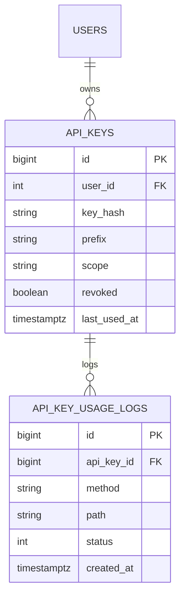

# 05 — API Key Management System

🏢 **Asked at:** Postman, Stripe, Razorpay, BrowserStack, Twilio

> Build the "API Keys" page you see in every developer platform: generate a key (shown once), use it to authenticate API requests, scope it (read-only vs read-write), and view usage logs. The signature lessons: **cryptographically secure key generation** and **storing only a hash** (never the plaintext key).

---

## 🎬 The Product Story

You sign up for Stripe or Postman, go to "API Keys," and click "Create." A long secret like `sk_live_a8Kd...` appears with a stern warning: *"Copy it now — you won't be able to see it again."* You paste it into your code, and every request your app makes carries that key so the platform knows it's you. The platform also logs each call so you can see usage and revoke a leaked key.

Two things make this a real security question: the key must be **unguessable** (generated with a cryptographic RNG, not `Math.random()`), and the server must store only a **hash** of it — so even if the database leaks, the actual keys can't be recovered. This is exactly how Stripe and GitHub handle tokens.

---

## 📋 Requirements (clarified)

**Functional:** create an API key (returned in plaintext once); list keys (showing only a prefix + metadata, never the secret); revoke a key; authenticate requests via the key; record usage.
**Non-functional:** keys generated with a CSPRNG; stored hashed; scopes enforced; per-user isolation.

**Clarifying questions:** Scopes/permissions needed? Key expiry? Usage logging detail? Rate limits per key?

---

## 🔑 Two Core Security Decisions

### 1. Generate with `crypto.randomBytes`, never `Math.random()`
> `Math.random()` is a **pseudo-random** generator optimized for speed, not security — its output is predictable and was never designed to resist an attacker guessing future or past values. Secrets must come from a **CSPRNG** (cryptographically secure pseudo-random number generator). In Node that's `crypto.randomBytes`, which draws from the OS entropy pool.

### 2. Store the hash, show the key once
> Like passwords, you never store the raw key. You store a hash (SHA-256 is fine here — unlike passwords, API keys are already high-entropy random, so the slow-hashing/salt concerns of bcrypt don't apply the same way). On each request you hash the presented key and look it up. The plaintext is shown to the user exactly once at creation.

```javascript
// File: server/utils/apiKey.js
const crypto = require("crypto");

// Generate a high-entropy key. Prefix helps humans identify it; the secret part is random.
function generateApiKey() {
  const secret = crypto.randomBytes(24).toString("base64url"); // CSPRNG, URL-safe
  const plaintext = `sk_${secret}`;                            // what the user copies (shown once)
  const hash = crypto.createHash("sha256").update(plaintext).digest("hex"); // what we store
  const prefix = plaintext.slice(0, 10);                       // e.g. "sk_a8Kd..." for display
  return { plaintext, hash, prefix };
}

// Hash an incoming key the same way to look it up.
function hashApiKey(plaintext) {
  return crypto.createHash("sha256").update(plaintext).digest("hex");
}
module.exports = { generateApiKey, hashApiKey };
```

---

## 🧱 Database Schema



```sql
-- File: database/schema.sql
CREATE TABLE api_keys (
  id          BIGSERIAL PRIMARY KEY,
  user_id     INTEGER NOT NULL REFERENCES users(id) ON DELETE CASCADE,
  key_hash    VARCHAR(64) NOT NULL,                        -- SHA-256 hex; NEVER the plaintext
  prefix      VARCHAR(12) NOT NULL,                        -- shown in the UI to identify the key
  name        VARCHAR(80),
  scope       VARCHAR(10) NOT NULL DEFAULT 'read'          -- 'read' | 'write'
              CHECK (scope IN ('read','write')),
  revoked     BOOLEAN NOT NULL DEFAULT false,
  last_used_at TIMESTAMPTZ,
  created_at  TIMESTAMPTZ NOT NULL DEFAULT now()
);
-- Auth looks up by hash on every API request → unique index.
CREATE UNIQUE INDEX idx_api_keys_hash ON api_keys(key_hash);

CREATE TABLE api_key_usage_logs (
  id         BIGSERIAL PRIMARY KEY,
  api_key_id BIGINT NOT NULL REFERENCES api_keys(id) ON DELETE CASCADE,
  method     VARCHAR(8) NOT NULL,
  path       TEXT NOT NULL,
  status     INTEGER NOT NULL,
  created_at TIMESTAMPTZ NOT NULL DEFAULT now()
);
CREATE INDEX idx_usage_key_time ON api_key_usage_logs(api_key_id, created_at DESC);
```

---

## 🔌 API Design

| Method | Path | Auth | Purpose |
|--------|------|------|---------|
| POST | `/api/v1/keys` | ✅ (session) | Create a key → returns plaintext **once** |
| GET | `/api/v1/keys` | ✅ | List keys (prefix + metadata only) |
| DELETE | `/api/v1/keys/:id` | ✅ | Revoke a key |
| GET | `/api/v1/keys/:id/usage` | ✅ | Usage logs |
| GET | `/api/v1/data` (example) | API key | A protected resource, authenticated by the key |

---

## 🔄 Full Stack Flow Diagram (use a key)

```mermaid
sequenceDiagram
  participant C as Client app
  participant M as API-Key Middleware
  participant D as Database
  C->>M: GET /api/v1/data (Authorization: Bearer sk_a8Kd...)
  M->>M: hash = sha256(presented key)
  M->>D: SELECT * FROM api_keys WHERE key_hash = $1
  alt no row / revoked
    M-->>C: 401 Unauthorized
  else valid
    M->>M: check scope allows this method (GET needs 'read')
    M->>D: UPDATE last_used_at; INSERT usage log
    M-->>C: 200 data
  end
```

**Reading this diagram:** A request carries the key; the middleware hashes it and looks up the matching row (the plaintext is never stored, so comparison is hash-to-hash). If found and not revoked, it checks the scope permits the operation, records usage, and proceeds — otherwise `401`/`403`. The unique hash index makes the lookup a single fast operation.

---

## 💻 Complete Working Code

```javascript
// File: server/middleware/apiKeyAuth.js
const { query } = require("../db");
const { hashApiKey } = require("../utils/apiKey");

// Authenticate a request using an API key (instead of a user session/JWT).
function apiKeyAuth({ requiredScope } = {}) {
  return async (req, res, next) => {
    const header = req.headers.authorization || "";
    const presented = header.startsWith("Bearer ") ? header.slice(7) : null;
    if (!presented) return res.status(401).json({ success: false, error: "API key required" });

    const row = (await query(
      "SELECT id, user_id, scope, revoked FROM api_keys WHERE key_hash = $1",
      [hashApiKey(presented)]                              // hash the incoming key, compare hashes
    )).rows[0];

    if (!row || row.revoked) {
      return res.status(401).json({ success: false, error: "Invalid or revoked API key" });
    }
    // Scope check: a 'read' key can't perform 'write' operations.
    if (requiredScope === "write" && row.scope !== "write") {
      return res.status(403).json({ success: false, error: "This key lacks write scope" });
    }

    req.apiKey = row;
    req.user = { id: row.user_id };                        // act on behalf of the key's owner

    // Record usage (fire-and-forget so it doesn't slow the response).
    query("UPDATE api_keys SET last_used_at = now() WHERE id = $1", [row.id]).catch(() => {});
    res.on("finish", () => {
      query("INSERT INTO api_key_usage_logs (api_key_id, method, path, status) VALUES ($1,$2,$3,$4)",
        [row.id, req.method, req.originalUrl, res.statusCode]).catch(() => {});
    });

    next();
  };
}
module.exports = { apiKeyAuth };
```

```javascript
// File: server/controllers/apiKeyController.js
const { query } = require("../db");
const { generateApiKey } = require("../utils/apiKey");

const ApiKeyController = {
  async create(req, res) {
    const { name, scope } = req.body;
    const { plaintext, hash, prefix } = generateApiKey();
    const row = (await query(
      "INSERT INTO api_keys (user_id, key_hash, prefix, name, scope) VALUES ($1,$2,$3,$4,$5) RETURNING id, prefix, scope, created_at",
      [req.user.id, hash, prefix, name || null, scope === "write" ? "write" : "read"]
    )).rows[0];
    // The ONLY time we ever return the plaintext.
    res.status(201).json({
      success: true,
      data: { ...row, key: plaintext },
      message: "Copy this key now — you won't be able to see it again.",
    });
  },

  async list(req, res) {
    // NEVER return key_hash or the plaintext — only prefix + metadata.
    const rows = (await query(
      "SELECT id, prefix, name, scope, revoked, last_used_at, created_at FROM api_keys WHERE user_id=$1 ORDER BY created_at DESC",
      [req.user.id]
    )).rows;
    res.status(200).json({ success: true, data: rows });
  },

  async revoke(req, res) {
    const row = (await query(
      "UPDATE api_keys SET revoked=true WHERE id=$1 AND user_id=$2 RETURNING id",
      [req.params.id, req.user.id]
    )).rows[0];
    if (!row) return res.status(404).json({ success: false, error: "Key not found" });
    res.status(200).json({ success: true, message: "Key revoked" });
  },

  async usage(req, res) {
    // Confirm ownership, then return logs.
    const owns = (await query("SELECT 1 FROM api_keys WHERE id=$1 AND user_id=$2", [req.params.id, req.user.id])).rows.length;
    if (!owns) return res.status(404).json({ success: false, error: "Key not found" });
    const logs = (await query(
      "SELECT method, path, status, created_at FROM api_key_usage_logs WHERE api_key_id=$1 ORDER BY created_at DESC LIMIT 100",
      [req.params.id]
    )).rows;
    res.status(200).json({ success: true, data: logs });
  },
};
module.exports = { ApiKeyController };
```

```javascript
// File: server/routes/keys.js
const express = require("express");
const router = express.Router();
const { ApiKeyController } = require("../controllers/apiKeyController");
const { requireAuth } = require("../middleware/auth");      // session/JWT auth for managing keys
const { asyncHandler } = require("../middleware/asyncHandler");

router.use(requireAuth);
router.post("/", asyncHandler(ApiKeyController.create));
router.get("/", asyncHandler(ApiKeyController.list));
router.delete("/:id", asyncHandler(ApiKeyController.revoke));
router.get("/:id/usage", asyncHandler(ApiKeyController.usage));
module.exports = router;
```

```javascript
// File: server/routes/publicData.js  (a resource authenticated BY an API key)
const express = require("express");
const router = express.Router();
const { apiKeyAuth } = require("../middleware/apiKeyAuth");
const { asyncHandler } = require("../middleware/asyncHandler");

router.get("/", apiKeyAuth({ requiredScope: "read" }), asyncHandler(async (req, res) => {
  res.json({ success: true, data: { message: `Hello user ${req.user.id}` } });
}));
router.post("/", apiKeyAuth({ requiredScope: "write" }), asyncHandler(async (req, res) => {
  res.status(201).json({ success: true, data: { created: true } });
}));
module.exports = router;
```

### Frontend

```jsx
// File: client/src/components/CreateKeyModal.jsx
import { useState } from "react";
import { apiFetch } from "../api/client";

export function CreateKeyModal({ onCreated }) {
  const [name, setName] = useState("");
  const [scope, setScope] = useState("read");
  const [newKey, setNewKey] = useState(null);             // plaintext, shown ONCE

  async function create(e) {
    e.preventDefault();
    const data = await apiFetch("/keys", { method: "POST", body: JSON.stringify({ name, scope }) });
    setNewKey(data.key);                                  // capture the one-time plaintext
    onCreated();
  }

  if (newKey) {
    return (
      <div>
        <p><strong>Copy your key now — it won't be shown again:</strong></p>
        <code>{newKey}</code>
        <button onClick={() => navigator.clipboard.writeText(newKey)}>Copy</button>
        <button onClick={() => setNewKey(null)}>Done</button>
      </div>
    );
  }

  return (
    <form onSubmit={create}>
      <input placeholder="Key name" value={name} onChange={(e) => setName(e.target.value)} />
      <select value={scope} onChange={(e) => setScope(e.target.value)}>
        <option value="read">Read-only</option><option value="write">Read-write</option>
      </select>
      <button>Create key</button>
    </form>
  );
}
```

```jsx
// File: client/src/components/ApiKeysList.jsx
import { useEffect, useState } from "react";
import { apiFetch } from "../api/client";

export function ApiKeysList() {
  const [keys, setKeys] = useState([]);
  const reload = () => apiFetch("/keys").then(setKeys);
  useEffect(() => { reload(); }, []);

  async function revoke(id) {
    await apiFetch(`/keys/${id}`, { method: "DELETE" });
    reload();
  }

  return (
    <table>
      <thead><tr><th>Key</th><th>Scope</th><th>Last used</th><th></th></tr></thead>
      <tbody>
        {keys.map((k) => (
          <tr key={k.id} style={{ opacity: k.revoked ? 0.5 : 1 }}>
            <td>{k.prefix}…{k.name ? ` (${k.name})` : ""}</td>
            <td>{k.scope}</td>
            <td>{k.last_used_at ? new Date(k.last_used_at).toLocaleString() : "never"}</td>
            <td>{!k.revoked && <button onClick={() => revoke(k.id)}>Revoke</button>}</td>
          </tr>
        ))}
      </tbody>
    </table>
  );
}
```

### Running
```bash
psql fullstack_course < database/schema.sql
cd server && npm install && npm run dev
cd client && npm install && npm run dev
```

### What You Will See
Click "Create key," choose read-only, and a key like `sk_a8Kd...` appears with a "copy now" warning. After dismissing, the list shows only the prefix (`sk_a8Kd…`) — the full key is gone forever. Use the key with `curl -H "Authorization: Bearer sk_..."` against `/api/v1/data` and you get data; a `POST` with a read-only key returns `403`. Revoke the key and the same request now returns `401`. The usage page lists each call with method, path, and status.

---

## ⚠️ What Makes This Problem Tricky (5 Non-Obvious Traps)

🔴 **Trap 1:** Generating keys with `Math.random()`.
✅ `crypto.randomBytes` (CSPRNG).
💡 Predictable keys can be guessed/forged — a critical security flaw.

🔴 **Trap 2:** Storing the plaintext key in the database.
✅ Store only a SHA-256 hash; show plaintext once.
💡 A DB leak must not expose usable keys.

🔴 **Trap 3:** Returning the key (or hash) in the list endpoint.
✅ Return only prefix + metadata.
💡 Re-displaying keys defeats the show-once model.

🔴 **Trap 4:** No scope enforcement — a read key can write.
✅ Check `requiredScope` in the middleware.
💡 Least-privilege is the point of scoped keys.

🔴 **Trap 5:** Logging usage synchronously, slowing every request.
✅ Fire-and-forget the log write (or `res.on("finish")`).
💡 Observability shouldn't tax the hot path.

---

## 🌀 How the Interviewer Can Twist This Question (6 Extensions)

**Twist 1 (Auth/Security): Key expiry + rotation**
🗣️ *"Keys should expire and be rotatable."*
🛠️ All three.
💻
```sql
ALTER TABLE api_keys ADD COLUMN expires_at TIMESTAMPTZ;
-- middleware rejects if expires_at < now(); rotation = create new + revoke old
```

**Twist 2 (Real-time): Live usage stream**
🗣️ *"Show requests hitting a key in real time."*
🛠️ Backend + Frontend.
💻
```javascript
// on each authed request, SSE-push the log entry to the owner's dashboard
```

**Twist 3 (Scale): Per-key rate limiting**
🗣️ *"Throttle each key independently."*
🛠️ Backend.
💻
```javascript
// reuse the token-bucket limiter with keyFn = req => req.apiKey.id (see Rate Limiter problem)
```

**Twist 4 (New feature): Fine-grained scopes**
🗣️ *"Scopes like 'invoices:read', 'customers:write'."*
🛠️ All three.
💻
```sql
ALTER TABLE api_keys ADD COLUMN scopes TEXT[]; -- e.g. {'invoices:read','customers:write'}
-- middleware checks the route's required scope is in the array
```

**Twist 5 (Performance): Cache key lookups**
🗣️ *"Hashing + DB lookup on every request is hot."*
🛠️ Backend.
💻
```javascript
// cache key_hash -> {userId, scope, revoked} in Redis with short TTL; invalidate on revoke
```

**Twist 6 (Resilience): Leaked-key detection / secret scanning**
🗣️ *"Detect keys committed to public repos."*
🛠️ Backend.
💻
```text
// recognizable prefix (sk_) lets scanners flag leaks; provide a webhook to auto-revoke a reported key
```

---

## 🧪 Test Cases (8 Cases)

| # | Action | Input | Expected | UI |
|---|--------|-------|----------|----|
| 1 | Create key | name, read | `201` plaintext once | Shows key + warning |
| 2 | List keys | – | prefix only | No secret shown |
| 3 | Use valid key | Bearer sk_ | `200` | Data returned |
| 4 | Read key writes | POST with read | `403` | Forbidden |
| 5 | Revoke | key id | `200` | Row dimmed |
| 6 | Use revoked | Bearer sk_ | `401` | Rejected |
| 7 | Invalid key | random | `401` | Rejected |
| 8 | Usage logs | key id | `200 {logs}` | Calls listed |

---

## ⏱️ Time Budget

| Phase | Time | What to do |
|-------|------|-----------|
| Read & clarify | 5 min | scopes? expiry? logging detail? |
| Security + schema | 12 min | randomBytes+hash, api_keys + usage logs |
| API design | 5 min | create/list/revoke/usage + protected resource |
| Backend | 26 min | generate util, apiKeyAuth middleware, controllers |
| Frontend | 18 min | CreateKeyModal (show once), ApiKeysList, revoke |
| Test | 10 min | scope 403, revoke 401, show-once, usage |

---

## 🎤 Famous Interview Questions

**Q1 (Conceptual): Why is Math.random() unacceptable for generating API keys?**
🏢 *Asked at: Stripe*
✅ Answer: `Math.random()` is a pseudo-random generator tuned for speed and statistical uniformity, not unpredictability — its internal state can be inferred from a few outputs, letting an attacker predict future or reconstruct past values. API keys are secrets that gate access, so they must be infeasible to guess; that requires a cryptographically secure RNG seeded from OS entropy, which in Node is `crypto.randomBytes`. Using 24+ random bytes gives an enormous keyspace that can't be brute-forced.
💡 Bonus insight: The same reasoning rules out using timestamps or sequential ids in keys — anything an attacker can model or enumerate undermines the secret, regardless of length.

**Q2 (Design Decision): Why store a hash of the key instead of the key itself?**
🏢 *Asked at: Postman*
✅ Answer: If the database is ever breached, plaintext keys would let attackers immediately impersonate every customer. Storing only a hash means a breach yields useless digests. On each request I hash the presented key and look up the matching hash, so I never need the original. I show the plaintext exactly once at creation; after that it lives only with the user. A prefix is stored separately so the UI can still identify which key is which.
💡 Bonus insight: Unlike passwords, API keys are already long and high-entropy, so a fast hash like SHA-256 is appropriate — the slow, salted hashing needed for low-entropy human passwords isn't necessary here.

**Q3 (Trade-off): SHA-256 for keys vs bcrypt for passwords — why different?**
🏢 *Asked at: Razorpay*
✅ Answer: bcrypt is deliberately slow with a salt to defend *low-entropy* human passwords against brute force and rainbow tables. API keys are machine-generated with 100+ bits of entropy, so brute force is already infeasible regardless of hash speed, and they're verified on every single request — so a deliberately slow hash would add latency to the hot path for no security gain. SHA-256 is fast and perfectly adequate for high-entropy secrets, which is why it's the standard choice for token storage.
💡 Bonus insight: Some systems add an HMAC with a server-side pepper instead of a plain hash, so an attacker who steals only the database (but not the pepper) still can't verify guesses — a reasonable hardening step.

**Q4 (Extension): How would you add per-key rate limiting and scopes at scale?**
🏢 *Asked at: Twilio*
✅ Answer: For rate limiting I'd reuse a token-bucket limiter keyed by the API key id, backed by Redis so the limit is global across servers. For scopes I'd move from a single read/write column to an array of fine-grained scopes (like `invoices:read`), and the middleware checks that the route's required scope is present. To keep the per-request auth cheap at scale, I'd cache the key lookup (hash → owner, scope, revoked) in Redis with a short TTL, invalidating on revoke.
💡 Bonus insight: Caching the lookup needs careful invalidation — a revoked key must stop working promptly, so I'd either keep the TTL short or publish a revoke event that purges the cache entry immediately.

**Q5 (Security/Edge case): What security and edge cases matter most here?**
🏢 *Asked at: Stripe*
✅ Answer: Generate with a CSPRNG, store only hashes, and reveal the plaintext once. Enforce scopes (read keys can't write) and revocation (revoked keys fail immediately). Never leak the key or hash in any list/log/error. Authenticate the *management* endpoints with a normal session so only the owner can create/revoke keys, and scope all operations to the owner. Consider expiry and a recognizable prefix so secret scanners can flag leaked keys, plus per-key rate limits to contain abuse.
💡 Bonus insight: A recognizable prefix like `sk_` is a deliberate security feature, not just cosmetics — it lets GitHub-style secret scanners and your own log filters detect and auto-revoke keys that get accidentally committed or printed.

---

## 🔗 Navigation
⬅️ Previous: [04 — Kanban Board](./04-kanban-board.md)
➡️ Next: [06 — CRM Contact Manager](./06-crm-contact-manager.md)
🏠 [Module Home](./README.md)
