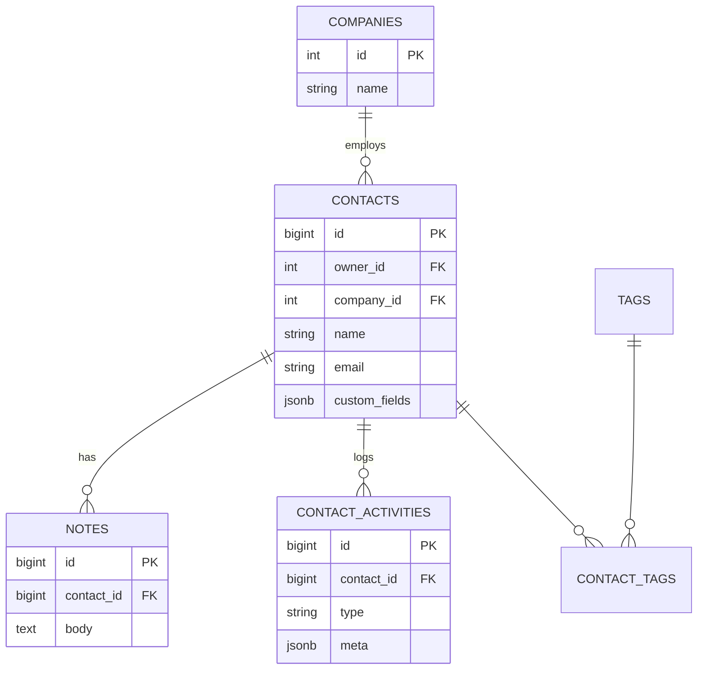
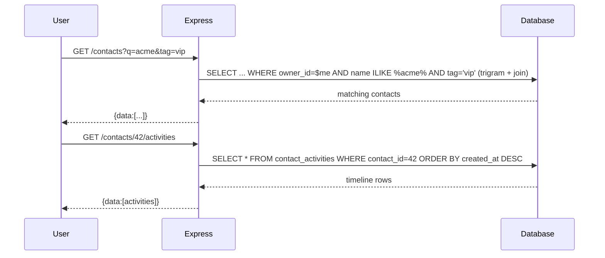

# 06 — CRM Contact Manager

🏢 **Asked at:** Freshworks, Zoho, Chargebee, HubSpot, Salesforce

> Build a mini CRM: contacts (with companies), notes, tags, and an activity timeline, plus search/filter. The signature lesson is the **flexible schema pattern** — using a `JSONB` column for custom fields so each customer can extend contacts without a schema migration.

---

## 🎬 The Product Story

A sales rep opens HubSpot. They see a list of contacts, search for "Acme," open a contact to read their company, notes, and a timeline of every interaction ("Called", "Emailed", "Note added"). Different companies using the CRM want *different* fields — one tracks "LinkedIn URL," another "Account Tier," another "Renewal Date." The CRM can't add a database column for every customer's whim, so it stores those extras in a flexible `JSONB` "custom fields" bag.

Freshworks and Zoho (both CRM companies) ask this to see relational modeling *plus* the pragmatic flexible-schema pattern, plus solid search/filter — the bread and butter of B2B SaaS.

---

## 📋 Requirements (clarified)

**Functional:** CRUD contacts; attach a company; add notes; tag contacts; an activity timeline; search by name/email and filter by tag/company; custom fields per contact.
**Non-functional:** per-owner (or per-tenant) isolation; fast search; extensible without migrations.

**Clarifying questions:** Single user or multi-tenant org? Which fields are core vs custom? Free-text search or structured filters? Soft-delete contacts?

---

## 🧱 Database Schema



```sql
-- File: database/schema.sql
CREATE TABLE companies (id SERIAL PRIMARY KEY, name VARCHAR(150) NOT NULL);

CREATE TABLE contacts (
  id            BIGSERIAL PRIMARY KEY,
  owner_id      INTEGER NOT NULL REFERENCES users(id) ON DELETE CASCADE,
  company_id    INTEGER REFERENCES companies(id) ON DELETE SET NULL,
  name          VARCHAR(150) NOT NULL,
  email         VARCHAR(255),
  phone         VARCHAR(40),
  custom_fields JSONB NOT NULL DEFAULT '{}',               -- flexible per-customer fields
  deleted_at    TIMESTAMPTZ,                               -- soft delete
  created_at    TIMESTAMPTZ NOT NULL DEFAULT now()
);
CREATE INDEX idx_contacts_owner ON contacts(owner_id) WHERE deleted_at IS NULL;
-- Case-insensitive name/email search; trigram index makes substring search indexable.
CREATE EXTENSION IF NOT EXISTS pg_trgm;
CREATE INDEX idx_contacts_name_trgm ON contacts USING GIN (name gin_trgm_ops);
-- Query inside custom_fields efficiently with a GIN index on the JSONB.
CREATE INDEX idx_contacts_custom ON contacts USING GIN (custom_fields);

CREATE TABLE notes (
  id BIGSERIAL PRIMARY KEY,
  contact_id BIGINT NOT NULL REFERENCES contacts(id) ON DELETE CASCADE,
  author_id INTEGER NOT NULL REFERENCES users(id),
  body TEXT NOT NULL,
  created_at TIMESTAMPTZ NOT NULL DEFAULT now()
);
CREATE INDEX idx_notes_contact ON notes(contact_id);

CREATE TABLE tags (id SERIAL PRIMARY KEY, owner_id INT REFERENCES users(id), name VARCHAR(50), UNIQUE(owner_id, name));
CREATE TABLE contact_tags (
  contact_id BIGINT REFERENCES contacts(id) ON DELETE CASCADE,
  tag_id INTEGER REFERENCES tags(id) ON DELETE CASCADE,
  PRIMARY KEY (contact_id, tag_id)
);

CREATE TABLE contact_activities (
  id BIGSERIAL PRIMARY KEY,
  contact_id BIGINT NOT NULL REFERENCES contacts(id) ON DELETE CASCADE,
  type VARCHAR(40) NOT NULL,                               -- 'created'|'note_added'|'called'|'emailed'...
  meta JSONB,
  created_at TIMESTAMPTZ NOT NULL DEFAULT now()
);
CREATE INDEX idx_activities_contact_time ON contact_activities(contact_id, created_at DESC);
```

> **The flexible schema pattern:** core, queried-everywhere fields (name, email) are real columns; the long tail of customer-specific fields lives in `custom_fields JSONB`. A GIN index keeps even JSON queries fast. This avoids a migration every time a customer wants a new field.

---

## 🔌 API Design

| Method | Path | Auth | Purpose |
|--------|------|------|---------|
| GET | `/api/v1/contacts?q&tag&company` | ✅ | List/search/filter |
| POST | `/api/v1/contacts` | ✅ | Create (incl. custom fields) |
| GET | `/api/v1/contacts/:id` | ✅ | Detail + tags + company |
| PATCH | `/api/v1/contacts/:id` | ✅ | Update (incl. custom fields) |
| DELETE | `/api/v1/contacts/:id` | ✅ | Soft-delete |
| POST | `/api/v1/contacts/:id/notes` | ✅ | Add a note (logs activity) |
| GET | `/api/v1/contacts/:id/activities` | ✅ | Timeline |

---

## 🔄 Flow Diagram (search + open contact)



**Reading this diagram:** Search combines a trigram-indexed name match with optional tag/company filters, all scoped to the owner. Opening a contact pulls its activity timeline newest-first from an indexed query. Both are reads; custom fields ride along inside each contact's JSONB.

---

## 💻 Complete Working Code

```javascript
// File: server/models/contactModel.js
const { query } = require("../db");

const ContactModel = {
  async search(ownerId, { q, tag, company }) {
    const params = [ownerId];
    const where = ["c.owner_id = $1", "c.deleted_at IS NULL"];
    let join = "";
    if (q) { params.push(`%${q}%`); where.push(`(c.name ILIKE $${params.length} OR c.email ILIKE $${params.length})`); }
    if (company) { params.push(company); where.push(`c.company_id = $${params.length}`); }
    if (tag) {
      params.push(tag);
      join = "JOIN contact_tags ct ON ct.contact_id=c.id JOIN tags t ON t.id=ct.tag_id";
      where.push(`t.name = $${params.length}`);
    }
    const sql = `SELECT DISTINCT c.id, c.name, c.email, c.phone, c.custom_fields, c.company_id
                 FROM contacts c ${join} WHERE ${where.join(" AND ")} ORDER BY c.name`;
    return (await query(sql, params)).rows;
  },

  async create(ownerId, body) {
    const { name, email, phone, companyId, customFields } = body;
    const c = (await query(
      "INSERT INTO contacts (owner_id, name, email, phone, company_id, custom_fields) VALUES ($1,$2,$3,$4,$5,$6) RETURNING *",
      [ownerId, name, email || null, phone || null, companyId || null, customFields || {}]
    )).rows[0];
    await query("INSERT INTO contact_activities (contact_id, type) VALUES ($1,'created')", [c.id]);
    return c;
  },

  async update(ownerId, id, body) {
    const allowed = ["name", "email", "phone", "company_id", "custom_fields"];
    const keys = Object.keys(body).filter((k) => allowed.includes(k));
    if (!keys.length) return ContactModel.getById(ownerId, id);
    const set = keys.map((k, i) => `${k} = $${i + 1}`).join(", ");
    const values = keys.map((k) => body[k]);
    values.push(id, ownerId);
    return (await query(
      `UPDATE contacts SET ${set} WHERE id=$${keys.length + 1} AND owner_id=$${keys.length + 2} AND deleted_at IS NULL RETURNING *`,
      values
    )).rows[0] || null;
  },

  getById: (ownerId, id) =>
    query("SELECT * FROM contacts WHERE id=$1 AND owner_id=$2 AND deleted_at IS NULL", [id, ownerId]).then((r) => r.rows[0] || null),

  softDelete: (ownerId, id) =>
    query("UPDATE contacts SET deleted_at=now() WHERE id=$1 AND owner_id=$2 AND deleted_at IS NULL RETURNING id", [id, ownerId]).then((r) => r.rows[0] || null),
};
module.exports = { ContactModel };
```

```javascript
// File: server/controllers/contactController.js
const { ContactModel } = require("../models/contactModel");
const { query } = require("../db");

const ContactController = {
  async list(req, res) {
    res.status(200).json({ success: true, data: await ContactModel.search(req.user.id, req.query) });
  },
  async create(req, res) {
    if (!req.body.name?.trim()) return res.status(400).json({ success: false, error: "Name required" });
    res.status(201).json({ success: true, data: await ContactModel.create(req.user.id, req.body) });
  },
  async getOne(req, res) {
    const c = await ContactModel.getById(req.user.id, req.params.id);
    if (!c) return res.status(404).json({ success: false, error: "Contact not found" });
    c.tags = (await query("SELECT t.name FROM tags t JOIN contact_tags ct ON ct.tag_id=t.id WHERE ct.contact_id=$1", [c.id])).rows.map((r) => r.name);
    res.status(200).json({ success: true, data: c });
  },
  async update(req, res) {
    const c = await ContactModel.update(req.user.id, req.params.id, req.body);
    if (!c) return res.status(404).json({ success: false, error: "Contact not found" });
    res.status(200).json({ success: true, data: c });
  },
  async remove(req, res) {
    const deleted = await ContactModel.softDelete(req.user.id, req.params.id);
    if (!deleted) return res.status(404).json({ success: false, error: "Contact not found" });
    res.status(204).send();
  },
  async addNote(req, res) {
    const owns = await ContactModel.getById(req.user.id, req.params.id);
    if (!owns) return res.status(404).json({ success: false, error: "Contact not found" });
    const note = (await query(
      "INSERT INTO notes (contact_id, author_id, body) VALUES ($1,$2,$3) RETURNING id, body, created_at",
      [req.params.id, req.user.id, req.body.body]
    )).rows[0];
    // Log to the activity timeline.
    await query("INSERT INTO contact_activities (contact_id, type, meta) VALUES ($1,'note_added',$2)",
      [req.params.id, { noteId: note.id }]);
    res.status(201).json({ success: true, data: note });
  },
  async activities(req, res) {
    const owns = await ContactModel.getById(req.user.id, req.params.id);
    if (!owns) return res.status(404).json({ success: false, error: "Contact not found" });
    const rows = (await query("SELECT type, meta, created_at FROM contact_activities WHERE contact_id=$1 ORDER BY created_at DESC", [req.params.id])).rows;
    res.status(200).json({ success: true, data: rows });
  },
};
module.exports = { ContactController };
```

```jsx
// File: client/src/components/ContactDetail.jsx
import { useEffect, useState } from "react";
import { apiFetch } from "../api/client";

export function ContactDetail({ contactId }) {
  const [contact, setContact] = useState(null);
  const [activities, setActivities] = useState([]);
  const [note, setNote] = useState("");

  async function load() {
    setContact(await apiFetch(`/contacts/${contactId}`));
    setActivities(await apiFetch(`/contacts/${contactId}/activities`));
  }
  useEffect(() => { load(); }, [contactId]);

  async function addNote(e) {
    e.preventDefault();
    if (!note.trim()) return;
    await apiFetch(`/contacts/${contactId}/notes`, { method: "POST", body: JSON.stringify({ body: note }) });
    setNote("");
    load();                                                 // refresh timeline
  }

  if (!contact) return <p>Loading…</p>;
  return (
    <div>
      <h2>{contact.name}</h2>
      <p>{contact.email} · {contact.phone}</p>
      {/* Render custom fields generically */}
      {Object.entries(contact.custom_fields || {}).map(([k, v]) => <p key={k}><b>{k}:</b> {String(v)}</p>)}
      <div>Tags: {(contact.tags || []).join(", ") || "none"}</div>

      <h3>Activity</h3>
      <form onSubmit={addNote}>
        <input value={note} onChange={(e) => setNote(e.target.value)} placeholder="Add a note…" />
        <button>Add</button>
      </form>
      <ul>
        {activities.map((a, i) => (
          <li key={i}>{a.type} — {new Date(a.created_at).toLocaleString()}</li>
        ))}
      </ul>
    </div>
  );
}
```

### Running
```bash
psql fullstack_course < database/schema.sql
cd server && npm install && npm run dev
cd client && npm install && npm run dev
```

### What You Will See
A searchable contact list. Type "acme" and matching contacts appear (substring search, trigram-indexed). Open a contact to see core fields *and* any custom fields (e.g. "Account Tier: Gold") rendered generically from the JSONB. Add a note — it appears instantly in the activity timeline alongside the "created" event. Create two different contacts with totally different custom fields and both work with no schema change. Delete a contact and it vanishes from the list (soft-deleted, still in the table).

---

## ⚠️ What Makes This Problem Tricky (5 Non-Obvious Traps)

🔴 **Trap 1:** Adding a real column for every customer-specific field.
✅ `custom_fields JSONB` + a GIN index.
💡 Avoids endless migrations; the flexible-schema pattern is the lesson.

🔴 **Trap 2:** Substring search with `ILIKE '%q%'` and no plan for scale.
✅ Trigram (`pg_trgm`) GIN index makes substring search indexable.
💡 Plain ILIKE forces a full scan as data grows.

🔴 **Trap 3:** Hard-deleting contacts (losing history/notes).
✅ Soft delete (`deleted_at`); filter it out in reads.
💡 CRMs need recoverable, auditable data.

🔴 **Trap 4:** Notes that don't appear on the timeline.
✅ Log a `contact_activities` row whenever something happens.
💡 The timeline is the product; activities must be recorded consistently.

🔴 **Trap 5:** Dynamic update that interpolates column names from input.
✅ Whitelist allowed columns; parameterize values.
💡 Prevents SQL injection via field names.

---

## 🌀 How the Interviewer Can Twist This Question (6 Extensions)

**Twist 1 (Auth/Security): Multi-tenant isolation**
🗣️ *"Each company's data must be fully isolated."*
🛠️ All three.
💻
```sql
ALTER TABLE contacts ADD COLUMN tenant_id INT; -- every query filters by tenant_id from the JWT (see Multi-tenant problem)
```

**Twist 2 (Real-time): Live timeline updates**
🗣️ *"Team members see new activities live."*
🛠️ Backend + Frontend.
💻
```javascript
// emit "activity" to a contact room on each insert; clients append
```

**Twist 3 (Scale): Saved views / advanced filters on custom fields**
🗣️ *"Filter where custom_fields->>'tier' = 'Gold'."*
🛠️ Backend.
💻
```sql
SELECT * FROM contacts WHERE owner_id=$1 AND custom_fields->>'tier' = $2; -- GIN index assists
```

**Twist 4 (New feature): Bulk import (CSV)**
🗣️ *"Import 10,000 contacts from a CSV."*
🛠️ All three.
💻
```javascript
// stream-parse CSV; batch INSERT (COPY or multi-row insert); report row-level errors
```

**Twist 5 (Performance): Full-text search across notes**
🗣️ *"Search inside note bodies too."*
🛠️ DB.
💻
```sql
ALTER TABLE notes ADD COLUMN tsv tsvector; CREATE INDEX ON notes USING GIN(tsv);
```

**Twist 6 (Resilience): Field-level audit log**
🗣️ *"Track who changed which field when."*
🛠️ All three.
💻
```sql
CREATE TABLE field_audit (contact_id BIGINT, field VARCHAR(60), old_val TEXT, new_val TEXT, changed_by INT, at TIMESTAMPTZ);
```

---

## 🧪 Test Cases (8 Cases)

| # | Action | Input | Expected | UI |
|---|--------|-------|----------|----|
| 1 | Create contact | name + custom | `201` | Listed |
| 2 | No name | `{name:""}` | `400` | Error |
| 3 | Search | `?q=acme` | matching | Filtered list |
| 4 | Filter by tag | `?tag=vip` | tagged only | Narrowed |
| 5 | Custom fields | open contact | rendered | Shows custom KV |
| 6 | Add note | `{body}` | `201` + activity | Timeline updates |
| 7 | Soft delete | id | `204` | Gone from list |
| 8 | Others' contact | not owner | `404` | Blocked |

---

## ⏱️ Time Budget

| Phase | Time | What to do |
|-------|------|-----------|
| Read & clarify | 5 min | multi-tenant? core vs custom fields? soft delete? |
| Schema | 12 min | contacts(JSONB), companies, notes, tags, activities + indexes |
| API design | 5 min | search/CRUD/notes/activities |
| Backend | 26 min | search builder, JSONB custom fields, activity logging |
| Frontend | 20 min | ContactList (search), ContactDetail (custom fields + timeline) |
| Test | 8 min | search, custom fields, note→activity, soft delete |

---

## 🎤 Famous Interview Questions

**Q1 (Conceptual): What is the flexible (JSONB) schema pattern and when is it appropriate?**
🏢 *Asked at: Freshworks*
✅ Answer: It means keeping the stable, frequently-queried fields as real columns while storing variable, customer-specific fields in a single JSON/JSONB column. It's appropriate when different users genuinely need different fields and you can't enumerate them up front — like a CRM where each company wants its own attributes. JSONB in Postgres is queryable and GIN-indexable, so you keep flexibility without giving up the ability to filter on those fields, and without a migration per new field.
💡 Bonus insight: The trade-off is weaker validation and that core query logic shouldn't depend on JSON internals — so the rule of thumb is "columns for what the app reasons about, JSONB for what the customer customizes."

**Q2 (Design Decision): Why model an activity timeline as its own table instead of deriving it?**
🏢 *Asked at: Zoho*
✅ Answer: The timeline is a first-class product feature combining heterogeneous events — created, note added, called, emailed — that don't all live in one source table, so deriving it with a giant UNION would be brittle and slow. A dedicated `contact_activities` table with a `type` and a JSONB `meta` gives one ordered, indexable stream I append to whenever anything happens. It's also extensible: new activity types just add new `type` values without schema changes.
💡 Bonus insight: This is essentially an append-only event log scoped to a contact, which also makes it a natural foundation for audit trails and analytics later.

**Q3 (Trade-off): JSONB custom fields vs an EAV (entity-attribute-value) table?**
🏢 *Asked at: Chargebee*
✅ Answer: EAV stores each custom attribute as a row (entity, attribute, value), which is fully flexible but makes reads painful — reconstructing one contact means many rows or many joins, and typing is lost. JSONB keeps all of a contact's custom fields together in one row, reads naturally, and is GIN-indexable for filtering, while still being schemaless. EAV's advantage is easier per-attribute constraints and indexing, but for a CRM's display-and-filter needs, JSONB is simpler and faster.
💡 Bonus insight: JSONB essentially gives you EAV's flexibility with document-style ergonomics — the main thing you sacrifice is strict per-field typing, which you can recover with check constraints or generated columns where it matters.

**Q4 (Extension): How would you support filtering and search on custom fields at scale?**
🏢 *Asked at: HubSpot*
✅ Answer: A GIN index on the JSONB column lets Postgres efficiently evaluate containment and key/value lookups like `custom_fields->>'tier' = 'Gold'`. For frequently-filtered custom fields I'd promote them to generated columns (a real column derived from the JSON) and index those directly. For free-text across name, email, and notes I'd add full-text `tsvector` columns with GIN indexes, and for substring/typo matching use trigram indexes. Beyond a point, syncing to a dedicated search engine handles complex faceted search.
💡 Bonus insight: Promoting a hot JSON key to a generated, indexed column is a nice escape hatch — you keep the schemaless bag for the long tail but get column-grade performance for the few fields everyone filters on.

**Q5 (Security/Edge case): What edge cases and security concerns matter?**
🏢 *Asked at: Freshworks*
✅ Answer: Scope every query to the owner (or tenant) so contacts never leak across accounts; soft-delete to preserve history and audit trails; whitelist columns in the dynamic update to prevent injection via field names; validate and size-limit the custom_fields JSON so a client can't store megabytes of arbitrary data; and sanitize note/field content rendered back to users to prevent stored XSS. I'd also log field-level changes for auditability in a B2B context.
💡 Bonus insight: The custom-fields bag is the sneaky risk surface — without size and shape limits, it becomes an unbounded dumping ground and a potential injection/XSS vector, so I constrain what can go in it even though it's "schemaless."

---

## 🔗 Navigation
⬅️ Previous: [05 — API Key Management System](./05-api-key-management-system.md)
➡️ Next: [07 — Webhook Delivery System](./07-webhook-delivery-system.md)
🏠 [Module Home](./README.md)
