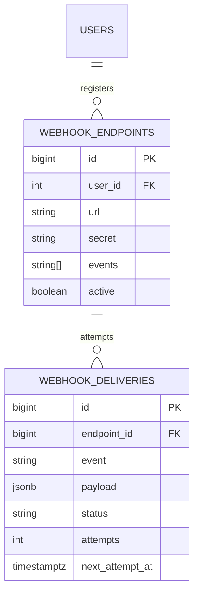

# 07 — Webhook Delivery System

🏢 **Asked at:** Razorpay, Stripe, Postman, Twilio, GitHub

> Build the system that *delivers* webhooks: when an event happens, call the customer's URL, retry with backoff if it fails, sign the payload so they can verify it's really you, and track every delivery attempt. The signature lessons: **exponential backoff retries** and **HMAC payload signing**.

---

## 🎬 The Product Story

> A **webhook** is a reversal of polling. Instead of your app constantly asking a service "did anything happen yet?" every few seconds, the service calls *your* URL the instant something happens — like a doorbell instead of repeatedly opening the door to check.

When a payment succeeds at Razorpay, Razorpay makes an HTTP POST to *your* server's URL with the event details. But the internet is unreliable — your server might be down or slow — so Razorpay must **retry** (without giving up immediately or hammering you), and it must **sign** the payload so you can be sure the request genuinely came from Razorpay and wasn't forged. Building that delivery engine, with retry tracking, is the question.

---

## 🔑 Two Core Concepts

### Exponential Backoff
> When a delivery fails, don't retry instantly or at a fixed interval. Wait progressively longer: **1s, then 2s, 4s, 8s, 16s…** — doubling each time. This gives a struggling receiver room to recover instead of being pounded, while still retrying promptly at first. Often jitter (randomness) is added so many failed deliveries don't all retry in lockstep.

### HMAC Signing
> **HMAC** (Hash-based Message Authentication Code) combines the payload with a shared secret to produce a signature. The sender computes `HMAC(secret, payload)` and sends it in a header; the receiver recomputes it with the *same* secret and compares. A match proves the payload is authentic and untampered, because only someone with the secret could produce a valid signature.

---

## 📋 Requirements (clarified)

**Functional:** register webhook endpoints (URL + secret); when an event fires, deliver (POST) to all matching endpoints; retry failures with exponential backoff; sign payloads with HMAC; show delivery logs with retry status.
**Non-functional:** deliveries don't block the main request; retries bounded; failures recorded.

**Clarifying questions:** Which events? Max retries before giving up? In-process retry queue or a real broker? Signature scheme expectations?

---

## 🧱 Database Schema



```sql
-- File: database/schema.sql
CREATE TABLE webhook_endpoints (
  id        BIGSERIAL PRIMARY KEY,
  user_id   INTEGER NOT NULL REFERENCES users(id) ON DELETE CASCADE,
  url       TEXT NOT NULL,
  secret    VARCHAR(64) NOT NULL,                          -- shared secret for HMAC signing
  events    TEXT[] NOT NULL,                               -- which event types to receive
  active    BOOLEAN NOT NULL DEFAULT true,
  created_at TIMESTAMPTZ NOT NULL DEFAULT now()
);
CREATE INDEX idx_endpoints_user ON webhook_endpoints(user_id);

CREATE TABLE webhook_deliveries (
  id              BIGSERIAL PRIMARY KEY,
  endpoint_id     BIGINT NOT NULL REFERENCES webhook_endpoints(id) ON DELETE CASCADE,
  event           VARCHAR(60) NOT NULL,
  payload         JSONB NOT NULL,
  status          VARCHAR(12) NOT NULL DEFAULT 'PENDING'   -- PENDING|SUCCESS|FAILED
                  CHECK (status IN ('PENDING','SUCCESS','FAILED')),
  attempts        INTEGER NOT NULL DEFAULT 0,
  last_status_code INTEGER,
  next_attempt_at TIMESTAMPTZ NOT NULL DEFAULT now(),      -- when the worker should next try
  created_at      TIMESTAMPTZ NOT NULL DEFAULT now()
);
-- The worker polls "deliveries due now that aren't done".
CREATE INDEX idx_deliveries_due ON webhook_deliveries(next_attempt_at) WHERE status = 'PENDING';
```

---

## 🔌 API Design

| Method | Path | Auth | Purpose |
|--------|------|------|---------|
| POST | `/api/v1/webhooks` | ✅ | Register an endpoint (returns its secret) |
| GET | `/api/v1/webhooks` | ✅ | List endpoints |
| GET | `/api/v1/webhooks/:id/deliveries` | ✅ | Delivery logs |
| POST | `/api/v1/webhooks/deliveries/:id/retry` | ✅ | Manually re-queue a failed delivery |
| (internal) | `emitEvent(type, payload)` | – | Fan an event out to matching endpoints |

---

## 🔄 Full Stack Flow Diagram (event → delivery with retries)

```mermaid
sequenceDiagram
  participant App as App (event source)
  participant Q as Deliveries table (queue)
  participant W as Delivery Worker
  participant R as Receiver (customer URL)
  App->>Q: emitEvent("payment.success") -> INSERT delivery rows (PENDING) for matching endpoints
  loop worker tick
    W->>Q: SELECT deliveries WHERE status=PENDING AND next_attempt_at<=now()
    W->>W: sign payload: HMAC(secret, body)
    W->>R: POST payload + X-Signature header
    alt 2xx
      R-->>W: 200
      W->>Q: status=SUCCESS
    else failure / timeout
      R-->>W: 5xx / no response
      W->>Q: attempts++; if attempts<max -> next_attempt_at=now()+backoff; else FAILED
    end
  end
```

**Reading this diagram:** Emitting an event simply inserts PENDING delivery rows (fast, non-blocking). A background worker repeatedly grabs deliveries that are due, signs each payload with that endpoint's secret, and POSTs it. Success marks the row done; failure increments the attempt count and schedules the next try further out via exponential backoff, giving up only after the max attempts.

---

## 💻 Complete Working Code

```javascript
// File: server/webhooks/sign.js
const crypto = require("crypto");
// Compute the HMAC-SHA256 signature of the raw body using the endpoint's secret.
function sign(secret, rawBody) {
  return crypto.createHmac("sha256", secret).update(rawBody).digest("hex");
}
module.exports = { sign };
```

```javascript
// File: server/webhooks/emit.js
const { query } = require("../db");
// Fan an event out: create a PENDING delivery for every active endpoint subscribed to it.
async function emitEvent(eventType, payload) {
  const endpoints = (await query(
    "SELECT id FROM webhook_endpoints WHERE active = true AND $1 = ANY(events)",
    [eventType]
  )).rows;
  for (const ep of endpoints) {
    await query(
      "INSERT INTO webhook_deliveries (endpoint_id, event, payload) VALUES ($1,$2,$3)",
      [ep.id, eventType, payload]                          // status defaults PENDING, due now
    );
  }
}
module.exports = { emitEvent };
```

```javascript
// File: server/webhooks/worker.js
const { query } = require("../db");
const { sign } = require("./sign");

const MAX_ATTEMPTS = 5;
// Backoff schedule in seconds: 1, 2, 4, 8, 16 (doubles each attempt).
const backoffSeconds = (attempt) => Math.pow(2, attempt);

async function deliverDue() {
  // Grab a batch of deliveries that are due.
  const due = (await query(
    `SELECT d.id, d.payload, d.event, d.attempts, e.url, e.secret
     FROM webhook_deliveries d JOIN webhook_endpoints e ON e.id = d.endpoint_id
     WHERE d.status = 'PENDING' AND d.next_attempt_at <= now()
     ORDER BY d.next_attempt_at LIMIT 20`
  )).rows;

  for (const d of due) {
    const rawBody = JSON.stringify({ event: d.event, data: d.payload });
    const signature = sign(d.secret, rawBody);

    let ok = false, statusCode = 0;
    try {
      const res = await fetch(d.url, {
        method: "POST",
        headers: { "Content-Type": "application/json", "X-Webhook-Signature": signature },
        body: rawBody,
        signal: AbortSignal.timeout(5000),                 // don't hang on a slow receiver
      });
      statusCode = res.status;
      ok = res.status >= 200 && res.status < 300;           // 2xx = delivered
    } catch {
      ok = false;                                           // timeout / network error
    }

    const attempts = d.attempts + 1;
    if (ok) {
      await query("UPDATE webhook_deliveries SET status='SUCCESS', attempts=$2, last_status_code=$3 WHERE id=$1",
        [d.id, attempts, statusCode]);
    } else if (attempts >= MAX_ATTEMPTS) {
      await query("UPDATE webhook_deliveries SET status='FAILED', attempts=$2, last_status_code=$3 WHERE id=$1",
        [d.id, attempts, statusCode]);                      // give up after max attempts
    } else {
      // Schedule the next retry with exponential backoff (+ jitter to avoid thundering herd).
      const delay = backoffSeconds(attempts) + Math.random();
      await query(
        "UPDATE webhook_deliveries SET attempts=$2, last_status_code=$3, next_attempt_at = now() + ($4 || ' seconds')::interval WHERE id=$1",
        [d.id, attempts, statusCode, String(delay)]
      );
    }
  }
}

// Run the worker on an interval (in production: a dedicated process / real queue).
function startWorker() {
  setInterval(() => { deliverDue().catch(console.error); }, 1000);
}
module.exports = { startWorker, deliverDue };
```

```javascript
// File: server/controllers/webhookController.js
const crypto = require("crypto");
const { query } = require("../db");

const WebhookController = {
  async create(req, res) {
    const { url, events } = req.body;
    if (!url || !Array.isArray(events) || events.length === 0) {
      return res.status(400).json({ success: false, error: "url and events[] required" });
    }
    const secret = crypto.randomBytes(24).toString("hex");  // CSPRNG secret for HMAC
    const row = (await query(
      "INSERT INTO webhook_endpoints (user_id, url, secret, events) VALUES ($1,$2,$3,$4) RETURNING id, url, events, active",
      [req.user.id, url, secret, events]
    )).rows[0];
    res.status(201).json({ success: true, data: { ...row, secret }, message: "Store this secret to verify signatures." });
  },

  async deliveries(req, res) {
    const owns = (await query("SELECT 1 FROM webhook_endpoints WHERE id=$1 AND user_id=$2", [req.params.id, req.user.id])).rows.length;
    if (!owns) return res.status(404).json({ success: false, error: "Endpoint not found" });
    const rows = (await query(
      "SELECT id, event, status, attempts, last_status_code, next_attempt_at, created_at FROM webhook_deliveries WHERE endpoint_id=$1 ORDER BY created_at DESC LIMIT 100",
      [req.params.id]
    )).rows;
    res.status(200).json({ success: true, data: rows });
  },

  async retry(req, res) {
    // Re-queue a failed delivery: reset to PENDING, due now.
    const row = (await query(
      `UPDATE webhook_deliveries SET status='PENDING', next_attempt_at=now()
       WHERE id=$1 AND status='FAILED' RETURNING id`,
      [req.params.id]
    )).rows[0];
    if (!row) return res.status(404).json({ success: false, error: "Failed delivery not found" });
    res.status(200).json({ success: true, message: "Re-queued" });
  },
};
module.exports = { WebhookController };
```

```javascript
// File: server/index.js (start the worker)
const { startWorker } = require("./webhooks/worker");
// ... after app setup ...
startWorker();                                              // background delivery loop
```

### How a receiver verifies (the other side)

```javascript
// File: example-receiver/verify.js  (what the CUSTOMER runs)
const crypto = require("crypto");
function verify(rawBody, signatureHeader, secret) {
  const expected = crypto.createHmac("sha256", secret).update(rawBody).digest("hex");
  // Constant-time compare to avoid timing attacks.
  return crypto.timingSafeEqual(Buffer.from(expected), Buffer.from(signatureHeader));
}
// In the receiver's route: if (!verify(rawBody, req.headers["x-webhook-signature"], SECRET)) return res.status(401).end();
```

### Frontend

```jsx
// File: client/src/components/DeliveryLogs.jsx
import { useEffect, useState } from "react";
import { apiFetch } from "../api/client";

export function DeliveryLogs({ endpointId }) {
  const [logs, setLogs] = useState([]);
  const reload = () => apiFetch(`/webhooks/${endpointId}/deliveries`).then(setLogs);
  useEffect(() => { reload(); }, [endpointId]);

  async function retry(id) {
    await apiFetch(`/webhooks/deliveries/${id}/retry`, { method: "POST" });
    reload();
  }

  return (
    <table>
      <thead><tr><th>Event</th><th>Status</th><th>Attempts</th><th>Code</th><th></th></tr></thead>
      <tbody>
        {logs.map((l) => (
          <tr key={l.id}>
            <td>{l.event}</td>
            <td style={{ color: l.status === "SUCCESS" ? "green" : l.status === "FAILED" ? "red" : "orange" }}>{l.status}</td>
            <td>{l.attempts}</td>
            <td>{l.last_status_code || "-"}</td>
            <td>{l.status === "FAILED" && <button onClick={() => retry(l.id)}>Retry</button>}</td>
          </tr>
        ))}
      </tbody>
    </table>
  );
}
```

### Running
```bash
psql fullstack_course < database/schema.sql
cd server && npm install && npm run dev    # starts the delivery worker
cd client && npm install && npm run dev
```

### What You Will See
Register an endpoint pointing at a test URL (e.g. webhook.site) with event `payment.success` — you get back a secret. Trigger `emitEvent("payment.success", {...})` and the worker delivers a signed POST within a second; the delivery log shows `SUCCESS` with status 200. Point an endpoint at a URL that returns 500 and watch the log: `attempts` climbs (1, 2, 3…) with the retries spaced out (1s, 2s, 4s…), finally flipping to `FAILED` after 5 tries. Click "Retry" on a failed one and it re-queues and runs again. On the receiver side, the HMAC signature verifies.

---

## ⚠️ What Makes This Problem Tricky (5 Non-Obvious Traps)

🔴 **Trap 1:** Delivering synchronously inside the event-producing request.
✅ Enqueue (insert PENDING rows); a worker delivers out-of-band.
💡 A slow receiver shouldn't block your core API.

🔴 **Trap 2:** Retrying instantly or at a fixed interval.
✅ Exponential backoff (1,2,4,8…) with jitter.
💡 Fixed/instant retries pound a struggling receiver (and you).

🔴 **Trap 3:** No max attempts — retrying forever.
✅ Cap attempts, then mark FAILED (with manual retry available).
💡 Unbounded retries are a resource leak and a self-DoS.

🔴 **Trap 4:** No payload signing, so receivers can't trust the call.
✅ HMAC the body with a per-endpoint secret; send in a header.
💡 Without signing, anyone can forge webhook calls to the receiver.

🔴 **Trap 5:** No request timeout, so one hung receiver stalls the worker.
✅ `AbortSignal.timeout` on the delivery fetch.
💡 Bounds the blast radius of a slow endpoint.

---

## 🌀 How the Interviewer Can Twist This Question (6 Extensions)

**Twist 1 (Auth/Security): Signature includes a timestamp (replay protection)**
🗣️ *"Stop attackers from replaying an old signed payload."*
🛠️ Backend.
💻
```javascript
// sign `${timestamp}.${body}`; receiver rejects if timestamp is older than 5 minutes
```

**Twist 2 (Real-time): Live delivery status in the dashboard**
🗣️ *"Show deliveries flipping to SUCCESS/FAILED live."*
🛠️ Backend + Frontend.
💻
```javascript
// SSE-push delivery status changes to the owner's dashboard
```

**Twist 3 (Scale): Real message broker instead of DB polling**
🗣️ *"Millions of events — DB polling won't scale."*
🛠️ Backend.
💻
```text
// publish events to a queue (RabbitMQ/SQS/BullMQ); workers consume; broker handles retry/DLQ
```

**Twist 4 (New feature): Dead-letter queue + alerting**
🗣️ *"Notify the owner when an endpoint keeps failing."*
🛠️ All three.
💻
```sql
-- move exhausted deliveries to a dead_letter view; alert/email the owner; auto-disable after N consecutive failures
```

**Twist 5 (Performance): Concurrent workers with row locking**
🗣️ *"Run many workers without double-delivering."*
🛠️ Backend.
💻
```sql
SELECT ... FOR UPDATE SKIP LOCKED LIMIT 20; -- each worker grabs a distinct batch
```

**Twist 6 (Resilience): Idempotent delivery (event id)**
🗣️ *"A receiver might get the same webhook twice."*
🛠️ All three.
💻
```javascript
// include a unique event id header; receivers dedupe on it (at-least-once delivery is the norm)
```

---

## 🧪 Test Cases (8 Cases)

| # | Action | Input | Expected | UI |
|---|--------|-------|----------|----|
| 1 | Register endpoint | url+events | `201` + secret | Listed |
| 2 | Deliver success | 2xx receiver | status SUCCESS | Green row |
| 3 | Retry on failure | 500 receiver | attempts++ backoff | Orange, climbing |
| 4 | Give up | 5 failures | status FAILED | Red row |
| 5 | Signature valid | receiver verifies | match | Accepted |
| 6 | Manual retry | failed id | re-queued | Runs again |
| 7 | Timeout | hung receiver | counted as failure | Retried |
| 8 | Others' logs | not owner | `404` | Blocked |

---

## ⏱️ Time Budget

| Phase | Time | What to do |
|-------|------|-----------|
| Read & clarify | 5 min | max retries? broker vs DB? signature scheme? |
| Concepts + schema | 12 min | backoff, HMAC, endpoints + deliveries tables |
| API design | 5 min | register/list/deliveries/retry + emitEvent |
| Backend | 30 min | emit (fan-out), worker (backoff), sign, controllers |
| Frontend | 14 min | DeliveryLogs with retry |
| Test | 10 min | success, retry/backoff, give-up, signature |
| Buffer | 4 min | timeout, ownership |

---

## 🎤 Famous Interview Questions

**Q1 (Conceptual): What is exponential backoff and why use it for webhook retries?**
🏢 *Asked at: Stripe*
✅ Answer: Exponential backoff means waiting progressively longer between retries — 1s, 2s, 4s, 8s — instead of retrying immediately or at a fixed cadence. If a receiver is down or overloaded, hammering it with rapid retries makes things worse and wastes resources; backoff gives it increasing time to recover while still retrying promptly at first. I cap the number of attempts so retries don't continue forever, and add jitter so many failed deliveries don't all retry at the exact same moment (the thundering-herd problem).
💡 Bonus insight: Jitter is the under-appreciated part — without randomness, a downstream outage causes every queued delivery to retry in synchronized waves, effectively DDoSing the receiver the instant it comes back.

**Q2 (Design Decision): Why deliver asynchronously via a queue instead of inline?**
🏢 *Asked at: Razorpay*
✅ Answer: The event source (say, a payment succeeding) shouldn't wait on the customer's server, which could be slow or down — that would couple my core API's latency and reliability to theirs. So emitting an event just inserts delivery rows (fast, local) and returns; a separate worker handles the actual HTTP calls, timeouts, and retries out of band. This decouples producers from receivers and lets me retry independently without affecting the main request path.
💡 Bonus insight: This is the same reasoning as a job queue — anything involving an unreliable external call or slow work belongs off the request path, with the database (or a broker) acting as the durable buffer.

**Q3 (Trade-off): Database-as-queue (polling) vs a real message broker?**
🏢 *Asked at: Twilio*
✅ Answer: Using the deliveries table as a queue with a polling worker is simple, transactional, and easy to reason about — great for moderate volume and an interview. But polling adds latency and load, and coordinating many workers needs care. A dedicated broker (SQS, RabbitMQ, BullMQ on Redis) gives built-in retry, delayed messages, dead-letter queues, and high throughput, at the cost of another moving part. I'd start with the DB approach and migrate to a broker as volume grows.
💡 Bonus insight: If staying on Postgres, `SELECT ... FOR UPDATE SKIP LOCKED` turns the table into a surprisingly capable concurrent queue, letting multiple workers pull disjoint batches without double-processing.

**Q4 (Extension): How do you make webhook delivery reliable end-to-end?**
🏢 *Asked at: GitHub*
✅ Answer: Webhooks are at-least-once by nature, so I sign payloads with HMAC for authenticity, include a unique event id so receivers can dedupe, retry with capped exponential backoff, and send a timestamp in the signature to prevent replay. Exhausted deliveries go to a dead-letter state with alerting, and I expose delivery logs plus manual retry. I also recommend receivers respond fast (2xx) and process asynchronously, since I time out slow responses.
💡 Bonus insight: The contract I'm offering is "at-least-once, authenticated, eventually-delivered" — which is why the *receiver* must be idempotent; guaranteeing exactly-once across an unreliable network is effectively impossible, so dedupe-on-event-id is the pragmatic answer.

**Q5 (Security/Edge case): What security and edge cases matter for webhooks?**
🏢 *Asked at: Razorpay*
✅ Answer: Sign every payload with a per-endpoint secret via HMAC so receivers can verify authenticity, and include a timestamp to block replay attacks; receivers should compare signatures in constant time. Time out slow receivers so one can't stall the worker, and cap retries to avoid self-DoS. Validate and possibly restrict target URLs to prevent using the system for SSRF against internal hosts. Scope endpoints and logs to their owner. And treat delivery as at-least-once, providing an event id so receivers dedupe.
💡 Bonus insight: SSRF is the sneaky one — since the system makes outbound requests to user-supplied URLs, an attacker could register an internal address, so blocking private/loopback ranges and metadata endpoints matters just as much as signing.

---

## 🔗 Navigation
⬅️ Previous: [06 — CRM Contact Manager](./06-crm-contact-manager.md)
➡️ Next: [08 — Feature Flag System](./08-feature-flag-system.md)
🏠 [Module Home](./README.md)
