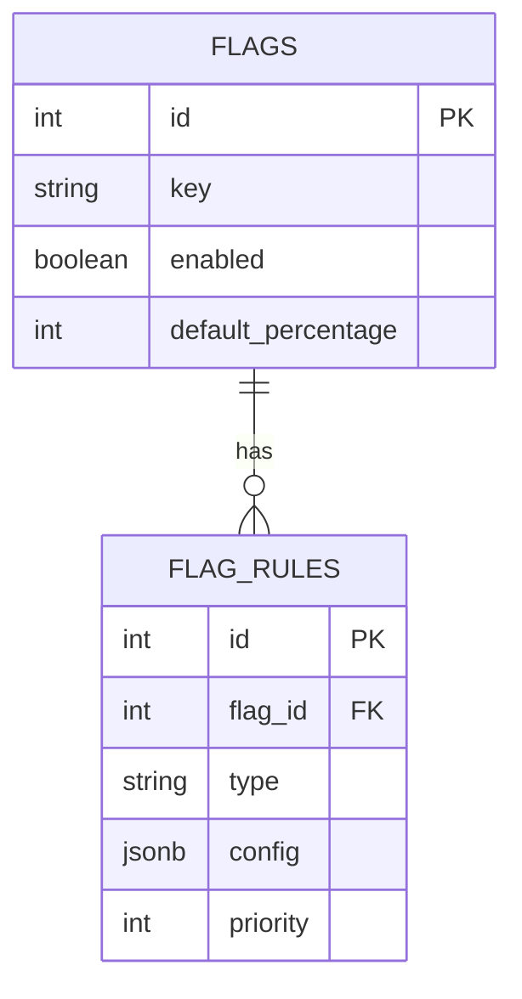
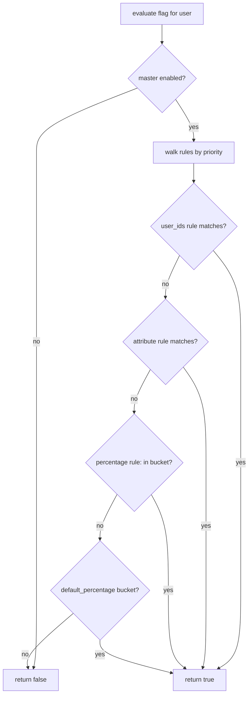

# 08 — Feature Flag System

🏢 **Asked at:** Atlassian, Meta, Google, Freshworks, LaunchDarkly

> Build a feature-flag service like LaunchDarkly: toggle features on/off without deploying, and roll a feature out to a *percentage* of users or to users matching certain attributes. The signature lesson: the **percentage rollout algorithm** — deterministically bucketing users so 10% means a *stable, consistent* 10%.

---

## 🎬 The Product Story

> A **feature flag** is a switch that turns a feature on or off *without shipping new code*. Teams use them to dark-launch features, roll out to 10% of users first to watch for problems, instantly kill a buggy feature, or show a feature only to internal staff or beta users.

Imagine your team built a risky new checkout flow. Instead of releasing it to everyone and praying, you put it behind a flag set to "10% of users." If metrics look good, you bump it to 50%, then 100% — all from a dashboard, no deploy. If it breaks, you flip it off in seconds. The interesting part: that 10% must be *consistent* — a given user should always be in or out, not flicker on every page load. That determinism is the core algorithm.

---

## 🔑 The Core Algorithm: Deterministic Percentage Rollout

> To roll out to X% of users *consistently*, you can't use `Math.random()` (the user would flicker in and out). Instead you **hash** the user's id together with the flag's key into a number, map it to a bucket 0–99, and enable the feature if `bucket < X`. Same user + same flag → same bucket → same decision, every time.

```javascript
// File: server/flags/bucket.js
const crypto = require("crypto");

// Map (flagKey, userId) deterministically to a bucket 0..99.
function bucketFor(flagKey, userId) {
  const hash = crypto.createHash("sha256").update(`${flagKey}:${userId}`).digest("hex");
  const slice = parseInt(hash.slice(0, 8), 16);            // first 32 bits as an integer
  return slice % 100;                                      // 0..99
}

// Is this user in the rolled-out percentage?
function inRollout(flagKey, userId, percentage) {
  return bucketFor(flagKey, userId) < percentage;          // bucket 0..(p-1) => enabled
}
module.exports = { bucketFor, inRollout };
```

> **Why include the flag key in the hash?** So the *same* user isn't always in the same global bucket across every flag — otherwise an unlucky user would be excluded from every gradual rollout. Salting with the flag key gives each flag an independent distribution.

---

## 📋 Requirements (clarified)

**Functional:** create flags (on/off); rules to target by percentage, by specific user ids, or by user attributes; an evaluation endpoint that tells the client whether a flag is on for a given user; an admin list.
**Non-functional:** evaluation is fast and deterministic; rules have a clear precedence order.

**Clarifying questions:** Rule types needed (percentage, user list, attributes)? Precedence between rules? Per-environment flags (dev/prod)? How does the client consume flags (bulk fetch vs per-flag)?

---

## 🧱 Database Schema



```sql
-- File: database/schema.sql
CREATE TABLE flags (
  id                 SERIAL PRIMARY KEY,
  key                VARCHAR(80) NOT NULL UNIQUE,          -- e.g. "new_checkout"
  description        TEXT,
  enabled            BOOLEAN NOT NULL DEFAULT false,       -- master switch (off = always off)
  default_percentage INTEGER NOT NULL DEFAULT 0            -- fallback rollout % when no rule matches
                     CHECK (default_percentage BETWEEN 0 AND 100),
  created_at         TIMESTAMPTZ NOT NULL DEFAULT now()
);

CREATE TABLE flag_rules (
  id       SERIAL PRIMARY KEY,
  flag_id  INTEGER NOT NULL REFERENCES flags(id) ON DELETE CASCADE,
  type     VARCHAR(20) NOT NULL CHECK (type IN ('user_ids','attribute','percentage')),
  config   JSONB NOT NULL,                                 -- e.g. {"userIds":[1,2]} / {"attr":"plan","equals":"pro"} / {"percentage":25}
  priority INTEGER NOT NULL DEFAULT 0                       -- lower = evaluated first
);
CREATE INDEX idx_rules_flag ON flag_rules(flag_id, priority);
```

---

## 🔌 API Design

| Method | Path | Auth | Purpose |
|--------|------|------|---------|
| POST | `/api/v1/flags` | ✅ (admin) | Create a flag |
| GET | `/api/v1/flags` | ✅ (admin) | List flags + rules |
| POST | `/api/v1/flags/:key/rules` | ✅ (admin) | Add a targeting rule |
| GET | `/api/v1/flags/evaluate?userId=&plan=` | ✅ | Evaluate all flags for a user/context |

Evaluate response (what the client app consumes):
```json
{ "success": true, "data": { "new_checkout": true, "dark_mode": false } }
```

---

## 🧠 Evaluation Engine & Precedence

Rules are evaluated in priority order; the first matching rule wins. The logic:

1. If the flag's master `enabled` is false → **off** (kill switch).
2. Walk rules by priority:
   - `user_ids`: on if the user is in the list.
   - `attribute`: on if the user's context attribute matches.
   - `percentage`: on if the user falls in the rollout bucket.
3. If no rule matches → use `default_percentage` (deterministic bucket).



**Reading this diagram:** The master switch is checked first as an instant kill. Then rules are tried in order — an explicit user-id allowlist beats an attribute match, which beats a percentage rollout — and the first hit decides "on." If nothing matches, the flag falls back to its default rollout percentage, still bucketed deterministically.

---

## 💻 Complete Working Code

```javascript
// File: server/flags/evaluate.js
const { inRollout } = require("./bucket");

// Evaluate one flag (+ its rules) for a given user context. Returns boolean.
function evaluateFlag(flag, rules, context /* {userId, ...attrs} */) {
  if (!flag.enabled) return false;                         // master kill switch

  // Rules already sorted by priority ascending.
  for (const rule of rules) {
    if (rule.type === "user_ids") {
      if ((rule.config.userIds || []).includes(context.userId)) return true;
    } else if (rule.type === "attribute") {
      const { attr, equals } = rule.config;
      if (context[attr] !== undefined && String(context[attr]) === String(equals)) return true;
    } else if (rule.type === "percentage") {
      if (inRollout(flag.key, context.userId, rule.config.percentage)) return true;
    }
    // No match on this rule → continue to the next.
  }

  // Fallback: default percentage rollout.
  return inRollout(flag.key, context.userId, flag.default_percentage);
}
module.exports = { evaluateFlag };
```

```javascript
// File: server/controllers/flagController.js
const { query } = require("../db");
const { evaluateFlag } = require("../flags/evaluate");

const FlagController = {
  async create(req, res) {
    const { key, description, enabled, defaultPercentage } = req.body;
    if (!key) return res.status(400).json({ success: false, error: "key required" });
    try {
      const row = (await query(
        "INSERT INTO flags (key, description, enabled, default_percentage) VALUES ($1,$2,$3,$4) RETURNING *",
        [key, description || null, !!enabled, defaultPercentage || 0]
      )).rows[0];
      res.status(201).json({ success: true, data: row });
    } catch (e) {
      if (e.code === "23505") return res.status(409).json({ success: false, error: "Flag key already exists" });
      throw e;
    }
  },

  async addRule(req, res) {
    const flag = (await query("SELECT id FROM flags WHERE key=$1", [req.params.key])).rows[0];
    if (!flag) return res.status(404).json({ success: false, error: "Flag not found" });
    const { type, config, priority } = req.body;
    const row = (await query(
      "INSERT INTO flag_rules (flag_id, type, config, priority) VALUES ($1,$2,$3,$4) RETURNING *",
      [flag.id, type, config, priority || 0]
    )).rows[0];
    res.status(201).json({ success: true, data: row });
  },

  // Evaluate ALL flags for the given context (one round-trip for the client).
  async evaluate(req, res) {
    const context = { userId: parseInt(req.query.userId) || req.user.id, ...req.query };
    const flags = (await query("SELECT * FROM flags")).rows;
    const allRules = (await query("SELECT * FROM flag_rules ORDER BY flag_id, priority")).rows;

    const result = {};
    for (const flag of flags) {
      const rules = allRules.filter((r) => r.flag_id === flag.id);
      result[flag.key] = evaluateFlag(flag, rules, context);
    }
    res.status(200).json({ success: true, data: result });
  },

  async list(req, res) {
    const flags = (await query("SELECT * FROM flags ORDER BY key")).rows;
    const rules = (await query("SELECT * FROM flag_rules ORDER BY flag_id, priority")).rows;
    res.status(200).json({ success: true, data: flags.map((f) => ({ ...f, rules: rules.filter((r) => r.flag_id === f.id) })) });
  },
};
module.exports = { FlagController };
```

```javascript
// File: server/routes/flags.js
const express = require("express");
const router = express.Router();
const { FlagController } = require("../controllers/flagController");
const { requireAuth } = require("../middleware/auth");
const { asyncHandler } = require("../middleware/asyncHandler");

router.use(requireAuth);
router.get("/evaluate", asyncHandler(FlagController.evaluate));   // before /:key-style if any
router.get("/", asyncHandler(FlagController.list));
router.post("/", asyncHandler(FlagController.create));
router.post("/:key/rules", asyncHandler(FlagController.addRule));
module.exports = router;
```

### Frontend — Provider + hook

```jsx
// File: client/src/flags/FeatureFlagProvider.jsx
import { createContext, useContext, useEffect, useState } from "react";
import { apiFetch } from "../api/client";
import { useAuth } from "../context/AuthContext";

const FlagContext = createContext({});

export function FeatureFlagProvider({ children }) {
  const { user } = useAuth();
  const [flags, setFlags] = useState({});
  const [loaded, setLoaded] = useState(false);

  // Fetch ALL flag evaluations once for this user (one request).
  useEffect(() => {
    if (!user) return;
    const ctx = new URLSearchParams({ userId: user.id, plan: user.plan || "" });
    apiFetch(`/flags/evaluate?${ctx}`).then(setFlags).finally(() => setLoaded(true));
  }, [user]);

  return <FlagContext.Provider value={{ flags, loaded }}>{children}</FlagContext.Provider>;
}

// useFlag("new_checkout") -> boolean
export function useFlag(key) {
  const { flags } = useContext(FlagContext);
  return !!flags[key];
}
```

```jsx
// File: client/src/components/Checkout.jsx
import { useFlag } from "../flags/FeatureFlagProvider";
import { NewCheckout } from "./NewCheckout";
import { OldCheckout } from "./OldCheckout";

export function Checkout() {
  // The feature is gated entirely by the flag — no deploy needed to switch.
  const newCheckout = useFlag("new_checkout");
  return newCheckout ? <NewCheckout /> : <OldCheckout />;
}
```

### Running
```bash
psql fullstack_course < database/schema.sql
cd server && npm install && npm run dev
cd client && npm install && npm run dev
```

### What You Will See
Create a flag `new_checkout` (enabled, default 0%). The checkout page shows the old flow. Add a `percentage` rule of 10% — now roughly 1 in 10 user ids see the new checkout, and crucially each specific user *consistently* sees the same version on every reload. Add a `user_ids` rule listing your own id and you always get the new flow regardless of the percentage. Flip the master `enabled` to false and *everyone* instantly reverts to the old flow (the kill switch) with no deploy.

---

## ⚠️ What Makes This Problem Tricky (5 Non-Obvious Traps)

🔴 **Trap 1:** Using `Math.random()` for percentage rollout.
✅ Deterministic hash of `(flagKey, userId)` → bucket.
💡 Random flickers the user in/out on every load; hashing is stable.

🔴 **Trap 2:** Hashing only the userId, so the same users are always bucketed together.
✅ Salt the hash with the flag key.
💡 Otherwise unlucky users miss every gradual rollout.

🔴 **Trap 3:** No clear rule precedence, so results are ambiguous.
✅ Evaluate rules by explicit `priority`; first match wins.
💡 Determinism requires a defined order.

🔴 **Trap 4:** Evaluating one flag per request (N round-trips).
✅ A single `/evaluate` returns all flags for the context.
💡 Bulk evaluation keeps the client fast.

🔴 **Trap 5:** No master kill switch independent of rules.
✅ `enabled=false` short-circuits to off.
💡 You must be able to instantly disable a buggy feature.

---

## 🌀 How the Interviewer Can Twist This Question (6 Extensions)

**Twist 1 (Auth/Security): Admin-only flag management**
🗣️ *"Only admins can create/toggle flags."*
🛠️ Backend.
💻
```javascript
// requireRole("admin") on create/addRule/toggle; evaluate stays open to authed users
```

**Twist 2 (Real-time): Push flag changes to clients**
🗣️ *"When I flip a flag, live clients update without refresh."*
🛠️ Backend + Frontend.
💻
```javascript
// SSE/WebSocket "flags:changed" -> provider refetches /evaluate
```

**Twist 3 (Scale): Edge-cache evaluations / SDK**
🗣️ *"Don't evaluate on every page load for millions of users."*
🛠️ Backend.
💻
```text
// ship rules to a client SDK that evaluates locally; or cache /evaluate per context with short TTL
```

**Twist 4 (New feature): Per-environment flags (dev/staging/prod)**
🗣️ *"Same flag, different state per environment."*
🛠️ All three.
💻
```sql
ALTER TABLE flags ADD COLUMN environment VARCHAR(10); -- unique (key, environment)
```

**Twist 5 (Performance): Gradual auto-rollout schedule**
🗣️ *"Ramp 5% -> 25% -> 100% over a week automatically."*
🛠️ Backend.
💻
```javascript
// a scheduled job bumps default_percentage per a rollout plan
```

**Twist 6 (Resilience): Audit log + safe defaults**
🗣️ *"Track who changed a flag; fail safe if the service is down."*
🛠️ All three.
💻
```sql
CREATE TABLE flag_audit (flag_id INT, change JSONB, changed_by INT, at TIMESTAMPTZ);
-- client SDK falls back to last-known/default values if evaluate is unreachable
```

---

## 🧪 Test Cases (8 Cases)

| # | Action | Input | Expected | UI |
|---|--------|-------|----------|----|
| 1 | Create flag | key | `201` | Listed |
| 2 | Duplicate key | same key | `409` | Error |
| 3 | Percentage rollout | 10% | ~10% of users on | Consistent per user |
| 4 | Determinism | same user twice | same result | No flicker |
| 5 | user_ids rule | my id | always on | New flow for me |
| 6 | attribute rule | plan=pro | pro users on | Targeted |
| 7 | Kill switch | enabled=false | all off | Reverts instantly |
| 8 | Evaluate all | context | `200 {flagKey:bool}` | One request |

---

## ⏱️ Time Budget

| Phase | Time | What to do |
|-------|------|-----------|
| Read & clarify | 5 min | rule types? precedence? environments? |
| Algorithm + schema | 12 min | deterministic bucketing, flags + rules tables |
| API design | 5 min | create/rules/evaluate/list |
| Backend | 26 min | bucket, evaluateFlag (precedence), controllers |
| Frontend | 18 min | FeatureFlagProvider, useFlag, gated component |
| Test | 10 min | determinism, percentage spread, kill switch, targeting |

---

## 🎤 Famous Interview Questions

**Q1 (Conceptual): How do you roll a feature out to exactly 10% of users consistently?**
🏢 *Asked at: LaunchDarkly*
✅ Answer: I hash the user's id together with the flag's key into a number and map it to a bucket 0–99, enabling the feature when the bucket is below the target percentage. Because hashing is deterministic, the same user always lands in the same bucket for that flag, so they consistently see the same variant rather than flickering on each request. Hashing also distributes users roughly uniformly, so "10%" really is about 10% of the population.
💡 Bonus insight: I salt the hash with the flag key so a user's bucket differs per flag — otherwise the same unlucky users would be excluded from every gradual rollout, which skews who ever experiences new features.

**Q2 (Design Decision): Why not use Math.random() for the rollout decision?**
🏢 *Asked at: Atlassian*
✅ Answer: `Math.random()` would re-decide on every evaluation, so a user could see the new feature on one page load and the old one on the next — a jarring, inconsistent experience, and it makes metrics meaningless because the "exposed" group isn't stable. A deterministic hash of the user and flag fixes each user's membership, so the rollout group is stable over time and across devices, which is exactly what you need to measure impact and to ramp safely.
💡 Bonus insight: Stability also matters for support and debugging — "user X is in the new flow" is only a meaningful, reproducible statement if the assignment is deterministic.

**Q3 (Trade-off): Server-side evaluation vs a client-side SDK?**
🏢 *Asked at: Meta*
✅ Answer: Server-side evaluation keeps the rules and secrets centralized and lets you change behavior instantly, but it adds a network call and load per evaluation. A client SDK ships the ruleset to the client and evaluates locally, eliminating per-decision round-trips and working offline, at the cost of propagation delay when rules change and exposing rule logic to the client. Many systems do both: bulk-evaluate on the server at load, and use an SDK with streamed updates for scale and responsiveness.
💡 Bonus insight: For percentage rollouts the SDK still needs the deterministic hash and the user key, so the same bucketing algorithm runs identically on client and server — consistency across both is essential.

**Q4 (Extension): How would this scale to millions of users evaluating many flags?**
🏢 *Asked at: Google*
✅ Answer: I'd avoid a server round-trip per decision by bulk-evaluating all flags for a context in one request and caching that per context with a short TTL, or by distributing rules to a client SDK that evaluates locally and receives streamed rule updates. The evaluation itself is cheap (a hash), so the bottleneck is rule distribution, which a CDN/edge or a streaming connection handles. Flag definitions are small and change rarely, making them ideal to cache aggressively.
💡 Bonus insight: Because evaluation is deterministic and stateless given the rules, it parallelizes trivially — the hard part is fast, consistent *propagation* of rule changes, not the compute.

**Q5 (Security/Edge case): What edge cases and safety concerns matter?**
🏢 *Asked at: Freshworks*
✅ Answer: A master kill switch must override all rules so a bad feature can be disabled instantly. Rule precedence must be explicit and deterministic so evaluations are unambiguous. Management endpoints should be admin-only and audited (who flipped what, when). The client SDK should fail safe — fall back to last-known or default values if the service is unreachable — so a flag outage never breaks the app. And percentage bucketing must stay consistent so users don't flicker.
💡 Bonus insight: Fail-safe defaults are the critical resilience property — if your flag service goes down and the app defaults everything to "off" (or last-known), an outage degrades gracefully instead of taking down every gated feature at once.

---

## 🔗 Navigation
⬅️ Previous: [07 — Webhook Delivery System](./07-webhook-delivery-system.md)
➡️ Next module: [04 — Advanced Full Stack Questions](../04-advanced-fullstack-questions/README.md)
🏠 [Module Home](./README.md)
