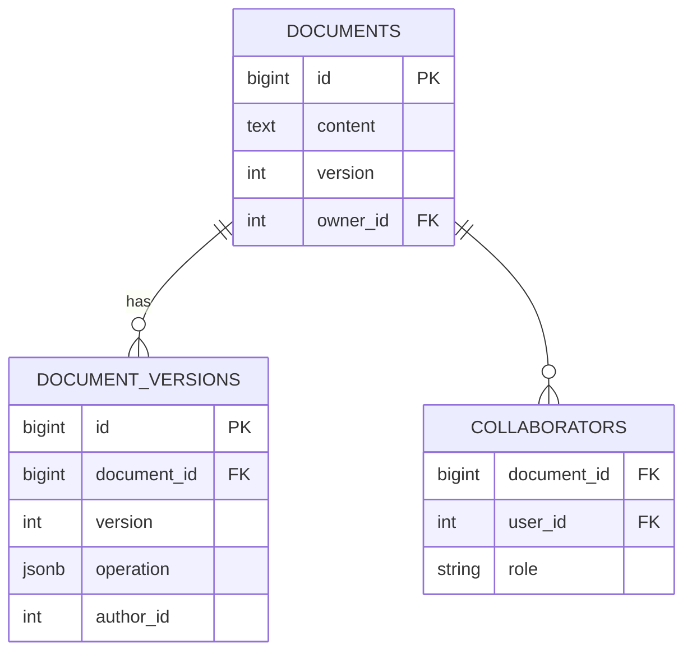
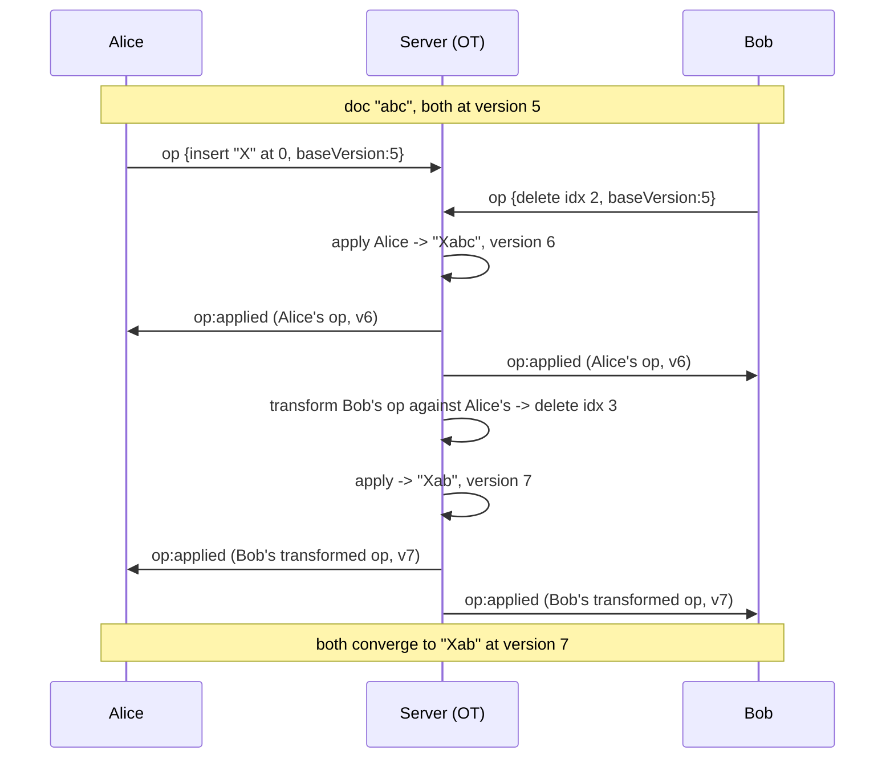

# 01 — Real-Time Collaborative Editor

🏢 **Asked at:** Google (Docs), Notion, Atlassian (Confluence), Figma

> Build a document editor where multiple people type at once and everyone's changes merge without overwriting each other — Google Docs in miniature. The signature concept is **Operational Transformation (OT)**: how to reconcile two simultaneous edits so neither is lost.

---

## 🎬 The Product Story

Two people open the same Google Doc. Alice types "Hello" at the start while Bob, at the same instant, deletes a word in the middle. Neither sees a frozen "someone else is editing" lock — both edits apply, the document stays consistent, and a moment later both screens show the *same* merged result. That seamless merge is deceptively hard: the two edits were authored against *different* versions of the document, so naively applying Bob's "delete at position 12" after Alice inserted 5 characters would delete the wrong thing.

Google and Figma ask this to probe whether you understand the concurrency problem at the heart of collaboration — and whether you can pick a pragmatic solution under time pressure (you cannot implement full OT in 90 minutes, and a good candidate knows that).

---

## 🔑 The Core Concept: Operational Transformation

> **Operational Transformation (OT)** represents every edit as an *operation* (e.g. "insert 'X' at position 5", "delete 3 chars at position 12") rather than sending the whole document. When two operations are made concurrently against the same base version, the server **transforms** one against the other so it applies correctly to the already-changed document.

**Concrete example:** the doc is `"abc"`. Simultaneously:
- Alice: `insert("X", 0)` → wants `"Xabc"`.
- Bob: `delete(1, 2)` (delete the char at index 2, `"c"`) → wants `"ab"`.

If the server applies Alice first (`"Xabc"`), Bob's `delete(1, 2)` now points at the wrong character (index 2 is now `"b"`). OT **transforms** Bob's op against Alice's: since Alice inserted 1 char *before* Bob's position, Bob's index shifts +1 → `delete(1, 3)`, correctly removing `"c"` from `"Xabc"` → `"Xab"`. Both intents preserved.

> **The interview-honest answer:** full OT (or its cousin CRDTs) is a large research-grade system. In 90 minutes you implement a **simplified last-write-wins with conflict notification** (achievable) and *explain* OT/CRDTs as the production path. Showing you know the difference is the win.

---

## 📋 Requirements (clarified)

**Functional:** multiple users edit a shared document; changes broadcast live; the document persists; show who's editing.
**Non-functional:** convergence (everyone ends with the same text); minimal data sent per keystroke; versioning.

**Clarifying questions:** How many concurrent editors? Is character-precise merging required, or is section/last-write-wins acceptable? Must we show cursors/presence? How important is offline support?

---

## 🧱 Database Schema



```sql
-- File: database/schema.sql
CREATE TABLE documents (
  id        BIGSERIAL PRIMARY KEY,
  owner_id  INTEGER NOT NULL REFERENCES users(id),
  title     VARCHAR(200) NOT NULL,
  content   TEXT NOT NULL DEFAULT '',
  version   INTEGER NOT NULL DEFAULT 0,                    -- increments on each applied op
  updated_at TIMESTAMPTZ NOT NULL DEFAULT now()
);
-- Append-only log of operations, enabling history/replay and conflict resolution.
CREATE TABLE document_versions (
  id          BIGSERIAL PRIMARY KEY,
  document_id BIGINT NOT NULL REFERENCES documents(id) ON DELETE CASCADE,
  version     INTEGER NOT NULL,                            -- the version this op produced
  operation   JSONB NOT NULL,                              -- {type:'insert'|'delete', pos, text|len}
  author_id   INTEGER NOT NULL REFERENCES users(id),
  created_at  TIMESTAMPTZ NOT NULL DEFAULT now(),
  UNIQUE (document_id, version)
);
CREATE TABLE collaborators (
  document_id BIGINT REFERENCES documents(id) ON DELETE CASCADE,
  user_id     INTEGER REFERENCES users(id) ON DELETE CASCADE,
  role        VARCHAR(10) NOT NULL DEFAULT 'editor',       -- 'editor' | 'viewer'
  PRIMARY KEY (document_id, user_id)
);
```

---

## 🔌 API + Socket Design

**REST:** `GET /documents/:id` (load content + version), `POST /documents` (create).
**Socket.io events:**
| Event | Direction | Payload |
|-------|-----------|---------|
| `doc:join` | client→server | `{documentId}` |
| `op` | client→server | `{documentId, baseVersion, operation}` |
| `op:applied` | server→clients | `{operation, version, authorId}` |
| `presence` | server→clients | who's currently editing |

---

## 🔄 Full Stack Flow Diagram (concurrent edits)



**Reading this diagram:** Both edits were authored against version 5. The server serializes them: it applies Alice's first (advancing to v6), then *transforms* Bob's operation so its position accounts for Alice's insert before re-applying it (v7). It broadcasts each applied/transformed op to everyone, so all clients replay the same operations in the same order and converge to identical text.

---

## 💻 Complete Working Code

```javascript
// File: server/ot/transform.js
// Transform operation `incoming` so it applies correctly AFTER `applied` already ran.
// Operations: {type:'insert', pos, text} or {type:'delete', pos, len}
function transform(incoming, applied) {
  const op = { ...incoming };

  if (applied.type === "insert") {
    // An insert before/at our position shifts us right by the inserted length.
    if (applied.pos <= op.pos) op.pos += applied.text.length;
  } else if (applied.type === "delete") {
    // A delete before us shifts us left by the deleted length (clamped at the delete point).
    if (applied.pos < op.pos) {
      op.pos -= Math.min(applied.len, op.pos - applied.pos);
    }
  }
  return op;
}

// Apply an operation to a string, returning the new string.
function apply(content, op) {
  if (op.type === "insert") {
    return content.slice(0, op.pos) + op.text + content.slice(op.pos);
  }
  if (op.type === "delete") {
    return content.slice(0, op.pos) + content.slice(op.pos + op.len);
  }
  return content;
}
module.exports = { transform, apply };
```

```javascript
// File: server/ot/docServer.js
const { Server } = require("socket.io");
const { verifyToken } = require("../auth/token");
const { query } = require("../db");
const { transform, apply } = require("./transform");

function attachDocSockets(httpServer) {
  const io = new Server(httpServer, { cors: { origin: "*" } });

  io.use((socket, next) => {                               // authenticate the socket
    try { socket.userId = verifyToken(socket.handshake.auth.token).sub; next(); }
    catch { next(new Error("Unauthorized")); }
  });

  io.on("connection", (socket) => {
    socket.on("doc:join", async ({ documentId }) => {
      // (In production: check collaborator role here.)
      socket.join(`doc:${documentId}`);
      const doc = (await query("SELECT content, version FROM documents WHERE id=$1", [documentId])).rows[0];
      socket.emit("doc:state", doc);                        // send current snapshot + version
    });

    socket.on("op", async ({ documentId, baseVersion, operation }) => {
      // Load current doc state under a transaction-ish read.
      const doc = (await query("SELECT content, version FROM documents WHERE id=$1", [documentId])).rows[0];
      if (!doc) return;

      // Transform the incoming op against every op the client hasn't seen yet
      // (versions baseVersion+1 .. doc.version).
      let op = operation;
      if (baseVersion < doc.version) {
        const missed = (await query(
          "SELECT operation FROM document_versions WHERE document_id=$1 AND version > $2 ORDER BY version",
          [documentId, baseVersion]
        )).rows;
        for (const m of missed) op = transform(op, m.operation); // rebase onto latest
      }

      // Apply, persist, bump version, log the op.
      const newContent = apply(doc.content, op);
      const newVersion = doc.version + 1;
      await query("UPDATE documents SET content=$1, version=$2, updated_at=now() WHERE id=$3",
        [newContent, newVersion, documentId]);
      await query("INSERT INTO document_versions (document_id, version, operation, author_id) VALUES ($1,$2,$3,$4)",
        [documentId, newVersion, op, socket.userId]);

      // Broadcast the (possibly transformed) op + new version to everyone.
      io.to(`doc:${documentId}`).emit("op:applied", { operation: op, version: newVersion, authorId: socket.userId });
    });
  });
  return io;
}
module.exports = { attachDocSockets };
```

```jsx
// File: client/src/components/CollaborativeEditor.jsx
import { useEffect, useRef, useState } from "react";
import { io } from "socket.io-client";

export function CollaborativeEditor({ documentId }) {
  const [content, setContent] = useState("");
  const versionRef = useRef(0);                            // the version our content reflects
  const socketRef = useRef(null);
  const applyingRemote = useRef(false);                    // guard: don't echo remote ops back

  useEffect(() => {
    const socket = io("http://localhost:4000", { auth: { token: localStorage.getItem("token") } });
    socketRef.current = socket;
    socket.emit("doc:join", { documentId });

    socket.on("doc:state", (doc) => { setContent(doc.content); versionRef.current = doc.version; });

    // Apply remote ops to our local content + advance our version.
    socket.on("op:applied", ({ operation, version }) => {
      applyingRemote.current = true;
      setContent((prev) => applyLocal(prev, operation));
      versionRef.current = version;
      applyingRemote.current = false;
    });

    return () => socket.disconnect();
  }, [documentId]);

  // Convert a textarea change into an insert/delete op (simplified: single contiguous change).
  function onChange(e) {
    if (applyingRemote.current) return;
    const next = e.target.value;
    const op = diffToOp(content, next);                    // compute minimal op
    setContent(next);                                      // optimistic local update
    if (op) socketRef.current.emit("op", { documentId, baseVersion: versionRef.current, operation: op });
  }

  return <textarea value={content} onChange={onChange} rows={20} cols={80} />;
}

// Apply an op to a local string (mirror of server apply()).
function applyLocal(s, op) {
  if (op.type === "insert") return s.slice(0, op.pos) + op.text + s.slice(op.pos);
  if (op.type === "delete") return s.slice(0, op.pos) + s.slice(op.pos + op.len);
  return s;
}

// Compute a single insert/delete op from old->new (handles one contiguous edit).
function diffToOp(oldStr, newStr) {
  if (oldStr === newStr) return null;
  let start = 0;
  while (start < oldStr.length && start < newStr.length && oldStr[start] === newStr[start]) start++;
  if (newStr.length > oldStr.length) {                     // insertion
    return { type: "insert", pos: start, text: newStr.slice(start, start + (newStr.length - oldStr.length)) };
  }
  return { type: "delete", pos: start, len: oldStr.length - newStr.length }; // deletion
}
```

### Running
```bash
psql fullstack_course < database/schema.sql
cd server && npm install socket.io && npm run dev
cd client && npm install socket.io-client && npm run dev
```

### What You Will See
Open the same document in two browser windows. Type in one — the text appears in the other within milliseconds. Now type in *both* at once at different positions: instead of one window clobbering the other, both edits survive and the two windows converge to identical text. Reload either window and the content (and version number) persists from the database. The `document_versions` table shows the ordered log of every operation.

---

## ⚠️ What Makes This Problem Tricky (5 Non-Obvious Traps)

🔴 **Trap 1:** Sending the whole document on every keystroke (last writer clobbers).
✅ Send small operations; transform and merge them.
💡 Whole-doc sync guarantees lost edits under concurrency.

🔴 **Trap 2:** Applying a remote op without transforming against missed ops.
✅ Rebase the incoming op against ops it hasn't seen.
💡 Positions drift; untransformed ops corrupt the text.

🔴 **Trap 3:** Echoing remote-applied ops back to the server as new local edits.
✅ An `applyingRemote` guard suppresses the change handler.
💡 Without it you get infinite op loops.

🔴 **Trap 4:** Claiming to implement "full OT" in 90 minutes.
✅ Build simplified merge; *explain* OT/CRDT as the production path.
💡 Interviewers reward honest scoping over a broken grand attempt.

🔴 **Trap 5:** No version log, so you can't reconcile or replay.
✅ Append-only `document_versions` with a version number.
💡 The op log is what makes convergence and history possible.

---

## 🌀 How the Interviewer Can Twist This Question (6 Extensions)

**Twist 1 (Auth/Security): Editor vs viewer roles**
🗣️ *"Viewers can see live changes but not edit."*
🛠️ All three.
💻
```javascript
// on doc:join check collaborators.role; reject "op" events from viewers
```

**Twist 2 (Real-time): Live cursors / presence**
🗣️ *"Show each user's cursor and selection."*
🛠️ Backend + Frontend.
💻
```javascript
// broadcast {userId, cursorPos} on selection change; render colored carets
```

**Twist 3 (Scale): CRDT instead of OT**
🗣️ *"Support offline editing and peer-to-peer."*
🛠️ Backend + Frontend.
💻
```text
// adopt a CRDT (e.g. Yjs): edits are commutative, converge without a central transform server
```

**Twist 4 (New feature): Comments / suggestions mode**
🗣️ *"Add inline comments anchored to text ranges."*
🛠️ All three.
💻
```sql
CREATE TABLE comments (id BIGSERIAL PRIMARY KEY, document_id BIGINT, anchor_from INT, anchor_to INT, body TEXT);
-- anchors must be transformed alongside ops to stay attached
```

**Twist 5 (Performance): Snapshot + compaction**
🗣️ *"The op log is huge; loading replays thousands of ops."*
🛠️ Backend.
💻
```javascript
// periodically store a content snapshot at version N; load snapshot + ops since N, not from 0
```

**Twist 6 (Resilience): Reconnect with op replay**
🗣️ *"A user reconnects after a dropout — catch them up."*
🛠️ Backend + Frontend.
💻
```javascript
// client sends lastVersion on reconnect; server sends all ops since then to replay locally
```

---

## 🧪 Test Cases (8 Cases)

| # | Action | Input | Expected | UI |
|---|--------|-------|----------|----|
| 1 | Single edit | insert | broadcast op | Other window updates |
| 2 | Concurrent edits | A insert + B delete | both preserved | Converge identically |
| 3 | Transform | op vs missed op | position adjusted | Correct merge |
| 4 | Persistence | reload | content + version | Restored |
| 5 | Version log | each op | row appended | History grows |
| 6 | Viewer edit | viewer op | rejected | No change |
| 7 | Reconnect | lastVersion | ops replayed | Caught up |
| 8 | No echo loop | remote applied | no re-emit | Stable |

---

## ⏱️ Time Budget

| Phase | Time | What to do |
|-------|------|-----------|
| Read & clarify | 6 min | char-precise vs LWW? presence? offline? |
| Concept + schema | 12 min | OT explanation, documents + versions tables |
| Socket design | 6 min | join / op / op:applied |
| Backend | 28 min | transform, apply, op handler with rebase, persistence |
| Frontend | 20 min | editor, diffToOp, remote-apply guard |
| Test | 12 min | concurrent merge, persistence, no-echo |

---

## 🎤 Famous Interview Questions

**Q1 (Conceptual): What is Operational Transformation and what problem does it solve?**
🏢 *Asked at: Google*
✅ Answer: OT lets multiple people edit the same document concurrently without losing changes. Instead of syncing whole documents, each edit is an operation like "insert at position 5"; when two operations are made against the same base version, the server transforms one against the other so its positions account for the change the other already made. This preserves both users' intent and guarantees every client converges to the same final text after replaying the same ordered operations.
💡 Bonus insight: The hard part isn't the simple two-op case but proving convergence for *all* interleavings — which is why real systems either use heavily-tested OT libraries or switch to CRDTs that are commutative by construction.

**Q2 (Design Decision): Why send operations instead of the full document?**
🏢 *Asked at: Notion*
✅ Answer: Sending the whole document on each change means the last writer overwrites everyone else's concurrent edits — the classic lost-update problem — and wastes bandwidth. Operations are tiny, express *intent* ("insert X here"), and can be transformed and merged so concurrent edits coexist. They also give you a replayable history for free, which enables versioning, undo, and catching up reconnecting clients. So operations are both more correct and more efficient.
💡 Bonus insight: Operations also make presence and comments tractable — cursors and comment anchors are just positions that get transformed alongside text ops, so they stay attached as the document changes.

**Q3 (Trade-off): OT vs CRDT — when would you choose each?**
🏢 *Asked at: Figma*
✅ Answer: OT relies on a central server to order and transform operations, which fits client-server web apps and keeps the data model simple, but the transform functions are notoriously tricky to get exhaustively correct. CRDTs make operations commutative by design so they converge without a central transformer, which is ideal for offline-first and peer-to-peer scenarios, at the cost of more complex data structures and metadata overhead. I'd use OT for a server-centric doc editor and CRDTs when offline/P2P or decentralization matters.
💡 Bonus insight: Figma famously uses a custom CRDT-like approach precisely because design tools need robust concurrent editing of structured data, whereas Google Docs historically used OT with a central server.

**Q4 (Extension): How would you handle a huge operation log efficiently?**
🏢 *Asked at: Atlassian*
✅ Answer: Replaying thousands of operations from version 0 on every load is wasteful, so I'd periodically persist a content *snapshot* at a given version and then only store/replay operations since that snapshot. Loading becomes "fetch the latest snapshot plus the handful of ops after it." I'd also compact or archive old ops. For reconnecting clients, I send only the ops after their last-known version rather than the whole history.
💡 Bonus insight: Snapshotting is the same idea as event-sourcing checkpoints — the op log is the source of truth, but snapshots bound the replay cost so load time stays constant regardless of document age.

**Q5 (Security/Edge case): What edge cases and security concerns matter?**
🏢 *Asked at: Google*
✅ Answer: Authenticate the socket and enforce collaborator roles so viewers can't emit edits and non-collaborators can't join. Guard against the local echo loop where a remote-applied op gets re-sent as a new edit. Handle reconnection by replaying missed ops so a client doesn't apply an op against a stale base. Sanitize content if it's ever rendered as HTML. And bound operation sizes/rates to prevent a malicious client from flooding the document with ops.
💡 Bonus insight: The echo-loop guard is the subtle correctness bug — without distinguishing "the user typed this" from "the server told me to apply this," you get an infinite operation storm that corrupts the document instantly.

---

## 🔗 Navigation
⬅️ Previous: [Module 04 Home](./README.md)
➡️ Next: [02 — Job Queue System](./02-job-queue-system.md)
🏠 [Module Home](./README.md)
