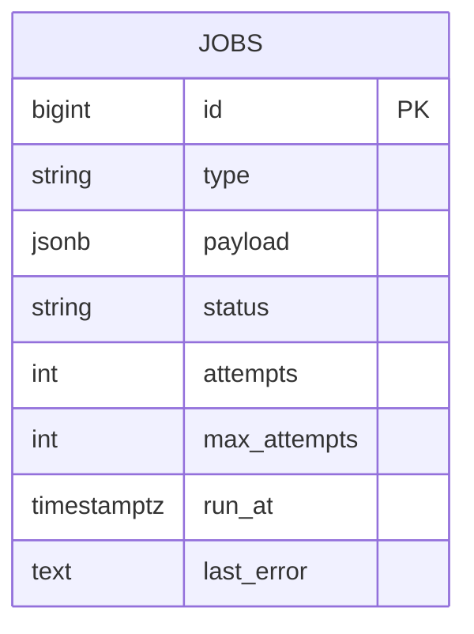

# 02 — Job Queue System

🏢 **Asked at:** Uber, Swiggy, Amazon, Atlassian

> Build a background job system: instead of doing slow work (sending email, resizing images, generating reports) during the API request, push it onto a queue and process it asynchronously with workers. The signature lessons: **decoupling slow work from the request path** and **reliable processing with retries**.

---

## 🎬 The Product Story

> A **job queue** is like a restaurant. The waiter (your API) takes your order in seconds and hands a ticket to the kitchen (the queue). The cooks (workers) prepare meals in the background. You don't stand at the counter while your food cooks — and the restaurant can hire more cooks when busy.

A user clicks "Export my data." If your API generated the 50MB report *during* the request, the user would stare at a spinner for 30 seconds and the request might time out. Instead, the API enqueues a "generate_report" job and returns instantly ("We'll email you when it's ready"). A worker picks up the job, does the slow work, and marks it done. Uber and Amazon ask this because async processing is fundamental to any system that does work heavier than a quick DB query.

---

## 📋 Requirements (clarified)

**Functional:** enqueue jobs of various types with a payload; workers process them in the background; track status (pending → processing → done/failed); retry failures; query a job's status.
**Non-functional:** the API returns immediately; jobs aren't lost; failed jobs retry then dead-letter; multiple workers can run safely.

**Clarifying questions:** In-memory or durable (DB/Redis)? Job types? Max retries? Do we need scheduled/delayed jobs? Priority levels?

---

## 🧱 Database Schema



```sql
-- File: database/schema.sql
CREATE TABLE jobs (
  id           BIGSERIAL PRIMARY KEY,
  type         VARCHAR(60) NOT NULL,                       -- 'send_email' | 'resize_image' | 'report'
  payload      JSONB NOT NULL,
  status       VARCHAR(12) NOT NULL DEFAULT 'PENDING'      -- PENDING|PROCESSING|DONE|FAILED
               CHECK (status IN ('PENDING','PROCESSING','DONE','FAILED')),
  attempts     INTEGER NOT NULL DEFAULT 0,
  max_attempts INTEGER NOT NULL DEFAULT 3,
  run_at       TIMESTAMPTZ NOT NULL DEFAULT now(),         -- earliest time to run (for delays/backoff)
  last_error   TEXT,
  created_at   TIMESTAMPTZ NOT NULL DEFAULT now()
);
-- Workers poll for "runnable" jobs: pending and due. Partial index keeps it fast.
CREATE INDEX idx_jobs_runnable ON jobs(run_at) WHERE status = 'PENDING';
```

---

## 🔌 API Design

| Method | Path | Auth | Purpose |
|--------|------|------|---------|
| POST | `/api/v1/jobs` | ✅ | Enqueue a job → returns `{id, status:PENDING}` immediately |
| GET | `/api/v1/jobs/:id` | ✅ | Poll job status/result |

---

## 🔄 Full Stack Flow Diagram (enqueue → process)

```mermaid
sequenceDiagram
  participant U as User (React)
  participant E as Express API
  participant Q as jobs table (queue)
  participant W as Worker
  U->>E: POST /jobs {type:"report"}
  E->>Q: INSERT job (PENDING)
  E-->>U: 202 Accepted {id, status:PENDING}   -- returns instantly
  loop worker tick
    W->>Q: claim one runnable job (FOR UPDATE SKIP LOCKED -> PROCESSING)
    W->>W: run the handler for job.type
    alt success
      W->>Q: status=DONE
    else error
      W->>Q: attempts++; if attempts<max -> PENDING, run_at=now()+backoff; else FAILED
    end
  end
  U->>E: GET /jobs/:id  (poll)
  E-->>U: {status:DONE, result}
```

**Reading this diagram:** The API's only job is to insert a row and return `202 Accepted` instantly — the user never waits for the slow work. A separate worker loop atomically claims one due job (using `SKIP LOCKED` so multiple workers never grab the same one), runs the matching handler, and marks it done — or, on failure, schedules a backed-off retry until it exhausts attempts and dead-letters as `FAILED`. The client polls for the result.

---

## 💻 Complete Working Code

```javascript
// File: server/queue/enqueue.js
const { query } = require("../db");
// Add a job to the queue. Returns immediately; the worker does the work later.
async function enqueue(type, payload, { delaySeconds = 0, maxAttempts = 3 } = {}) {
  const { rows } = await query(
    `INSERT INTO jobs (type, payload, max_attempts, run_at)
     VALUES ($1,$2,$3, now() + ($4 || ' seconds')::interval)
     RETURNING id, status`,
    [type, payload, maxAttempts, String(delaySeconds)]
  );
  return rows[0];
}
module.exports = { enqueue };
```

```javascript
// File: server/queue/handlers.js
// Map of job type -> async handler. Add new job types here.
const handlers = {
  async send_email(payload) {
    // simulate sending an email
    await new Promise((r) => setTimeout(r, 200));
    if (!payload.to) throw new Error("missing recipient");
    return { sentTo: payload.to };
  },
  async resize_image(payload) {
    await new Promise((r) => setTimeout(r, 300));
    return { resized: `${payload.key}@thumb` };
  },
  async report(payload) {
    await new Promise((r) => setTimeout(r, 500));
    return { url: `/reports/${payload.userId}.csv` };
  },
};
module.exports = { handlers };
```

```javascript
// File: server/queue/worker.js
const { pool, query } = require("../db");
const { handlers } = require("./handlers");

const backoffSeconds = (attempt) => Math.pow(2, attempt);   // 2,4,8...

// Claim ONE runnable job atomically so concurrent workers don't double-process.
async function claimJob(client) {
  const { rows } = await client.query(
    `UPDATE jobs SET status='PROCESSING', attempts = attempts + 1
     WHERE id = (
       SELECT id FROM jobs
       WHERE status='PENDING' AND run_at <= now()
       ORDER BY run_at
       FOR UPDATE SKIP LOCKED                                -- skip rows other workers locked
       LIMIT 1
     )
     RETURNING id, type, payload, attempts, max_attempts`
  );
  return rows[0] || null;
}

async function tick() {
  const client = await pool.connect();
  try {
    await client.query("BEGIN");
    const job = await claimJob(client);
    await client.query("COMMIT");                            // commit the claim before running
    if (!job) { client.release(); return; }

    try {
      const handler = handlers[job.type];
      if (!handler) throw new Error(`No handler for ${job.type}`);
      const result = await handler(job.payload);
      await query("UPDATE jobs SET status='DONE', payload = payload || $2 WHERE id=$1",
        [job.id, { result }]);                               // store result in payload
    } catch (err) {
      if (job.attempts >= job.max_attempts) {
        await query("UPDATE jobs SET status='FAILED', last_error=$2 WHERE id=$1", [job.id, err.message]);
      } else {
        // Retry later with exponential backoff.
        await query(
          "UPDATE jobs SET status='PENDING', last_error=$2, run_at = now() + ($3 || ' seconds')::interval WHERE id=$1",
          [job.id, err.message, String(backoffSeconds(job.attempts))]
        );
      }
    }
  } catch (e) {
    await client.query("ROLLBACK").catch(() => {});
  } finally {
    client.release();
  }
}

function startWorker() {
  setInterval(() => { tick().catch(console.error); }, 500); // poll every 500ms
}
module.exports = { startWorker, tick };
```

```javascript
// File: server/controllers/jobController.js
const { enqueue } = require("../queue/enqueue");
const { query } = require("../db");

const JobController = {
  async create(req, res) {
    const { type, payload } = req.body;
    if (!type) return res.status(400).json({ success: false, error: "type required" });
    const job = await enqueue(type, { ...payload, userId: req.user.id });
    // 202 Accepted = "received, processing asynchronously".
    res.status(202).json({ success: true, data: job });
  },
  async get(req, res) {
    const job = (await query("SELECT id, type, status, attempts, payload, last_error FROM jobs WHERE id=$1", [req.params.id])).rows[0];
    if (!job) return res.status(404).json({ success: false, error: "Job not found" });
    res.status(200).json({ success: true, data: job });
  },
};
module.exports = { JobController };
```

```javascript
// File: server/index.js (start the worker alongside the API)
const { startWorker } = require("./queue/worker");
startWorker();    // in production: run workers as separate processes, scaled independently
```

```jsx
// File: client/src/components/JobRunner.jsx
import { useState, useRef } from "react";
import { apiFetch } from "../api/client";

export function JobRunner() {
  const [status, setStatus] = useState(null);
  const [result, setResult] = useState(null);
  const pollRef = useRef();

  async function run() {
    setResult(null);
    const job = await apiFetch("/jobs", { method: "POST", body: JSON.stringify({ type: "report", payload: {} }) });
    setStatus("PENDING");
    // Poll for completion.
    pollRef.current = setInterval(async () => {
      const j = await apiFetch(`/jobs/${job.id}`);
      setStatus(j.status);
      if (j.status === "DONE") { setResult(j.payload.result); clearInterval(pollRef.current); }
      if (j.status === "FAILED") { clearInterval(pollRef.current); }
    }, 1000);
  }

  return (
    <div>
      <button onClick={run} disabled={status === "PENDING" || status === "PROCESSING"}>Generate report</button>
      {status && <p>Status: {status}</p>}
      {result && <a href={result.url}>Download report</a>}
    </div>
  );
}
```

### Running
```bash
psql fullstack_course < database/schema.sql
cd server && npm install && npm run dev    # API + worker
cd client && npm install && npm run dev
```

### What You Will See
Click "Generate report" — the button responds *instantly* with "Status: PENDING" (the API returned `202` without doing the slow work). Within a second or two the poll flips it to "PROCESSING" then "DONE," and a download link appears. Enqueue a `send_email` job with no recipient and watch the `jobs` row retry (attempts 1, 2, 3 with growing `run_at` gaps) before landing on `FAILED` with `last_error="missing recipient"`. Run two worker processes and no job is ever processed twice.

---

## ⚠️ What Makes This Problem Tricky (5 Non-Obvious Traps)

🔴 **Trap 1:** Doing the slow work inside the API request.
✅ Enqueue and return `202`; a worker does the work.
💡 The whole point — keeps the request path fast and timeout-free.

🔴 **Trap 2:** Two workers grabbing the same job (double processing).
✅ `FOR UPDATE SKIP LOCKED` to claim atomically.
💡 The standard pattern for a safe DB-backed queue.

🔴 **Trap 3:** Failing jobs vanish or retry forever.
✅ Track attempts; retry with backoff; dead-letter at max.
💡 Bounded retries + a FAILED terminal state.

🔴 **Trap 4:** Returning `200` for an async accept.
✅ `202 Accepted` signals "processing later."
💡 Correct semantics; the client knows to poll.

🔴 **Trap 5:** A crashed worker leaves jobs stuck in PROCESSING forever.
✅ A reaper that re-queues PROCESSING jobs idle too long (visibility timeout).
💡 Resilience to worker crashes mid-job.

---

## 🌀 How the Interviewer Can Twist This Question (6 Extensions)

**Twist 1 (Auth/Security): Scope jobs to their owner**
🗣️ *"Users can only see their own jobs."*
🛠️ Backend.
💻
```sql
ALTER TABLE jobs ADD COLUMN user_id INT; -- GET /jobs/:id checks job.user_id = req.user.id
```

**Twist 2 (Real-time): Push job completion via WebSocket**
🗣️ *"Notify the user the instant the job finishes (no polling)."*
🛠️ Backend + Frontend.
💻
```javascript
// on DONE, io.to(`user:${userId}`).emit("job:done", {id, result})
```

**Twist 3 (Scale): Real broker (Redis/BullMQ, SQS)**
🗣️ *"Millions of jobs/day — DB polling won't keep up."*
🛠️ Backend.
💻
```text
// move to BullMQ (Redis) or SQS: built-in priorities, delays, retries, DLQ; workers consume
```

**Twist 4 (New feature): Priorities & scheduled jobs**
🗣️ *"High-priority jobs jump the queue; some run at a future time."*
🛠️ Backend.
💻
```sql
ALTER TABLE jobs ADD COLUMN priority INT DEFAULT 0;
-- claim: ORDER BY priority DESC, run_at; run_at in future = scheduled
```

**Twist 5 (Performance): Batch claiming**
🗣️ *"Claim N jobs per tick to raise throughput."*
🛠️ Backend.
💻
```sql
-- SELECT ... FOR UPDATE SKIP LOCKED LIMIT 10; process the batch concurrently
```

**Twist 6 (Resilience): Idempotent handlers + dedupe key**
🗣️ *"A retried job shouldn't send two emails."*
🛠️ All three.
💻
```sql
ALTER TABLE jobs ADD COLUMN dedupe_key VARCHAR(80) UNIQUE; -- enqueue is a no-op if key exists
```

---

## 🧪 Test Cases (8 Cases)

| # | Action | Input | Expected | UI |
|---|--------|-------|----------|----|
| 1 | Enqueue | `{type:"report"}` | `202 {PENDING}` | Instant response |
| 2 | Process | worker tick | DONE + result | Poll shows DONE |
| 3 | Unknown type | `{type:"x"}` | retries→FAILED | "No handler" error |
| 4 | Retry/backoff | failing job | attempts++, gaps grow | Eventually FAILED |
| 5 | Two workers | one job | processed once | No duplicate |
| 6 | Poll status | job id | `200 {status}` | Live updates |
| 7 | Stuck job reaped | crashed worker | re-queued | Re-processed |
| 8 | Missing type | `{}` | `400` | Error |

---

## ⏱️ Time Budget

| Phase | Time | What to do |
|-------|------|-----------|
| Read & clarify | 5 min | durable? job types? retries? priorities? |
| Schema | 8 min | jobs table + runnable partial index |
| API design | 4 min | enqueue (202) + status poll |
| Backend | 28 min | enqueue, handlers, worker (SKIP LOCKED, backoff) |
| Frontend | 16 min | JobRunner with polling |
| Test | 12 min | async accept, retry, no-double-process |
| Buffer | 7 min | stuck-job reaper |

---

## 🎤 Famous Interview Questions

**Q1 (Conceptual): Why use a job queue instead of doing the work in the request?**
🏢 *Asked at: Uber*
✅ Answer: Slow or unreliable work — sending email, resizing images, calling third-party APIs, generating reports — would make the request hang, risk timeouts, and tie up web server capacity. A queue lets the API do the minimum (record the request, return `202`) and hand the heavy work to background workers that process it independently. This keeps the user-facing path fast and responsive, lets you scale workers separately from the API, and makes the work retryable if it fails.
💡 Bonus insight: It also smooths spikes — a burst of requests enqueues quickly and workers drain the backlog at a sustainable rate, instead of overwhelming a downstream service all at once.

**Q2 (Design Decision): How do you prevent two workers from processing the same job?**
🏢 *Asked at: Amazon*
✅ Answer: With a database-backed queue I claim a job using `SELECT ... FOR UPDATE SKIP LOCKED LIMIT 1` inside a transaction and immediately set it to PROCESSING. `SKIP LOCKED` means a worker ignores rows another worker has already locked, so each worker grabs a distinct job with no contention or double-processing. With a dedicated broker like SQS or BullMQ, this is handled natively via visibility timeouts and atomic dequeue.
💡 Bonus insight: `SKIP LOCKED` is what makes Postgres a genuinely viable queue — without it, concurrent workers would block on the same locked row, serializing throughput.

**Q3 (Trade-off): Database-backed queue vs a dedicated broker (Redis/SQS)?**
🏢 *Asked at: Atlassian*
✅ Answer: A DB queue needs no new infrastructure, is transactional (you can enqueue a job in the same transaction as a business write), and is easy to inspect — great up to moderate volume. But it relies on polling, which adds latency and load, and lacks built-in features. A dedicated broker offers push delivery, priorities, delays, dead-letter queues, and high throughput, at the cost of operating another system and losing transactional coupling with your DB. I'd start with the DB and migrate when volume or features demand it.
💡 Bonus insight: The transactional enqueue is an underrated DB-queue advantage — "create order AND enqueue fulfillment, atomically" is trivial in one DB transaction but requires the outbox pattern when the queue is external.

**Q4 (Extension): How do you guarantee a retried job doesn't cause duplicate side effects?**
🏢 *Asked at: Amazon*
✅ Answer: Job processing is at-least-once, so handlers must be idempotent. I give jobs a dedupe key so re-enqueuing the same logical work is a no-op, and inside the handler I make the side effect idempotent — e.g. check whether the email was already recorded as sent before sending, or use an idempotency key with the email provider. That way a retry after a partial failure re-runs safely without sending twice.
💡 Bonus insight: This mirrors the payments idempotency lesson — since exactly-once delivery is effectively impossible across failures, you make the *effect* exactly-once by designing the handler to tolerate replays.

**Q5 (Security/Edge case): What edge cases and reliability concerns matter?**
🏢 *Asked at: Uber*
✅ Answer: Handle worker crashes mid-job with a reaper that re-queues jobs stuck in PROCESSING past a visibility timeout. Bound retries and dead-letter exhausted jobs with their error for inspection. Make handlers idempotent for safe retries. Scope job status to its owner so users can't read others' jobs or results. Cap payload size and validate job type to a known handler. And monitor queue depth so a growing backlog triggers scaling or alerts.
💡 Bonus insight: The stuck-PROCESSING case is the classic reliability gap — without a visibility timeout/reaper, a single worker crash silently strands jobs forever, and nobody notices until a user asks where their report went.

---

## 🔗 Navigation
⬅️ Previous: [01 — Real-Time Collaborative Editor](./01-realtime-collaborative-editor.md)
➡️ Next: [03 — Multi-Tenant SaaS App](./03-multi-tenant-saas-app.md)
🏠 [Module Home](./README.md)
