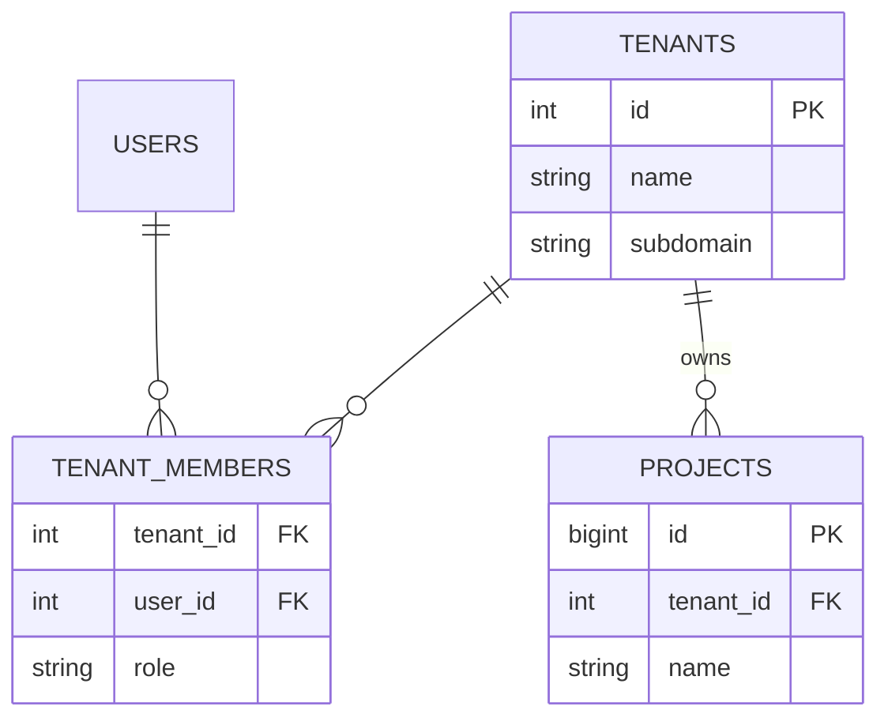
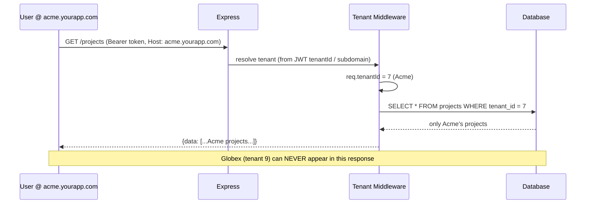

# 03 — Multi-Tenant SaaS App

🏢 **Asked at:** Freshworks, Zoho, Chargebee, Atlassian

> Build a SaaS where one application serves many customer organizations (tenants) and each tenant's data is completely isolated from the others. The signature lessons: **row-level isolation** with a `tenant_id` on every table, and **tenant resolution** from the subdomain or token.

---

## 🎬 The Product Story

> **Multi-tenancy** means one running application serves many separate customers (tenants), each seeing only their own data — like an apartment building where everyone shares the structure but each apartment has its own lock. Acme Corp and Globex both use the same Freshworks instance, but Acme must *never* see Globex's tickets, contacts, or users.

A new company signs up at `acme.yourapp.com`. They invite their team, create data, and it all lives in the same database as every other customer's — but tagged with their tenant id and filtered on every query. Get this wrong and you leak one customer's data to another, the single most catastrophic bug a SaaS can ship. Freshworks and Zoho (both multi-tenant SaaS companies) ask this to see if isolation is baked into your architecture, not bolted on.

---

## 🔑 The Core Concept: Tenant Isolation Strategies

Three common approaches, from simplest to most isolated:

| Strategy | How | Pros | Cons |
|----------|-----|------|------|
| **Shared DB, shared schema** (row-level) | One DB, a `tenant_id` column on every table; filter on it | Simple, cheap, easy to scale operationally | Isolation depends on *never* forgetting the filter |
| Shared DB, schema-per-tenant | One DB, a Postgres schema per tenant | Stronger isolation, per-tenant migration | Many schemas get unwieldy |
| DB-per-tenant | A separate database per tenant | Strongest isolation | Expensive, complex at scale |

> For an interview, implement **row-level isolation** (the most common real-world choice) and *centralize* the tenant filter so it's impossible to forget. Mention the others as trade-offs.

---

## 📋 Requirements (clarified)

**Functional:** organizations sign up; users belong to a tenant; all resources (e.g. projects) are scoped to the tenant; a user only ever sees their tenant's data; tenant is resolved from subdomain or JWT.
**Non-functional:** isolation is enforced centrally (not per-query by hand); fast tenant-scoped queries.

**Clarifying questions:** Isolation model (row/schema/db)? Tenant from subdomain or token? Can a user belong to multiple tenants? Per-tenant roles?

---

## 🧱 Database Schema



```sql
-- File: database/schema.sql
CREATE TABLE tenants (
  id        SERIAL PRIMARY KEY,
  name      VARCHAR(120) NOT NULL,
  subdomain VARCHAR(63) NOT NULL UNIQUE                    -- acme -> acme.yourapp.com
);
CREATE TABLE tenant_members (
  tenant_id INTEGER NOT NULL REFERENCES tenants(id) ON DELETE CASCADE,
  user_id   INTEGER NOT NULL REFERENCES users(id) ON DELETE CASCADE,
  role      VARCHAR(10) NOT NULL DEFAULT 'member',         -- 'admin' | 'member'
  PRIMARY KEY (tenant_id, user_id)
);

-- EVERY tenant-scoped table carries tenant_id and indexes it.
CREATE TABLE projects (
  id         BIGSERIAL PRIMARY KEY,
  tenant_id  INTEGER NOT NULL REFERENCES tenants(id) ON DELETE CASCADE,
  name       VARCHAR(150) NOT NULL,
  created_at TIMESTAMPTZ NOT NULL DEFAULT now()
);
CREATE INDEX idx_projects_tenant ON projects(tenant_id);   -- every query filters by tenant_id
```

> **The discipline:** `tenant_id NOT NULL` on every tenant-scoped table, indexed, and *every* query filters by it. The danger is human error — forgetting the filter once leaks data — so we make the filter automatic (below).

---

## 🔌 API Design

| Method | Path | Auth | Purpose |
|--------|------|------|---------|
| POST | `/api/v1/signup` | – | Create tenant + first admin user |
| POST | `/api/v1/projects` | ✅ | Create a project (auto-scoped to tenant) |
| GET | `/api/v1/projects` | ✅ | List the tenant's projects only |

The JWT carries `tenantId`; middleware extracts it and *all* queries use it.

---

## 🔄 Full Stack Flow Diagram (tenant-scoped request)



**Reading this diagram:** Every authenticated request resolves the tenant once (from the verified JWT, cross-checked with the subdomain), pins it to `req.tenantId`, and every query is filtered by it. Because the tenant comes from the trusted token — not anything the client can freely set in a body — a user can't request another tenant's data.

---

## 💻 Complete Working Code

```javascript
// File: server/middleware/tenant.js
const { verifyToken } = require("../auth/token");

// Resolve the tenant from the JWT (authoritative) and optionally verify it matches the subdomain.
function resolveTenant(req, res, next) {
  const header = req.headers.authorization || "";
  const token = header.startsWith("Bearer ") ? header.slice(7) : null;
  if (!token) return res.status(401).json({ success: false, error: "Authentication required" });

  let payload;
  try { payload = verifyToken(token); }
  catch { return res.status(401).json({ success: false, error: "Invalid token" }); }

  req.user = { id: payload.sub };
  req.tenantId = payload.tenantId;                          // TRUSTED source of tenant identity
  if (!req.tenantId) return res.status(403).json({ success: false, error: "No tenant context" });

  // Optional defense-in-depth: ensure the subdomain matches the token's tenant.
  const host = req.headers.host || "";
  const sub = host.split(".")[0];
  if (payload.subdomain && sub && sub !== payload.subdomain) {
    return res.status(403).json({ success: false, error: "Tenant mismatch" });
  }
  next();
}
module.exports = { resolveTenant };
```

```javascript
// File: server/db/tenantScoped.js
const { query } = require("../db");

// A thin wrapper that FORCES every query to include tenant_id, so you can't forget it.
// Each method takes tenantId explicitly as the first argument.
const TenantDB = {
  listProjects: (tenantId) =>
    query("SELECT id, name, created_at FROM projects WHERE tenant_id = $1 ORDER BY created_at DESC", [tenantId])
      .then((r) => r.rows),

  createProject: (tenantId, name) =>
    query("INSERT INTO projects (tenant_id, name) VALUES ($1, $2) RETURNING id, name, created_at", [tenantId, name])
      .then((r) => r.rows[0]),

  getProject: (tenantId, id) =>
    query("SELECT id, name FROM projects WHERE id = $1 AND tenant_id = $2", [id, tenantId])
      .then((r) => r.rows[0] || null),
};
module.exports = { TenantDB };
```

```javascript
// File: server/controllers/projectController.js
const { TenantDB } = require("../db/tenantScoped");

const ProjectController = {
  async list(req, res) {
    // req.tenantId comes from the middleware — NEVER from req.body/query.
    const projects = await TenantDB.listProjects(req.tenantId);
    res.status(200).json({ success: true, data: projects });
  },
  async create(req, res) {
    if (!req.body.name?.trim()) return res.status(400).json({ success: false, error: "name required" });
    const project = await TenantDB.createProject(req.tenantId, req.body.name.trim());
    res.status(201).json({ success: true, data: project });
  },
  async get(req, res) {
    const project = await TenantDB.getProject(req.tenantId, req.params.id);
    if (!project) return res.status(404).json({ success: false, error: "Project not found" }); // 404, not 403, to avoid leaking existence
    res.status(200).json({ success: true, data: project });
  },
};
module.exports = { ProjectController };
```

```javascript
// File: server/controllers/signupController.js
const bcrypt = require("bcrypt");
const { pool } = require("../db");
const { signToken } = require("../auth/token");

const SignupController = {
  // Create a tenant and its first admin user atomically.
  async signup(req, res) {
    const { orgName, subdomain, email, password } = req.body;
    const client = await pool.connect();
    try {
      await client.query("BEGIN");
      const tenant = (await client.query(
        "INSERT INTO tenants (name, subdomain) VALUES ($1,$2) RETURNING id, subdomain", [orgName, subdomain]
      )).rows[0];
      const user = (await client.query(
        "INSERT INTO users (email, password_hash) VALUES ($1,$2) RETURNING id, email",
        [email, await bcrypt.hash(password, 10)]
      )).rows[0];
      await client.query(
        "INSERT INTO tenant_members (tenant_id, user_id, role) VALUES ($1,$2,'admin')",
        [tenant.id, user.id]
      );
      await client.query("COMMIT");
      // Token embeds the tenant context.
      const token = signToken({ id: user.id, tenantId: tenant.id, subdomain: tenant.subdomain });
      res.status(201).json({ success: true, data: { token, tenant, user } });
    } catch (e) {
      await client.query("ROLLBACK");
      if (e.code === "23505") return res.status(409).json({ success: false, error: "Subdomain or email taken" });
      throw e;
    } finally {
      client.release();
    }
  },
};
module.exports = { SignupController };
```

> Note: `signToken` here includes `tenantId` and `subdomain` in the JWT payload (extend the `token.js` from the foundations to carry these claims).

```javascript
// File: server/routes/projects.js
const express = require("express");
const router = express.Router();
const { ProjectController } = require("../controllers/projectController");
const { resolveTenant } = require("../middleware/tenant");
const { asyncHandler } = require("../middleware/asyncHandler");

router.use(resolveTenant);                                  // every route below is tenant-scoped
router.get("/", asyncHandler(ProjectController.list));
router.post("/", asyncHandler(ProjectController.create));
router.get("/:id", asyncHandler(ProjectController.get));
module.exports = router;
```

### Frontend (tenant-aware)

```jsx
// File: client/src/components/TenantSwitcher.jsx
// If a user belongs to multiple tenants, switching changes the active token/subdomain.
import { useAuth } from "../context/AuthContext";

export function TenantSwitcher({ memberships }) {
  const { switchTenant } = useAuth();                       // re-issues a token for the chosen tenant
  return (
    <select onChange={(e) => switchTenant(Number(e.target.value))}>
      {memberships.map((m) => <option key={m.tenantId} value={m.tenantId}>{m.tenantName}</option>)}
    </select>
  );
}
```

```jsx
// File: client/src/pages/ProjectsPage.jsx
import { useEffect, useState } from "react";
import { apiFetch } from "../api/client";

export function ProjectsPage() {
  const [projects, setProjects] = useState([]);
  const [name, setName] = useState("");
  const [loading, setLoading] = useState(true);

  useEffect(() => { apiFetch("/projects").then(setProjects).finally(() => setLoading(false)); }, []);

  async function add(e) {
    e.preventDefault();
    if (!name.trim()) return;
    const p = await apiFetch("/projects", { method: "POST", body: JSON.stringify({ name }) });
    setProjects((prev) => [p, ...prev]);
    setName("");
  }

  if (loading) return <p>Loading…</p>;
  return (
    <div>
      <h1>Projects</h1>
      <form onSubmit={add}><input value={name} onChange={(e) => setName(e.target.value)} placeholder="New project" /><button>Add</button></form>
      {projects.length === 0 ? <p>No projects yet.</p> : <ul>{projects.map((p) => <li key={p.id}>{p.name}</li>)}</ul>}
    </div>
  );
}
```

### Running
```bash
psql fullstack_course < database/schema.sql
cd server && npm install && npm run dev
cd client && npm install && npm run dev
```

### What You Will See
Sign up "Acme" at `acme.yourapp.com` and "Globex" at `globex.yourapp.com`. Log in as an Acme user, create projects — you see only Acme's. Log in as Globex and you see a completely separate, empty list. Crucially, even if you tamper with a request to try to read project id from another tenant, you get `404` because the query is filtered by *your* tenant id (taken from the token, which you can't forge). Switching tenants (for multi-tenant users) re-issues a token and the data set changes accordingly.

---

## ⚠️ What Makes This Problem Tricky (5 Non-Obvious Traps)

🔴 **Trap 1:** Forgetting the `tenant_id` filter on a query → cross-tenant leak.
✅ Centralize tenant scoping (a wrapper/middleware) so it's automatic.
💡 The catastrophic SaaS bug; never rely on remembering per-query.

🔴 **Trap 2:** Trusting a `tenantId` from the request body/query.
✅ Derive tenant from the verified JWT (or validated subdomain).
💡 A client-controlled tenant id is a wide-open door.

🔴 **Trap 3:** Returning `403` for another tenant's resource (leaks existence).
✅ Return `404` — don't reveal that the id exists elsewhere.
💡 Even existence is cross-tenant information.

🔴 **Trap 4:** No index on `tenant_id`, so every query scans.
✅ Index `tenant_id` (often composite with other filters).
💡 Every query filters by it; it must be indexed.

🔴 **Trap 5:** Subdomain and token tenant disagreeing.
✅ Verify they match (defense in depth).
💡 Catches token-replay across tenants.

---

## 🌀 How the Interviewer Can Twist This Question (6 Extensions)

**Twist 1 (Auth/Security): Postgres Row-Level Security (RLS)**
🗣️ *"Enforce isolation at the database layer too."*
🛠️ DB.
💻
```sql
ALTER TABLE projects ENABLE ROW LEVEL SECURITY;
CREATE POLICY tenant_isolation ON projects USING (tenant_id = current_setting('app.tenant_id')::int);
-- set app.tenant_id per connection so even a forgotten filter can't leak
```

**Twist 2 (Real-time): Tenant-scoped WebSocket rooms**
🗣️ *"Live updates must stay within a tenant."*
🛠️ Backend.
💻
```javascript
// socket joins room `tenant:${tenantId}`; broadcasts never cross tenants
```

**Twist 3 (Scale): Per-tenant rate limits & quotas**
🗣️ *"Free tenants get smaller limits."*
🛠️ Backend.
💻
```javascript
// rate-limit keyed by tenantId; enforce plan quotas (projects per tenant) on create
```

**Twist 4 (New feature): Per-tenant roles & permissions**
🗣️ *"Admins manage members; members can't."*
🛠️ All three.
💻
```javascript
// tenant_members.role checked: requireTenantRole("admin") on member-management routes
```

**Twist 5 (Performance): Composite tenant indexes**
🗣️ *"Tenant-scoped filtered queries are slow."*
🛠️ DB.
💻
```sql
CREATE INDEX idx_projects_tenant_created ON projects(tenant_id, created_at DESC);
```

**Twist 6 (Resilience): Tenant data export / deletion (GDPR)**
🗣️ *"A tenant offboards — export then delete all their data."*
🛠️ Backend.
💻
```javascript
// ON DELETE CASCADE from tenants handles deletion; an export job dumps all tenant_id=X rows first
```

---

## 🧪 Test Cases (8 Cases)

| # | Action | Input | Expected | UI |
|---|--------|-------|----------|----|
| 1 | Signup tenant | org+admin | `201 {token}` | Logged in |
| 2 | Duplicate subdomain | taken | `409` | Error |
| 3 | List projects | tenant A token | only A's | A's list |
| 4 | Cross-tenant read | A reads B's id | `404` | Not found |
| 5 | Create project | name | `201` scoped to A | Appears |
| 6 | Tenant from token | tampered body tenantId | ignored | Uses token tenant |
| 7 | Subdomain mismatch | wrong host | `403` | Blocked |
| 8 | Switch tenant | multi-tenant user | different data | List changes |

---

## ⏱️ Time Budget

| Phase | Time | What to do |
|-------|------|-----------|
| Read & clarify | 6 min | isolation model? subdomain/token? multi-tenant users? |
| Schema | 10 min | tenants/members + tenant_id on every table + indexes |
| API design | 5 min | signup, tenant-scoped CRUD |
| Backend | 26 min | tenant middleware, scoped DB wrapper, signup txn |
| Frontend | 16 min | projects page, tenant switcher |
| Test | 12 min | isolation (cross-tenant 404), token-as-source-of-truth |

---

## 🎤 Famous Interview Questions

**Q1 (Conceptual): What is multi-tenancy and what are the isolation strategies?**
🏢 *Asked at: Freshworks*
✅ Answer: Multi-tenancy is one application instance serving many customer organizations while keeping each tenant's data isolated. The main strategies are: shared database with a `tenant_id` column on every row (cheapest, easiest to operate, isolation enforced in queries); schema-per-tenant (stronger isolation, separate namespaces, but many schemas to manage); and database-per-tenant (strongest isolation, but expensive and operationally heavy). Most SaaS uses row-level isolation because it scales operationally, reserving stronger models for high-compliance customers.
💡 Bonus insight: These aren't mutually exclusive — a common pattern is row-level for the bulk of customers and a dedicated database for a few enterprise tenants with strict isolation requirements.

**Q2 (Design Decision): Where does the tenant id come from, and why does that matter?**
🏢 *Asked at: Zoho*
✅ Answer: It must come from a trusted source — the verified JWT (and optionally cross-checked against the subdomain) — never from a value the client can set freely like a request body field. If you trusted a client-supplied tenant id, any user could request another tenant's data simply by changing it. By deriving `tenantId` from the signed token in middleware and using it for every query, the tenant boundary is enforced by something the client cannot forge.
💡 Bonus insight: Cross-checking the token's tenant against the request's subdomain is cheap defense-in-depth — it catches a token being replayed against the wrong tenant's host.

**Q3 (Trade-off): Application-level filtering vs database Row-Level Security?**
🏢 *Asked at: Chargebee*
✅ Answer: Application-level filtering (adding `WHERE tenant_id = ?` everywhere) is simple and portable but relies on developers never forgetting it — one missed filter leaks data. Postgres Row-Level Security pushes the constraint into the database: you set the tenant per connection and policies automatically restrict every query, so even a forgotten application filter can't leak across tenants. RLS is stronger defense-in-depth but adds DB complexity and must be wired into connection handling. I centralize the app filter and add RLS for critical tables.
💡 Bonus insight: RLS turns isolation from a discipline you must remember into an invariant the database guarantees — which is exactly the property you want for the one bug class that can sink the whole company.

**Q4 (Extension): How would you scale and offboard tenants?**
🏢 *Asked at: Atlassian*
✅ Answer: For scale I ensure every tenant-scoped query uses a composite index leading with `tenant_id`, apply per-tenant rate limits and quotas, and can shard very large tenants to dedicated databases if needed. For offboarding, `ON DELETE CASCADE` from the tenants table cleanly removes all tenant data, and before deletion I run an export job that dumps every `tenant_id = X` row for compliance (GDPR/data portability). I'd also support per-tenant data residency if customers require it.
💡 Bonus insight: A "noisy neighbor" is a real multi-tenant risk — one heavy tenant degrading others — so per-tenant rate limits and the option to isolate a big tenant onto its own resources are part of scaling, not just performance tuning.

**Q5 (Security/Edge case): What's the worst failure mode and how do you prevent it?**
🏢 *Asked at: Freshworks*
✅ Answer: The catastrophic failure is a cross-tenant data leak — showing one customer another's data. I prevent it by deriving tenant from the trusted token, centralizing the tenant filter so individual queries can't forget it, indexing `tenant_id`, returning 404 (not 403) for other tenants' resources so I don't even leak existence, and adding database RLS as a backstop. I'd also test isolation explicitly: attempt cross-tenant access in tests and assert 404.
💡 Bonus insight: Returning 404 instead of 403 for another tenant's resource is a subtle but important choice — a 403 confirms the id exists somewhere, which itself is cross-tenant information leakage.

---

## 🔗 Navigation
⬅️ Previous: [02 — Job Queue System](./02-job-queue-system.md)
➡️ Next: [04 — Analytics Dashboard](./04-analytics-dashboard.md)
🏠 [Module Home](./README.md)
