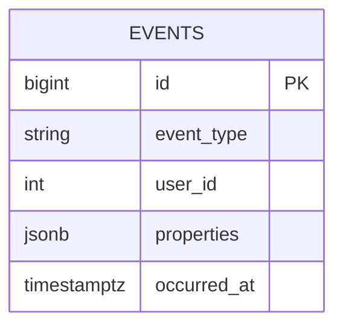
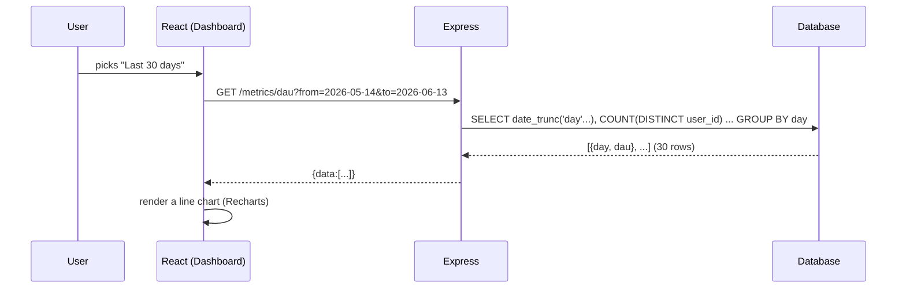

# 04 — Analytics Dashboard

🏢 **Asked at:** Meta, Google, BrowserStack, Razorpay, Freshworks

> Build a dashboard over event data: track events, then compute metrics like Daily Active Users (DAU), funnels, and charts over a date range. The signature lessons: modeling **time-series event data** and writing **aggregation queries** (the DAU query especially) that the interviewer will ask you to explain line by line.

---

## 🎬 The Product Story

Every product team lives in a dashboard: "How many users were active today? Last 30 days? What's our signup → activation → purchase funnel? Are we retaining users?" Behind those line charts and big numbers is a humble `events` table — one row per "thing that happened" (a page view, a click, a purchase) — and a set of SQL aggregations that roll millions of those rows into a handful of numbers.

Meta and Google ask this because analytics is everywhere internally, and the skill — modeling events flexibly and writing correct, efficient `GROUP BY`/`COUNT(DISTINCT)` queries over time — is exactly what data-intensive products need.

---

## 📋 Requirements (clarified)

**Functional:** record events (type, user, properties, timestamp); compute DAU over a date range; compute a conversion funnel; show charts; filter by date range.
**Non-functional:** queries efficient over large event volumes; flexible event properties; correct distinct-counting.

**Clarifying questions:** Which metrics (DAU/WAU, funnel, retention)? How flexible must event properties be? Real-time or batch-acceptable? Expected event volume?

---

## 🧱 Database Schema



```sql
-- File: database/schema.sql
-- One row per event. The fact table of the whole dashboard.
CREATE TABLE events (
  id          BIGSERIAL PRIMARY KEY,
  event_type  VARCHAR(60) NOT NULL,                        -- 'page_view' | 'signup' | 'purchase' ...
  user_id     INTEGER,                                     -- nullable (anonymous events)
  properties  JSONB,                                       -- flexible: {plan:'pro', amount:499}
  occurred_at TIMESTAMPTZ NOT NULL DEFAULT now()
);
-- Almost every analytic query filters/buckets by time, often per type.
CREATE INDEX idx_events_time ON events(occurred_at);
CREATE INDEX idx_events_type_time ON events(event_type, occurred_at);
-- (For DAU we also benefit from this composite.)
CREATE INDEX idx_events_user_time ON events(user_id, occurred_at);
```

> **Why `JSONB properties`?** Each event type carries different data (a purchase has `amount`, a page view has `path`). A flexible JSONB bag avoids a column explosion and lets new event types ship without migrations — the same flexible-schema pattern as the CRM problem.

---

## 🔌 API Design

| Method | Path | Auth | Purpose |
|--------|------|------|---------|
| POST | `/api/v1/events` | ✅ | Record an event |
| GET | `/api/v1/metrics/dau?from&to` | ✅ | Daily active users series |
| GET | `/api/v1/metrics/funnel?steps&from&to` | ✅ | Conversion funnel |
| GET | `/api/v1/metrics/summary?from&to` | ✅ | Top-line metrics (total events, unique users) |

---

## 🧮 The DAU Query (explained line by line)

**Daily Active Users** = the count of *distinct* users who did anything on each day.

```sql
SELECT
  date_trunc('day', occurred_at)::date AS day,   -- bucket each event into its calendar day
  COUNT(DISTINCT user_id) AS dau                  -- count UNIQUE users per day (not events!)
FROM events
WHERE occurred_at >= $1 AND occurred_at < $2      -- restrict to the requested date range
  AND user_id IS NOT NULL                          -- ignore anonymous events
GROUP BY day                                       -- one row per day
ORDER BY day;                                      -- chronological for the chart
```

Line by line:
- `date_trunc('day', occurred_at)` rounds each timestamp down to midnight, so all of a day's events share a bucket.
- `COUNT(DISTINCT user_id)` — the crux: a user active 50 times today counts **once**. Using plain `COUNT(*)` would give event volume, not active users — the #1 mistake here.
- `WHERE ... range` limits the scan (and uses the time index).
- `GROUP BY day` collapses events into one row per day; `ORDER BY` makes it chart-ready.

---

## 🔄 Full Stack Flow Diagram (load DAU chart)



**Reading this diagram:** Choosing a range issues one aggregation query. The database does the heavy lifting — bucketing millions of events by day and distinct-counting users — and returns a tiny series (one number per day). React just plots it. The cost lives in the database (helped by the time index), not in shipping raw events to the client.

---

## 💻 Complete Working Code

```javascript
// File: server/controllers/metricsController.js
const { query } = require("../db");

const MetricsController = {
  // Record an event.
  async record(req, res) {
    const { eventType, properties } = req.body;
    if (!eventType) return res.status(400).json({ success: false, error: "eventType required" });
    await query(
      "INSERT INTO events (event_type, user_id, properties) VALUES ($1,$2,$3)",
      [eventType, req.user.id, properties || {}]
    );
    res.status(201).json({ success: true });
  },

  // Daily Active Users series.
  async dau(req, res) {
    const { from, to } = req.query;
    const { rows } = await query(
      `SELECT date_trunc('day', occurred_at)::date AS day, COUNT(DISTINCT user_id) AS dau
       FROM events
       WHERE occurred_at >= $1 AND occurred_at < $2 AND user_id IS NOT NULL
       GROUP BY day ORDER BY day`,
      [from, to]
    );
    res.status(200).json({ success: true, data: rows });
  },

  // Conversion funnel: for an ordered list of event types, how many users did step 1, step 1+2, etc.
  async funnel(req, res) {
    const steps = (req.query.steps || "").split(",").filter(Boolean); // e.g. signup,activate,purchase
    const { from, to } = req.query;
    if (steps.length === 0) return res.status(400).json({ success: false, error: "steps required" });

    // Users who did each step, in the window.
    const result = [];
    let eligible = null; // set of user_ids who completed all prior steps
    for (const step of steps) {
      const { rows } = await query(
        `SELECT DISTINCT user_id FROM events
         WHERE event_type = $1 AND occurred_at >= $2 AND occurred_at < $3 AND user_id IS NOT NULL`,
        [step, from, to]
      );
      const usersThisStep = new Set(rows.map((r) => r.user_id));
      // Funnel: must have done all previous steps too.
      const count = eligible === null
        ? usersThisStep.size
        : [...eligible].filter((u) => usersThisStep.has(u)).length;
      eligible = eligible === null ? usersThisStep : new Set([...eligible].filter((u) => usersThisStep.has(u)));
      result.push({ step, count });
    }
    res.status(200).json({ success: true, data: result });
  },

  async summary(req, res) {
    const { from, to } = req.query;
    const { rows } = await query(
      `SELECT COUNT(*)::int AS total_events, COUNT(DISTINCT user_id)::int AS unique_users
       FROM events WHERE occurred_at >= $1 AND occurred_at < $2`,
      [from, to]
    );
    res.status(200).json({ success: true, data: rows[0] });
  },
};
module.exports = { MetricsController };
```

```javascript
// File: server/routes/metrics.js
const express = require("express");
const router = express.Router();
const { MetricsController } = require("../controllers/metricsController");
const { requireAuth } = require("../middleware/auth");
const { asyncHandler } = require("../middleware/asyncHandler");

router.use(requireAuth);
router.post("/events", asyncHandler(MetricsController.record));
router.get("/metrics/dau", asyncHandler(MetricsController.dau));
router.get("/metrics/funnel", asyncHandler(MetricsController.funnel));
router.get("/metrics/summary", asyncHandler(MetricsController.summary));
module.exports = router;
```

### Frontend (Recharts)

```jsx
// File: client/src/pages/Dashboard.jsx
import { useEffect, useState } from "react";
import { LineChart, Line, XAxis, YAxis, Tooltip, ResponsiveContainer } from "recharts";
import { apiFetch } from "../api/client";
import { MetricCard } from "../components/MetricCard";

export function Dashboard() {
  const [range, setRange] = useState({ from: daysAgo(30), to: today() });
  const [dau, setDau] = useState([]);
  const [summary, setSummary] = useState({ total_events: 0, unique_users: 0 });
  const [loading, setLoading] = useState(true);

  useEffect(() => {
    setLoading(true);
    const qs = `from=${range.from}&to=${range.to}`;
    Promise.all([apiFetch(`/metrics/dau?${qs}`), apiFetch(`/metrics/summary?${qs}`)])
      .then(([d, s]) => { setDau(d); setSummary(s); })
      .finally(() => setLoading(false));
  }, [range]);

  if (loading) return <p>Loading metrics…</p>;
  return (
    <div>
      <h1>Analytics</h1>
      <div>
        <input type="date" value={range.from} onChange={(e) => setRange((r) => ({ ...r, from: e.target.value }))} />
        <input type="date" value={range.to} onChange={(e) => setRange((r) => ({ ...r, to: e.target.value }))} />
      </div>
      <div style={{ display: "flex", gap: 16 }}>
        <MetricCard label="Total events" value={summary.total_events} />
        <MetricCard label="Unique users" value={summary.unique_users} />
      </div>
      {dau.length === 0 ? <p>No data in this range.</p> : (
        <ResponsiveContainer width="100%" height={300}>
          <LineChart data={dau}>
            <XAxis dataKey="day" /><YAxis /><Tooltip />
            <Line type="monotone" dataKey="dau" stroke="#3366cc" />
          </LineChart>
        </ResponsiveContainer>
      )}
    </div>
  );
}

const today = () => new Date().toISOString().slice(0, 10);
const daysAgo = (n) => new Date(Date.now() - n * 864e5).toISOString().slice(0, 10);
```

```jsx
// File: client/src/components/MetricCard.jsx
export function MetricCard({ label, value }) {
  return (
    <div style={{ padding: 16, border: "1px solid #ddd", borderRadius: 8, minWidth: 140 }}>
      <div style={{ color: "#666" }}>{label}</div>
      <div style={{ fontSize: 28, fontWeight: 700 }}>{value.toLocaleString()}</div>
    </div>
  );
}
```

### Running
```bash
psql fullstack_course < database/schema.sql
cd server && npm install && npm run dev
cd client && npm install recharts && npm run dev
```

### What You Will See
The dashboard shows two big numbers (total events, unique users) and a DAU line chart for the last 30 days. Pick a custom date range and everything recomputes for that window. Record some events (`POST /events`) across different users and days, and the DAU line reflects *distinct users per day* — a user firing 100 events in one day still adds just 1 to that day's DAU. The funnel endpoint returns a shrinking count per step (signup → activate → purchase).

---

## ⚠️ What Makes This Problem Tricky (5 Non-Obvious Traps)

🔴 **Trap 1:** Using `COUNT(*)` for DAU instead of `COUNT(DISTINCT user_id)`.
✅ Distinct-count users.
💡 The classic mistake — that's event volume, not active users.

🔴 **Trap 2:** Bucketing by day in JS instead of SQL `date_trunc`.
✅ Aggregate in the database.
💡 Shipping millions of raw events to the client is infeasible.

🔴 **Trap 3:** Timezone confusion — days bucketed in UTC vs the user's zone.
✅ Be explicit (`date_trunc('day', occurred_at AT TIME ZONE 'Asia/Kolkata')`).
💡 "DAU" shifts by hours if the zone is wrong.

🔴 **Trap 4:** No time index, so range queries scan the whole table.
✅ Index `occurred_at` (and `(event_type, occurred_at)`).
💡 Analytics queries are range scans; index them.

🔴 **Trap 5:** A funnel that counts step N independently of prior steps.
✅ Each step must be users who completed *all* prior steps.
💡 A funnel is a narrowing set, not independent counts.

---

## 🌀 How the Interviewer Can Twist This Question (6 Extensions)

**Twist 1 (Auth/Security): Tenant/org-scoped analytics**
🗣️ *"Each org sees only its own metrics."*
🛠️ All three.
💻
```sql
ALTER TABLE events ADD COLUMN tenant_id INT; -- every metric query filters by tenant_id
```

**Twist 2 (Real-time): Live "active now" counter**
🗣️ *"Show users active in the last 5 minutes, live."*
🛠️ Backend + Frontend.
💻
```sql
SELECT COUNT(DISTINCT user_id) FROM events WHERE occurred_at > now() - interval '5 minutes';
-- poll every 10s or push via SSE
```

**Twist 3 (Scale): Pre-aggregated rollups**
🗣️ *"Billions of events — live aggregation is too slow."*
🛠️ DB.
💻
```sql
CREATE TABLE daily_active (day DATE PRIMARY KEY, dau INT);
-- nightly job computes DAU once; dashboard reads rollups, not raw events
```

**Twist 4 (New feature): Retention cohorts**
🗣️ *"Show week-N retention by signup cohort."*
🛠️ Backend.
💻
```text
// group users by signup week (cohort); for each later week, count how many returned
```

**Twist 5 (Performance): Approximate distinct (HyperLogLog)**
🗣️ *"Exact COUNT(DISTINCT) is too expensive at scale."*
🛠️ DB.
💻
```sql
-- use postgresql-hll or Redis PFCOUNT for fast approximate unique counts
```

**Twist 6 (Resilience): Time partitioning**
🗣️ *"The events table is enormous; old data slows everything."*
🛠️ DB.
💻
```sql
-- PARTITION events BY RANGE (occurred_at) per month; drop old partitions cheaply
```

---

## 🧪 Test Cases (8 Cases)

| # | Action | Input | Expected | UI |
|---|--------|-------|----------|----|
| 1 | Record event | `{eventType}` | `201` | Counted |
| 2 | DAU range | `?from&to` | series per day | Line chart |
| 3 | Distinct counting | user fires 100x | DAU +1 | Correct |
| 4 | Empty range | no events | `[]` | "No data" |
| 5 | Funnel | steps=a,b,c | shrinking counts | Funnel |
| 6 | Summary | range | totals + unique | Metric cards |
| 7 | Missing eventType | `{}` | `400` | Error |
| 8 | Large range | 1 year | aggregated fast | Renders |

---

## ⏱️ Time Budget

| Phase | Time | What to do |
|-------|------|-----------|
| Read & clarify | 5 min | which metrics? property flexibility? timezone? |
| Schema | 8 min | events(JSONB) + time/type indexes |
| API design | 5 min | record + dau/funnel/summary |
| Backend | 26 min | DAU (COUNT DISTINCT + date_trunc), funnel, summary |
| Frontend | 18 min | Dashboard with Recharts + date range + metric cards |
| Test | 10 min | distinct counting, funnel narrowing, empty range |

---

## 🎤 Famous Interview Questions

**Q1 (Conceptual): Write and explain the DAU query.**
🏢 *Asked at: Meta*
✅ Answer: DAU is the number of distinct users active per day. I bucket events by day with `date_trunc('day', occurred_at)` and count distinct users with `COUNT(DISTINCT user_id)`, filtered to the date range and to non-null users, grouped and ordered by day. The key is `COUNT(DISTINCT user_id)` rather than `COUNT(*)` — a user active many times in a day must count once, otherwise I'd be reporting event volume, not active users. The time index makes the range scan efficient.
💡 Bonus insight: Timezone is the subtle correctness issue — "a day" must be defined in the product's reporting timezone, so I'd `date_trunc` after converting `occurred_at AT TIME ZONE` the right zone, or DAU silently shifts by hours.

**Q2 (Design Decision): Why a single events table with JSONB properties?**
🏢 *Asked at: Google*
✅ Answer: Analytics needs to ingest many heterogeneous event types cheaply and add new ones without migrations. A single append-only `events` table with a flexible `properties` JSONB column captures any event shape, while a few real columns (type, user, timestamp) carry the dimensions every query filters on. This makes ingestion simple and uniform, and aggregations operate over one well-indexed table. Type-specific data lives in the JSON, queryable when needed.
💡 Bonus insight: This is essentially a fact table in dimensional-modeling terms — wide, append-only, time-indexed — which is exactly the shape that aggregation queries and columnar analytics engines are optimized for.

**Q3 (Trade-off): Live aggregation vs pre-computed rollups?**
🏢 *Asked at: Razorpay*
✅ Answer: Aggregating raw events on each request is always accurate and flexible — any metric, any range — but it scans large volumes and gets slow as events grow. Pre-computed rollups (e.g. a nightly `daily_active` table) make dashboard reads trivially fast and cheap, at the cost of staleness (yesterday's data) and rigidity (you can only read metrics you precomputed). The usual answer is hybrid: rollups for historical/standard metrics, live queries for today and ad-hoc exploration.
💡 Bonus insight: Rollups also bound cost growth — once a day is closed it never changes, so you compute it once, and the dashboard's cost becomes independent of total history.

**Q4 (Extension): How do you scale distinct-counting to billions of events?**
🏢 *Asked at: Meta*
✅ Answer: Exact `COUNT(DISTINCT)` over billions of rows is expensive because it must dedupe a huge set. I'd use approximate distinct counting with HyperLogLog (Postgres `hll` extension or Redis `PFCOUNT`), which estimates unique counts in tiny fixed memory with a small error — perfectly acceptable for DAU-style metrics. I'd also pre-aggregate per day and partition the events table by time so queries touch only relevant partitions, and consider a columnar warehouse for heavy analytics.
💡 Bonus insight: HyperLogLog sketches are mergeable, so you can compute daily sketches and union them to get weekly/monthly uniques without rescanning — something exact distinct counts can't do.

**Q5 (Security/Edge case): What edge cases and concerns matter for analytics?**
🏢 *Asked at: Freshworks*
✅ Answer: Scope metrics to the org/tenant so customers can't see each other's analytics. Handle timezones explicitly so day boundaries are correct and consistent. Handle empty ranges gracefully (return an empty series, render "no data"). Index time columns so range queries don't table-scan. For funnels, ensure each step counts only users who completed all prior steps (a narrowing set), and define whether order/time-window matters. And consider PII — event properties shouldn't capture sensitive data carelessly.
💡 Bonus insight: The funnel "narrowing set" rule is the easy-to-miss correctness bug — counting each step independently can produce a later step with *more* users than an earlier one, which is logically impossible for a funnel and immediately signals the query is wrong.

---

## 🔗 Navigation
⬅️ Previous: [03 — Multi-Tenant SaaS App](./03-multi-tenant-saas-app.md)
➡️ Next: [05 — Cache Layer with Redis](./05-cache-layer-with-redis.md)
🏠 [Module Home](./README.md)
