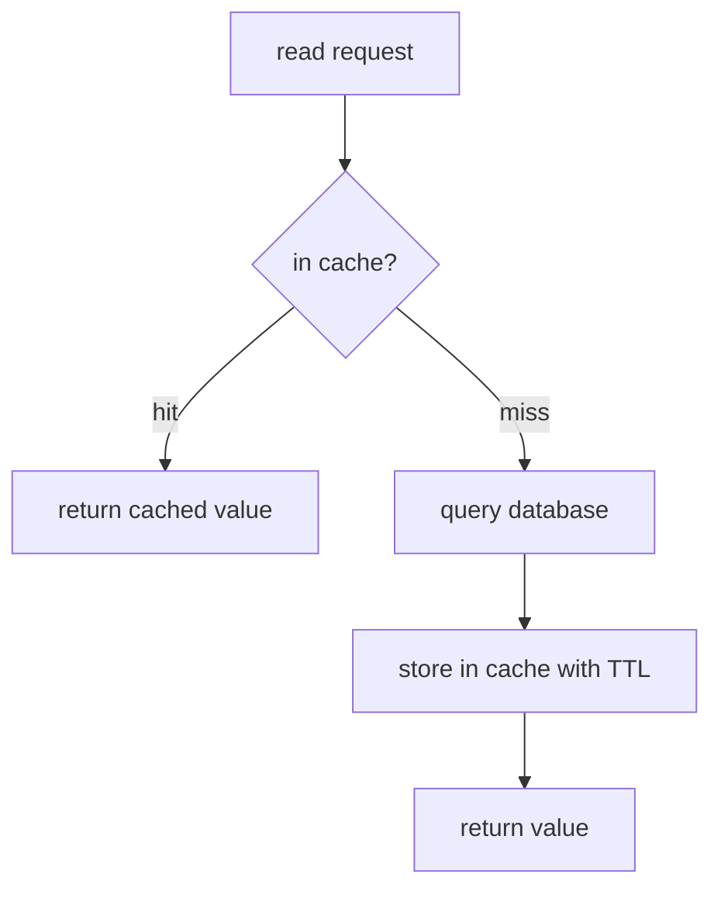
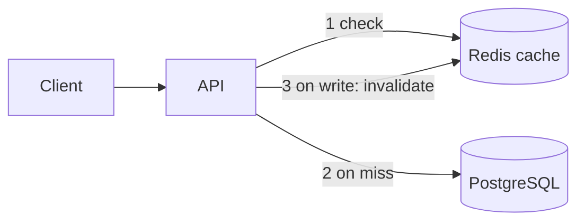
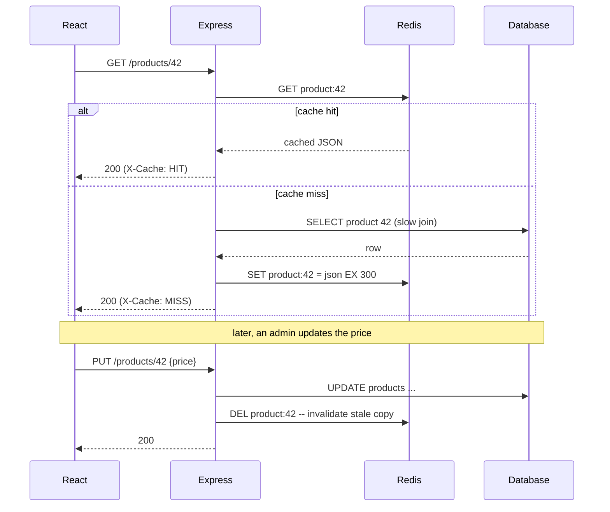

# 05 — Cache Layer with Redis

🏢 **Asked at:** Amazon, Google, Razorpay, Freshworks, Swiggy

> Add a caching layer with Redis to make reads fast and take load off the database. The signature lessons: the **cache-aside pattern**, **cache invalidation** (famously one of the two hard problems in CS), and reasoning about the cache/DB consistency that trips everyone up.

---

## 🎬 The Product Story

Your product page query is correct but slow — it joins five tables and runs on every visit, and the same handful of popular products are requested thousands of times a minute. The database is sweating. The fix: put a fast in-memory store (Redis) in front of it. The first request computes the result and stores it in Redis; the next thousand requests read it straight from memory in under a millisecond, never touching the database.

The catch — and the whole interview — is **invalidation**: when the product's price changes, the cached copy is now *wrong*. Amazon and Google ask this to see if you understand not just "cache for speed" but the genuinely hard part: keeping the cache and database from drifting out of sync.

---

## 🔑 Core Concept: The Cache-Aside Pattern

> **Cache-aside** (a.k.a. lazy loading): the application checks the cache first. On a **hit**, return the cached value. On a **miss**, fetch from the database, store it in the cache (with a TTL), and return it. The cache is populated lazily, on demand.



> **Invalidation analogy:** a cached value is like a printed price tag on a shelf. When the real price changes in the back-office system, the shelf tag is now lying. You must either reprint it (update the cache) or rip it off (delete the cache) — otherwise customers see stale prices. "There are only two hard things in CS: cache invalidation and naming things."

---

## 📋 Requirements (clarified)

**Functional:** read a resource through the cache (cache-aside); on write, keep the cache correct (invalidate); show cache hit/miss.
**Non-functional:** big latency win on hot reads; bounded staleness; graceful behavior if Redis is down.

**Clarifying questions:** What's read-heavy? Acceptable staleness (seconds? must be immediate)? Is Redis also used for sessions/rate-limiting? What happens if Redis is unavailable?

---

## 🧱 What's Cached (no new SQL tables — Redis sits beside the DB)



Redis stores keyed values, e.g. `product:42 -> {json}` with a TTL. The database remains the source of truth; Redis is a fast, disposable copy.

---

## 🔌 API Design

| Method | Path | Auth | Cache behavior |
|--------|------|------|----------------|
| GET | `/api/v1/products/:id` | – | Cache-aside read (TTL 5 min) |
| PUT | `/api/v1/products/:id` | ✅ | Write DB, then **invalidate** the cache key |
| GET | `/api/v1/products/:id` (header) | – | Returns `X-Cache: HIT|MISS` |

---

## 🔄 Full Stack Flow Diagram (read with cache, then a write)



**Reading this diagram:** Reads consult Redis first; a miss falls through to the slow DB query and back-fills the cache with a TTL so future reads are fast. A write updates the database (the source of truth) and then *deletes* the cache key, so the next read recomputes fresh — preventing the cache from serving the old price.

---

## 💻 Complete Working Code

```javascript
// File: server/cache/redis.js
const { createClient } = require("redis");
const client = createClient({ url: process.env.REDIS_URL || "redis://localhost:6379" });
client.on("error", (e) => console.error("Redis error", e));
client.connect();
module.exports = { redis: client };
```

```javascript
// File: server/cache/cacheAside.js
const { redis } = require("./redis");

// Generic cache-aside helper: try cache, else run loader, then cache the result.
// Fails OPEN: if Redis is down, fall back to the loader so the app still works.
async function cacheAside(key, ttlSeconds, loader) {
  try {
    const cached = await redis.get(key);
    if (cached !== null) return { value: JSON.parse(cached), hit: true };
  } catch { /* Redis down -> ignore, fall through to DB */ }

  const value = await loader();                            // the slow DB query
  try {
    await redis.set(key, JSON.stringify(value), { EX: ttlSeconds }); // back-fill with TTL
  } catch { /* caching is best-effort */ }
  return { value, hit: false };
}

// Invalidate a key (call after a write).
async function invalidate(key) {
  try { await redis.del(key); } catch { /* best-effort */ }
}
module.exports = { cacheAside, invalidate };
```

```javascript
// File: server/controllers/productController.js
const { query } = require("../db");
const { cacheAside, invalidate } = require("../cache/cacheAside");

const ProductController = {
  async get(req, res) {
    const id = parseInt(req.params.id);
    const { value, hit } = await cacheAside(`product:${id}`, 300, async () => {
      // The "expensive" query we want to avoid repeating.
      const { rows } = await query(
        `SELECT p.id, p.name, p.price, c.name AS category
         FROM products p LEFT JOIN categories c ON c.id = p.category_id
         WHERE p.id = $1`,
        [id]
      );
      return rows[0] || null;
    });

    if (!value) return res.status(404).json({ success: false, error: "Product not found" });
    res.set("X-Cache", hit ? "HIT" : "MISS");              // visible proof of caching
    res.status(200).json({ success: true, data: value });
  },

  async update(req, res) {
    const id = parseInt(req.params.id);
    const { name, price } = req.body;
    const { rows } = await query(
      "UPDATE products SET name = COALESCE($1,name), price = COALESCE($2,price) WHERE id = $3 RETURNING id",
      [name ?? null, price ?? null, id]
    );
    if (!rows[0]) return res.status(404).json({ success: false, error: "Product not found" });

    await invalidate(`product:${id}`);                     // <-- the crucial step: drop the stale cache
    res.status(200).json({ success: true, message: "Updated (cache invalidated)" });
  },
};
module.exports = { ProductController };
```

```javascript
// File: server/routes/products.js
const express = require("express");
const router = express.Router();
const { ProductController } = require("../controllers/productController");
const { requireAuth } = require("../middleware/auth");
const { asyncHandler } = require("../middleware/asyncHandler");

router.get("/:id", asyncHandler(ProductController.get));               // public, cached
router.put("/:id", requireAuth, asyncHandler(ProductController.update)); // invalidates
module.exports = router;
```

### Frontend (shows hit/miss latency)

```jsx
// File: client/src/components/ProductView.jsx
import { useState } from "react";

export function ProductView({ productId }) {
  const [product, setProduct] = useState(null);
  const [cacheStatus, setCacheStatus] = useState(null);
  const [ms, setMs] = useState(null);

  async function load() {
    const t0 = performance.now();
    const res = await fetch(`/api/v1/products/${productId}`);
    const json = await res.json();
    setMs(Math.round(performance.now() - t0));
    setCacheStatus(res.headers.get("X-Cache"));            // HIT or MISS
    setProduct(json.data);
  }

  return (
    <div>
      <button onClick={load}>Load product</button>
      {product && (
        <div>
          <h3>{product.name} — ₹{product.price}</h3>
          <small>Cache: {cacheStatus} · {ms}ms</small>     {/* MISS is slow, HIT is fast */}
        </div>
      )}
    </div>
  );
}
```

### Running
```bash
# Start Redis (e.g. docker run -p 6379:6379 redis)
psql fullstack_course < database/schema.sql
cd server && npm install redis && npm run dev
cd client && npm install && npm run dev
```

### What You Will See
Click "Load product" the first time — `Cache: MISS · 28ms` (it hit the database). Click again — `Cache: HIT · 2ms` (served from Redis, an order of magnitude faster). Now update the product's price via `PUT` and load again — the first load after the write is a `MISS` (the cache was invalidated) showing the *new* price, and subsequent loads are `HIT`s. Stop Redis entirely and the app still works (slower) because the cache helper fails open to the database.

---

## ⚠️ What Makes This Problem Tricky (5 Non-Obvious Traps)

🔴 **Trap 1:** Writing to the DB but forgetting to invalidate the cache.
✅ Invalidate (or update) the key on every write.
💡 The cause of stale-data bugs; the heart of the problem.

🔴 **Trap 2:** Caching with no TTL, so stale/leaked keys live forever.
✅ Always set a TTL as a safety net.
💡 TTL bounds staleness even if an invalidation is missed.

🔴 **Trap 3:** App crashes when Redis is down (cache as a hard dependency).
✅ Fail open — fall back to the DB.
💡 The cache is an optimization, not a source of truth.

🔴 **Trap 4:** Thundering herd — a hot key expires and 1,000 requests all hit the DB at once.
✅ Mitigate with a short lock / "single flight" / staggered TTL.
💡 Cache stampede can spike the DB worse than no cache.

🔴 **Trap 5:** Caching user-specific data under a shared key.
✅ Key by all relevant dimensions (e.g. include user/tenant id).
💡 A shared key leaks one user's data to another.

---

## 🌀 How the Interviewer Can Twist This Question (6 Extensions)

**Twist 1 (Auth/Security): Per-user cache keys**
🗣️ *"Cache personalized data without leaking across users."*
🛠️ Backend.
💻
```javascript
cacheAside(`user:${req.user.id}:dashboard`, 60, loader); // key includes the user id
```

**Twist 2 (Real-time): Pub/sub invalidation across servers**
🗣️ *"Many API servers — invalidation must reach all of them."*
🛠️ Backend.
💻
```javascript
// on write, redis.publish("invalidate", key); each server subscribes and DELs locally if it has a local cache
```

**Twist 3 (Scale): Write-through vs write-behind**
🗣️ *"Compare cache write strategies."*
🛠️ Backend.
💻
```text
// write-through: update DB + cache synchronously (fresh, slower writes)
// write-behind: update cache now, flush to DB async (fast writes, risk of loss)
```

**Twist 4 (New feature): Cache the expensive list/search results**
🗣️ *"Cache search results, not just single items."*
🛠️ Backend.
💻
```javascript
cacheAside(`search:${q}:${page}`, 120, () => runSearch(q, page)); // key by query+page
```

**Twist 5 (Performance): Stampede protection (single-flight)**
🗣️ *"Stop the herd when a hot key expires."*
🛠️ Backend.
💻
```javascript
// SET NX a short lock; only the lock holder recomputes, others briefly wait / serve stale
```

**Twist 6 (Resilience): Stale-while-revalidate**
🗣️ *"Serve slightly stale data instantly while refreshing in the background."*
🛠️ Backend.
💻
```text
// return the cached (possibly expired) value immediately, trigger an async refresh of the key
```

---

## 🧪 Test Cases (8 Cases)

| # | Action | Input | Expected | UI |
|---|--------|-------|----------|----|
| 1 | First read | GET /products/1 | `X-Cache: MISS` | Slow |
| 2 | Second read | GET /products/1 | `X-Cache: HIT` | Fast |
| 3 | After write | PUT then GET | MISS, fresh value | New data |
| 4 | TTL expiry | wait > TTL | MISS again | Recomputed |
| 5 | Redis down | stop Redis | falls back to DB | Works (slower) |
| 6 | Missing product | GET /products/999 | `404` | Not found |
| 7 | Per-user key | two users | separate cache | No leak |
| 8 | Invalidate | PUT | key DEL'd | Stale gone |

---

## ⏱️ Time Budget

| Phase | Time | What to do |
|-------|------|-----------|
| Read & clarify | 5 min | read-heavy? staleness tolerance? Redis-down behavior? |
| Pattern | 8 min | cache-aside flow, invalidation strategy |
| Backend | 26 min | redis client, cacheAside helper (fail-open), get/update + invalidate |
| Frontend | 14 min | ProductView showing HIT/MISS + latency |
| Edge cases | 12 min | TTL, Redis-down fallback, per-user keys |
| Test | 10 min | hit/miss, invalidation, fail-open |

---

## 🎤 Famous Interview Questions

**Q1 (Conceptual): Explain the cache-aside pattern.**
🏢 *Asked at: Amazon*
✅ Answer: In cache-aside the application manages the cache directly. On a read it checks the cache first; a hit returns immediately, and a miss falls through to the database, after which the application stores the result in the cache with a TTL before returning it. The cache is populated lazily, only for data that's actually requested. On writes, the application updates the database and then invalidates (or updates) the relevant cache key so future reads don't serve stale data.
💡 Bonus insight: It's called "aside" because the cache sits beside the data path and the app orchestrates it — contrasted with read-through/write-through caches where the cache layer itself loads and persists, hiding the database from the app.

**Q2 (Design Decision): How do you keep the cache consistent with the database on writes?**
🏢 *Asked at: Razorpay*
✅ Answer: The simplest robust approach is write-then-invalidate: update the database (the source of truth), then delete the cache key so the next read recomputes from fresh data. I prefer deleting over updating the cache because computing the new cached value can race with concurrent writes, whereas a delete just forces a clean reload. I also always set a TTL as a backstop, so even if an invalidation is somehow missed, staleness is bounded to the TTL window.
💡 Bonus insight: There's a subtle race even here — a read can repopulate the cache with old data between the DB write and the delete — which is why critical systems order it carefully (or use techniques like delayed double-delete) and lean on the TTL as a safety net.

**Q3 (Trade-off): Write-through vs write-behind vs cache-aside?**
🏢 *Asked at: Google*
✅ Answer: Cache-aside populates lazily on read misses and is simple and resilient (a cache failure just means slower reads). Write-through updates the cache and database together on every write, keeping the cache always fresh but making writes slower and caching data that may never be read. Write-behind updates the cache immediately and flushes to the database asynchronously, giving very fast writes but risking data loss if the cache fails before flushing. I default to cache-aside for read-heavy workloads and consider write-through when reads almost always follow writes.
💡 Bonus insight: Write-behind is the highest-performance and highest-risk option — it effectively makes the cache a temporary system of record, so it's only acceptable where some data loss is tolerable or backed by durability guarantees.

**Q4 (Extension): How do you prevent a cache stampede when a hot key expires?**
🏢 *Asked at: Amazon*
✅ Answer: A stampede happens when a popular key expires and thousands of concurrent requests all miss and hit the database at once. I prevent it with single-flight locking — the first request acquires a short lock (`SET NX`) and recomputes while others briefly wait or serve the previous value — and with staggered/jittered TTLs so many keys don't expire simultaneously. Stale-while-revalidate also helps: serve the slightly-expired value instantly and refresh in the background.
💡 Bonus insight: The counterintuitive part is that a cache can make a DB *more* fragile at expiry moments than no cache at all — so stampede protection isn't optional for genuinely hot keys.

**Q5 (Security/Edge case): What edge cases and failure modes matter when caching?**
🏢 *Asked at: Freshworks*
✅ Answer: Fail open so a Redis outage degrades to slower DB reads rather than an error. Always set a TTL to bound staleness. Invalidate on every write, and key cache entries by all relevant dimensions (user/tenant) so personalized data never leaks across users under a shared key. Watch for stampedes on hot keys, and avoid caching sensitive data longer than necessary. Decide explicitly how much staleness is acceptable per resource — some data tolerates minutes, some must be near-real-time.
💡 Bonus insight: The per-user/per-tenant key mistake is a real security bug, not just correctness — caching a personalized response under a shared key like `dashboard` will serve one user's private data to the next requester.

---

## 🔗 Navigation
⬅️ Previous: [04 — Analytics Dashboard](./04-analytics-dashboard.md)
➡️ Next module: [05 — API Design Challenges](../05-api-design-challenges/README.md)
🏠 [Module Home](./README.md)
