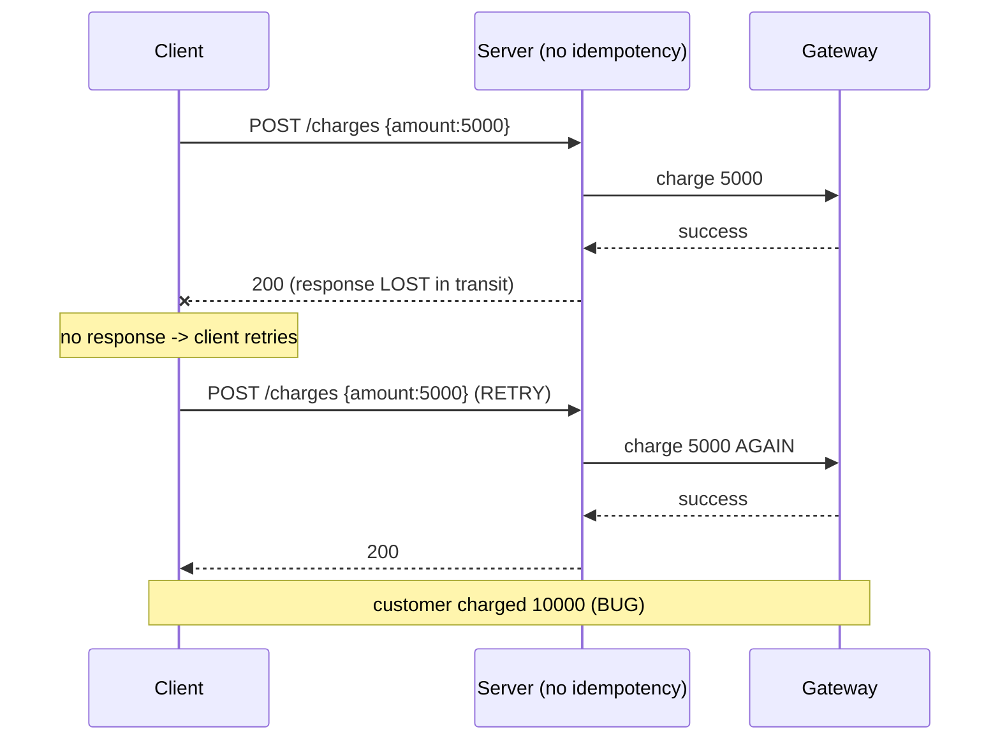
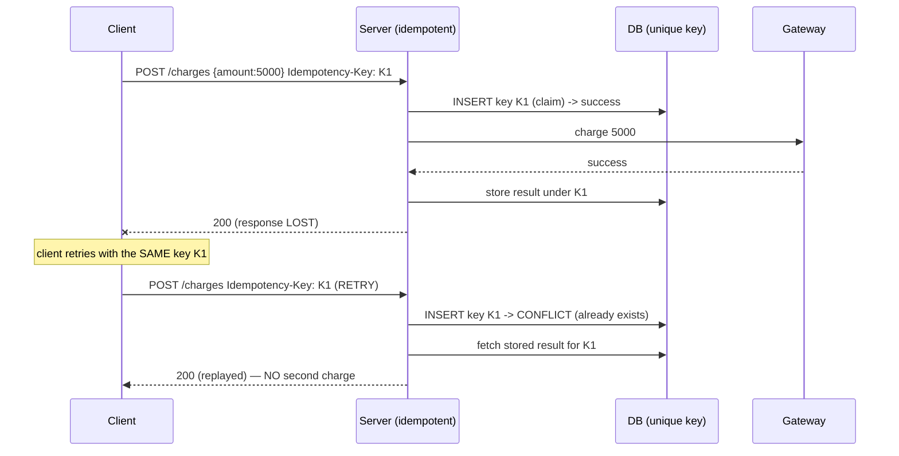

# 04 — Idempotency in APIs

🏢 **Asked at:** Stripe, Razorpay, PhonePe, Juspay — **CRITICAL** for payment companies

> The single most important API-correctness concept at any company that moves money. This is a full deep-dive: what idempotency is, why network reality forces it, how to implement it with idempotency keys and a database `UNIQUE` constraint, and exactly how Stripe's API behaves.

---

## 🎬 The Story

A merchant's server calls your `POST /charges` to charge a customer ₹5,000. The charge succeeds at your end — but the *response* never makes it back (the merchant's connection dropped at the worst possible moment). The merchant's code, having received no answer, does the sane thing: it retries. Without protection, you just charged the customer ₹10,000.

This isn't a rare edge case — it's the *normal* behavior of distributed systems. Networks drop responses, clients time out and retry, load balancers re-send. An API that handles money must assume **every request may arrive more than once** and make duplicates harmless. That property is idempotency, and idempotency keys are how you achieve it.

---

## 🔑 What Idempotency Means (precisely)

> An operation is **idempotent** if performing it multiple times has the same effect as performing it once.

By HTTP convention:
- `GET`, `PUT`, `DELETE` are *naturally* idempotent (reading, replacing, or deleting the same thing repeatedly ends in the same state).
- `POST` (create) is *naturally not* — two POSTs make two resources.

Since charging, ordering, and "create payment" are POSTs, we make them idempotent **artificially** with an **idempotency key**.

---

## 🗝️ The Idempotency Key Mechanism

1. The **client generates a unique key** (a UUID) for *one logical operation* and sends it in a header: `Idempotency-Key: 7c3b...`.
2. The server, on first sight of a key, does the work and **stores the key with the result**.
3. If the **same key arrives again**, the server **does not redo the work** — it returns the stored result.
4. The key ties all retries of one logical operation together; a *different* operation uses a *different* key.

The crucial guarantee comes from a database `UNIQUE` constraint on the key: even two simultaneous requests with the same key can't both "win."

---

## ⚠️ Without Idempotency vs With Idempotency (sequence diagrams)

### Without — the double charge



### With — the safe retry



**Reading these diagrams:** In the first, the lost response causes a retry that the server can't distinguish from a new request, so it charges twice. In the second, the retry carries the *same* key; the server's attempt to claim that key hits the `UNIQUE` constraint, so instead of charging again it returns the stored result. The customer is charged exactly once regardless of how many times the client retries.

---

## 🧱 Database-Level Implementation

```sql
-- File: database/schema.sql
-- The UNIQUE primary key is what makes concurrent duplicates impossible.
CREATE TABLE idempotency_keys (
  key          VARCHAR(80) PRIMARY KEY,                    -- the client-provided key (UNIQUE)
  request_hash VARCHAR(64) NOT NULL,                       -- hash of the request, to detect key reuse with different params
  status       VARCHAR(12) NOT NULL DEFAULT 'IN_PROGRESS', -- IN_PROGRESS | COMPLETED
  response     JSONB,                                      -- the stored result to replay
  status_code  INTEGER,
  created_at   TIMESTAMPTZ NOT NULL DEFAULT now()
);
```

> Storing a **hash of the request body** alongside the key lets you detect a dangerous mistake: the same key reused for a *different* request (e.g. a buggy client). Stripe returns an error in that case rather than silently doing the wrong thing.

---

## 💻 Reusable Idempotency Middleware

```javascript
// File: server/middleware/idempotency.js
const crypto = require("crypto");
const { pool } = require("../db");

// Hash the meaningful parts of the request to detect key reuse with different params.
function hashRequest(req) {
  return crypto.createHash("sha256")
    .update(req.method + req.originalUrl + JSON.stringify(req.body || {}))
    .digest("hex");
}

// Wrap any mutating handler to make it idempotent via the Idempotency-Key header.
function idempotent(handler) {
  return async (req, res, next) => {
    const key = req.headers["idempotency-key"];
    if (!key) return res.status(400).json({ success: false, error: "Idempotency-Key header required" });

    const reqHash = hashRequest(req);
    const client = await pool.connect();
    try {
      await client.query("BEGIN");

      // 1) Try to CLAIM the key atomically.
      const claim = await client.query(
        `INSERT INTO idempotency_keys (key, request_hash) VALUES ($1,$2)
         ON CONFLICT (key) DO NOTHING RETURNING key`,
        [key, reqHash]
      );

      if (claim.rows.length === 0) {
        // Key already exists -> this is a retry (or concurrent duplicate).
        const existing = (await client.query("SELECT request_hash, status, response, status_code FROM idempotency_keys WHERE key=$1", [key])).rows[0];
        await client.query("COMMIT");

        // Guard: same key, DIFFERENT request body = client bug.
        if (existing.request_hash !== reqHash) {
          return res.status(422).json({ success: false, error: "Idempotency-Key reused with different parameters" });
        }
        if (existing.status === "IN_PROGRESS") {
          // The original request is still running; tell the client to retry shortly.
          return res.status(409).json({ success: false, error: "Request with this key is still processing" });
        }
        // Replay the stored response.
        return res.status(existing.status_code).json({ ...existing.response, idempotentReplay: true });
      }

      await client.query("COMMIT");                        // claim committed; we own this key

      // 2) Run the real handler, capturing its response so we can store it.
      const originalJson = res.json.bind(res);
      res.json = async (body) => {
        await pool.query(
          "UPDATE idempotency_keys SET status='COMPLETED', response=$2, status_code=$3 WHERE key=$1",
          [key, body, res.statusCode]
        );
        return originalJson(body);
      };
      return handler(req, res, next);
    } catch (err) {
      await client.query("ROLLBACK").catch(() => {});
      next(err);
    } finally {
      client.release();
    }
  };
}
module.exports = { idempotent };
```

```javascript
// File: server/routes/charges.js
const express = require("express");
const router = express.Router();
const { idempotent } = require("../middleware/idempotency");
const { requireAuth } = require("../middleware/auth");
const { asyncHandler } = require("../middleware/asyncHandler");
const { query } = require("../db");

// The charge handler is wrapped so retries with the same key never double-charge.
router.post("/", requireAuth, idempotent(asyncHandler(async (req, res) => {
  const { amount, orderId } = req.body;
  // (Real impl: call the gateway here.) Simulate creating a charge.
  const { rows } = await query(
    "INSERT INTO payments (order_id, amount, status) VALUES ($1,$2,'SUCCESS') RETURNING id, amount, status",
    [orderId, amount]
  );
  res.status(201).json({ success: true, data: rows[0] });
})));

module.exports = router;
```

### How a client uses it

```javascript
// File: client/src/api/charges.js
function uuid() { return crypto.randomUUID(); }

export async function createCharge(amount, orderId) {
  const key = uuid();                                      // ONE key per logical charge
  async function attempt() {                               // retries reuse the SAME key
    return fetch("/api/v1/charges", {
      method: "POST",
      headers: {
        "Content-Type": "application/json",
        Authorization: `Bearer ${localStorage.getItem("token")}`,
        "Idempotency-Key": key,
      },
      body: JSON.stringify({ amount, orderId }),
    });
  }
  try { return await attempt(); }
  catch { return await attempt(); }                        // safe: server dedupes by key
}
```

### What You Will See
Send `POST /charges` with `Idempotency-Key: K1` — a payment is created and returned (`201`). Send the *exact same request with K1 again* — you get back the *same* payment with `idempotentReplay: true` and **no second row** in `payments`. Send K1 with a different `amount` — you get `422 "reused with different parameters"`. Fire two K1 requests concurrently — one creates the charge, the other either replays it or gets `409 "still processing"`. The customer is charged exactly once no matter how many retries.

---

## 🏢 How Stripe Actually Does It

Stripe's real API mirrors this design (paraphrased from their public docs):
- You pass an `Idempotency-Key` header on POST requests.
- Stripe saves the first response against the key; retries with the same key return the saved response, replaying the same status code.
- Reusing a key with a different request body returns an error.
- Keys are retained for 24 hours, after which they're forgotten (so the same key would create a new resource).

This is the industry-standard contract, and stating it shows you know the real-world reference implementation. *(Content paraphrased from Stripe's public documentation for licensing compliance.)*

---

## ⚠️ Non-Obvious Traps

🔴 **Trap 1:** Generating a new key per retry → defeats the whole mechanism.
✅ One key per *logical* operation, reused across retries.

🔴 **Trap 2:** Check-key-then-act as two steps → race window allows double charge.
✅ Atomic claim via `INSERT ... ON CONFLICT` inside a transaction.

🔴 **Trap 3:** Ignoring key reuse with different params (silent wrong behavior).
✅ Store a request hash; reject mismatches with `422`.

🔴 **Trap 4:** Keys stored forever (unbounded growth).
✅ Expire keys (e.g. 24h TTL), like Stripe.

🔴 **Trap 5:** Not handling the in-progress state (concurrent retry while first still runs).
✅ Mark `IN_PROGRESS`; return `409` to the racing retry.

---

## 🌀 Extensions

**Auth/Security:** scope keys per API key/account so one client's key can't collide with another's.
**Real-time:** push the final result to the client when the in-progress original completes.
**Scale:** store keys in Redis (`SET NX EX 86400`) for an atomic claim with built-in expiry.
**New feature:** apply the same middleware to refunds, transfers, and order creation.
**Performance:** index/partition the keys table by `created_at` for cheap expiry cleanup.
**Resilience:** reconcile keys stuck `IN_PROGRESS` (the server crashed mid-operation) against the gateway.

---

## 🧪 Test Cases (8 Cases)

| # | Action | Input | Expected |
|---|--------|-------|----------|
| 1 | First request | key K1 | `201` created |
| 2 | Retry same key | K1 again | same result, `idempotentReplay:true`, no new row |
| 3 | Missing key | no header | `400` |
| 4 | Key reuse, diff body | K1 + new amount | `422` |
| 5 | Concurrent same key | K1 + K1 | one creates, other 409/replay |
| 6 | Different op | K2 | new resource |
| 7 | Expired key | K1 after 24h | treated as new |
| 8 | In-progress | K1 while running | `409` |

---

## ⏱️ Time Budget

| Phase | Time | What to do |
|-------|------|-----------|
| Read & clarify | 5 min | who makes the key? retention? per-account? |
| Schema | 8 min | idempotency_keys (PK + request_hash + status) |
| Middleware | 24 min | atomic claim, replay, request-hash guard, in-progress |
| Wire + client | 12 min | wrap charge route; client retries with same key |
| Test | 12 min | replay, concurrent, reuse-mismatch |
| Buffer | 9 min | expiry, in-progress |

---

## 🎤 Famous Interview Questions

**Q1 (Conceptual): Why do payment APIs need idempotency keys?**
🏢 *Asked at: Stripe*
✅ Answer: Networks are unreliable, so a client that doesn't receive a response can't tell whether the operation succeeded, and the safe thing for it to do is retry. Without protection, those retries create duplicate charges. An idempotency key lets the client mark all retries of one logical operation with the same identifier; the server does the work once, stores the result against the key, and replays that stored result for any retry. This guarantees at-most-once side effects despite unlimited retries.
💡 Bonus insight: The key must represent the *intent*, generated once before the first attempt and reused on retries — a fresh key per attempt would make each retry look like a brand-new charge.

**Q2 (Design Decision): How do you make the key claim safe under concurrency?**
🏢 *Asked at: Razorpay*
✅ Answer: I rely on a database `UNIQUE` constraint and claim the key with a single atomic `INSERT ... ON CONFLICT DO NOTHING` inside a transaction. Only one of any number of concurrent requests with the same key can successfully insert; the others get a conflict and fall into the replay path. This collapses the dangerous check-then-act sequence into one atomic operation the database enforces, eliminating the race window where two requests both decide to proceed.
💡 Bonus insight: An `IN_PROGRESS` status handles the case where the first request is still running when a retry arrives — the retry returns 409 instead of either charging again or returning an empty result.

**Q3 (Trade-off): Where do you store idempotency keys and for how long?**
🏢 *Asked at: PhonePe*
✅ Answer: The database gives durability and the unique-constraint guarantee, and lets you store the key in the same transaction as the side effect. Redis gives a fast atomic claim via `SET NX` with built-in `EX` expiry. Keys don't need to live forever — retries happen within minutes — so a 24-hour retention (Stripe's choice) is plenty, after which the key is forgotten and would create a new resource. I'd keep the authoritative record durable and expire keys to bound storage.
💡 Bonus insight: Bounding retention matters operationally — without expiry the keys table grows forever, so partitioning by `created_at` and dropping old partitions keeps cleanup cheap.

**Q4 (Extension): What happens if the same key is sent with a different request body?**
🏢 *Asked at: Stripe*
✅ Answer: That signals a client bug — the same "logical operation" identifier is being used for genuinely different requests. I store a hash of the request alongside the key, and on a key match I compare hashes; if they differ I reject with a 422 rather than silently replaying the first result or processing the new body. This protects the client from a confusing outcome where, say, a ₹5,000 charge silently returns the result of an earlier ₹500 charge.
💡 Bonus insight: This guard turns a subtle, hard-to-debug data-integrity bug into a loud, immediate error at the boundary — which is exactly where you want such bugs surfaced.

**Q5 (Security/Edge case): What edge cases must idempotency handle?**
🏢 *Asked at: Razorpay*
✅ Answer: Concurrent duplicates (atomic claim + `IN_PROGRESS`/409), key reuse with different params (request-hash mismatch → 422), the server crashing after charging but before storing the result (reconcile in-progress keys against the gateway), key expiry (bounded retention), and scoping keys per account so different clients' keys can't collide. I also ensure the stored response includes the original status code so replays are byte-for-byte equivalent.
💡 Bonus insight: The crash-after-charge-before-store window is the genuinely hard case — it's why production payment systems pair idempotency with a reconciliation job that queries the gateway for the true outcome of any operation left `IN_PROGRESS`.

---

## 🔗 Navigation
⬅️ Previous: [03 — Error Handling & Response Contracts](./03-error-handling-contracts.md)
➡️ Next module: [06 — Database Design Challenges](../06-database-design-challenges/README.md)
🏠 [Module Home](./README.md)
